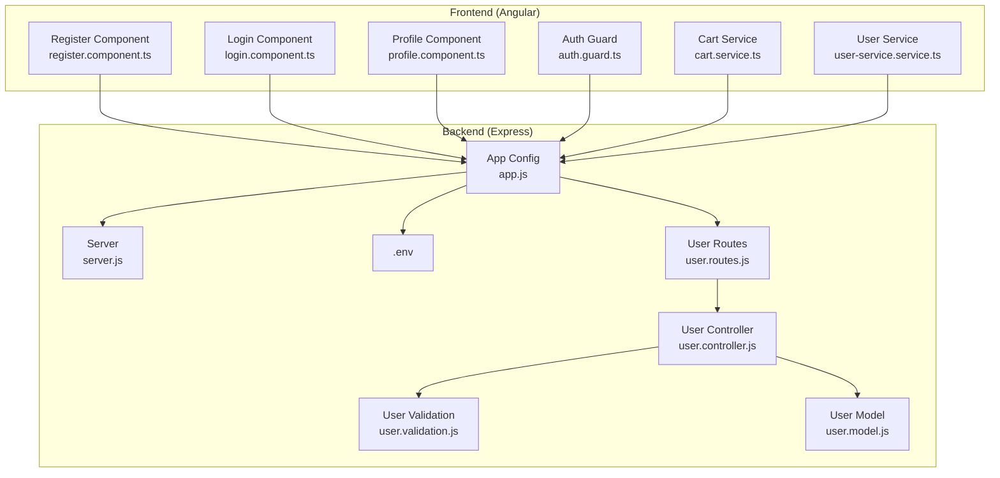
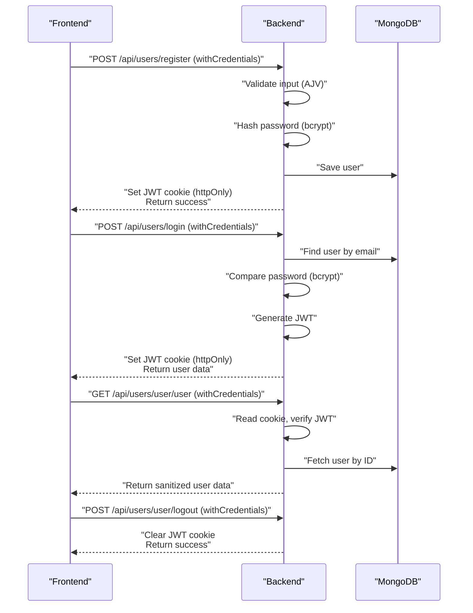
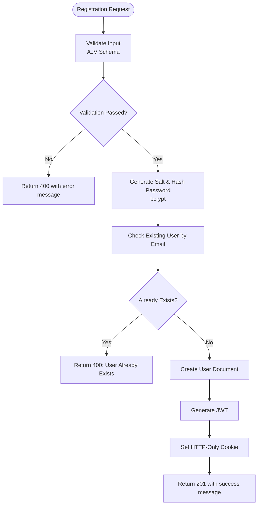
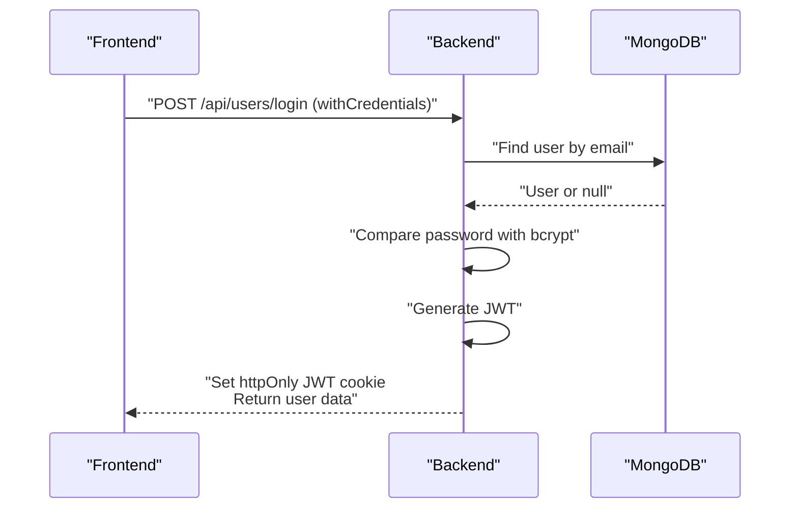
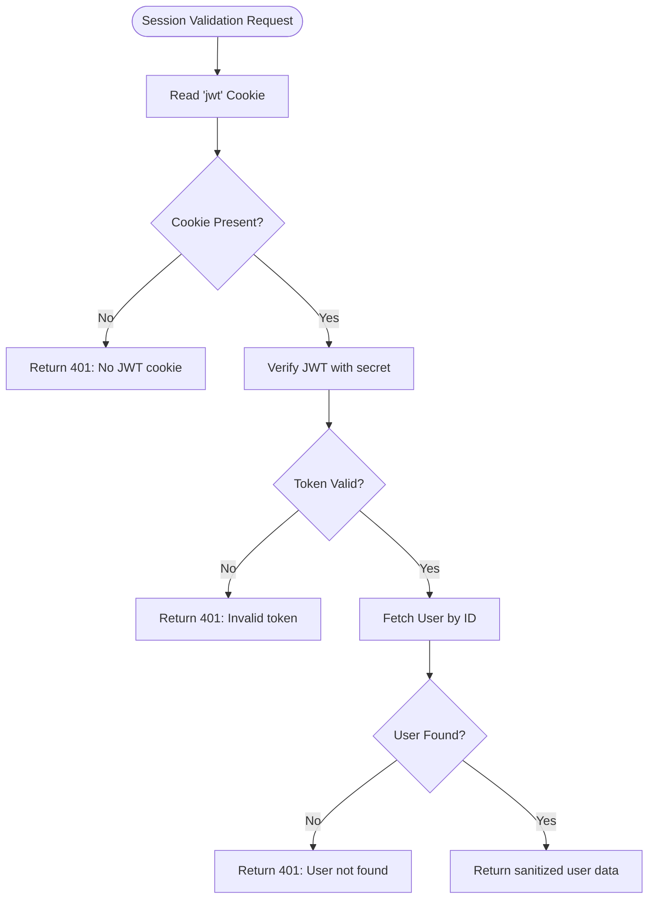
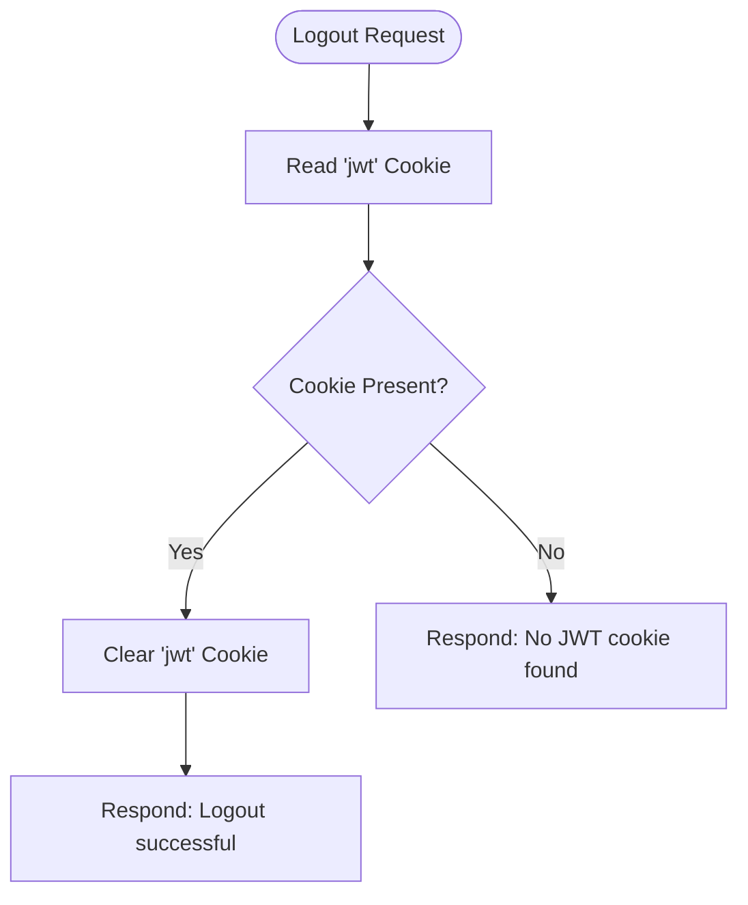
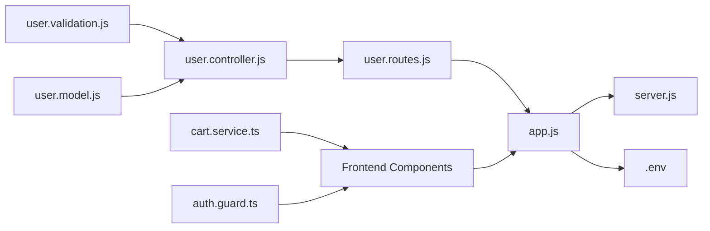

# Authentication Flow and User Management

<cite>
**Referenced Files in This Document**
- [user.controller.js](file://Back-end/src/Controllers/user.controller.js)
- [user.validation.js](file://Back-end/src/Middlewares/user.validation.js)
- [user.routes.js](file://Back-end/src/Routes/user.routes.js)
- [user.model.js](file://Back-end/src/Models/user.model.js)
- [app.js](file://Back-end/src/app.js)
- [server.js](file://Back-end/src/Servers/server.js)
- [.env](file://Back-end/.env)
- [register.component.ts](file://Front-end/src/app/features/auth/pages/register/register.component.ts)
- [login.component.ts](file://Front-end/src/app/features/auth/pages/login/login.component.ts)
- [profile.component.ts](file://Front-end/src/app/features/auth/pages/profile/profile.component.ts)
- [auth.guard.ts](file://Front-end/src/app/core/guards/auth.guard.ts)
- [user-service.service.ts](file://Front-end/src/app/core/services/user-service.service.ts)
- [cart.service.ts](file://Front-end/src/app/core/services/cart.service.ts)
- [proxy.conf.json](file://Front-end/proxy.conf.json)
- [environment.ts](file://Front-end/src/environments/environment.ts)
</cite>

## Table of Contents
1. [Introduction](#introduction)
2. [Project Structure](#project-structure)
3. [Core Components](#core-components)
4. [Architecture Overview](#architecture-overview)
5. [Detailed Component Analysis](#detailed-component-analysis)
6. [Dependency Analysis](#dependency-analysis)
7. [Performance Considerations](#performance-considerations)
8. [Troubleshooting Guide](#troubleshooting-guide)
9. [Conclusion](#conclusion)

## Introduction
This document provides comprehensive documentation for the authentication flow and user management system in the Lightstorm e-commerce platform. It covers the complete lifecycle from user registration to login, session management via cookies, and session validation. It also documents the frontend integration patterns, error handling strategies, and user experience considerations. The backend uses Express.js, MongoDB via Mongoose, JWT for token generation, and bcrypt for password hashing. The frontend is built with Angular and integrates with the backend APIs through HTTP requests with credentials support.

## Project Structure
The authentication system spans both the backend and frontend:

- Backend:
  - Controllers handle HTTP requests and orchestrate business logic.
  - Routes define endpoints for user-related operations.
  - Middleware validates request payloads.
  - Models define the user schema and embedded cart structure.
  - App configuration sets up CORS, cookies, and static serving for the Angular app.
  - Environment variables configure the port and database URL.

- Frontend:
  - Angular components manage user registration, login, and profile actions.
  - Services encapsulate HTTP communication with the backend.
  - Guards protect routes by validating session state.
  - Proxy configuration ensures API requests reach the backend during development.

**Diagram sources**
- [app.js](file://Back-end/src/app.js#L1-L96)
- [server.js](file://Back-end/src/Servers/server.js#L1-L6)
- [.env](file://Back-end/.env#L1-L3)
- [user.routes.js](file://Back-end/src/Routes/user.routes.js#L1-L24)
- [user.controller.js](file://Back-end/src/Controllers/user.controller.js#L1-L480)
- [user.validation.js](file://Back-end/src/Middlewares/user.validation.js#L1-L29)
- [user.model.js](file://Back-end/src/Models/user.model.js#L1-L29)
- [register.component.ts](file://Front-end/src/app/features/auth/pages/register/register.component.ts#L1-L86)
- [login.component.ts](file://Front-end/src/app/features/auth/pages/login/login.component.ts#L1-L116)
- [profile.component.ts](file://Front-end/src/app/features/auth/pages/profile/profile.component.ts#L1-L33)
- [auth.guard.ts](file://Front-end/src/app/core/guards/auth.guard.ts#L1-L42)
- [cart.service.ts](file://Front-end/src/app/core/services/cart.service.ts#L1-L111)
- [user-service.service.ts](file://Front-end/src/app/core/services/user-service.service.ts#L1-L25)

**Section sources**
- [app.js](file://Back-end/src/app.js#L1-L96)
- [server.js](file://Back-end/src/Servers/server.js#L1-L6)
- [.env](file://Back-end/.env#L1-L3)
- [user.routes.js](file://Back-end/src/Routes/user.routes.js#L1-L24)
- [user.controller.js](file://Back-end/src/Controllers/user.controller.js#L1-L480)
- [user.validation.js](file://Back-end/src/Middlewares/user.validation.js#L1-L29)
- [user.model.js](file://Back-end/src/Models/user.model.js#L1-L29)
- [register.component.ts](file://Front-end/src/app/features/auth/pages/register/register.component.ts#L1-L86)
- [login.component.ts](file://Front-end/src/app/features/auth/pages/login/login.component.ts#L1-L116)
- [profile.component.ts](file://Front-end/src/app/features/auth/pages/profile/profile.component.ts#L1-L33)
- [auth.guard.ts](file://Front-end/src/app/core/guards/auth.guard.ts#L1-L42)
- [cart.service.ts](file://Front-end/src/app/core/services/cart.service.ts#L1-L111)
- [user-service.service.ts](file://Front-end/src/app/core/services/user-service.service.ts#L1-L25)
- [proxy.conf.json](file://Front-end/proxy.conf.json#L1-L8)
- [environment.ts](file://Front-end/src/environments/environment.ts#L1-L5)

## Core Components
This section outlines the primary components involved in authentication and user management:

- User Controller:
  - Registration: Validates input, hashes password, checks for existing user, creates user, generates JWT, and sets HTTP-only cookie.
  - Login: Finds user by email, compares password, generates JWT, and sets HTTP-only cookie.
  - Session Validation: Reads JWT cookie, verifies token, fetches user, and returns sanitized user data.
  - Logout: Clears JWT cookie.
  - Additional user operations: CRUD, cart management, order management.

- User Validation Middleware:
  - Uses AJV to validate request payload shape and required fields.

- User Routes:
  - Defines endpoints for registration, login, session validation, logout, and cart/order operations.

- User Model:
  - Defines user schema including username, email, password, gender, image, orders, carts, and isAdmin.
  - Defines embedded cart items with product ObjectId and quantity.

- App Configuration:
  - Enables CORS with credentials, cookie parsing, connects to MongoDB, serves Angular app, and handles errors.

- Frontend Components and Services:
  - Registration component posts to backend with credentials.
  - Login component posts to backend with credentials, handles redirects, and synchronizes cart.
  - Profile component logs out by posting to backend.
  - Auth guard protects routes by validating session via backend.
  - Cart service manages guest cart and syncs with backend after login.

**Section sources**
- [user.controller.js](file://Back-end/src/Controllers/user.controller.js#L32-L175)
- [user.validation.js](file://Back-end/src/Middlewares/user.validation.js#L1-L29)
- [user.routes.js](file://Back-end/src/Routes/user.routes.js#L15-L18)
- [user.model.js](file://Back-end/src/Models/user.model.js#L8-L27)
- [app.js](file://Back-end/src/app.js#L19-L23)
- [register.component.ts](file://Front-end/src/app/features/auth/pages/register/register.component.ts#L76-L84)
- [login.component.ts](file://Front-end/src/app/features/auth/pages/login/login.component.ts#L57-L96)
- [profile.component.ts](file://Front-end/src/app/features/auth/pages/profile/profile.component.ts#L24-L30)
- [auth.guard.ts](file://Front-end/src/app/core/guards/auth.guard.ts#L15-L40)
- [cart.service.ts](file://Front-end/src/app/core/services/cart.service.ts#L93-L109)

## Architecture Overview
The authentication architecture follows a client-server model with cookie-based session management:

- Frontend Angular app communicates with the backend via HTTP endpoints.
- Backend validates requests, authenticates users, and manages sessions via JWT stored in HTTP-only cookies.
- MongoDB stores user data, including hashed passwords and cart items.
- CORS is configured to allow credentials from the Angular development server.

**Diagram sources**
- [user.controller.js](file://Back-end/src/Controllers/user.controller.js#L138-L175)
- [user.controller.js](file://Back-end/src/Controllers/user.controller.js#L118-L136)
- [user.controller.js](file://Back-end/src/Controllers/user.controller.js#L421-L445)
- [user.controller.js](file://Back-end/src/Controllers/user.controller.js#L447-L458)
- [user.validation.js](file://Back-end/src/Middlewares/user.validation.js#L1-L29)
- [register.component.ts](file://Front-end/src/app/features/auth/pages/register/register.component.ts#L76-L84)
- [login.component.ts](file://Front-end/src/app/features/auth/pages/login/login.component.ts#L57-L96)
- [profile.component.ts](file://Front-end/src/app/features/auth/pages/profile/profile.component.ts#L24-L30)

## Detailed Component Analysis

### Registration Workflow
The registration process includes validation, password hashing, duplicate checking, user creation, token generation, and cookie setting.

**Diagram sources**
- [user.controller.js](file://Back-end/src/Controllers/user.controller.js#L138-L175)
- [user.validation.js](file://Back-end/src/Middlewares/user.validation.js#L1-L29)

Key implementation details:
- Validation uses AJV schema to enforce required fields and types.
- Password hashing uses bcrypt with a configurable salt round.
- Duplicate detection prevents multiple accounts with the same email.
- JWT is generated and stored in an HTTP-only cookie with a long expiration.
- On success, the response includes a success message and user data.

**Section sources**
- [user.controller.js](file://Back-end/src/Controllers/user.controller.js#L138-L175)
- [user.validation.js](file://Back-end/src/Middlewares/user.validation.js#L1-L29)

### Login Workflow
The login process validates credentials, authenticates the user, and establishes a session via cookie.

**Diagram sources**
- [user.controller.js](file://Back-end/src/Controllers/user.controller.js#L118-L136)
- [login.component.ts](file://Front-end/src/app/features/auth/pages/login/login.component.ts#L57-L96)

Key implementation details:
- Finds user by email and compares hashed password.
- Generates JWT and sets an HTTP-only cookie for session persistence.
- Returns user data to the frontend for UI updates and role-based routing.

**Section sources**
- [user.controller.js](file://Back-end/src/Controllers/user.controller.js#L118-L136)
- [login.component.ts](file://Front-end/src/app/features/auth/pages/login/login.component.ts#L57-L96)

### Session Validation (GetUserByToken)
Session validation ensures the user is authenticated by verifying the JWT cookie and fetching user details.

**Diagram sources**
- [user.controller.js](file://Back-end/src/Controllers/user.controller.js#L421-L445)
- [auth.guard.ts](file://Front-end/src/app/core/guards/auth.guard.ts#L15-L40)

Key implementation details:
- Reads the JWT cookie and verifies it against the secret.
- Retrieves the user by the ID contained in the token.
- Returns user data excluding sensitive fields like password.

**Section sources**
- [user.controller.js](file://Back-end/src/Controllers/user.controller.js#L421-L445)
- [auth.guard.ts](file://Front-end/src/app/core/guards/auth.guard.ts#L15-L40)

### Logout Functionality (userLogout)
Logout clears the JWT cookie to terminate the session.

**Diagram sources**
- [user.controller.js](file://Back-end/src/Controllers/user.controller.js#L447-L458)
- [profile.component.ts](file://Front-end/src/app/features/auth/pages/profile/profile.component.ts#L24-L30)

Key implementation details:
- Checks for the presence of the JWT cookie.
- Clears the cookie and responds appropriately.

**Section sources**
- [user.controller.js](file://Back-end/src/Controllers/user.controller.js#L447-L458)
- [profile.component.ts](file://Front-end/src/app/features/auth/pages/profile/profile.component.ts#L24-L30)

### Frontend Integration Patterns
- Registration:
  - Submits form data to the registration endpoint with credentials enabled.
  - Navigates to login upon successful registration.
  - Displays SweetAlert errors on failure.

- Login:
  - Submits credentials to the login endpoint with credentials enabled.
  - Handles admin vs regular user redirection.
  - Synchronizes guest cart with backend after successful login.
  - Displays SweetAlert success or error messages.

- Profile:
  - Posts to the logout endpoint with credentials enabled.
  - Navigates to login after logout.

- Auth Guard:
  - Protects routes by validating session via backend.
  - Redirects unauthenticated users to login with the intended URL as a query parameter.

- Cart Service:
  - Manages a guest cart in localStorage.
  - Syncs guest cart items to backend after login by iterating through items and adding them to the user's cart.

**Section sources**
- [register.component.ts](file://Front-end/src/app/features/auth/pages/register/register.component.ts#L76-L84)
- [login.component.ts](file://Front-end/src/app/features/auth/pages/login/login.component.ts#L57-L96)
- [profile.component.ts](file://Front-end/src/app/features/auth/pages/profile/profile.component.ts#L24-L30)
- [auth.guard.ts](file://Front-end/src/app/core/guards/auth.guard.ts#L15-L40)
- [cart.service.ts](file://Front-end/src/app/core/services/cart.service.ts#L93-L109)

### User Experience Considerations
- Input validation feedback:
  - Registration enforces minimum username length, valid email format, matching passwords, minimum password length, and valid gender selection.
  - Login enforces valid email format and minimum password length.

- Success and error notifications:
  - SweetAlert is used to inform users of success and error states during registration and login.

- Seamless cart synchronization:
  - After login, guest cart items are synced to the backend to preserve purchase intent.

- Role-based navigation:
  - Admin users are redirected to the admin area; regular users are redirected to the home page after login.

**Section sources**
- [register.component.ts](file://Front-end/src/app/features/auth/pages/register/register.component.ts#L37-L75)
- [login.component.ts](file://Front-end/src/app/features/auth/pages/login/login.component.ts#L59-L95)

## Dependency Analysis
The authentication system exhibits clear separation of concerns with explicit dependencies:

- Controllers depend on:
  - Validation middleware for input sanitization.
  - Models for data persistence.
  - JWT and bcrypt for token and password handling.
  - Cookie parser for session management.

- Routes depend on:
  - Controllers for request handling.

- App configuration depends on:
  - Environment variables for database URL.
  - CORS settings for frontend-backend communication.
  - Static serving for the Angular app.

- Frontend components depend on:
  - Services for HTTP communication.
  - Guards for route protection.
  - Cart service for guest cart management.

**Diagram sources**
- [user.validation.js](file://Back-end/src/Middlewares/user.validation.js#L1-L29)
- [user.controller.js](file://Back-end/src/Controllers/user.controller.js#L1-L480)
- [user.model.js](file://Back-end/src/Models/user.model.js#L1-L29)
- [user.routes.js](file://Back-end/src/Routes/user.routes.js#L1-L24)
- [app.js](file://Back-end/src/app.js#L1-L96)
- [server.js](file://Back-end/src/Servers/server.js#L1-L6)
- [.env](file://Back-end/.env#L1-L3)
- [cart.service.ts](file://Front-end/src/app/core/services/cart.service.ts#L1-L111)
- [auth.guard.ts](file://Front-end/src/app/core/guards/auth.guard.ts#L1-L42)

**Section sources**
- [user.controller.js](file://Back-end/src/Controllers/user.controller.js#L1-L480)
- [user.validation.js](file://Back-end/src/Middlewares/user.validation.js#L1-L29)
- [user.routes.js](file://Back-end/src/Routes/user.routes.js#L1-L24)
- [user.model.js](file://Back-end/src/Models/user.model.js#L1-L29)
- [app.js](file://Back-end/src/app.js#L1-L96)
- [server.js](file://Back-end/src/Servers/server.js#L1-L6)
- [.env](file://Back-end/.env#L1-L3)
- [cart.service.ts](file://Front-end/src/app/core/services/cart.service.ts#L1-L111)
- [auth.guard.ts](file://Front-end/src/app/core/guards/auth.guard.ts#L1-L42)

## Performance Considerations
- Password hashing:
  - bcrypt cost factor is set to a moderate value suitable for development. In production, consider tuning the cost factor to balance security and performance.

- Token verification:
  - JWT verification occurs on every protected request. Keep the secret secure and rotate it periodically.

- Cookie configuration:
  - HTTP-only cookies prevent XSS attacks. Consider adding SameSite and Secure attributes for enhanced security.

- Database queries:
  - Ensure indexes exist on frequently queried fields like email to optimize user lookup performance.

- Frontend cart synchronization:
  - Batch operations for syncing guest cart items reduce network overhead.

[No sources needed since this section provides general guidance]

## Troubleshooting Guide
Common authentication issues and resolutions:

- Registration failures:
  - Validation errors: Ensure the payload matches the AJV schema and required fields are present.
  - Duplicate email: Verify the email is not already registered.
  - Internal server errors: Check backend logs for database or server errors.

- Login failures:
  - Invalid credentials: Confirm email and password match stored records.
  - JWT verification errors: Ensure the cookie is present and not expired.
  - CORS issues: Verify frontend and backend origins and credentials configuration.

- Session validation errors:
  - Missing cookie: Ensure requests include credentials and cookies are not blocked.
  - Invalid token: Confirm the token was signed with the correct secret.
  - User not found: Verify the user still exists in the database.

- Logout issues:
  - Cookie not cleared: Confirm the cookie name matches and the request includes credentials.

- Frontend integration:
  - API base URL: Ensure the Angular proxy forwards requests to the backend port.
  - Credentials: Enable withCredentials for endpoints requiring cookies.

**Section sources**
- [user.controller.js](file://Back-end/src/Controllers/user.controller.js#L138-L175)
- [user.controller.js](file://Back-end/src/Controllers/user.controller.js#L118-L136)
- [user.controller.js](file://Back-end/src/Controllers/user.controller.js#L421-L445)
- [user.controller.js](file://Back-end/src/Controllers/user.controller.js#L447-L458)
- [app.js](file://Back-end/src/app.js#L19-L23)
- [proxy.conf.json](file://Front-end/proxy.conf.json#L1-L8)
- [environment.ts](file://Front-end/src/environments/environment.ts#L1-L5)

## Conclusion
The Lightstorm authentication system provides a robust foundation for user registration, login, session management, and validation. It leverages bcrypt for secure password handling, JWT for session tokens, and HTTP-only cookies for safe storage. The frontend integrates seamlessly with the backend through Angular services and guards, ensuring a smooth user experience with proper error handling and role-based navigation. Adhering to the troubleshooting steps and performance recommendations will help maintain a reliable and secure authentication flow.