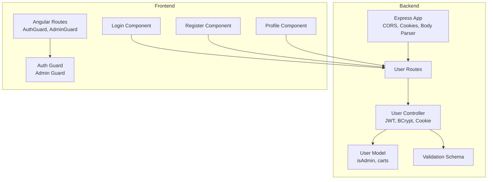
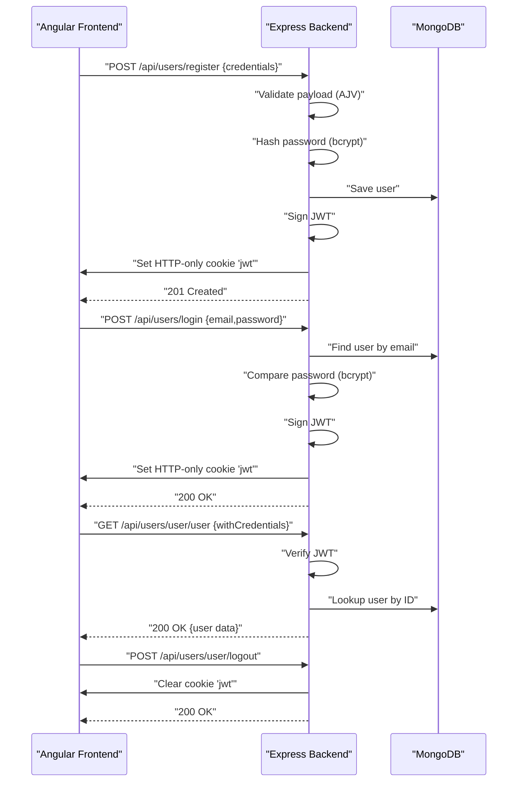
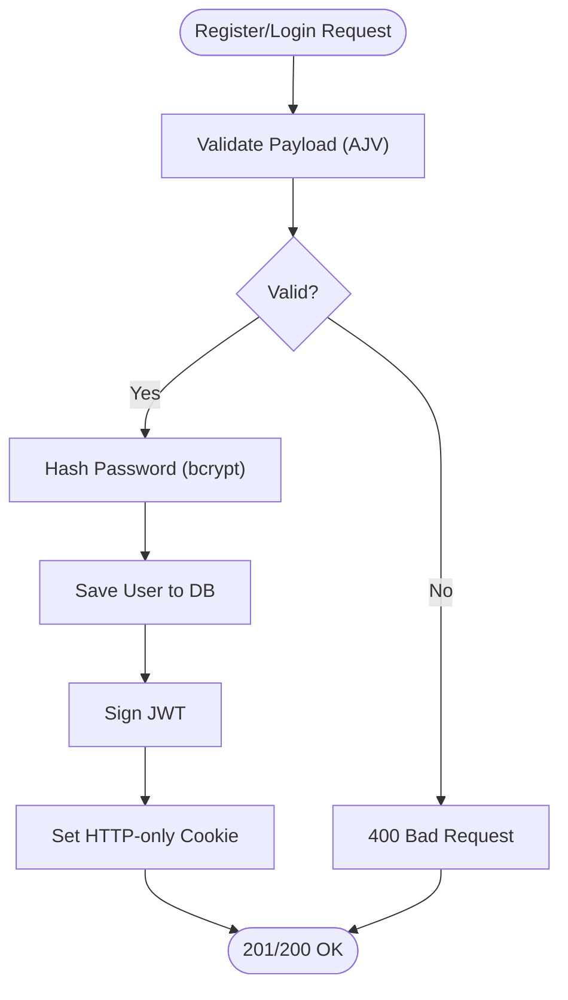
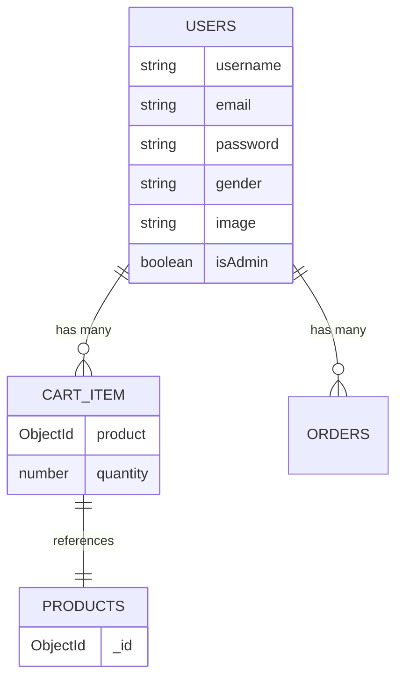
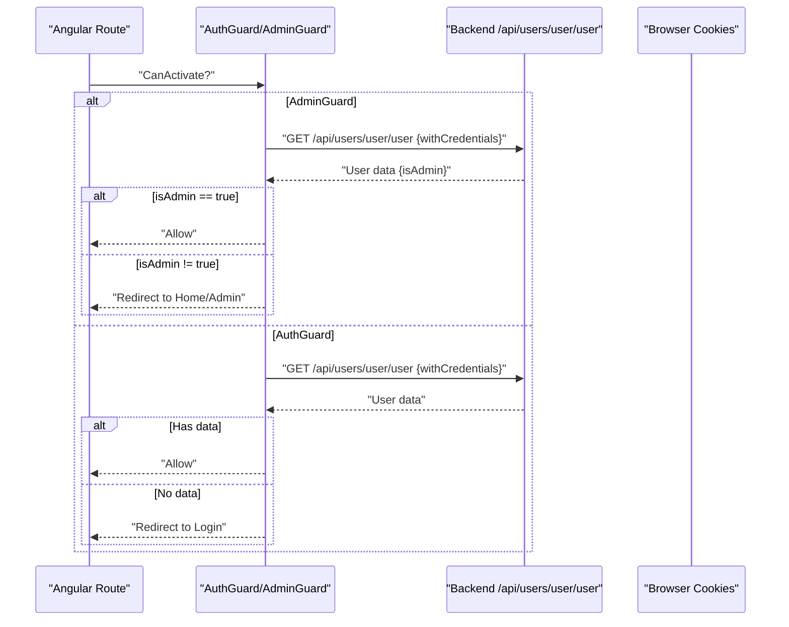
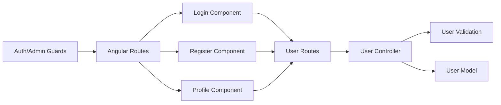

# Authentication and Authorization

<cite>
**Referenced Files in This Document**
- [app.js](file://Back-end/src/app.js)
- [env.js](file://Back-end/src/config/env.js)
- [user.controller.js](file://Back-end/src/controllers/user.controller.js)
- [user.validation.js](file://Back-end/src/middlewares/user.validation.js)
- [user.routes.js](file://Back-end/src/routes/user.routes.js)
- [user.model.js](file://Back-end/src/models/user.model.js)
- [auth.guard.ts](file://Front-end/src/app/core/guards/auth.guard.ts)
- [admin.guard.ts](file://Front-end/src/app/core/guards/admin.guard.ts)
- [login.component.ts](file://Front-end/src/app/features/auth/pages/login/login.component.ts)
- [register.component.ts](file://Front-end/src/app/features/auth/pages/register/register.component.ts)
- [profile.component.ts](file://Front-end/src/app/features/auth/pages/profile/profile.component.ts)
- [app.routes.ts](file://Front-end/src/app/app.routes.ts)
</cite>

## Table of Contents
1. [Introduction](#introduction)
2. [Project Structure](#project-structure)
3. [Core Components](#core-components)
4. [Architecture Overview](#architecture-overview)
5. [Detailed Component Analysis](#detailed-component-analysis)
6. [Dependency Analysis](#dependency-analysis)
7. [Performance Considerations](#performance-considerations)
8. [Security Measures and Mitigations](#security-measures-and-mitigations)
9. [Troubleshooting Guide](#troubleshooting-guide)
10. [Conclusion](#conclusion)
11. [Appendices](#appendices)

## Introduction
This document explains the authentication and authorization system for the Lightstorm e-commerce platform. It covers JWT token generation and verification, cookie-based session persistence, user registration and login flows, password hashing, input validation, and frontend guards enforcing role-based access control. It also highlights security considerations and mitigation strategies for common vulnerabilities.

## Project Structure
The authentication system spans the backend Express server and frontend Angular application:
- Backend
  - Express app initializes CORS, cookies, body parsing, and routes.
  - User routes expose registration, login, logout, and profile retrieval.
  - Controllers implement JWT signing, bcrypt password hashing, and cookie setting.
  - Validation middleware enforces strict input schemas.
  - Mongoose model defines user roles and cart structure.
- Frontend
  - Guards protect routes based on user roles.
  - Login and register pages coordinate with backend APIs.
  - Profile page handles logout and navigates to login.

**Diagram sources**
- [app.js](file://Back-end/src/app.js#L1-L96)
- [user.routes.js](file://Back-end/src/routes/user.routes.js#L1-L24)
- [user.controller.js](file://Back-end/src/controllers/user.controller.js#L1-L480)
- [user.model.js](file://Back-end/src/models/user.model.js#L1-L29)
- [user.validation.js](file://Back-end/src/middlewares/user.validation.js#L1-L29)
- [app.routes.ts](file://Front-end/src/app/app.routes.ts#L1-L50)
- [auth.guard.ts](file://Front-end/src/app/core/guards/auth.guard.ts#L1-L42)
- [admin.guard.ts](file://Front-end/src/app/core/guards/admin.guard.ts#L1-L46)
- [login.component.ts](file://Front-end/src/app/features/auth/pages/login/login.component.ts#L1-L116)
- [register.component.ts](file://Front-end/src/app/features/auth/pages/register/register.component.ts#L1-L86)
- [profile.component.ts](file://Front-end/src/app/features/auth/pages/profile/profile.component.ts#L1-L33)

**Section sources**
- [app.js](file://Back-end/src/app.js#L1-L96)
- [user.routes.js](file://Back-end/src/routes/user.routes.js#L1-L24)
- [user.controller.js](file://Back-end/src/controllers/user.controller.js#L1-L480)
- [user.model.js](file://Back-end/src/models/user.model.js#L1-L29)
- [user.validation.js](file://Back-end/src/middlewares/user.validation.js#L1-L29)
- [app.routes.ts](file://Front-end/src/app/app.routes.ts#L1-L50)
- [auth.guard.ts](file://Front-end/src/app/core/guards/auth.guard.ts#L1-L42)
- [admin.guard.ts](file://Front-end/src/app/core/guards/admin.guard.ts#L1-L46)
- [login.component.ts](file://Front-end/src/app/features/auth/pages/login/login.component.ts#L1-L116)
- [register.component.ts](file://Front-end/src/app/features/auth/pages/register/register.component.ts#L1-L86)
- [profile.component.ts](file://Front-end/src/app/features/auth/pages/profile/profile.component.ts#L1-L33)

## Core Components
- Backend Express app
  - Enables CORS with credentials and cookie parsing.
  - Serves static Angular app and proxies API routes.
- User routes
  - Expose endpoints for registration, login, logout, user retrieval by token, and cart/order operations.
- User controller
  - Implements bcrypt password hashing, JWT signing, cookie setting, token verification, and logout.
- Validation middleware
  - AJV schema validates incoming user payloads.
- User model
  - Defines user fields including isAdmin flag and cart items.
- Frontend guards
  - AuthGuard restricts non-admins from admin pages.
  - AdminGuard restricts non-admins from admin areas.
- Frontend pages
  - Login and register handle form validation and API calls with credentials.
  - Profile handles logout and redirects to login.

**Section sources**
- [app.js](file://Back-end/src/app.js#L1-L96)
- [user.routes.js](file://Back-end/src/routes/user.routes.js#L1-L24)
- [user.controller.js](file://Back-end/src/controllers/user.controller.js#L1-L480)
- [user.validation.js](file://Back-end/src/middlewares/user.validation.js#L1-L29)
- [user.model.js](file://Back-end/src/models/user.model.js#L1-L29)
- [auth.guard.ts](file://Front-end/src/app/core/guards/auth.guard.ts#L1-L42)
- [admin.guard.ts](file://Front-end/src/app/core/guards/admin.guard.ts#L1-L46)
- [login.component.ts](file://Front-end/src/app/features/auth/pages/login/login.component.ts#L1-L116)
- [register.component.ts](file://Front-end/src/app/features/auth/pages/register/register.component.ts#L1-L86)
- [profile.component.ts](file://Front-end/src/app/features/auth/pages/profile/profile.component.ts#L1-L33)

## Architecture Overview
The authentication flow uses JWT tokens stored in HTTP-only cookies. The frontend sends credentials with withCredentials enabled, and the backend sets a secure cookie. Guards enforce role-based access on the client side.

**Diagram sources**
- [user.controller.js](file://Back-end/src/controllers/user.controller.js#L118-L175)
- [user.validation.js](file://Back-end/src/middlewares/user.validation.js#L1-L29)
- [user.routes.js](file://Back-end/src/routes/user.routes.js#L15-L18)
- [login.component.ts](file://Front-end/src/app/features/auth/pages/login/login.component.ts#L38-L96)
- [register.component.ts](file://Back-end/src/middlewares/user.validation.js#L1-L29)
- [profile.component.ts](file://Front-end/src/app/features/auth/pages/profile/profile.component.ts#L25-L29)

## Detailed Component Analysis

### Backend: User Controller (JWT, Cookies, Password Hashing)
- Registration
  - Validates input via AJV schema.
  - Hashes password with bcrypt.
  - Creates user record and signs JWT.
  - Sets HTTP-only cookie with expiration.
- Login
  - Finds user by email, compares password with bcrypt.
  - Signs JWT and sets HTTP-only cookie.
- Token-based user retrieval
  - Reads cookie, verifies JWT, fetches user from DB, strips password.
- Logout
  - Clears the JWT cookie.

**Diagram sources**
- [user.controller.js](file://Back-end/src/controllers/user.controller.js#L138-L175)
- [user.validation.js](file://Back-end/src/middlewares/user.validation.js#L1-L29)

**Section sources**
- [user.controller.js](file://Back-end/src/controllers/user.controller.js#L32-L57)
- [user.controller.js](file://Back-end/src/controllers/user.controller.js#L118-L175)
- [user.controller.js](file://Back-end/src/controllers/user.controller.js#L421-L458)
- [user.validation.js](file://Back-end/src/middlewares/user.validation.js#L1-L29)

### Backend: Routes and Model
- Routes
  - Define endpoints for register, login, logout, user retrieval by token, and cart/order operations.
- Model
  - Includes isAdmin flag and cart entries with product ObjectId and quantity.

**Diagram sources**
- [user.routes.js](file://Back-end/src/routes/user.routes.js#L1-L24)
- [user.model.js](file://Back-end/src/models/user.model.js#L1-L29)

**Section sources**
- [user.routes.js](file://Back-end/src/routes/user.routes.js#L1-L24)
- [user.model.js](file://Back-end/src/models/user.model.js#L1-L29)

### Frontend: Guards and Pages
- AuthGuard
  - Protects routes for regular users; redirects unauthenticated users to login.
- AdminGuard
  - Restricts access to admin pages to users with isAdmin=true.
- Login and Register
  - Submit forms to backend with withCredentials enabled.
- Profile
  - Calls logout endpoint to clear cookie and navigate to login.

**Diagram sources**
- [auth.guard.ts](file://Front-end/src/app/core/guards/auth.guard.ts#L15-L40)
- [admin.guard.ts](file://Front-end/src/app/core/guards/admin.guard.ts#L15-L44)
- [profile.component.ts](file://Front-end/src/app/features/auth/pages/profile/profile.component.ts#L25-L29)

**Section sources**
- [auth.guard.ts](file://Front-end/src/app/core/guards/auth.guard.ts#L1-L42)
- [admin.guard.ts](file://Front-end/src/app/core/guards/admin.guard.ts#L1-L46)
- [login.component.ts](file://Front-end/src/app/features/auth/pages/login/login.component.ts#L38-L96)
- [register.component.ts](file://Front-end/src/app/features/auth/pages/register/register.component.ts#L33-L84)
- [profile.component.ts](file://Front-end/src/app/features/auth/pages/profile/profile.component.ts#L1-L33)
- [app.routes.ts](file://Front-end/src/app/app.routes.ts#L21-L49)

## Dependency Analysis
- Backend dependencies
  - Express app depends on routes, controllers, models, and validation middleware.
  - Controllers depend on bcrypt for password hashing, jsonwebtoken for JWT, and cookie-parser for cookie handling.
- Frontend dependencies
  - Guards depend on HTTP client to call backend user endpoint.
  - Pages depend on guards and HTTP client for authentication flows.

**Diagram sources**
- [user.routes.js](file://Back-end/src/routes/user.routes.js#L1-L24)
- [user.controller.js](file://Back-end/src/controllers/user.controller.js#L1-L480)
- [user.validation.js](file://Back-end/src/middlewares/user.validation.js#L1-L29)
- [user.model.js](file://Back-end/src/models/user.model.js#L1-L29)
- [auth.guard.ts](file://Front-end/src/app/core/guards/auth.guard.ts#L1-L42)
- [admin.guard.ts](file://Front-end/src/app/core/guards/admin.guard.ts#L1-L46)
- [app.routes.ts](file://Front-end/src/app/app.routes.ts#L1-L50)

**Section sources**
- [user.routes.js](file://Back-end/src/routes/user.routes.js#L1-L24)
- [user.controller.js](file://Back-end/src/controllers/user.controller.js#L1-L480)
- [user.validation.js](file://Back-end/src/middlewares/user.validation.js#L1-L29)
- [user.model.js](file://Back-end/src/models/user.model.js#L1-L29)
- [auth.guard.ts](file://Front-end/src/app/core/guards/auth.guard.ts#L1-L42)
- [admin.guard.ts](file://Front-end/src/app/core/guards/admin.guard.ts#L1-L46)
- [app.routes.ts](file://Front-end/src/app/app.routes.ts#L1-L50)

## Performance Considerations
- Password hashing cost
  - Using bcrypt with a moderate salt round count balances security and performance. Consider tuning rounds based on hardware capacity.
- JWT signing overhead
  - Keep secret keys short-lived and rotate periodically to reduce risk without impacting performance.
- Cookie size
  - Store minimal claims in JWT to keep cookie sizes small and reduce bandwidth usage.
- Caching user data
  - On the frontend, cache user data after login to avoid repeated backend calls until logout or refresh.

[No sources needed since this section provides general guidance]

## Security Measures and Mitigations
- Input validation
  - Backend uses AJV schema to validate registration payloads, preventing malformed or unexpected fields.
- Password hashing
  - Passwords are hashed with bcrypt before storage.
- Cookie security
  - JWT is stored in an HTTP-only cookie, reducing XSS exposure.
  - Consider adding SameSite and Secure flags for stricter controls.
- Role-based access control
  - isAdmin field in the model enables backend and frontend guards to enforce admin-only routes.
- CSRF protection
  - Current implementation relies on cookies with credentials. Consider adding CSRF tokens for state-changing requests.
- Token storage
  - HTTP-only cookie prevents client-side scripts from accessing the token.
- Environment configuration
  - Centralized environment configuration improves maintainability of secrets and base URLs.

**Section sources**
- [user.validation.js](file://Back-end/src/middlewares/user.validation.js#L1-L29)
- [user.controller.js](file://Back-end/src/controllers/user.controller.js#L37-L49)
- [user.controller.js](file://Back-end/src/controllers/user.controller.js#L128-L132)
- [user.controller.js](file://Back-end/src/controllers/user.controller.js#L423-L458)
- [admin.guard.ts](file://Front-end/src/app/core/guards/admin.guard.ts#L15-L44)
- [auth.guard.ts](file://Front-end/src/app/core/guards/auth.guard.ts#L15-L40)
- [env.js](file://Back-end/src/config/env.js#L1-L4)

## Troubleshooting Guide
- Login fails with invalid credentials
  - Verify email exists and password matches hash.
- Unauthorized errors on protected routes
  - Ensure cookies are sent with credentials and the JWT cookie is present.
- Admin guard denies access
  - Confirm user has isAdmin=true in the database.
- Logout does not work
  - Ensure the frontend calls the logout endpoint with credentials and clears local state.

**Section sources**
- [user.controller.js](file://Back-end/src/controllers/user.controller.js#L118-L126)
- [user.controller.js](file://Back-end/src/controllers/user.controller.js#L447-L458)
- [user.controller.js](file://Back-end/src/controllers/user.controller.js#L421-L445)
- [admin.guard.ts](file://Front-end/src/app/core/guards/admin.guard.ts#L15-L44)
- [auth.guard.ts](file://Front-end/src/app/core/guards/auth.guard.ts#L15-L40)

## Conclusion
The Lightstorm authentication system integrates backend JWT and cookie management with frontend guards to provide role-based access control. Strong input validation and bcrypt-based password hashing improve security. Enhancing CSRF protection and cookie flags would further harden the system against common threats.

[No sources needed since this section summarizes without analyzing specific files]

## Appendices

### Protected Routes and Admin Patterns
- Protected routes
  - Checkout, profile, payment, and confirm order require authenticated users.
- Admin-only routes
  - Admin dashboard, user management, and product management require isAdmin=true.
- Permission patterns
  - Guards call the backend user endpoint to verify identity and role.

**Section sources**
- [app.routes.ts](file://Front-end/src/app/app.routes.ts#L21-L49)
- [auth.guard.ts](file://Front-end/src/app/core/guards/auth.guard.ts#L15-L40)
- [admin.guard.ts](file://Front-end/src/app/core/guards/admin.guard.ts#L15-L44)
- [user.controller.js](file://Back-end/src/controllers/user.controller.js#L421-L445)