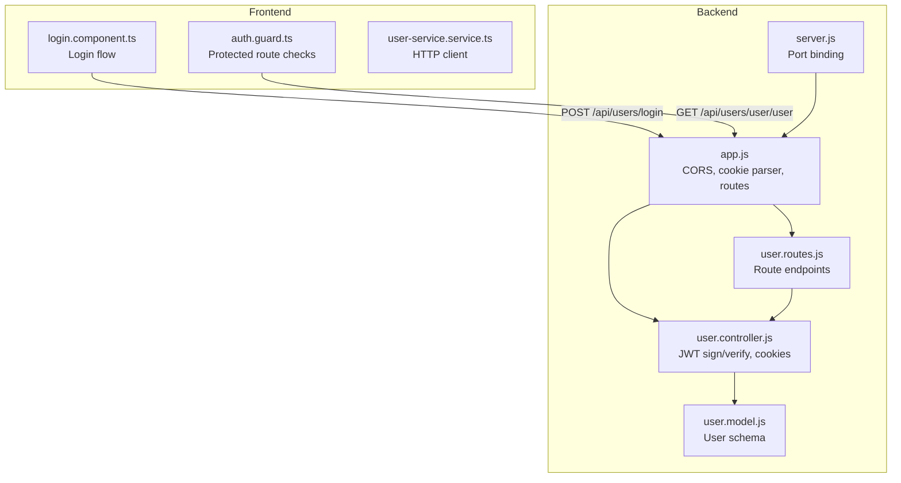
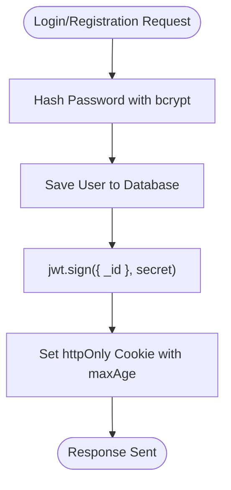
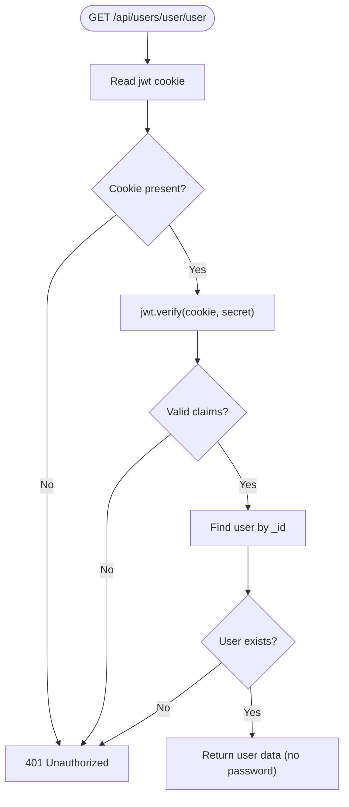
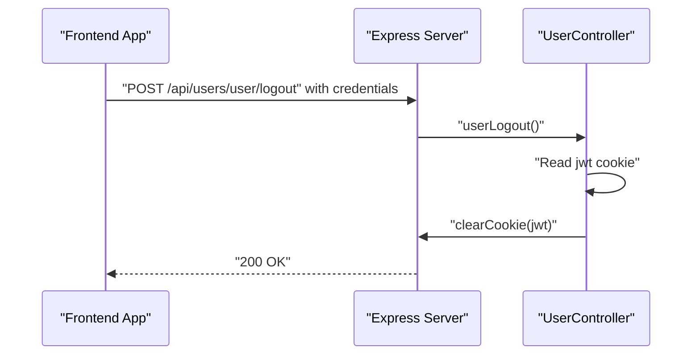
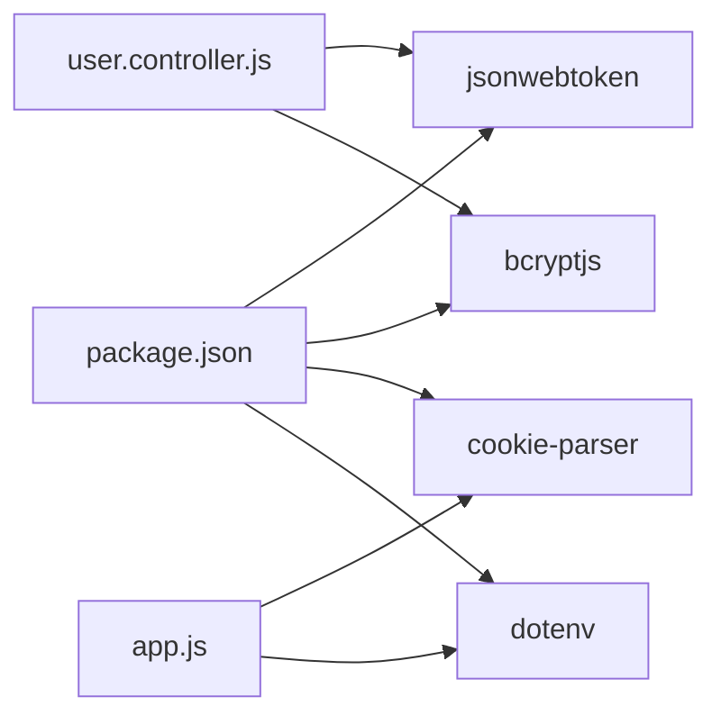

# JWT Token Implementation

<cite>
**Referenced Files in This Document**
- [user.controller.js](file://Back-end/src/Controllers/user.controller.js)
- [user.model.js](file://Back-end/src/Models/user.model.js)
- [user.routes.js](file://Back-end/src/Routes/user.routes.js)
- [app.js](file://Back-end/src/app.js)
- [server.js](file://Back-end/src/server.js)
- [auth.guard.ts](file://Front-end/src/app/core/guards/auth.guard.ts)
- [login.component.ts](file://Front-end/src/app/features/auth/pages/login/login.component.ts)
- [user-service.service.ts](file://Front-end/src/app/core/services/user-service.service.ts)
- [package.json](file://Back-end/package.json)
</cite>

## Table of Contents
1. [Introduction](#introduction)
2. [Project Structure](#project-structure)
3. [Core Components](#core-components)
4. [Architecture Overview](#architecture-overview)
5. [Detailed Component Analysis](#detailed-component-analysis)
6. [Dependency Analysis](#dependency-analysis)
7. [Performance Considerations](#performance-considerations)
8. [Troubleshooting Guide](#troubleshooting-guide)
9. [Conclusion](#conclusion)

## Introduction
This document explains the JWT token implementation used for authentication in the e-commerce backend. It covers how passwords are hashed using bcrypt, how JWT tokens are generated via jsonwebtoken, how tokens are verified in the GetUserByToken endpoint, and how logout clears cookies. It also documents cookie configuration, security implications, and practical guidance for token creation, validation, and secure storage.

## Project Structure
The JWT implementation spans backend controllers, routes, and middleware, and integrates with the frontend via HTTP requests with credentials enabled.



**Diagram sources**
- [user.controller.js](file://Back-end/src/Controllers/user.controller.js#L118-L175)
- [user.routes.js](file://Back-end/src/Routes/user.routes.js#L15-L18)
- [app.js](file://Back-end/src/app.js#L19-L23)
- [server.js](file://Back-end/src/server.js#L1-L6)
- [auth.guard.ts](file://Front-end/src/app/core/guards/auth.guard.ts#L15-L39)
- [login.component.ts](file://Front-end/src/app/features/auth/pages/login/login.component.ts#L37-L96)
- [user-service.service.ts](file://Front-end/src/app/core/services/user-service.service.ts#L1-L25)

**Section sources**
- [user.controller.js](file://Back-end/src/Controllers/user.controller.js#L1-L480)
- [user.routes.js](file://Back-end/src/Routes/user.routes.js#L1-L24)
- [app.js](file://Back-end/src/app.js#L1-L96)
- [server.js](file://Back-end/src/server.js#L1-L6)
- [auth.guard.ts](file://Front-end/src/app/core/guards/auth.guard.ts#L1-L42)
- [login.component.ts](file://Front-end/src/app/features/auth/pages/login/login.component.ts#L1-L116)
- [user-service.service.ts](file://Front-end/src/app/core/services/user-service.service.ts#L1-L25)

## Core Components
- Token generation during login and registration:
  - Password hashing with bcrypt before storing user data.
  - JWT signing with a secret key and setting an httpOnly cookie with a long maxAge.
- Token verification:
  - GetUserByToken reads the jwt cookie, verifies it with jsonwebtoken, resolves the user by claims, and returns user data without the password.
- Logout:
  - userLogout clears the jwt cookie.

Key implementation references:
- Token creation and cookie setting during login and registration: [user.controller.js](file://Back-end/src/Controllers/user.controller.js#L118-L175)
- Token verification in GetUserByToken: [user.controller.js](file://Back-end/src/Controllers/user.controller.js#L421-L445)
- Logout clearing cookie: [user.controller.js](file://Back-end/src/Controllers/user.controller.js#L447-L458)

**Section sources**
- [user.controller.js](file://Back-end/src/Controllers/user.controller.js#L118-L175)
- [user.controller.js](file://Back-end/src/Controllers/user.controller.js#L421-L445)
- [user.controller.js](file://Back-end/src/Controllers/user.controller.js#L447-L458)

## Architecture Overview
The JWT flow connects frontend and backend through explicit endpoints and cookie-based session-like behavior.

```mermaid
sequenceDiagram
participant FE as "Frontend App"
participant API as "Express Server"
participant CTRL as "UserController"
participant DB as "MongoDB"
FE->>API : "POST /api/users/login" with credentials
API->>CTRL : "LoginUser()"
CTRL->>DB : "Find user by email"
DB-->>CTRL : "User document"
CTRL->>CTRL : "bcrypt.compare(password, hash)"
CTRL->>CTRL : "jwt.sign({ _id }, secret)"
CTRL->>API : "Set Cookie : jwt=httpOnly; maxAge=24*30*60*60*1000"
API-->>FE : "200 OK with user"
FE->>API : "GET /api/users/user/user" with credentials
API->>CTRL : "GetUserByToken()"
CTRL->>API : "Read jwt cookie"
API-->>CTRL : "jwt cookie value"
CTRL->>CTRL : "jwt.verify(cookie, secret)"
CTRL->>DB : "Find user by _id"
DB-->>CTRL : "User document"
CTRL-->>FE : "200 OK with user data"
FE->>API : "POST /api/users/user/logout" with credentials
API->>CTRL : "userLogout()"
CTRL->>API : "clearCookie(jwt)"
API-->>FE : "200 OK"
```

**Diagram sources**
- [user.controller.js](file://Back-end/src/Controllers/user.controller.js#L118-L175)
- [user.controller.js](file://Back-end/src/Controllers/user.controller.js#L421-L445)
- [user.controller.js](file://Back-end/src/Controllers/user.controller.js#L447-L458)
- [user.routes.js](file://Back-end/src/Routes/user.routes.js#L15-L18)
- [app.js](file://Back-end/src/app.js#L19-L23)

## Detailed Component Analysis

### Token Generation During Login and Registration
- Password hashing:
  - Salt generation and bcrypt hashing occur before saving user data.
- JWT creation:
  - A compact token is signed using a secret key and attached to the response as an httpOnly cookie.
- Cookie configuration:
  - httpOnly flag prevents client-side script access.
  - maxAge sets a long-lived session (30 days).

Implementation references:
- Login flow: [user.controller.js](file://Back-end/src/Controllers/user.controller.js#L118-L136)
- Registration flow: [user.controller.js](file://Back-end/src/Controllers/user.controller.js#L138-L175)



**Diagram sources**
- [user.controller.js](file://Back-end/src/Controllers/user.controller.js#L118-L175)

**Section sources**
- [user.controller.js](file://Back-end/src/Controllers/user.controller.js#L118-L175)

### Token Verification Mechanism
- Endpoint: GET /api/users/user/user
- Steps:
  - Extract jwt cookie from request.
  - Verify signature with jsonwebtoken.
  - Resolve user by the _id claim.
  - Return user data excluding the password field.

Implementation references:
- Verification logic: [user.controller.js](file://Back-end/src/Controllers/user.controller.js#L421-L445)
- Route definition: [user.routes.js](file://Back-end/src/Routes/user.routes.js#L17-L17)



**Diagram sources**
- [user.controller.js](file://Back-end/src/Controllers/user.controller.js#L421-L445)
- [user.routes.js](file://Back-end/src/Routes/user.routes.js#L17-L17)

**Section sources**
- [user.controller.js](file://Back-end/src/Controllers/user.controller.js#L421-L445)
- [user.routes.js](file://Back-end/src/Routes/user.routes.js#L17-L17)

### Logout Functionality
- Endpoint: POST /api/users/user/logout
- Behavior:
  - Reads jwt cookie if present.
  - Clears the cookie.
  - Returns success or informational messages.

Implementation references:
- Logout logic: [user.controller.js](file://Back-end/src/Controllers/user.controller.js#L447-L458)
- Route definition: [user.routes.js](file://Back-end/src/Routes/user.routes.js#L18-L18)



**Diagram sources**
- [user.controller.js](file://Back-end/src/Controllers/user.controller.js#L447-L458)
- [user.routes.js](file://Back-end/src/Routes/user.routes.js#L18-L18)

**Section sources**
- [user.controller.js](file://Back-end/src/Controllers/user.controller.js#L447-L458)
- [user.routes.js](file://Back-end/src/Routes/user.routes.js#L18-L18)

### Cookie Configuration and Security Implications
- httpOnly: Ensures the cookie cannot be accessed via JavaScript, mitigating XSS risks.
- maxAge: Sets a long-lived cookie suitable for persistent sessions.
- withCredentials: Frontend requests include cookies for authenticated routes.
- CORS: Credentials-enabled CORS allows cross-origin requests with cookies.

Implementation references:
- Cookie setting: [user.controller.js](file://Back-end/src/Controllers/user.controller.js#L128-L132), [user.controller.js](file://Back-end/src/Controllers/user.controller.js#L164-L167)
- Cookie parsing: [app.js](file://Back-end/src/app.js#L23-L23)
- Frontend credentials: [auth.guard.ts](file://Front-end/src/app/core/guards/auth.guard.ts#L18-L18), [login.component.ts](file://Front-end/src/app/features/auth/pages/login/login.component.ts#L57-L57)
- CORS with credentials: [app.js](file://Back-end/src/app.js#L19-L22)

Security considerations:
- The secret used for signing is currently a string literal. Prefer a strong secret stored in environment variables.
- Consider adding SameSite and Secure flags for HTTPS deployments.
- Implement token expiration and refresh strategies for enhanced security.

**Section sources**
- [user.controller.js](file://Back-end/src/Controllers/user.controller.js#L128-L132)
- [user.controller.js](file://Back-end/src/Controllers/user.controller.js#L164-L167)
- [app.js](file://Back-end/src/app.js#L19-L23)
- [auth.guard.ts](file://Front-end/src/app/core/guards/auth.guard.ts#L18-L18)
- [login.component.ts](file://Front-end/src/app/features/auth/pages/login/login.component.ts#L57-L57)

### Token Expiration, Refresh Strategies, and Best Practices
Current state:
- Tokens are long-lived due to a large maxAge.
- No built-in expiration handling or refresh endpoints.

Recommended enhancements:
- Add expiration to JWT payload and verify exp during GetUserByToken.
- Implement a dedicated refresh token endpoint and separate refresh token storage.
- Enforce short-lived access tokens and rotate refresh tokens.
- Store refresh tokens securely (hashed, scoped, revocable).
- Use HTTPS and set Secure and SameSite flags for cookies.

[No sources needed since this section provides general guidance]

## Dependency Analysis
External libraries involved in JWT implementation:
- jsonwebtoken: Signing and verifying JWTs.
- bcryptjs: Password hashing.
- cookie-parser: Parsing cookies on the server.
- dotenv: Loading environment variables (for secrets).

Implementation references:
- Dependencies: [package.json](file://Back-end/package.json#L13-L26)
- Usage in controller: [user.controller.js](file://Back-end/src/Controllers/user.controller.js#L6-L7)



**Diagram sources**
- [package.json](file://Back-end/package.json#L13-L26)
- [user.controller.js](file://Back-end/src/Controllers/user.controller.js#L6-L7)
- [app.js](file://Back-end/src/app.js#L5-L8)

**Section sources**
- [package.json](file://Back-end/package.json#L13-L26)
- [user.controller.js](file://Back-end/src/Controllers/user.controller.js#L6-L7)
- [app.js](file://Back-end/src/app.js#L5-L8)

## Performance Considerations
- bcrypt cost: Using a moderate salt rounds value balances security and performance.
- JWT verification overhead: Minimal compared to database queries; cache user lookups if needed.
- Cookie size: Keep JWT small; avoid large payloads in claims.
- Network latency: Enable compression and keep endpoints lean.

[No sources needed since this section provides general guidance]

## Troubleshooting Guide
Common issues and resolutions:
- Unauthorized due to missing cookie:
  - Ensure requests include credentials and the jwt cookie is present.
  - References: [auth.guard.ts](file://Front-end/src/app/core/guards/auth.guard.ts#L18-L18), [login.component.ts](file://Front-end/src/app/features/auth/pages/login/login.component.ts#L57-L57)
- Invalid token:
  - Verify the signing secret matches the one used to sign the token.
  - References: [user.controller.js](file://Back-end/src/Controllers/user.controller.js#L430-L430)
- User not found after token verification:
  - Confirm the user still exists in the database.
  - References: [user.controller.js](file://Back-end/src/Controllers/user.controller.js#L435-L438)
- Logout not clearing cookie:
  - Ensure the cookie domain/path matches the request origin.
  - References: [user.controller.js](file://Back-end/src/Controllers/user.controller.js#L447-L458)

**Section sources**
- [auth.guard.ts](file://Front-end/src/app/core/guards/auth.guard.ts#L18-L18)
- [login.component.ts](file://Front-end/src/app/features/auth/pages/login/login.component.ts#L57-L57)
- [user.controller.js](file://Back-end/src/Controllers/user.controller.js#L430-L430)
- [user.controller.js](file://Back-end/src/Controllers/user.controller.js#L435-L438)
- [user.controller.js](file://Back-end/src/Controllers/user.controller.js#L447-L458)

## Conclusion
The backend implements a straightforward JWT-based authentication system using bcrypt for password hashing and jsonwebtoken for token signing. Cookies are configured as httpOnly with a long maxAge, enabling persistent sessions. The GetUserByToken endpoint validates tokens and resolves users, while logout clears the cookie. For production, adopt environment-backed secrets, add token expiration and refresh strategies, and harden cookie attributes for improved security.