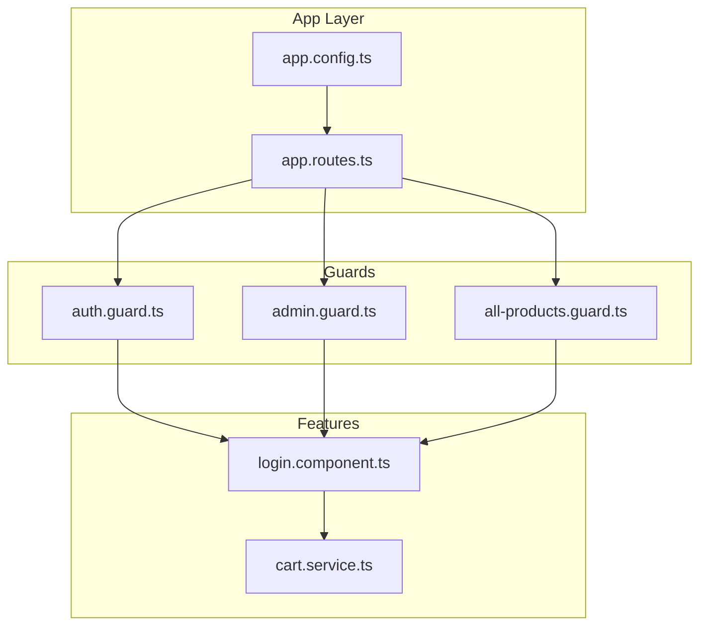
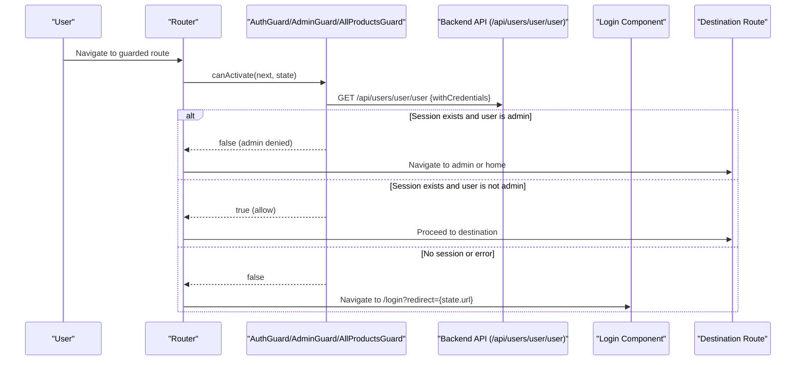
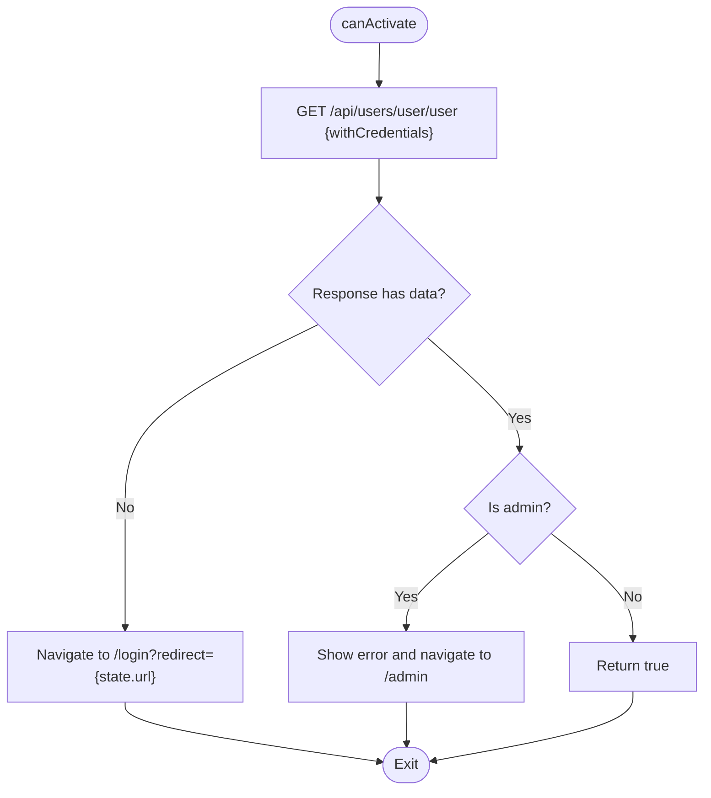
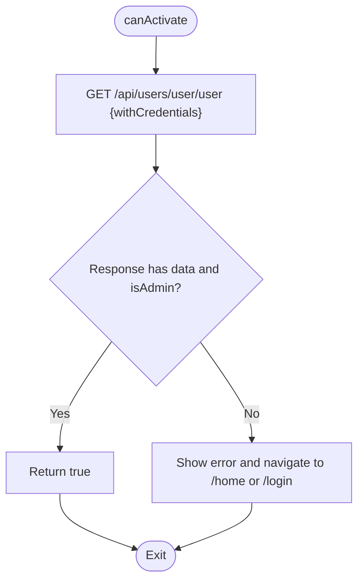
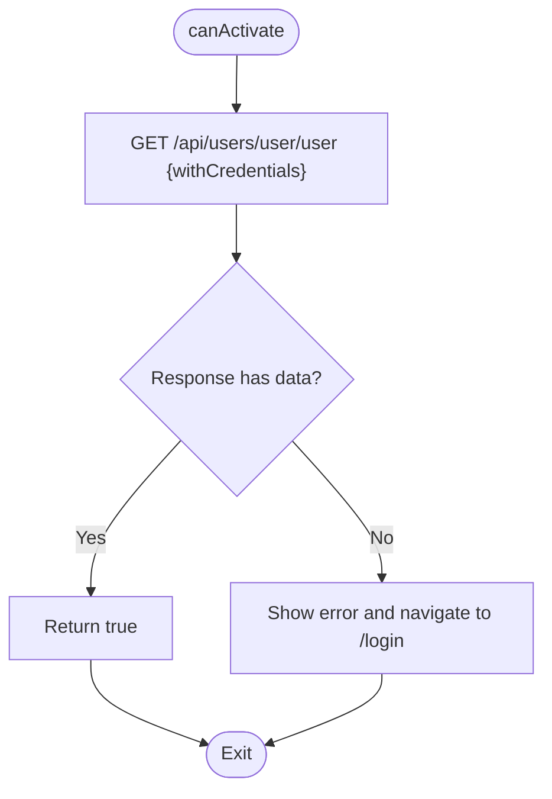
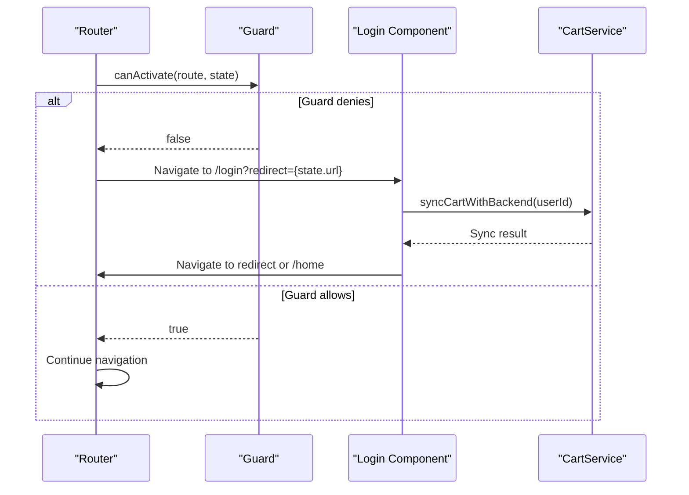
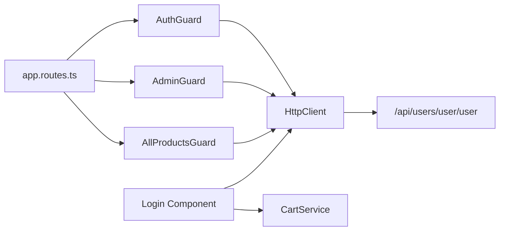

# Route Guards and Access Control

<cite>
**Referenced Files in This Document**
- [auth.guard.ts](file://Front-end/src/app/core/guards/auth.guard.ts)
- [admin.guard.ts](file://Front-end/src/app/core/guards/admin.guard.ts)
- [all-products.guard.ts](file://Front-end/src/app/core/guards/all-products.guard.ts)
- [app.routes.ts](file://Front-end/src/app/app.routes.ts)
- [login.component.ts](file://Front-end/src/app/features/auth/pages/login/login.component.ts)
- [cart.service.ts](file://Front-end/src/app/core/services/cart.service.ts)
- [app.config.ts](file://Front-end/src/app/app.config.ts)
- [user.service.ts](file://Front-end/src/app/core/services/user-service.service.ts)
- [user.service.ts](file://Front-end/src/app/features/admin/admin/services/user.service.ts)
- [user.service.ts](file://Front-end/src/app/features/shop/pages/checkout/user.service.ts)
</cite>

## Table of Contents
1. [Introduction](#introduction)
2. [Project Structure](#project-structure)
3. [Core Components](#core-components)
4. [Architecture Overview](#architecture-overview)
5. [Detailed Component Analysis](#detailed-component-analysis)
6. [Dependency Analysis](#dependency-analysis)
7. [Performance Considerations](#performance-considerations)
8. [Troubleshooting Guide](#troubleshooting-guide)
9. [Conclusion](#conclusion)
10. [Appendices](#appendices)

## Introduction
This document explains the Angular route protection system used in the application. It focuses on three guards:
- AuthGuard: protects authenticated routes for non-admin users.
- AdminGuard: enforces role-based access control for admin-only sections.
- AllProductsGuard: validates access to product listings requiring login.

It details how guards implement the canActivate interface, check tokens via backend calls, and redirect users appropriately. It also documents how guards integrate with Angular’s router module, how navigation is intercepted, and how to configure protected routes. Finally, it covers guard composition, error handling, and best practices for secure navigation.

## Project Structure
The route protection system is implemented under the core guards module and wired into the application routes. Guards rely on HTTP calls to a backend endpoint that returns the current user session. The router configuration attaches guards to specific paths to enforce access policies.

**Diagram sources**
- [app.config.ts](file://Front-end/src/app/app.config.ts#L1-L11)
- [app.routes.ts](file://Front-end/src/app/app.routes.ts#L1-L50)
- [auth.guard.ts](file://Front-end/src/app/core/guards/auth.guard.ts#L1-L42)
- [admin.guard.ts](file://Front-end/src/app/core/guards/admin.guard.ts#L1-L46)
- [all-products.guard.ts](file://Front-end/src/app/core/guards/all-products.guard.ts#L1-L46)
- [login.component.ts](file://Front-end/src/app/features/auth/pages/login/login.component.ts#L1-L116)
- [cart.service.ts](file://Front-end/src/app/core/services/cart.service.ts#L1-L111)

**Section sources**
- [app.config.ts](file://Front-end/src/app/app.config.ts#L1-L11)
- [app.routes.ts](file://Front-end/src/app/app.routes.ts#L1-L50)

## Core Components
- AuthGuard: Denies admin users access to general authenticated pages and redirects them to the admin area. Otherwise, allows access.
- AdminGuard: Ensures only admin users can access admin routes; otherwise, informs and redirects non-admins.
- AllProductsGuard: Requires a valid user session for product listings; otherwise, prompts login and redirects.

All guards implement the canActivate interface, perform an HTTP GET against the backend user endpoint with credentials, and handle both success and error outcomes by navigating to appropriate destinations.

**Section sources**
- [auth.guard.ts](file://Front-end/src/app/core/guards/auth.guard.ts#L1-L42)
- [admin.guard.ts](file://Front-end/src/app/core/guards/admin.guard.ts#L1-L46)
- [all-products.guard.ts](file://Front-end/src/app/core/guards/all-products.guard.ts#L1-L46)

## Architecture Overview
The guards integrate with Angular’s router to intercept navigation attempts. When a user tries to navigate to a guarded route, the router invokes the guard’s canActivate method. The guard checks the current user session via a backend endpoint and either:
- Allow navigation by returning true.
- Deny navigation and redirect to login or another destination by returning false and triggering router navigation.

**Diagram sources**
- [auth.guard.ts](file://Front-end/src/app/core/guards/auth.guard.ts#L15-L40)
- [admin.guard.ts](file://Front-end/src/app/core/guards/admin.guard.ts#L15-L44)
- [all-products.guard.ts](file://Front-end/src/app/core/guards/all-products.guard.ts#L15-L43)
- [login.component.ts](file://Front-end/src/app/features/auth/pages/login/login.component.ts#L38-L96)
- [app.routes.ts](file://Front-end/src/app/app.routes.ts#L32-L47)

## Detailed Component Analysis

### AuthGuard
Purpose:
- Prevent admin users from accessing general authenticated routes (e.g., checkout, profile, payment, confirm order).
- Redirect admins to the admin area when attempting to access non-admin routes.

Key behaviors:
- Calls the backend user endpoint with credentials.
- If the response indicates an admin user, denies access and navigates to the admin route.
- If the response indicates a non-admin user, allows access.
- On error, navigates to login with the current URL as a redirect parameter.

Integration points:
- Used in routes for checkout, profile, payment, and confirm order.

**Diagram sources**
- [auth.guard.ts](file://Front-end/src/app/core/guards/auth.guard.ts#L15-L40)

**Section sources**
- [auth.guard.ts](file://Front-end/src/app/core/guards/auth.guard.ts#L1-L42)
- [app.routes.ts](file://Front-end/src/app/app.routes.ts#L32-L47)

### AdminGuard
Purpose:
- Enforce admin-only access to admin routes (e.g., admin dashboard, user management, product management).

Key behaviors:
- Calls the backend user endpoint with credentials.
- If the response indicates an admin user, allows access.
- If the response indicates a non-admin user or no session, informs the user and navigates to home.
- On error, informs the user and navigates to login.

Integration points:
- Used in routes for admin, admin/users, and admin/product.

**Diagram sources**
- [admin.guard.ts](file://Front-end/src/app/core/guards/admin.guard.ts#L15-L44)

**Section sources**
- [admin.guard.ts](file://Front-end/src/app/core/guards/admin.guard.ts#L1-L46)
- [app.routes.ts](file://Front-end/src/app/app.routes.ts#L33-L38)

### AllProductsGuard
Purpose:
- Require a valid user session for accessing product listings.

Key behaviors:
- Calls the backend user endpoint with credentials.
- If the response indicates a valid user, allows access.
- If no session exists, informs the user and navigates to login.
- On error, informs the user and navigates to login.

Integration points:
- Used in the products route.

**Diagram sources**
- [all-products.guard.ts](file://Front-end/src/app/core/guards/all-products.guard.ts#L15-L43)

**Section sources**
- [all-products.guard.ts](file://Front-end/src/app/core/guards/all-products.guard.ts#L1-L46)
- [app.routes.ts](file://Front-end/src/app/app.routes.ts#L40-L44)

### Router Integration and Navigation Interception
- Guards are attached to routes via the canActivate array in the routes configuration.
- When a navigation attempt occurs, the router invokes the guard’s canActivate method synchronously (wrapped in an observable).
- On denial, guards navigate to login with the current URL as a redirect parameter, enabling seamless post-login redirection.
- On successful authentication, login component reads the redirect query parameter and navigates accordingly.

**Diagram sources**
- [app.routes.ts](file://Front-end/src/app/app.routes.ts#L32-L47)
- [login.component.ts](file://Front-end/src/app/features/auth/pages/login/login.component.ts#L76-L87)
- [cart.service.ts](file://Front-end/src/app/core/services/cart.service.ts#L93-L109)

**Section sources**
- [app.routes.ts](file://Front-end/src/app/app.routes.ts#L1-L50)
- [login.component.ts](file://Front-end/src/app/features/auth/pages/login/login.component.ts#L1-L116)
- [cart.service.ts](file://Front-end/src/app/core/services/cart.service.ts#L1-L111)

## Dependency Analysis
- Guards depend on Angular’s Router and HttpClient to perform navigation and HTTP calls.
- Guards call the backend endpoint /api/users/user/user with credentials to determine the current user’s session and role.
- Login component coordinates post-authentication navigation and guest-to-user cart synchronization.
- Routes import and attach guards to specific paths.

**Diagram sources**
- [auth.guard.ts](file://Front-end/src/app/core/guards/auth.guard.ts#L1-L42)
- [admin.guard.ts](file://Front-end/src/app/core/guards/admin.guard.ts#L1-L46)
- [all-products.guard.ts](file://Front-end/src/app/core/guards/all-products.guard.ts#L1-L46)
- [login.component.ts](file://Front-end/src/app/features/auth/pages/login/login.component.ts#L1-L116)
- [cart.service.ts](file://Front-end/src/app/core/services/cart.service.ts#L1-L111)
- [app.routes.ts](file://Front-end/src/app/app.routes.ts#L1-L50)

**Section sources**
- [auth.guard.ts](file://Front-end/src/app/core/guards/auth.guard.ts#L1-L42)
- [admin.guard.ts](file://Front-end/src/app/core/guards/admin.guard.ts#L1-L46)
- [all-products.guard.ts](file://Front-end/src/app/core/guards/all-products.guard.ts#L1-L46)
- [login.component.ts](file://Front-end/src/app/features/auth/pages/login/login.component.ts#L1-L116)
- [cart.service.ts](file://Front-end/src/app/core/services/cart.service.ts#L1-L111)
- [app.routes.ts](file://Front-end/src/app/app.routes.ts#L1-L50)

## Performance Considerations
- Each guard performs a network call to the backend during navigation. Consider caching user sessions in memory to reduce redundant requests if the app grows.
- Avoid blocking navigation with heavy synchronous operations; keep guard logic lightweight and asynchronous.
- Use distinct guards per route to minimize unnecessary checks and improve maintainability.

[No sources needed since this section provides general guidance]

## Troubleshooting Guide
Common issues and resolutions:
- Admins redirected to admin route when accessing authenticated pages:
  - Expected behavior of AuthGuard. Ensure admin routes are protected by AdminGuard and non-admin routes by AuthGuard.
- Non-admins blocked from admin routes:
  - Expected behavior of AdminGuard. Verify the backend returns the correct isAdmin flag.
- Users prompted to log in when accessing product listings:
  - Expected behavior of AllProductsGuard. Ensure the backend endpoint returns a valid user session.
- Post-login redirection not working:
  - Confirm the login component reads the redirect query parameter and navigates to it after successful authentication and cart synchronization.
- Guest cart not syncing after login:
  - Verify the login component calls the cart synchronization service and handles errors gracefully.

**Section sources**
- [auth.guard.ts](file://Front-end/src/app/core/guards/auth.guard.ts#L15-L40)
- [admin.guard.ts](file://Front-end/src/app/core/guards/admin.guard.ts#L15-L44)
- [all-products.guard.ts](file://Front-end/src/app/core/guards/all-products.guard.ts#L15-L43)
- [login.component.ts](file://Front-end/src/app/features/auth/pages/login/login.component.ts#L76-L87)
- [cart.service.ts](file://Front-end/src/app/core/services/cart.service.ts#L93-L109)

## Conclusion
The route protection system uses three guards to enforce authentication and role-based access control:
- AuthGuard prevents admin users from accessing general authenticated routes.
- AdminGuard restricts admin-only areas to administrators.
- AllProductsGuard ensures product listings require a valid user session.

Guards integrate seamlessly with Angular’s router, leveraging backend endpoints to validate sessions and roles. Proper configuration and error handling ensure smooth navigation and a secure user experience.

[No sources needed since this section summarizes without analyzing specific files]

## Appendices

### Protected Route Configurations
- Authenticated routes (non-admin):
  - checkout, profile, payment, confirm
  - Protected by AuthGuard
- Admin-only routes:
  - admin, admin/users, admin/product
  - Protected by AdminGuard
- Product listings:
  - products
  - Protected by AllProductsGuard

**Section sources**
- [app.routes.ts](file://Front-end/src/app/app.routes.ts#L32-L47)

### Token Checking Mechanism
- Guards call the backend endpoint /api/users/user/user with credentials enabled.
- Successful responses indicate a valid session; guards evaluate user role to decide access.
- Errors trigger navigation to login with the current URL as a redirect parameter.

**Section sources**
- [auth.guard.ts](file://Front-end/src/app/core/guards/auth.guard.ts#L18-L39)
- [admin.guard.ts](file://Front-end/src/app/core/guards/admin.guard.ts#L18-L43)
- [all-products.guard.ts](file://Front-end/src/app/core/guards/all-products.guard.ts#L18-L42)

### Redirect Strategies
- AuthGuard: Redirects admins to admin; allows non-admins to proceed.
- AdminGuard: Redirects non-admins to home or login; allows admins to proceed.
- AllProductsGuard: Redirects anonymous users to login.
- Login component: Reads redirect query parameter and navigates after cart synchronization.

**Section sources**
- [auth.guard.ts](file://Front-end/src/app/core/guards/auth.guard.ts#L21-L36)
- [admin.guard.ts](file://Front-end/src/app/core/guards/admin.guard.ts#L21-L41)
- [all-products.guard.ts](file://Front-end/src/app/core/guards/all-products.guard.ts#L21-L41)
- [login.component.ts](file://Front-end/src/app/features/auth/pages/login/login.component.ts#L76-L87)

### Guard Composition and Best Practices
- Attach one guard per route to keep logic explicit and maintainable.
- Centralize user session checks in guards rather than duplicating logic across components.
- Provide clear user feedback via notifications when access is denied.
- Ensure robust error handling in guards and login flow to prevent unexpected states.
- Consider caching user roles and permissions to reduce repeated backend calls.

[No sources needed since this section provides general guidance]