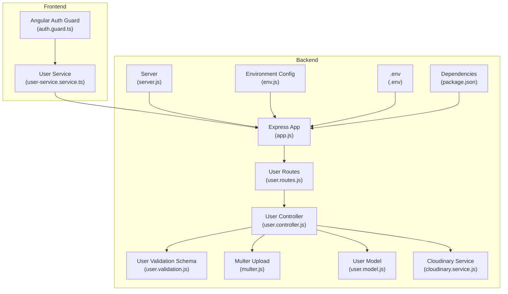
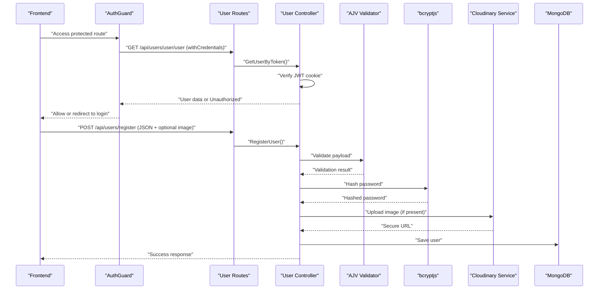
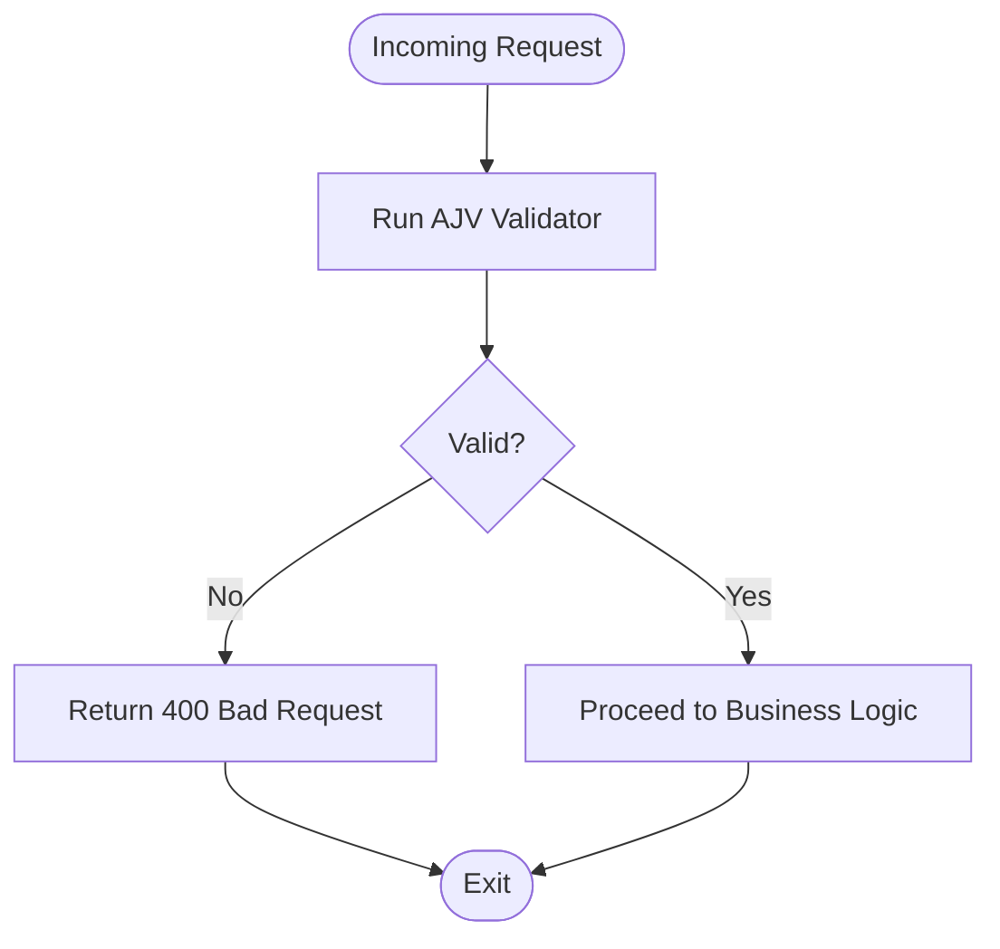
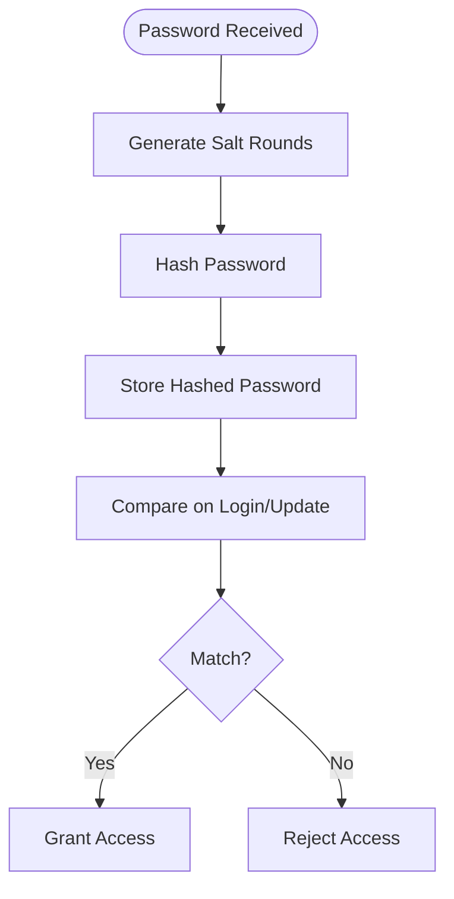
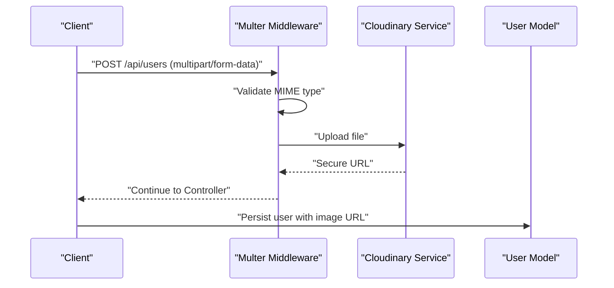
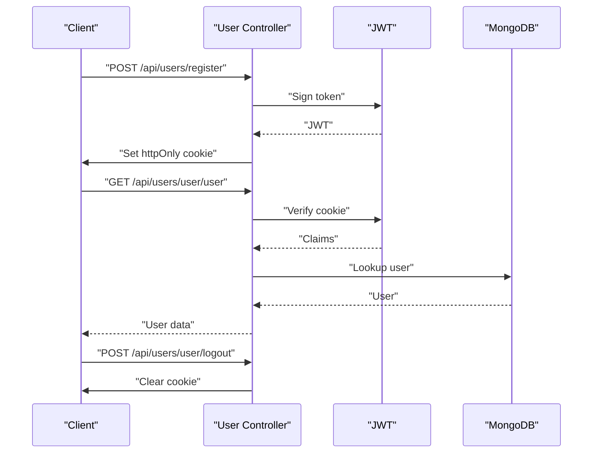
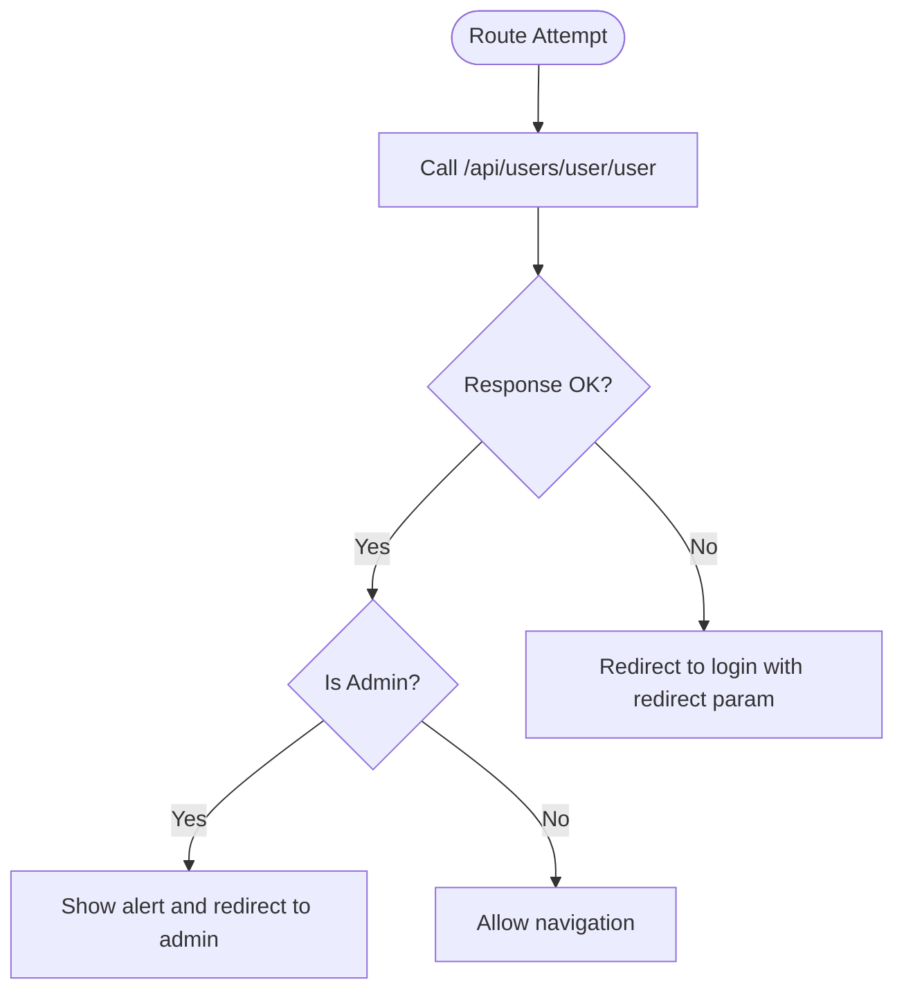
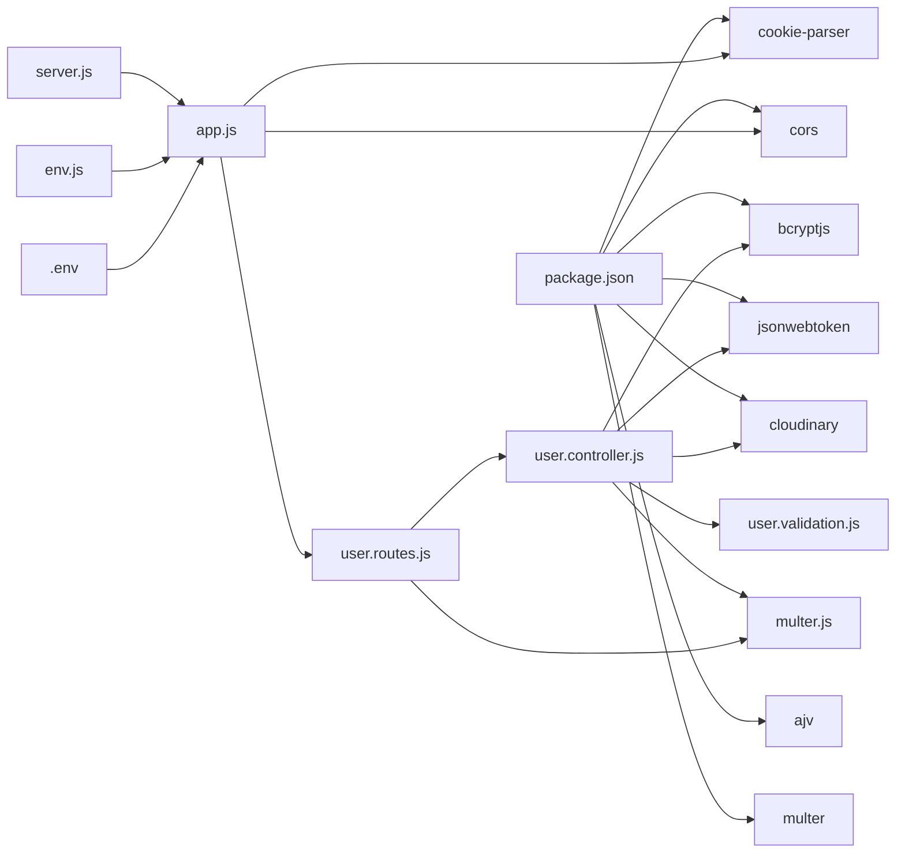

# Security Measures and Validation

<cite>
**Referenced Files in This Document**
- [user.controller.js](file://Back-end/src/Controllers/user.controller.js)
- [user.validation.js](file://Back-end/src/Middlewares/user.validation.js)
- [multer.js](file://Back-end/src/Middlewares/multer.js)
- [cloudinary.service.js](file://Back-end/src/services/cloudinary.service.js)
- [user.model.js](file://Back-end/src/Models/user.model.js)
- [user.routes.js](file://Back-end/src/Routes/user.routes.js)
- [app.js](file://Back-end/src/app.js)
- [server.js](file://Back-end/src/server.js)
- [env.js](file://Back-end/src/config/env.js)
- [.env](file://Back-end/.env)
- [package.json](file://Back-end/package.json)
- [auth.guard.ts](file://Front-end/src/app/core/guards/auth.guard.ts)
- [user-service.service.ts](file://Front-end/src/app/core/services/user-service.service.ts)
</cite>

## Table of Contents
1. [Introduction](#introduction)
2. [Project Structure](#project-structure)
3. [Core Components](#core-components)
4. [Architecture Overview](#architecture-overview)
5. [Detailed Component Analysis](#detailed-component-analysis)
6. [Dependency Analysis](#dependency-analysis)
7. [Performance Considerations](#performance-considerations)
8. [Troubleshooting Guide](#troubleshooting-guide)
9. [Conclusion](#conclusion)
10. [Appendices](#appendices)

## Introduction
This document details the comprehensive security measures implemented in the authentication system. It explains input validation using schema validation for user data integrity, password security practices with bcrypt hashing and secure storage, file upload security via multer configuration and Cloudinary integration, and secure cookie handling. It also outlines CSRF protection strategies, XSS prevention measures, and common security vulnerabilities with mitigation strategies and audit considerations. Finally, it provides guidelines for maintaining security best practices and regular updates.

## Project Structure
The authentication and security-related logic spans the backend controllers, middlewares, models, routes, and services, along with frontend guards and services. The backend uses Express, Mongoose, bcryptjs, JWT, and Cloudinary. The frontend uses Angular guards and HTTP client to enforce session-based access control.

**Diagram sources**
- [app.js](file://Back-end/src/app.js#L1-L96)
- [server.js](file://Back-end/src/server.js#L1-L6)
- [env.js](file://Back-end/src/config/env.js#L1-L4)
- [.env](file://Back-end/.env#L1-L3)
- [package.json](file://Back-end/package.json#L1-L29)
- [user.routes.js](file://Back-end/src/Routes/user.routes.js#L1-L24)
- [user.controller.js](file://Back-end/src/Controllers/user.controller.js#L1-L480)
- [user.validation.js](file://Back-end/src/Middlewares/user.validation.js#L1-L29)
- [multer.js](file://Back-end/src/Middlewares/multer.js#L1-L33)
- [user.model.js](file://Back-end/src/Models/user.model.js#L1-L29)
- [cloudinary.service.js](file://Back-end/src/services/cloudinary.service.js#L1-L22)
- [auth.guard.ts](file://Front-end/src/app/core/guards/auth.guard.ts#L1-L42)
- [user-service.service.ts](file://Front-end/src/app/core/services/user-service.service.ts#L1-L25)

**Section sources**
- [app.js](file://Back-end/src/app.js#L1-L96)
- [server.js](file://Back-end/src/server.js#L1-L6)
- [user.routes.js](file://Back-end/src/Routes/user.routes.js#L1-L24)
- [user.controller.js](file://Back-end/src/Controllers/user.controller.js#L1-L480)
- [user.validation.js](file://Back-end/src/Middlewares/user.validation.js#L1-L29)
- [multer.js](file://Back-end/src/Middlewares/multer.js#L1-L33)
- [cloudinary.service.js](file://Back-end/src/services/cloudinary.service.js#L1-L22)
- [user.model.js](file://Back-end/src/Models/user.model.js#L1-L29)
- [auth.guard.ts](file://Front-end/src/app/core/guards/auth.guard.ts#L1-L42)
- [user-service.service.ts](file://Front-end/src/app/core/services/user-service.service.ts#L1-L25)

## Core Components
- Input validation middleware using AJV schema validation ensures strict typing and required fields for user payloads.
- Password security uses bcrypt hashing with salt rounds and secure password comparison.
- File upload security leverages multer disk storage, explicit file type filtering, and Cloudinary secure upload pipeline.
- Secure cookie handling uses httpOnly cookies with a long expiry for session persistence.
- Frontend authentication guard enforces session validation via a protected endpoint and redirects unauthenticated users.

**Section sources**
- [user.validation.js](file://Back-end/src/Middlewares/user.validation.js#L1-L29)
- [user.controller.js](file://Back-end/src/Controllers/user.controller.js#L32-L57)
- [user.controller.js](file://Back-end/src/Controllers/user.controller.js#L118-L136)
- [user.controller.js](file://Back-end/src/Controllers/user.controller.js#L138-L175)
- [multer.js](file://Back-end/src/Middlewares/multer.js#L1-L33)
- [cloudinary.service.js](file://Back-end/src/services/cloudinary.service.js#L1-L22)
- [app.js](file://Back-end/src/app.js#L19-L23)
- [auth.guard.ts](file://Front-end/src/app/core/guards/auth.guard.ts#L15-L40)

## Architecture Overview
The authentication flow integrates frontend guards, backend routes, controllers, validators, and services. Requests pass through CORS and cookie parsing middleware, then reach the user routes. Controllers validate input, hash passwords, manage uploads, and handle JWT cookies.

**Diagram sources**
- [auth.guard.ts](file://Front-end/src/app/core/guards/auth.guard.ts#L15-L40)
- [user.routes.js](file://Back-end/src/Routes/user.routes.js#L16-L17)
- [user.controller.js](file://Back-end/src/Controllers/user.controller.js#L138-L175)
- [user.validation.js](file://Back-end/src/Middlewares/user.validation.js#L1-L29)
- [cloudinary.service.js](file://Back-end/src/services/cloudinary.service.js#L10-L19)
- [user.model.js](file://Back-end/src/Models/user.model.js#L8-L27)

## Detailed Component Analysis

### Input Validation Middleware (AJV Schema)
- Purpose: Enforce strict schema validation for user payloads to prevent malformed or malicious data.
- Implementation highlights:
  - Defines an object schema with typed properties, required fields, and disallows additional properties.
  - Compiled validator is used in controller endpoints to validate incoming requests.
- Security benefits:
  - Prevents injection of unexpected fields.
  - Ensures required fields are present and of correct type.

**Diagram sources**
- [user.validation.js](file://Back-end/src/Middlewares/user.validation.js#L4-L26)
- [user.controller.js](file://Back-end/src/Controllers/user.controller.js#L34-L35)

**Section sources**
- [user.validation.js](file://Back-end/src/Middlewares/user.validation.js#L1-L29)
- [user.controller.js](file://Back-end/src/Controllers/user.controller.js#L32-L57)
- [user.controller.js](file://Back-end/src/Controllers/user.controller.js#L138-L175)

### Password Security Practices (bcrypt)
- Salt generation and hashing:
  - Uses bcrypt to generate salt rounds and hash passwords before storage.
- Secure comparison:
  - Compares provided password against stored hash during login and user updates.
- Storage:
  - Stores only hashed passwords in the database model.

**Diagram sources**
- [user.controller.js](file://Back-end/src/Controllers/user.controller.js#L37-L39)
- [user.controller.js](file://Back-end/src/Controllers/user.controller.js#L65-L75)
- [user.controller.js](file://Back-end/src/Controllers/user.controller.js#L123)
- [user.model.js](file://Back-end/src/Models/user.model.js#L12-L14)

**Section sources**
- [user.controller.js](file://Back-end/src/Controllers/user.controller.js#L32-L57)
- [user.controller.js](file://Back-end/src/Controllers/user.controller.js#L65-L75)
- [user.controller.js](file://Back-end/src/Controllers/user.controller.js#L118-L136)
- [user.controller.js](file://Back-end/src/Controllers/user.controller.js#L138-L175)
- [user.model.js](file://Back-end/src/Models/user.model.js#L12-L14)

### File Upload Security (multer + Cloudinary)
- Local upload configuration:
  - Disk storage configured with a dedicated uploads directory.
  - File filter restricts uploads to JPEG, PNG, and JPG.
- Cloudinary integration:
  - Secure upload pipeline with HTTPS enabled.
  - Returns secure URLs for stored images.
- Security considerations:
  - Whitelisted MIME types reduce risk of executable content.
  - Cloudinary handles storage and delivery; local filesystem is minimal and temporary.

**Diagram sources**
- [multer.js](file://Back-end/src/Middlewares/multer.js#L12-L30)
- [cloudinary.service.js](file://Back-end/src/services/cloudinary.service.js#L10-L19)
- [user.routes.js](file://Back-end/src/Routes/user.routes.js#L12-L13)
- [user.controller.js](file://Back-end/src/Controllers/user.controller.js#L42-L50)

**Section sources**
- [multer.js](file://Back-end/src/Middlewares/multer.js#L1-L33)
- [cloudinary.service.js](file://Back-end/src/services/cloudinary.service.js#L1-L22)
- [user.controller.js](file://Back-end/src/Controllers/user.controller.js#L42-L50)

### Secure Cookie Handling (JWT)
- Cookie attributes:
  - httpOnly flag prevents client-side script access.
  - Long maxAge sets persistent session duration.
- Token lifecycle:
  - Issued on successful registration/login.
  - Verified on protected route access.
  - Cleared on logout.

**Diagram sources**
- [user.controller.js](file://Back-end/src/Controllers/user.controller.js#L127-L132)
- [user.controller.js](file://Back-end/src/Controllers/user.controller.js#L163-L167)
- [user.controller.js](file://Back-end/src/Controllers/user.controller.js#L421-L444)
- [user.controller.js](file://Back-end/src/Controllers/user.controller.js#L447-L457)
- [app.js](file://Back-end/src/app.js#L23)

**Section sources**
- [user.controller.js](file://Back-end/src/Controllers/user.controller.js#L127-L132)
- [user.controller.js](file://Back-end/src/Controllers/user.controller.js#L163-L167)
- [user.controller.js](file://Back-end/src/Controllers/user.controller.js#L421-L444)
- [user.controller.js](file://Back-end/src/Controllers/user.controller.js#L447-L457)
- [app.js](file://Back-end/src/app.js#L19-L23)

### CSRF Protection Strategies
- Current state:
  - No explicit CSRF middleware or tokens are implemented in the backend.
- Recommended mitigations:
  - Integrate a CSRF protection library (e.g., csurf) with cookie-based CSRF tokens.
  - Enforce SameSite cookie attribute for state-changing requests.
  - Validate Origin and Referer headers for cross-origin requests.
  - Use anti-CSRF tokens in forms and AJAX requests.

[No sources needed since this section provides general guidance]

### XSS Prevention Measures
- Current state:
  - No explicit sanitization or Content-Security-Policy headers are configured.
- Recommended mitigations:
  - Implement Helmet.js to set CSP, X-Frame-Options, and other security headers.
  - Sanitize user-generated content on display and form submissions.
  - Escape HTML when rendering dynamic content in templates or frontend components.
  - Use Angular’s built-in binding protections and avoid innerHTML where possible.

[No sources needed since this section provides general guidance]

### Frontend Authentication Guard
- Purpose: Protect routes by validating session state via a backend endpoint.
- Behavior:
  - Sends credentials with each request.
  - Redirects to login on failure.
  - Admins are blocked from accessing user routes.

**Diagram sources**
- [auth.guard.ts](file://Front-end/src/app/core/guards/auth.guard.ts#L15-L40)
- [user-service.service.ts](file://Front-end/src/app/core/services/user-service.service.ts#L10-L22)

**Section sources**
- [auth.guard.ts](file://Front-end/src/app/core/guards/auth.guard.ts#L1-L42)
- [user-service.service.ts](file://Front-end/src/app/core/services/user-service.service.ts#L1-L25)

## Dependency Analysis
- Backend dependencies relevant to security:
  - bcryptjs for password hashing.
  - jsonwebtoken for JWT signing and verification.
  - cookie-parser for cookie parsing.
  - cors with credentials enabled for cross-origin support.
  - ajv for schema validation.
  - multer for file uploads.
  - cloudinary for secure image hosting.
- Environment and configuration:
  - .env holds database URL and port.
  - app.js configures CORS origins and cookie parser.

**Diagram sources**
- [package.json](file://Back-end/package.json#L13-L26)
- [app.js](file://Back-end/src/app.js#L1-L96)
- [user.controller.js](file://Back-end/src/Controllers/user.controller.js#L1-L10)
- [user.validation.js](file://Back-end/src/Middlewares/user.validation.js#L1-L2)
- [multer.js](file://Back-end/src/Middlewares/multer.js#L1-L3)
- [cloudinary.service.js](file://Back-end/src/services/cloudinary.service.js#L1-L8)
- [user.routes.js](file://Back-end/src/Routes/user.routes.js#L1-L4)
- [server.js](file://Back-end/src/server.js#L1-L6)
- [env.js](file://Back-end/src/config/env.js#L1-L4)
- [.env](file://Back-end/.env#L1-L3)

**Section sources**
- [package.json](file://Back-end/package.json#L1-L29)
- [app.js](file://Back-end/src/app.js#L1-L96)
- [user.controller.js](file://Back-end/src/Controllers/user.controller.js#L1-L10)
- [user.routes.js](file://Back-end/src/Routes/user.routes.js#L1-L24)
- [server.js](file://Back-end/src/server.js#L1-L6)
- [env.js](file://Back-end/src/config/env.js#L1-L4)
- [.env](file://Back-end/.env#L1-L3)

## Performance Considerations
- Validation overhead: AJV compilation occurs once per module load; reuse compiled validators to minimize runtime cost.
- Hashing cost: Adjust bcrypt salt rounds based on hardware capacity; higher rounds increase security but CPU usage.
- Upload throughput: Configure Cloudinary upload presets and CDN caching to optimize image delivery.
- Cookie size: Keep JWT payloads minimal to reduce bandwidth and parsing overhead.

[No sources needed since this section provides general guidance]

## Troubleshooting Guide
- Validation errors:
  - Ensure payloads match the AJV schema; missing required fields or wrong types trigger 400 responses.
- Password hashing failures:
  - Verify bcrypt availability and environment; inspect error messages for hashing issues.
- Upload rejections:
  - Confirm MIME type matches allowed types; check file filter logic.
- JWT verification failures:
  - Confirm cookie presence and signature; ensure secret alignment between signing and verification.
- CORS issues:
  - Verify allowed origins and credentials configuration.

**Section sources**
- [user.validation.js](file://Back-end/src/Middlewares/user.validation.js#L1-L29)
- [user.controller.js](file://Back-end/src/Controllers/user.controller.js#L34-L35)
- [user.controller.js](file://Back-end/src/Controllers/user.controller.js#L65-L75)
- [multer.js](file://Back-end/src/Middlewares/multer.js#L19-L29)
- [user.controller.js](file://Back-end/src/Controllers/user.controller.js#L421-L444)
- [app.js](file://Back-end/src/app.js#L19-L23)

## Conclusion
The authentication system employs robust input validation, strong password hashing, secure file upload controls, and JWT-based session management with httpOnly cookies. While the current implementation provides solid foundations, adding CSRF protection, CSP headers, and stricter CORS policies would further harden the system. Regular audits, dependency updates, and adherence to security best practices are essential for maintaining a secure environment.

[No sources needed since this section summarizes without analyzing specific files]

## Appendices
- Security audit checklist:
  - Review all routes for authentication/authorization checks.
  - Validate secrets and environment variables are not exposed.
  - Confirm CORS and CSRF protections are enabled.
  - Audit third-party libraries for known vulnerabilities.
  - Test error handling to avoid information disclosure.
  - Monitor logs for suspicious activity and failed attempts.

[No sources needed since this section provides general guidance]