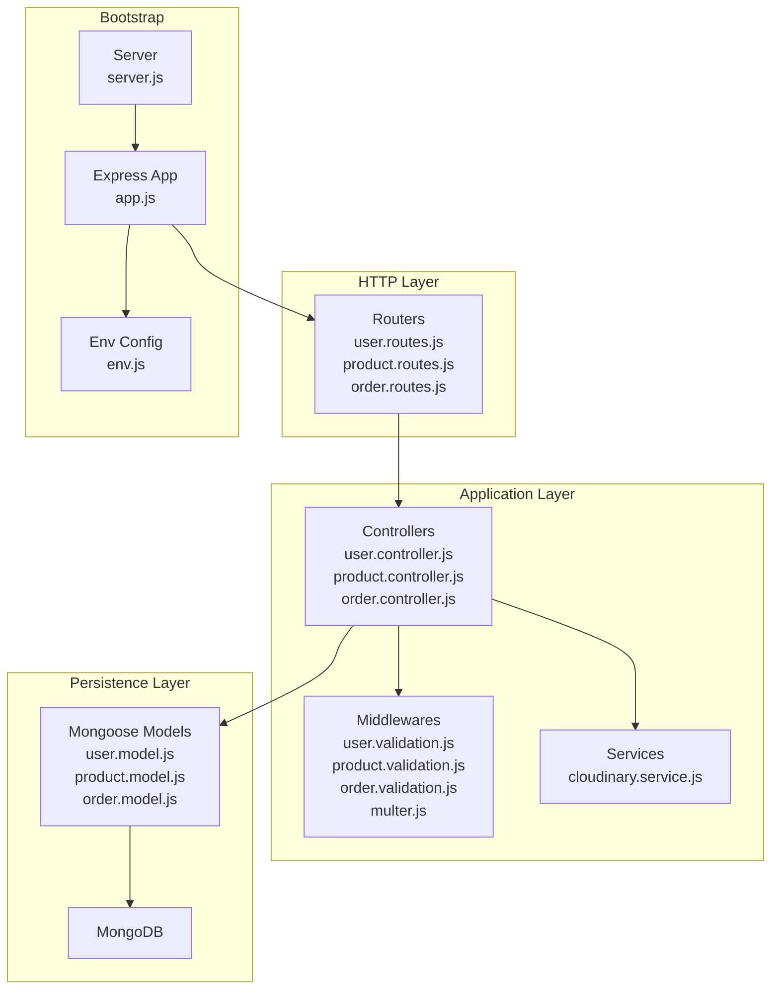
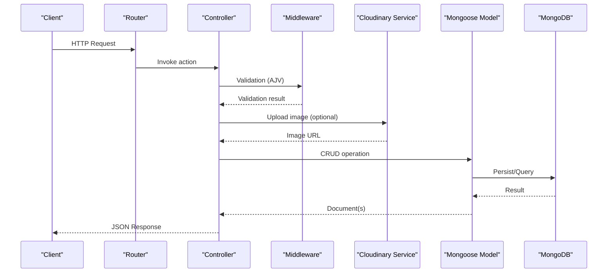
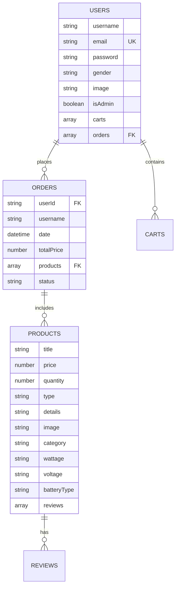
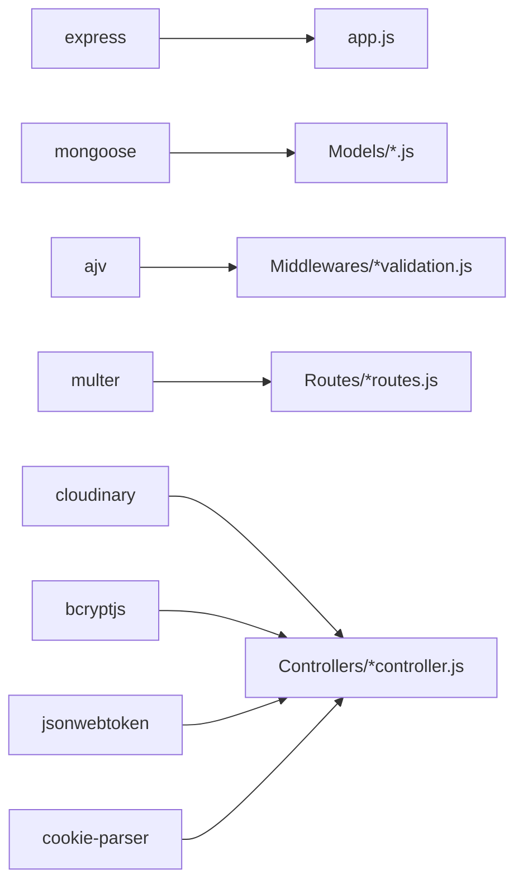

# Backend API Documentation

<cite>
**Referenced Files in This Document**
- [app.js](file://Back-end/src/app.js)
- [server.js](file://Back-end/src/Servers/server.js)
- [env.js](file://Back-end/src/config/env.js)
- [package.json](file://Back-end/package.json)
- [user.controller.js](file://Back-end/src/Controllers/user.controller.js)
- [product.controller.js](file://Back-end/src/Controllers/product.controller.js)
- [order.controller.js](file://Back-end/src/Controllers/order.controller.js)
- [user.routes.js](file://Back-end/src/Routes/user.routes.js)
- [product.routes.js](file://Back-end/src/Routes/product.routes.js)
- [order.routes.js](file://Back-end/src/Routes/order.routes.js)
- [user.model.js](file://Back-end/src/Models/user.model.js)
- [product.model.js](file://Back-end/src/Models/product.model.js)
- [order.model.js](file://Back-end/src/Models/order.model.js)
- [user.validation.js](file://Back-end/src/Middlewares/user.validation.js)
- [product.validation.js](file://Back-end/src/Middlewares/product.validation.js)
- [order.validation.js](file://Back-end/src/Middlewares/order.validation.js)
- [cloudinary.service.js](file://Back-end/src/services/cloudinary.service.js)
- [multer.js](file://Back-end/src/Middlewares/multer.js)
</cite>

## Table of Contents
1. [Introduction](#introduction)
2. [Project Structure](#project-structure)
3. [Core Components](#core-components)
4. [Architecture Overview](#architecture-overview)
5. [Detailed Component Analysis](#detailed-component-analysis)
6. [Dependency Analysis](#dependency-analysis)
7. [Performance Considerations](#performance-considerations)
8. [Troubleshooting Guide](#troubleshooting-guide)
9. [Conclusion](#conclusion)
10. [Appendices](#appendices)

## Introduction
This document provides comprehensive API documentation for the Lightstorm backend RESTful services. It covers user management, product catalog, and order processing endpoints, including HTTP methods, URL patterns, request/response schemas, authentication requirements, and error handling. It also explains the MVC architecture (controllers, models, routes), API versioning, rate limiting, and security measures. Integration with MongoDB via Mongoose models and Cloudinary for image management is documented.

## Project Structure
The backend follows an MVC architecture with clear separation of concerns:
- Controllers handle HTTP requests and orchestrate business logic.
- Models define data schemas and integrate with MongoDB.
- Routes map URLs to controller actions.
- Middlewares enforce validation and file uploads.
- Services encapsulate third-party integrations (e.g., Cloudinary).
- Environment configuration centralizes constants like base API path.

**Diagram sources**
- [user.routes.js](file://Back-end/src/Routes/user.routes.js#L1-L24)
- [product.routes.js](file://Back-end/src/Routes/product.routes.js#L1-L20)
- [order.routes.js](file://Back-end/src/Routes/order.routes.js#L1-L19)
- [user.controller.js](file://Back-end/src/Controllers/user.controller.js#L1-L480)
- [product.controller.js](file://Back-end/src/Controllers/product.controller.js#L1-L348)
- [order.controller.js](file://Back-end/src/Controllers/order.controller.js#L1-L258)
- [user.validation.js](file://Back-end/src/Middlewares/user.validation.js#L1-L29)
- [product.validation.js](file://Back-end/src/Middlewares/product.validation.js#L1-L39)
- [order.validation.js](file://Back-end/src/Middlewares/order.validation.js#L1-L39)
- [cloudinary.service.js](file://Back-end/src/services/cloudinary.service.js)
- [user.model.js](file://Back-end/src/Models/user.model.js#L1-L29)
- [product.model.js](file://Back-end/src/Models/product.model.js#L1-L29)
- [order.model.js](file://Back-end/src/Models/order.model.js#L1-L13)
- [app.js](file://Back-end/src/app.js#L1-L96)
- [server.js](file://Back-end/src/Servers/server.js#L1-L6)
- [env.js](file://Back-end/src/config/env.js#L1-L4)

**Section sources**
- [app.js](file://Back-end/src/app.js#L1-L96)
- [server.js](file://Back-end/src/Servers/server.js#L1-L6)
- [env.js](file://Back-end/src/config/env.js#L1-L4)

## Core Components
- Express app initialization, CORS, cookies, body parsing, static serving, and global error handling.
- Route registration under base path /api with sub-routes for users, products, and orders.
- MongoDB connection via Mongoose using DATABASE_URL from environment.
- Angular static assets served at root with catch-all fallback to index.html.

Key behaviors:
- CORS configured for development origins.
- Cookie-based session via JWT stored in httpOnly cookies.
- Global 500 error handler for API routes.

**Section sources**
- [app.js](file://Back-end/src/app.js#L1-L96)
- [env.js](file://Back-end/src/config/env.js#L1-L4)

## Architecture Overview
The system uses a layered MVC pattern:
- Routes define endpoints and bind them to controller methods.
- Controllers coordinate validation, model operations, and service calls.
- Models define schemas and relationships; populate references where needed.
- Middlewares enforce validation and file upload handling.
- Services abstract external integrations (Cloudinary).

**Diagram sources**
- [user.routes.js](file://Back-end/src/Routes/user.routes.js#L1-L24)
- [product.routes.js](file://Back-end/src/Routes/product.routes.js#L1-L20)
- [order.routes.js](file://Back-end/src/Routes/order.routes.js#L1-L19)
- [user.controller.js](file://Back-end/src/Controllers/user.controller.js#L1-L480)
- [product.controller.js](file://Back-end/src/Controllers/product.controller.js#L1-L348)
- [order.controller.js](file://Back-end/src/Controllers/order.controller.js#L1-L258)
- [user.validation.js](file://Back-end/src/Middlewares/user.validation.js#L1-L29)
- [product.validation.js](file://Back-end/src/Middlewares/product.validation.js#L1-L39)
- [order.validation.js](file://Back-end/src/Middlewares/order.validation.js#L1-L39)
- [cloudinary.service.js](file://Back-end/src/services/cloudinary.service.js)
- [user.model.js](file://Back-end/src/Models/user.model.js#L1-L29)
- [product.model.js](file://Back-end/src/Models/product.model.js#L1-L29)
- [order.model.js](file://Back-end/src/Models/order.model.js#L1-L13)

## Detailed Component Analysis

### Authentication and Session Management
- Login endpoint validates credentials and issues an httpOnly JWT cookie.
- Registration endpoint validates input, hashes password, and issues a JWT cookie.
- Protected routes can be accessed by reading the JWT cookie and verifying it server-side.
- Logout clears the JWT cookie.

Common response codes:
- 200 OK on successful login/register.
- 400 Bad Request on invalid credentials or validation errors.
- 401 Unauthorized if JWT is missing/invalid/expired.
- 500 Internal Server Error on server failures.

Practical curl examples:
- Register: curl -c cookies.txt -X POST http://localhost:7000/api/users/register -H "Content-Type: application/json" -d '{"username":"john","email":"john@example.com","password":"Passw0rd!","gender":"male"}'
- Login: curl -c cookies.txt -X POST http://localhost:7000/api/users/login -H "Content-Type: application/json" -d '{"email":"john@example.com","password":"Passw0rd!"}'
- Get user by token: curl -b cookies.txt http://localhost:7000/api/users/user/user
- Logout: curl -b cookies.txt -X POST http://localhost:7000/api/users/user/logout

Security measures:
- httpOnly cookies prevent client-side access.
- JWT secret used for verification.
- Passwords are hashed with bcrypt before storage.

**Section sources**
- [user.controller.js](file://Back-end/src/Controllers/user.controller.js#L118-L175)
- [user.controller.js](file://Back-end/src/Controllers/user.controller.js#L421-L458)
- [user.routes.js](file://Back-end/src/Routes/user.routes.js#L15-L18)

### User Management Endpoints
Base path: /api/users

Endpoints:
- GET / – Retrieve all users (admin-only behavior implied by controller)
- GET /:id – Retrieve user by ID
- POST / – Create a new user (multipart/form-data with avatar)
- PUT /:id – Update user (multipart/form-data for avatar)
- DELETE /:id – Delete user by ID
- POST /login – Authenticate user and set JWT cookie
- POST /register – Register user and set JWT cookie
- GET /user/user – Get current user by JWT cookie
- POST /user/logout – Clear JWT cookie
- POST /:id/cart – Add product to user cart
- GET /:id/cart – Get user’s cart
- PUT /cart/increase – Increase product quantity in cart
- PUT /cart/decrease – Decrease product quantity in cart
- DELETE /cart/remove – Remove product from cart
- POST /:id/order – Convert cart items to an order

Request/response schemas:
- Create/Update user requires multipart form with avatar file and JSON fields.
- Cart operations accept JSON payload with user and product identifiers and quantities.
- Order creation computes total price and persists order linked to user.

Common response codes:
- 200 OK for successful operations.
- 201 Created for resource creation.
- 400 Bad Request for validation errors or insufficient stock.
- 401 Unauthorized for missing/invalid JWT.
- 404 Not Found for missing resources.
- 500 Internal Server Error for server failures.

Practical curl examples:
- Create user: curl -c cookies.txt -X POST http://localhost:7000/api/users -F "avatar=@/path/to/image.jpg" -F "username=john" -F "email=john@example.com" -F "password=Passw0rd!" -F "gender=male"
- Update user: curl -b cookies.txt -X PUT http://localhost:7000/api/users/:id -F "avatar=@/path/to/new.jpg" -F "gender=male"
- Add to cart: curl -X POST http://localhost:7000/api/users/:id/cart -H "Content-Type: application/json" -d '{"user_id":"USER_ID","product":"PRODUCT_ID","quantity":1}'
- Place order: curl -X POST http://localhost:7000/api/users/:id/order -H "Content-Type: application/json"

**Section sources**
- [user.routes.js](file://Back-end/src/Routes/user.routes.js#L6-L21)
- [user.controller.js](file://Back-end/src/Controllers/user.controller.js#L32-L116)
- [user.controller.js](file://Back-end/src/Controllers/user.controller.js#L177-L270)
- [user.controller.js](file://Back-end/src/Controllers/user.controller.js#L273-L403)
- [user.controller.js](file://Back-end/src/Controllers/user.controller.js#L421-L458)
- [user.validation.js](file://Back-end/src/Middlewares/user.validation.js#L1-L29)
- [user.model.js](file://Back-end/src/Models/user.model.js#L1-L29)

### Product Catalog Endpoints
Base path: /api/products

Endpoints:
- GET / – List products with filtering, sorting, and pagination
- GET /featured – Get featured products (latest)
- GET /:id – Retrieve product by ID
- POST / – Create product (multipart/form-data with image)
- PUT /:id – Update product (multipart/form-data for image)
- DELETE /:id – Delete product by ID
- POST /:id/reviews – Add or update review
- GET /user/product/token – Get current user by JWT cookie
- POST /product/addtocart – Add product to cart (public endpoint)

Query parameters (GET /):
- minPrice, maxPrice: numeric filters
- category: case-insensitive regex match
- search: text search using MongoDB text index
- sort: field name; prefix with "-" for descending
- page, limit: pagination

Request/response schemas:
- Create/update product supports optional electrical attributes (wattage, voltage, batteryType) and category.
- Reviews include user_id, name, comment, rating, and date.

Common response codes:
- 200 OK for successful operations.
- 201 Created for product creation.
- 400 Bad Request for validation errors.
- 404 Not Found for missing resources.
- 500 Internal Server Error for server failures.

Practical curl examples:
- List products: curl "http://localhost:7000/api/products?page=1&limit=24&category=Electronics&sort=-createdAt"
- Create product: curl -X POST http://localhost:7000/api/products -F "image=@/path/to/image.jpg" -F "title=Wireless Mouse" -F "price=29.99" -F "quantity=100" -F "category=Electronics"
- Add review: curl -X POST http://localhost:7000/api/products/:id/reviews -H "Content-Type: application/json" -d '{"user_id":"USER_ID","name":"Alice","comment":"Great product","rating":5}'
- Add to cart (public): curl -X POST http://localhost:7000/api/products/product/addtocart -H "Content-Type: application/json" -d '{"user_id":"USER_ID","product":"PRODUCT_ID","quantity":1}'

**Section sources**
- [product.routes.js](file://Back-end/src/Routes/product.routes.js#L6-L16)
- [product.controller.js](file://Back-end/src/Controllers/product.controller.js#L10-L68)
- [product.controller.js](file://Back-end/src/Controllers/product.controller.js#L107-L175)
- [product.controller.js](file://Back-end/src/Controllers/product.controller.js#L180-L218)
- [product.controller.js](file://Back-end/src/Controllers/product.controller.js#L223-L233)
- [product.controller.js](file://Back-end/src/Controllers/product.controller.js#L237-L268)
- [product.controller.js](file://Back-end/src/Controllers/product.controller.js#L273-L296)
- [product.controller.js](file://Back-end/src/Controllers/product.controller.js#L302-L334)
- [product.validation.js](file://Back-end/src/Middlewares/product.validation.js#L1-L39)
- [product.model.js](file://Back-end/src/Models/product.model.js#L1-L29)

### Order Processing Endpoints
Base path: /api/orders

Endpoints:
- GET /weeklySales – Aggregated weekly sales
- GET /salesPerWeek – Sales grouped by week
- GET /dailySales – Aggregated daily sales
- GET /weekly – Weekly order count
- GET /daily – Daily order count
- GET / – List orders with computed days difference
- GET /:id – Retrieve order by ID
- GET /:status – Retrieve orders by status (placeholder)
- POST / – Create order (placeholder)
- PUT /:id – Update order by ID
- DELETE /:id – Delete order by ID

Response schemas:
- Aggregation endpoints return summary objects with totals.
- Orders include userId, username, date, totalPrice, products array, and status.

Common response codes:
- 200 OK for successful operations.
- 400 Bad Request for missing order ID.
- 404 Not Found for missing resources.
- 500 Internal Server Error for server failures.

Practical curl examples:
- Get daily sales: curl http://localhost:7000/api/orders/dailySales
- Get weekly orders: curl http://localhost:7000/api/orders/weekly
- Update order: curl -X PUT http://localhost:7000/api/orders/:id -H "Content-Type: application/json" -d '{"status":"Accepted"}'
- Delete order: curl -X DELETE http://localhost:7000/api/orders/:id

**Section sources**
- [order.routes.js](file://Back-end/src/Routes/order.routes.js#L5-L15)
- [order.controller.js](file://Back-end/src/Controllers/order.controller.js#L7-L31)
- [order.controller.js](file://Back-end/src/Controllers/order.controller.js#L59-L74)
- [order.controller.js](file://Back-end/src/Controllers/order.controller.js#L79-L97)
- [order.controller.js](file://Back-end/src/Controllers/order.controller.js#L101-L125)
- [order.controller.js](file://Back-end/src/Controllers/order.controller.js#L129-L165)
- [order.controller.js](file://Back-end/src/Controllers/order.controller.js#L170-L194)
- [order.controller.js](file://Back-end/src/Controllers/order.controller.js#L198-L222)
- [order.controller.js](file://Back-end/src/Controllers/order.controller.js#L226-L243)
- [order.validation.js](file://Back-end/src/Middlewares/order.validation.js#L1-L39)
- [order.model.js](file://Back-end/src/Models/order.model.js#L1-L13)

### Data Models and Relationships

**Diagram sources**
- [user.model.js](file://Back-end/src/Models/user.model.js#L1-L29)
- [product.model.js](file://Back-end/src/Models/product.model.js#L1-L29)
- [order.model.js](file://Back-end/src/Models/order.model.js#L1-L13)

**Section sources**
- [user.model.js](file://Back-end/src/Models/user.model.js#L1-L29)
- [product.model.js](file://Back-end/src/Models/product.model.js#L1-L29)
- [order.model.js](file://Back-end/src/Models/order.model.js#L1-L13)

### Validation and Request Schemas
- User validation enforces presence of specific fields and types.
- Product validation enforces constraints on title length, numeric fields, enums, and nested review structure.
- Order validation enforces ObjectId-like strings and date-time format, plus required fields and enum values.

Common response codes:
- 400 Bad Request for validation failures.

**Section sources**
- [user.validation.js](file://Back-end/src/Middlewares/user.validation.js#L1-L29)
- [product.validation.js](file://Back-end/src/Middlewares/product.validation.js#L1-L39)
- [order.validation.js](file://Back-end/src/Middlewares/order.validation.js#L1-L39)

### File Uploads and Cloudinary Integration
- Multer middleware handles multipart/form-data uploads.
- Uploaded files are processed and sent to Cloudinary service.
- Returned Cloudinary URL is persisted in the model (user.image, product.image).

Common response codes:
- 500 Internal Server Error if upload fails.

**Section sources**
- [user.routes.js](file://Back-end/src/Routes/user.routes.js#L4-L4)
- [product.routes.js](file://Back-end/src/Routes/product.routes.js#L4-L4)
- [user.controller.js](file://Back-end/src/Controllers/user.controller.js#L42-L48)
- [product.controller.js](file://Back-end/src/Controllers/product.controller.js#L154-L163)
- [cloudinary.service.js](file://Back-end/src/services/cloudinary.service.js)

## Dependency Analysis
External dependencies relevant to API behavior:
- Express: web framework and routing.
- Mongoose: MongoDB ODM for models.
- AJV: JSON Schema validation.
- Multer: multipart/form-data handling.
- Cloudinary: image upload service.
- bcryptjs: password hashing.
- jsonwebtoken: JWT generation/verification.
- cookie-parser: cookie parsing.

**Diagram sources**
- [package.json](file://Back-end/package.json#L13-L27)
- [app.js](file://Back-end/src/app.js#L1-L96)
- [user.controller.js](file://Back-end/src/Controllers/user.controller.js#L1-L9)
- [product.controller.js](file://Back-end/src/Controllers/product.controller.js#L1-L5)
- [order.controller.js](file://Back-end/src/Controllers/order.controller.js#L1-L2)
- [user.validation.js](file://Back-end/src/Middlewares/user.validation.js#L1-L2)
- [product.validation.js](file://Back-end/src/Middlewares/product.validation.js#L1-L2)
- [order.validation.js](file://Back-end/src/Middlewares/order.validation.js#L1-L2)
- [user.routes.js](file://Back-end/src/Routes/user.routes.js#L1-L4)
- [product.routes.js](file://Back-end/src/Routes/product.routes.js#L1-L4)
- [order.routes.js](file://Back-end/src/Routes/order.routes.js#L1-L3)

**Section sources**
- [package.json](file://Back-end/package.json#L13-L27)

## Performance Considerations
- Product listing uses text index for search and supports pagination and sorting; ensure appropriate indexing in MongoDB.
- Aggregation pipelines compute derived fields (e.g., days difference) server-side; consider caching for frequently accessed summaries.
- Image uploads occur synchronously; consider asynchronous processing for high-volume scenarios.

[No sources needed since this section provides general guidance]

## Troubleshooting Guide
Common issues and resolutions:
- CORS errors: Verify allowed origins in CORS configuration.
- 400 validation errors: Check request payload against JSON Schema definitions.
- 401 unauthorized: Ensure JWT cookie is present and valid.
- 500 internal server errors: Inspect server logs for stack traces.

Error handling:
- Global error middleware responds with structured JSON for API routes in development mode.

**Section sources**
- [app.js](file://Back-end/src/app.js#L82-L93)
- [user.validation.js](file://Back-end/src/Middlewares/user.validation.js#L1-L29)
- [product.validation.js](file://Back-end/src/Middlewares/product.validation.js#L1-L39)
- [order.validation.js](file://Back-end/src/Middlewares/order.validation.js#L1-L39)

## Conclusion
The Lightstorm backend provides a well-structured REST API implementing user management, product catalog, and order processing with clear MVC boundaries. It leverages Mongoose for persistence, AJV for validation, Multer for uploads, and Cloudinary for image management. Authentication relies on JWT stored in httpOnly cookies. The API exposes endpoints for CRUD operations, cart management, order aggregation, and administrative insights.

[No sources needed since this section summarizes without analyzing specific files]

## Appendices

### API Versioning
- No explicit API versioning is implemented in the current codebase. Base path is /api; consider adding /api/v1 for future versions.

**Section sources**
- [env.js](file://Back-end/src/config/env.js#L3-L3)
- [app.js](file://Back-end/src/app.js#L39-L41)

### Rate Limiting
- No built-in rate limiting middleware is present. Consider integrating a rate-limiting solution (e.g., express-rate-limit) for production deployments.

[No sources needed since this section provides general guidance]

### Security Measures
- JWT stored as httpOnly cookie mitigates XSS risks.
- Passwords hashed with bcrypt.
- Input validated with AJV schemas.
- Multer restricts file uploads; sanitize filenames and enforce quotas.

**Section sources**
- [user.controller.js](file://Back-end/src/Controllers/user.controller.js#L128-L132)
- [user.controller.js](file://Back-end/src/Controllers/user.controller.js#L164-L167)
- [user.validation.js](file://Back-end/src/Middlewares/user.validation.js#L1-L29)
- [product.validation.js](file://Back-end/src/Middlewares/product.validation.js#L1-L39)
- [order.validation.js](file://Back-end/src/Middlewares/order.validation.js#L1-L39)