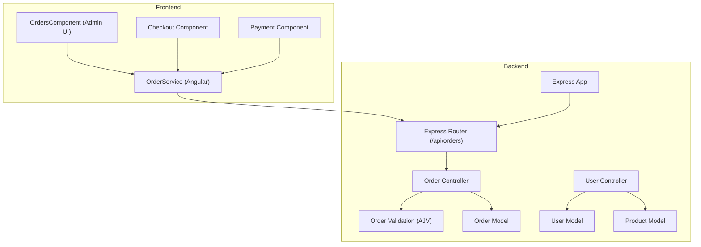
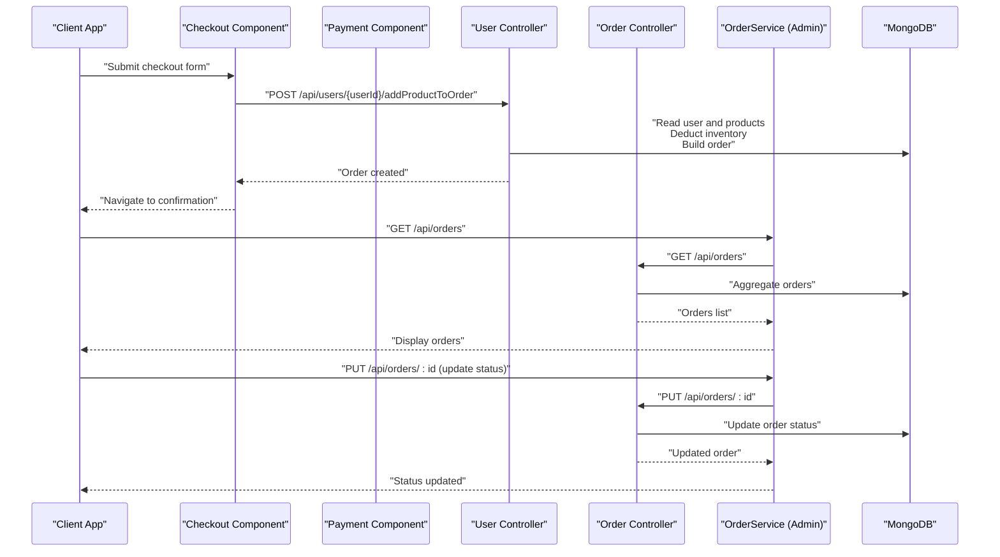
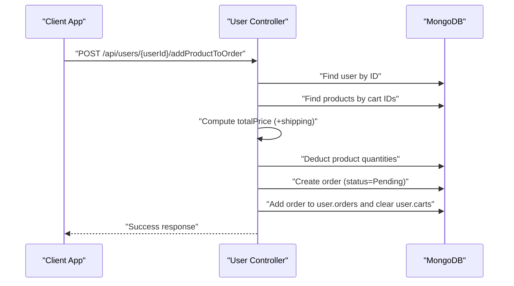
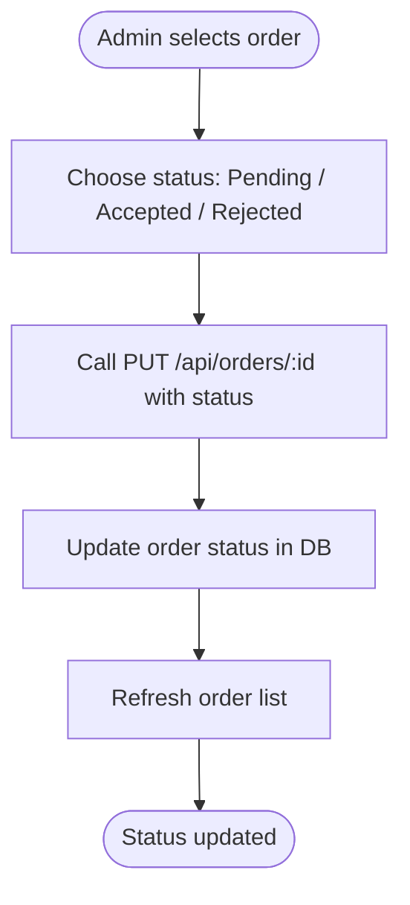
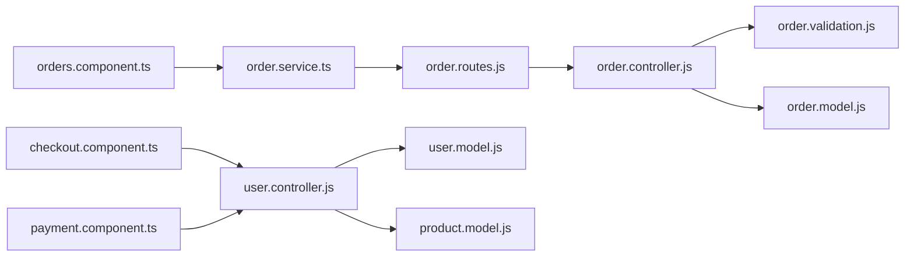
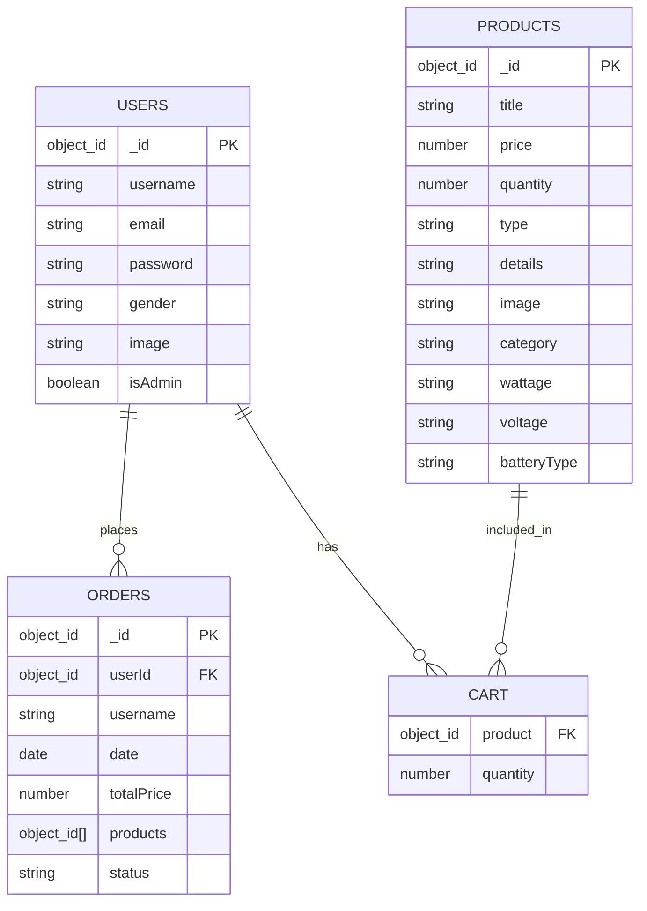

# Order Processing API

<cite>
**Referenced Files in This Document**
- [order.routes.js](file://Back-end/src/Routes/order.routes.js)
- [order.controller.js](file://Back-end/src/Controllers/order.controller.js)
- [order.validation.js](file://Back-end/src/Middlewares/order.validation.js)
- [order.model.js](file://Back-end/src/Models/order.model.js)
- [user.controller.js](file://Back-end/src/Controllers/user.controller.js)
- [user.model.js](file://Back-end/src/Models/user.model.js)
- [product.model.js](file://Back-end/src/Models/product.model.js)
- [app.js](file://Back-end/src/app.js)
- [order.service.ts](file://Front-end/src/app/features/admin/admin/Services/order.service.ts)
- [orders.component.ts](file://Front-end/src/app/features/admin/components/orders/orders.component.ts)
- [order-service.service.ts](file://Front-end/src/app/core/services/order-service.service.ts)
- [checkout.component.ts](file://Front-end/src/app/features/shop/pages/checkout/checkout.component.ts)
- [payment.component.ts](file://Front-end/src/app/features/shop/pages/payment/payment.component.ts)
- [package.json](file://Back-end/package.json)
</cite>

## Table of Contents
1. [Introduction](#introduction)
2. [Project Structure](#project-structure)
3. [Core Components](#core-components)
4. [Architecture Overview](#architecture-overview)
5. [Detailed Component Analysis](#detailed-component-analysis)
6. [Dependency Analysis](#dependency-analysis)
7. [Performance Considerations](#performance-considerations)
8. [Troubleshooting Guide](#troubleshooting-guide)
9. [Conclusion](#conclusion)
10. [Appendices](#appendices)

## Introduction
This document provides comprehensive API documentation for order processing and management endpoints in the Lightstorm e-commerce platform. It covers the order lifecycle endpoints, request/response schemas, validation rules, and the end-to-end order creation workflow from cart to order status management. Administrative order management capabilities and reporting endpoints are also documented.

## Project Structure
The order processing system spans the backend API and frontend consumption layers:
- Backend routes define the REST endpoints for orders.
- Controllers implement business logic for order retrieval, creation, updates, deletions, and analytics.
- Validation middleware enforces schema compliance for incoming requests.
- Models define the data structures for orders, users, and products.
- Frontend services and components consume the API for order management and display.

**Diagram sources**
- [order.routes.js](file://Back-end/src/Routes/order.routes.js#L1-L19)
- [order.controller.js](file://Back-end/src/Controllers/order.controller.js#L1-L258)
- [order.validation.js](file://Back-end/src/Middlewares/order.validation.js#L1-L39)
- [order.model.js](file://Back-end/src/Models/order.model.js#L1-L13)
- [user.controller.js](file://Back-end/src/Controllers/user.controller.js#L220-L270)
- [user.model.js](file://Back-end/src/Models/user.model.js#L1-L29)
- [product.model.js](file://Back-end/src/Models/product.model.js#L1-L29)
- [app.js](file://Back-end/src/app.js#L1-L96)
- [order.service.ts](file://Front-end/src/app/features/admin/admin/Services/order.service.ts#L1-L56)
- [orders.component.ts](file://Front-end/src/app/features/admin/components/orders/orders.component.ts#L1-L89)
- [checkout.component.ts](file://Front-end/src/app/features/shop/pages/checkout/checkout.component.ts#L109-L135)
- [payment.component.ts](file://Front-end/src/app/features/shop/pages/payment/payment.component.ts#L101-L138)

**Section sources**
- [order.routes.js](file://Back-end/src/Routes/order.routes.js#L1-L19)
- [app.js](file://Back-end/src/app.js#L38-L42)

## Core Components
- Order Routes: Expose endpoints for listing, retrieving, filtering by status, creating, updating, and deleting orders, plus analytics endpoints.
- Order Controller: Implements CRUD operations, status updates, deletion, and analytics aggregation pipelines.
- Order Validation: AJV-based schema validation for order payloads.
- Order Model: Mongoose schema defining order fields and relationships.
- User Controller: Implements cart-to-order conversion, inventory deduction, and order creation.
- User and Product Models: Define user carts, orders, and product inventory.

**Section sources**
- [order.controller.js](file://Back-end/src/Controllers/order.controller.js#L7-L31)
- [order.validation.js](file://Back-end/src/Middlewares/order.validation.js#L4-L28)
- [order.model.js](file://Back-end/src/Models/order.model.js#L3-L10)
- [user.controller.js](file://Back-end/src/Controllers/user.controller.js#L224-L261)
- [user.model.js](file://Back-end/src/Models/user.model.js#L3-L27)
- [product.model.js](file://Back-end/src/Models/product.model.js#L11-L23)

## Architecture Overview
The order lifecycle integrates frontend checkout/payment with backend order creation and management:
- Users add items to cart via user controller endpoints.
- Payment confirmation triggers order creation in the user controller, which builds an order from cart items, calculates totals, and persists the order.
- Admins manage orders via the order controller endpoints and analytics.

**Diagram sources**
- [checkout.component.ts](file://Front-end/src/app/features/shop/pages/checkout/checkout.component.ts#L109-L135)
- [payment.component.ts](file://Front-end/src/app/features/shop/pages/payment/payment.component.ts#L120-L137)
- [user.controller.js](file://Back-end/src/Controllers/user.controller.js#L224-L261)
- [order.controller.js](file://Back-end/src/Controllers/order.controller.js#L59-L74)
- [order.service.ts](file://Front-end/src/app/features/admin/admin/Services/order.service.ts#L12-L26)

## Detailed Component Analysis

### Order Lifecycle Endpoints
- GET /api/orders
  - Description: Retrieve all orders with computed days difference and selected fields.
  - Response: Array of order objects with fields userId, username, totalPrice, status, products, date, daysDifference.
  - Status Codes: 200 OK, 500 Internal Server Error.
- GET /api/orders/:id
  - Description: Retrieve a single order by ID.
  - Response: Order object matching the ID.
  - Status Codes: 200 OK, 404 Not Found.
- GET /api/orders/:status
  - Description: Retrieve orders filtered by status (placeholder implementation).
  - Response: Implementation pending.
  - Status Codes: As implemented.
- POST /api/orders
  - Description: Create a new order (placeholder implementation).
  - Request Body: Order payload validated by AJV schema.
  - Response: Success acknowledgment.
  - Status Codes: 201 Created, 400 Bad Request (validation), 500 Internal Server Error.
- PUT /api/orders/:id
  - Description: Update order status by ID.
  - Request Body: Partial order update (e.g., status).
  - Response: Updated order object.
  - Status Codes: 200 OK, 404 Not Found, 500 Internal Server Error.
- DELETE /api/orders/:id
  - Description: Delete an order by ID.
  - Response: Deletion confirmation and deleted order object.
  - Status Codes: 200 OK, 400 Bad Request (missing ID), 404 Not Found, 500 Internal Server Error.

**Section sources**
- [order.routes.js](file://Back-end/src/Routes/order.routes.js#L10-L15)
- [order.controller.js](file://Back-end/src/Controllers/order.controller.js#L7-L31)
- [order.controller.js](file://Back-end/src/Controllers/order.controller.js#L43-L47)
- [order.controller.js](file://Back-end/src/Controllers/order.controller.js#L52-L54)
- [order.controller.js](file://Back-end/src/Controllers/order.controller.js#L59-L74)
- [order.controller.js](file://Back-end/src/Controllers/order.controller.js#L79-L97)

### Order Analytics Endpoints
- GET /api/orders/weeklySales
  - Description: Aggregate total sales for the last 7 days.
  - Response: Object with totalSales.
  - Status Codes: 200 OK, 500 Internal Server Error.
- GET /api/orders/salesPerWeek
  - Description: Group sales by calendar week.
  - Response: Array of weekly sales aggregates.
  - Status Codes: 200 OK, 500 Internal Server Error.
- GET /api/orders/dailySales
  - Description: Aggregate total sales for the last 24 hours.
  - Response: Object with totalSales.
  - Status Codes: 200 OK, 500 Internal Server Error.
- GET /api/orders/weekly
  - Description: Count total orders in the last 7 days.
  - Response: Object with totalOrders.
  - Status Codes: 200 OK, 500 Internal Server Error.
- GET /api/orders/daily
  - Description: Count total orders in the last 24 hours.
  - Response: Object with totalOrders or 404 Not Found.
  - Status Codes: 200 OK, 404 Not Found, 500 Internal Server Error.

**Section sources**
- [order.routes.js](file://Back-end/src/Routes/order.routes.js#L5-L8)
- [order.controller.js](file://Back-end/src/Controllers/order.controller.js#L170-L194)
- [order.controller.js](file://Back-end/src/Controllers/order.controller.js#L226-L243)
- [order.controller.js](file://Back-end/src/Controllers/order.controller.js#L198-L222)
- [order.controller.js](file://Back-end/src/Controllers/order.controller.js#L101-L125)
- [order.controller.js](file://Back-end/src/Controllers/order.controller.js#L129-L165)

### Order Creation Workflow (Cart to Order)
End-to-end flow from cart to order:
1. User adds items to cart via user controller endpoints.
2. On checkout, client invokes user controller to convert cart to order.
3. Backend:
   - Reads user and product documents.
   - Calculates total price including shipping.
   - Deducts inventory quantities.
   - Creates order with status "Pending".
   - Links order to user and clears cart.
4. Frontend receives success response and navigates to confirmation.

**Diagram sources**
- [user.controller.js](file://Back-end/src/Controllers/user.controller.js#L224-L261)
- [user.model.js](file://Back-end/src/Models/user.model.js#L3-L27)
- [product.model.js](file://Back-end/src/Models/product.model.js#L11-L23)

**Section sources**
- [user.controller.js](file://Back-end/src/Controllers/user.controller.js#L224-L261)
- [user.model.js](file://Back-end/src/Models/user.model.js#L3-L27)
- [product.model.js](file://Back-end/src/Models/product.model.js#L11-L23)
- [checkout.component.ts](file://Front-end/src/app/features/shop/pages/checkout/checkout.component.ts#L118-L132)
- [payment.component.ts](file://Front-end/src/app/features/shop/pages/payment/payment.component.ts#L120-L137)

### Order Status Management
Supported statuses: Pending, Accepted, Rejected. Admins can update order status via PUT /api/orders/:id. The frontend admin component demonstrates toggling status among Pending, Accepted, and Rejected.

**Diagram sources**
- [orders.component.ts](file://Front-end/src/app/features/admin/components/orders/orders.component.ts#L44-L87)
- [order.controller.js](file://Back-end/src/Controllers/order.controller.js#L59-L74)

**Section sources**
- [orders.component.ts](file://Front-end/src/app/features/admin/components/orders/orders.component.ts#L44-L87)
- [order.controller.js](file://Back-end/src/Controllers/order.controller.js#L59-L74)

### Administrative Order Management
- Listing orders: GET /api/orders retrieves aggregated order data for admin dashboard.
- Updating status: PUT /api/orders/:id updates order status.
- Deleting orders: DELETE /api/orders/:id removes an order by ID.
- Analytics: Weekly/daily sales and order counts support reporting.

**Section sources**
- [order.controller.js](file://Back-end/src/Controllers/order.controller.js#L7-L31)
- [order.controller.js](file://Back-end/src/Controllers/order.controller.js#L59-L74)
- [order.controller.js](file://Back-end/src/Controllers/order.controller.js#L79-L97)
- [order.controller.js](file://Back-end/src/Controllers/order.controller.js#L101-L165)
- [order.controller.js](file://Back-end/src/Controllers/order.controller.js#L170-L243)

### Request/Response Schemas
Order Schema (validated by AJV):
- Type: object
- Properties:
  - userId: string (ObjectId format)
  - username: string
  - date: string (date-time format)
  - totalPrice: number
  - products: array of objects with:
    - productId: string (ObjectId format)
    - title: string
    - quantity: number
  - status: string enum ["Pending", "Accepted", "Rejected"]
- Required: All properties listed above
- Additional properties: disallowed

Order Model Fields:
- userId: ObjectId referencing users
- username: string
- date: Date
- totalPrice: number
- products: array of ObjectIds referencing products
- status: string (Pending, Accepted, Rejected)

User Model (relevant parts):
- carts: array of { product: ObjectId, quantity: number }
- orders: array of ObjectIds referencing orders

Product Model (relevant parts):
- price: number
- quantity: number (min 0)

Note: Shipping details and payment information are not part of the current order schema. They are handled outside the order resource in the frontend checkout/payment flow.

**Section sources**
- [order.validation.js](file://Back-end/src/Middlewares/order.validation.js#L4-L28)
- [order.validation.js](file://Back-end/src/Middlewares/order.validation.js#L31-L34)
- [order.model.js](file://Back-end/src/Models/order.model.js#L3-L10)
- [user.model.js](file://Back-end/src/Models/user.model.js#L3-L27)
- [product.model.js](file://Back-end/src/Models/product.model.js#L11-L23)

### Examples

- Creating an order from cart
  - Endpoint: POST /api/users/{userId}/addProductToOrder (triggered from frontend)
  - Behavior: Converts user cart to order, calculates total price, deducts inventory, sets status to Pending.
  - Reference: [user.controller.js](file://Back-end/src/Controllers/user.controller.js#L224-L261)

- Updating order status
  - Endpoint: PUT /api/orders/:id
  - Example request body: { "status": "Accepted" }
  - Reference: [order.controller.js](file://Back-end/src/Controllers/order.controller.js#L59-L74), [orders.component.ts](file://Front-end/src/app/features/admin/components/orders/orders.component.ts#L44-L87)

- Retrieving order details
  - Endpoint: GET /api/orders/:id
  - Reference: [order.controller.js](file://Back-end/src/Controllers/order.controller.js#L43-L47)

- Generating order reports
  - Endpoints: /api/orders/weeklySales, /api/orders/dailySales, /api/orders/salesPerWeek, /api/orders/weekly, /api/orders/daily
  - Reference: [order.controller.js](file://Back-end/src/Controllers/order.controller.js#L101-L165), [order.controller.js](file://Back-end/src/Controllers/order.controller.js#L170-L243)

## Dependency Analysis
- Route to Controller: order.routes.js maps /api/orders/* to order.controller.js handlers.
- Controller to Model: order.controller.js uses order.model.js for database operations.
- Controller to Validation: order.controller.js relies on order.validation.js for AJV schema validation.
- User Controller Dependencies: user.controller.js depends on user.model.js and product.model.js for cart and inventory operations.
- Frontend to Backend: order.service.ts and orders.component.ts consume order endpoints; checkout and payment components trigger order creation.

**Diagram sources**
- [order.routes.js](file://Back-end/src/Routes/order.routes.js#L1-L19)
- [order.controller.js](file://Back-end/src/Controllers/order.controller.js#L1-L258)
- [order.validation.js](file://Back-end/src/Middlewares/order.validation.js#L1-L39)
- [order.model.js](file://Back-end/src/Models/order.model.js#L1-L13)
- [user.controller.js](file://Back-end/src/Controllers/user.controller.js#L220-L270)
- [user.model.js](file://Back-end/src/Models/user.model.js#L1-L29)
- [product.model.js](file://Back-end/src/Models/product.model.js#L1-L29)
- [order.service.ts](file://Front-end/src/app/features/admin/admin/Services/order.service.ts#L1-L56)
- [orders.component.ts](file://Front-end/src/app/features/admin/components/orders/orders.component.ts#L1-L89)
- [checkout.component.ts](file://Front-end/src/app/features/shop/pages/checkout/checkout.component.ts#L109-L135)
- [payment.component.ts](file://Front-end/src/app/features/shop/pages/payment/payment.component.ts#L120-L137)

**Section sources**
- [order.routes.js](file://Back-end/src/Routes/order.routes.js#L1-L19)
- [order.controller.js](file://Back-end/src/Controllers/order.controller.js#L1-L258)
- [user.controller.js](file://Back-end/src/Controllers/user.controller.js#L220-L270)
- [order.service.ts](file://Front-end/src/app/features/admin/admin/Services/order.service.ts#L1-L56)
- [orders.component.ts](file://Front-end/src/app/features/admin/components/orders/orders.component.ts#L1-L89)
- [checkout.component.ts](file://Front-end/src/app/features/shop/pages/checkout/checkout.component.ts#L109-L135)
- [payment.component.ts](file://Front-end/src/app/features/shop/pages/payment/payment.component.ts#L120-L137)

## Performance Considerations
- Aggregation Pipelines: Analytics endpoints use MongoDB aggregation for efficient computation of sales and order counts.
- Indexing: Product search indexing is defined in product.model.js; consider adding indexes for frequently queried order fields (e.g., status, date).
- Validation Overhead: AJV validation occurs on order creation; keep schemas minimal and precise to reduce overhead.
- Inventory Deduction: Deduction happens during order creation; ensure atomic operations and error rollback to prevent inconsistent inventory.

[No sources needed since this section provides general guidance]

## Troubleshooting Guide
- Validation Errors
  - Cause: Request payload fails AJV schema validation.
  - Symptoms: 400 Bad Request with validation error details.
  - Resolution: Ensure userId, username, date, totalPrice, products, and status conform to schema.
  - Reference: [order.validation.js](file://Back-end/src/Middlewares/order.validation.js#L4-L28)

- Order Not Found
  - Cause: Nonexistent order ID in update/delete operations.
  - Symptoms: 404 Not Found.
  - Resolution: Verify order ID exists before calling PUT/DELETE.
  - Reference: [order.controller.js](file://Back-end/src/Controllers/order.controller.js#L65-L67), [order.controller.js](file://Back-end/src/Controllers/order.controller.js#L88-L90)

- Internal Server Errors
  - Cause: Unhandled exceptions in controllers or models.
  - Symptoms: 500 Internal Server Error.
  - Resolution: Check server logs and error handling blocks.
  - Reference: [order.controller.js](file://Back-end/src/Controllers/order.controller.js#L69-L73), [order.controller.js](file://Back-end/src/Controllers/order.controller.js#L93-L96), [order.controller.js](file://Back-end/src/Controllers/order.controller.js#L121-L124)

- Frontend Integration Issues
  - Cause: Incorrect endpoint URLs or missing credentials.
  - Symptoms: CORS errors or unauthorized access.
  - Resolution: Confirm base URL and credentials for API calls.
  - Reference: [order.service.ts](file://Front-end/src/app/features/admin/admin/Services/order.service.ts#L8), [app.js](file://Back-end/src/app.js#L19-L22)

**Section sources**
- [order.validation.js](file://Back-end/src/Middlewares/order.validation.js#L4-L28)
- [order.controller.js](file://Back-end/src/Controllers/order.controller.js#L65-L73)
- [order.controller.js](file://Back-end/src/Controllers/order.controller.js#L88-L96)
- [order.controller.js](file://Back-end/src/Controllers/order.controller.js#L121-L124)
- [order.service.ts](file://Front-end/src/app/features/admin/admin/Services/order.service.ts#L8)
- [app.js](file://Back-end/src/app.js#L19-L22)

## Conclusion
The order processing API provides a robust foundation for managing orders, integrating cart-to-order conversion, status updates, and administrative reporting. The schema validation ensures data integrity, while aggregation pipelines enable efficient analytics. Extending the schema to include shipping details and payment information would further align the API with typical e-commerce needs.

[No sources needed since this section summarizes without analyzing specific files]

## Appendices

### API Definitions

- GET /api/orders
  - Description: Retrieve all orders with computed days difference.
  - Response: Array of order objects.
  - Status Codes: 200, 500.

- GET /api/orders/:id
  - Description: Retrieve order by ID.
  - Response: Order object.
  - Status Codes: 200, 404.

- GET /api/orders/:status
  - Description: Retrieve orders by status (placeholder).
  - Response: Implementation pending.
  - Status Codes: As implemented.

- POST /api/orders
  - Description: Create new order (placeholder).
  - Request Body: Order payload validated by AJV.
  - Response: Success acknowledgment.
  - Status Codes: 201, 400, 500.

- PUT /api/orders/:id
  - Description: Update order status.
  - Request Body: Partial order update.
  - Response: Updated order.
  - Status Codes: 200, 404, 500.

- DELETE /api/orders/:id
  - Description: Delete order by ID.
  - Response: Deletion confirmation.
  - Status Codes: 200, 400, 404, 500.

- Analytics Endpoints
  - GET /api/orders/weeklySales: Total sales for last 7 days.
  - GET /api/orders/salesPerWeek: Sales grouped by week.
  - GET /api/orders/dailySales: Total sales for last 24 hours.
  - GET /api/orders/weekly: Total orders for last 7 days.
  - GET /api/orders/daily: Total orders for last 24 hours.

**Section sources**
- [order.routes.js](file://Back-end/src/Routes/order.routes.js#L5-L15)
- [order.controller.js](file://Back-end/src/Controllers/order.controller.js#L7-L31)
- [order.controller.js](file://Back-end/src/Controllers/order.controller.js#L43-L47)
- [order.controller.js](file://Back-end/src/Controllers/order.controller.js#L52-L54)
- [order.controller.js](file://Back-end/src/Controllers/order.controller.js#L59-L74)
- [order.controller.js](file://Back-end/src/Controllers/order.controller.js#L79-L97)
- [order.controller.js](file://Back-end/src/Controllers/order.controller.js#L101-L165)
- [order.controller.js](file://Back-end/src/Controllers/order.controller.js#L170-L243)

### Data Models

**Diagram sources**
- [user.model.js](file://Back-end/src/Models/user.model.js#L3-L27)
- [product.model.js](file://Back-end/src/Models/product.model.js#L11-L23)
- [order.model.js](file://Back-end/src/Models/order.model.js#L3-L10)