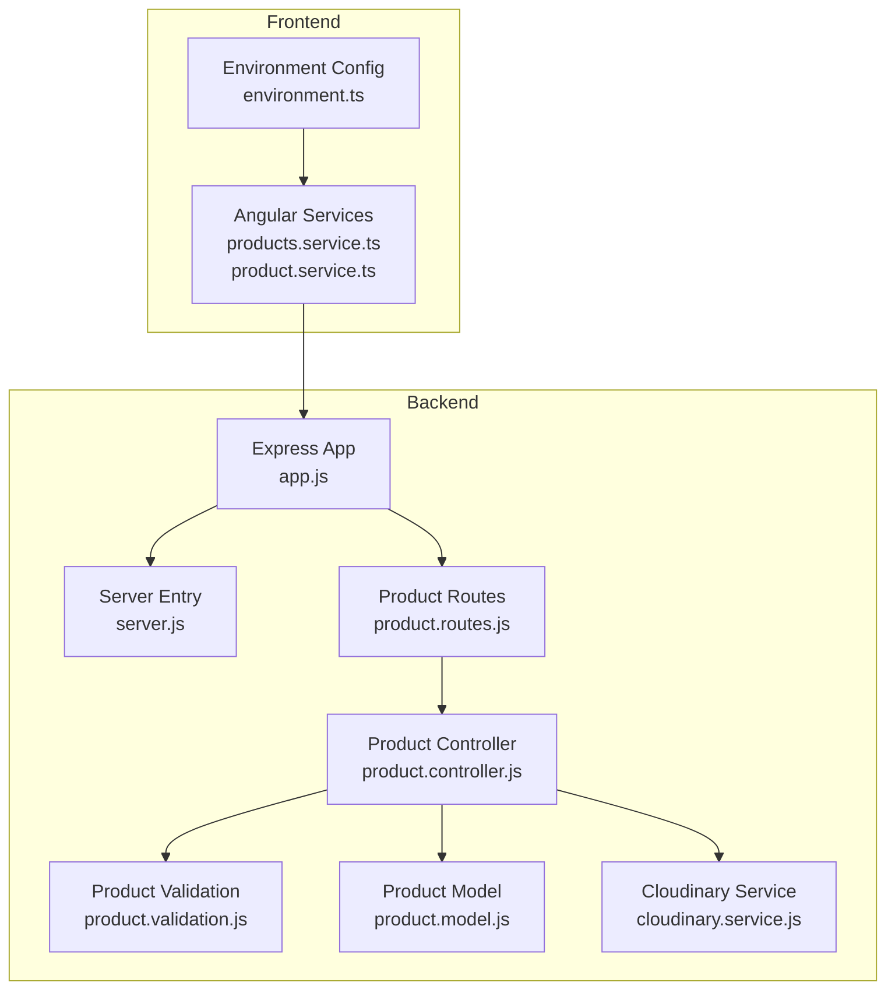
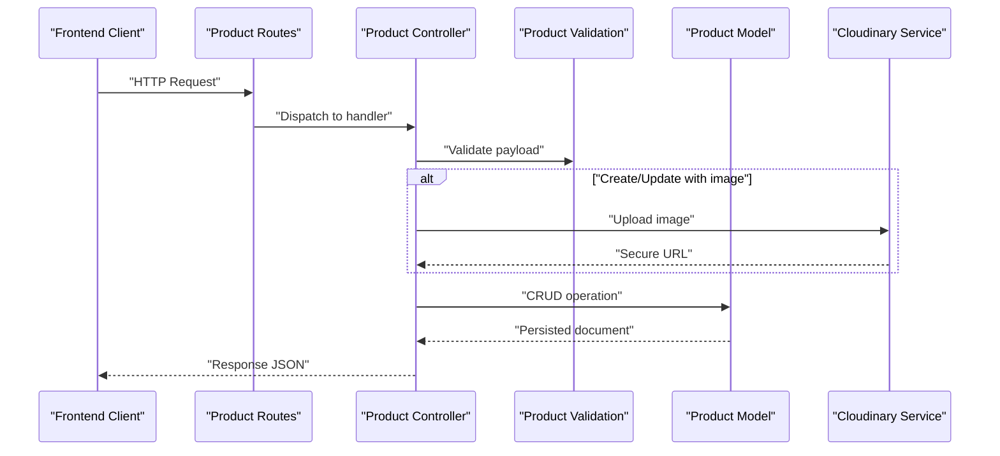
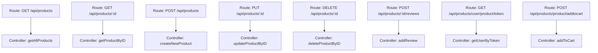
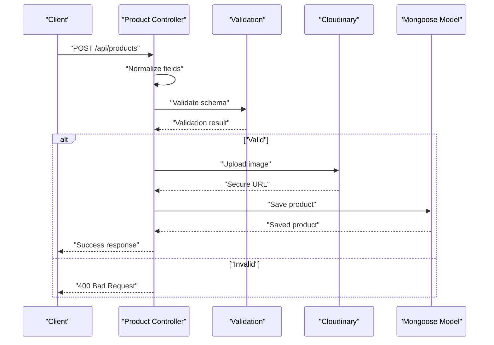
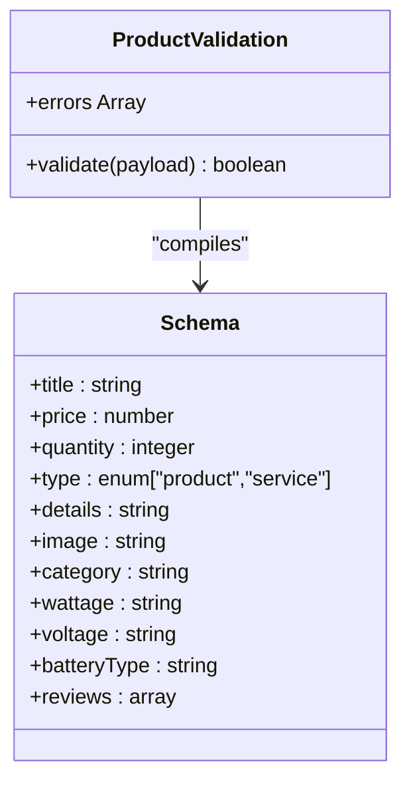
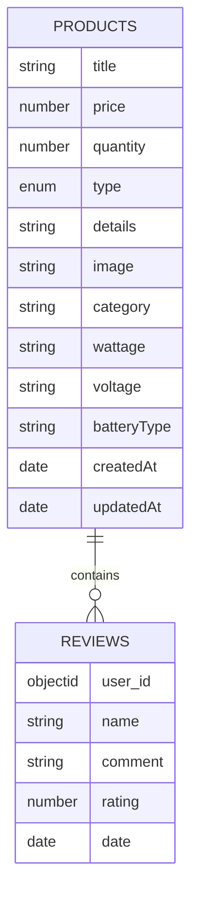
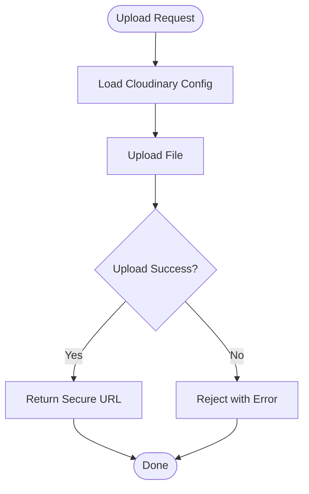
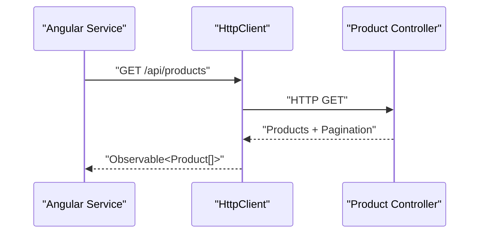
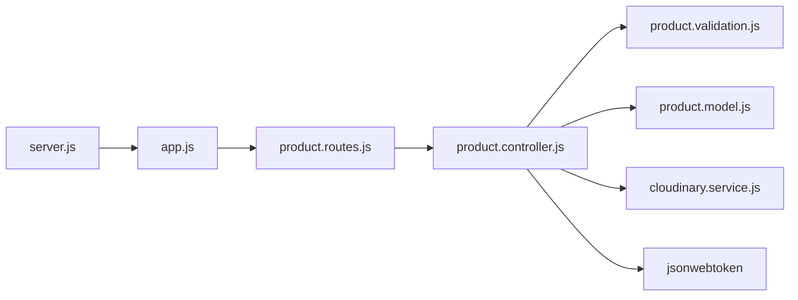

# Product Catalog API

<cite>
**Referenced Files in This Document**
- [product.routes.js](file://Back-end/src/Routes/product.routes.js)
- [product.controller.js](file://Back-end/src/Controllers/product.controller.js)
- [product.validation.js](file://Back-end/src/Middlewares/product.validation.js)
- [product.model.js](file://Back-end/src/Models/product.model.js)
- [cloudinary.service.js](file://Back-end/src/services/cloudinary.service.js)
- [app.js](file://Back-end/src/app.js)
- [server.js](file://Back-end/src/Servers/server.js)
- [products.service.ts](file://Front-end/src/app/core/services/products.service.ts)
- [product.service.ts](file://Front-end/src/app/features/shop/pages/products/product.service.ts)
- [product.model.ts](file://Front-end/src/app/features/shop/pages/products/product.model.ts)
- [environment.ts](file://Front-end/src/environments/environment.ts)
</cite>

## Table of Contents
1. [Introduction](#introduction)
2. [Project Structure](#project-structure)
3. [Core Components](#core-components)
4. [Architecture Overview](#architecture-overview)
5. [Detailed Component Analysis](#detailed-component-analysis)
6. [Dependency Analysis](#dependency-analysis)
7. [Performance Considerations](#performance-considerations)
8. [Troubleshooting Guide](#troubleshooting-guide)
9. [Conclusion](#conclusion)
10. [Appendices](#appendices)

## Introduction
This document provides comprehensive API documentation for the product catalog management endpoints. It covers product CRUD operations, search and filtering, pagination, category-based queries, validation rules, and image upload integration with Cloudinary. It also includes request/response schemas, examples for creating solar panels with technical specifications, updating product availability, and retrieving products with filters.

## Project Structure
The product catalog API is implemented in the Back-end directory using Express.js and Mongoose. The routes define endpoint contracts, controllers implement business logic, validations enforce data integrity, and the Cloudinary service handles image uploads. The Front-end Angular application consumes these endpoints via HTTP services.

**Diagram sources**
- [app.js](file://Back-end/src/app.js#L1-L96)
- [server.js](file://Back-end/src/Servers/server.js#L1-L6)
- [product.routes.js](file://Back-end/src/Routes/product.routes.js#L1-L20)
- [product.controller.js](file://Back-end/src/Controllers/product.controller.js#L1-L348)
- [product.validation.js](file://Back-end/src/Middlewares/product.validation.js#L1-L39)
- [product.model.js](file://Back-end/src/Models/product.model.js#L1-L29)
- [cloudinary.service.js](file://Back-end/src/services/cloudinary.service.js#L1-L22)
- [environment.ts](file://Front-end/src/environments/environment.ts#L1-L5)
- [products.service.ts](file://Front-end/src/app/core/services/products.service.ts#L1-L31)
- [product.service.ts](file://Front-end/src/app/features/shop/pages/products/product.service.ts#L1-L49)

**Section sources**
- [product.routes.js](file://Back-end/src/Routes/product.routes.js#L1-L20)
- [product.controller.js](file://Back-end/src/Controllers/product.controller.js#L1-L348)
- [product.validation.js](file://Back-end/src/Middlewares/product.validation.js#L1-L39)
- [product.model.js](file://Back-end/src/Models/product.model.js#L1-L29)
- [cloudinary.service.js](file://Back-end/src/services/cloudinary.service.js#L1-L22)
- [app.js](file://Back-end/src/app.js#L1-L96)
- [server.js](file://Back-end/src/Servers/server.js#L1-L6)
- [environment.ts](file://Front-end/src/environments/environment.ts#L1-L5)
- [products.service.ts](file://Front-end/src/app/core/services/products.service.ts#L1-L31)
- [product.service.ts](file://Front-end/src/app/features/shop/pages/products/product.service.ts#L1-L49)

## Core Components
- Product Routes: Define endpoints for listing, retrieving, creating, updating, deleting, and reviewing products.
- Product Controller: Implements business logic including filtering, sorting, pagination, validation, Cloudinary image upload, and CRUD operations.
- Product Validation: Enforces strict schema validation for product creation/update.
- Product Model: Defines the Mongoose schema, indexes, and embedded reviews structure.
- Cloudinary Service: Handles secure image uploads and returns URLs and identifiers.
- Frontend Services: Consume the API for product listing, retrieval, creation, update, and deletion.

Key endpoints:
- GET /api/products
- GET /api/products/:id
- POST /api/products
- PUT /api/products/:id
- DELETE /api/products/:id
- POST /api/products/:id/reviews
- GET /api/products/user/product/token
- POST /api/products/product/addtocart

**Section sources**
- [product.routes.js](file://Back-end/src/Routes/product.routes.js#L1-L20)
- [product.controller.js](file://Back-end/src/Controllers/product.controller.js#L10-L348)
- [product.validation.js](file://Back-end/src/Middlewares/product.validation.js#L4-L35)
- [product.model.js](file://Back-end/src/Models/product.model.js#L11-L26)
- [cloudinary.service.js](file://Back-end/src/services/cloudinary.service.js#L10-L21)
- [products.service.ts](file://Front-end/src/app/core/services/products.service.ts#L14-L28)
- [product.service.ts](file://Front-end/src/app/features/shop/pages/products/product.service.ts#L20-L30)

## Architecture Overview
The API follows a layered architecture:
- Presentation Layer: Express routes and controllers.
- Application Layer: Validation middleware and business logic.
- Persistence Layer: Mongoose model with MongoDB.
- Integration Layer: Cloudinary for image storage.

**Diagram sources**
- [product.routes.js](file://Back-end/src/Routes/product.routes.js#L6-L16)
- [product.controller.js](file://Back-end/src/Controllers/product.controller.js#L107-L175)
- [product.validation.js](file://Back-end/src/Middlewares/product.validation.js#L37-L38)
- [product.model.js](file://Back-end/src/Models/product.model.js#L11-L23)
- [cloudinary.service.js](file://Back-end/src/services/cloudinary.service.js#L10-L21)

## Detailed Component Analysis

### Product Routes
Defines the REST endpoints for product catalog management:
- GET /api/products: List products with filtering, sorting, and pagination.
- GET /api/products/:id: Retrieve a product by ID.
- POST /api/products: Create a new product with image upload.
- PUT /api/products/:id: Update an existing product with optional image replacement.
- DELETE /api/products/:id: Remove a product by ID.
- POST /api/products/:id/reviews: Add or replace a review for a product.
- GET /api/products/user/product/token: Fetch user info by JWT cookie.
- POST /api/products/product/addtocart: Add product to user cart.

**Diagram sources**
- [product.routes.js](file://Back-end/src/Routes/product.routes.js#L6-L16)

**Section sources**
- [product.routes.js](file://Back-end/src/Routes/product.routes.js#L1-L20)

### Product Controller
Implements business logic for product operations:
- getAllProducts: Applies filters (minPrice, maxPrice, category, search), sorts, paginates, and returns products with pagination metadata.
- getProductByID: Retrieves a product by ObjectId.
- createNewProduct: Normalizes field names, validates payload, uploads image to Cloudinary, and persists product.
- updateProductByID: Partially updates product fields and optionally replaces image.
- deleteProductByID: Removes a product by ID.
- addReview: Adds or replaces a user's review.
- getUserByToken: Verifies JWT cookie and returns user data.
- addToCart: Updates user cart and product inventory.

**Diagram sources**
- [product.controller.js](file://Back-end/src/Controllers/product.controller.js#L107-L175)
- [product.validation.js](file://Back-end/src/Middlewares/product.validation.js#L37-L38)
- [cloudinary.service.js](file://Back-end/src/services/cloudinary.service.js#L10-L21)
- [product.model.js](file://Back-end/src/Models/product.model.js#L11-L23)

**Section sources**
- [product.controller.js](file://Back-end/src/Controllers/product.controller.js#L10-L348)

### Product Validation
Enforces strict schema validation using AJV:
- Required fields: title, price, quantity, category.
- Optional fields: type, details, image, category, wattage, voltage, batteryType, reviews.
- Reviews array items require name, comment, rating with integer range 1–5.
- Additional properties are not allowed.

**Diagram sources**
- [product.validation.js](file://Back-end/src/Middlewares/product.validation.js#L4-L35)

**Section sources**
- [product.validation.js](file://Back-end/src/Middlewares/product.validation.js#L1-L39)

### Product Model
Defines the Mongoose schema and indexes:
- Fields: title, price, quantity (min 0, default 0), type (enum), details, image, category, wattage, voltage, batteryType, reviews.
- Timestamps enabled.
- Text index on title and details for efficient text search.

**Diagram sources**
- [product.model.js](file://Back-end/src/Models/product.model.js#L3-L26)

**Section sources**
- [product.model.js](file://Back-end/src/Models/product.model.js#L1-L29)

### Cloudinary Integration
Handles secure image uploads:
- Configuration with cloud name, API key, and secret.
- Uploads temporary file and returns secure URL and public ID.

**Diagram sources**
- [cloudinary.service.js](file://Back-end/src/services/cloudinary.service.js#L3-L21)

**Section sources**
- [cloudinary.service.js](file://Back-end/src/services/cloudinary.service.js#L1-L22)

### Frontend Integration
Consumers of the API endpoints:
- Core ProductsService: Provides methods for listing, retrieving, creating, updating, and deleting products.
- Shop ProductsService: Offers additional methods for user token retrieval and product/cart interactions.
- Environment configuration sets the base API URL.

**Diagram sources**
- [products.service.ts](file://Front-end/src/app/core/services/products.service.ts#L14-L28)
- [product.service.ts](file://Front-end/src/app/features/shop/pages/products/product.service.ts#L20-L30)
- [environment.ts](file://Front-end/src/environments/environment.ts#L3)

**Section sources**
- [products.service.ts](file://Front-end/src/app/core/services/products.service.ts#L1-L31)
- [product.service.ts](file://Front-end/src/app/features/shop/pages/products/product.service.ts#L1-L49)
- [environment.ts](file://Front-end/src/environments/environment.ts#L1-L5)

## Dependency Analysis
The product controller depends on:
- Validation middleware for schema enforcement.
- Cloudinary service for image uploads.
- Product model for persistence and indexing.
- JWT verification for user token retrieval.

**Diagram sources**
- [product.controller.js](file://Back-end/src/Controllers/product.controller.js#L1-L6)
- [product.validation.js](file://Back-end/src/Middlewares/product.validation.js#L1-L2)
- [product.model.js](file://Back-end/src/Models/product.model.js#L1-L2)
- [cloudinary.service.js](file://Back-end/src/services/cloudinary.service.js#L1-L2)
- [product.routes.js](file://Back-end/src/Routes/product.routes.js#L1-L4)
- [app.js](file://Back-end/src/app.js#L1-L14)
- [server.js](file://Back-end/src/Servers/server.js#L1-L2)

**Section sources**
- [product.controller.js](file://Back-end/src/Controllers/product.controller.js#L1-L6)
- [product.validation.js](file://Back-end/src/Middlewares/product.validation.js#L1-L2)
- [product.model.js](file://Back-end/src/Models/product.model.js#L1-L2)
- [cloudinary.service.js](file://Back-end/src/services/cloudinary.service.js#L1-L2)
- [product.routes.js](file://Back-end/src/Routes/product.routes.js#L1-L4)
- [app.js](file://Back-end/src/app.js#L1-L14)
- [server.js](file://Back-end/src/Servers/server.js#L1-L2)

## Performance Considerations
- Text Search Index: The product model defines a text index on title and details to optimize search queries.
- Pagination: Implemented with page and limit query parameters to control result volume.
- Sorting: Supports dynamic sort by field names with optional descending order via a leading minus sign.
- Filtering: Numeric price range filtering and category regex filtering improve query specificity.

Recommendations:
- Use category filtering for large catalogs to reduce result sets.
- Apply pagination consistently to avoid large payloads.
- Prefer exact category matches to minimize regex overhead.

**Section sources**
- [product.model.js](file://Back-end/src/Models/product.model.js#L25-L26)
- [product.controller.js](file://Back-end/src/Controllers/product.controller.js#L14-L45)

## Troubleshooting Guide
Common issues and resolutions:
- Validation Errors: Ensure required fields (title, price, quantity, category) are present and formatted correctly. Check numeric fields for non-numeric values.
- Image Upload Failures: Verify Cloudinary configuration and file paths. Confirm the upload completes before saving the product.
- Product Not Found: Confirm ObjectId validity and that the product exists in the database.
- JWT Unauthorized: Ensure the JWT cookie is present and valid; verify the secret and token claims.
- CORS Issues: Confirm allowed origins in the backend CORS configuration.

**Section sources**
- [product.validation.js](file://Back-end/src/Middlewares/product.validation.js#L37-L38)
- [cloudinary.service.js](file://Back-end/src/services/cloudinary.service.js#L10-L21)
- [product.controller.js](file://Back-end/src/Controllers/product.controller.js#L92-L102)
- [app.js](file://Back-end/src/app.js#L19-L22)

## Conclusion
The product catalog API provides robust CRUD operations with advanced search, filtering, and pagination. Strict validation ensures data integrity, while Cloudinary integration enables seamless image uploads. The frontend services consume these endpoints effectively, enabling comprehensive product management workflows.

## Appendices

### API Endpoints Reference

- GET /api/products
  - Query parameters: minPrice, maxPrice, category, search, sort, page, limit
  - Response: products array and pagination metadata
  - Example request: GET /api/products?page=1&limit=24&sort=-createdAt
  - Example response: { products: [...], pagination: { page, limit, totalItems, totalPages } }

- GET /api/products/:id
  - Path parameter: id (ObjectId)
  - Response: Product document
  - Example response: { _id, title, price, quantity, category, ... }

- POST /api/products
  - Body: Product fields (multipart/form-data with image)
  - Response: Success message or validation errors
  - Example request: multipart/form-data with fields: title, price, quantity, category, details, image, type, wattage, voltage, batteryType

- PUT /api/products/:id
  - Path parameter: id (ObjectId)
  - Body: Partial product fields (optional image)
  - Response: Updated product document
  - Example request: JSON with fields to update (e.g., price, quantity, image)

- DELETE /api/products/:id
  - Path parameter: id (ObjectId)
  - Response: Deletion confirmation
  - Example response: { message: "Product deleted successfully" }

- POST /api/products/:id/reviews
  - Path parameter: id (ObjectId)
  - Body: { user_id, name, comment, rating }
  - Response: Review addition confirmation

- GET /api/products/user/product/token
  - Cookies: jwt
  - Response: User data without password

- POST /api/products/product/addtocart
  - Body: { user_id, product, quantity }
  - Response: Cart update confirmation

**Section sources**
- [product.routes.js](file://Back-end/src/Routes/product.routes.js#L6-L16)
- [product.controller.js](file://Back-end/src/Controllers/product.controller.js#L10-L348)

### Request/Response Schemas

- Product Creation (multipart/form-data)
  - Required: title, price, quantity, category
  - Optional: type, details, image, wattage, voltage, batteryType
  - Validation: AJV schema enforces types, enums, and constraints

- Product Update (JSON)
  - Fields: title, details, price, quantity, category, type, wattage, voltage, batteryType
  - Optional image replacement via multipart/form-data

- Pagination Response
  - Fields: page, limit, totalItems, totalPages

- Review Schema
  - Fields: user_id, name, comment, rating (1–5), date

**Section sources**
- [product.validation.js](file://Back-end/src/Middlewares/product.validation.js#L4-L35)
- [product.model.js](file://Back-end/src/Models/product.model.js#L3-L23)
- [product.controller.js](file://Back-end/src/Controllers/product.controller.js#L56-L64)

### Examples

- Creating a Solar Panel Product
  - Endpoint: POST /api/products
  - Fields: title, price, quantity, category, details, type="product", wattage, voltage, batteryType
  - Image: Attach a single image file in multipart/form-data

- Updating Product Availability
  - Endpoint: PUT /api/products/:id
  - Fields: quantity (and/or price)

- Retrieving Products with Filters
  - Endpoint: GET /api/products
  - Query parameters: category, minPrice, maxPrice, search, sort, page, limit

**Section sources**
- [product.controller.js](file://Back-end/src/Controllers/product.controller.js#L107-L175)
- [product.controller.js](file://Back-end/src/Controllers/product.controller.js#L180-L218)
- [product.controller.js](file://Back-end/src/Controllers/product.controller.js#L10-L68)