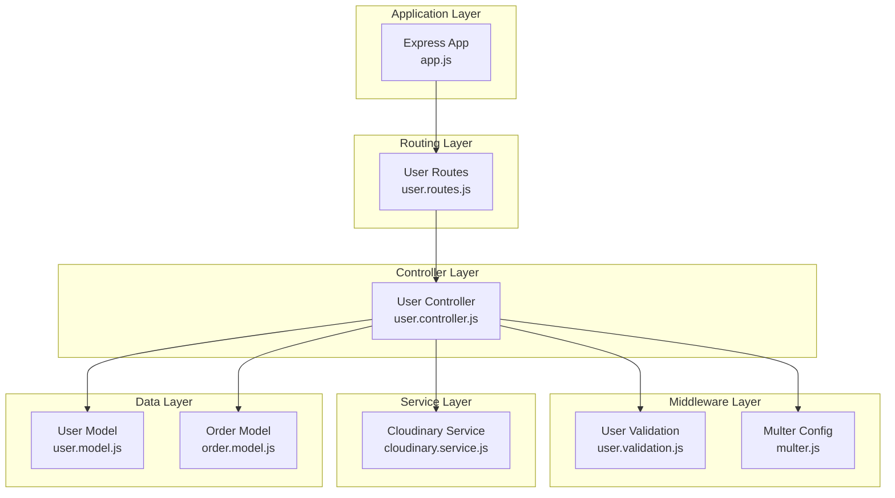
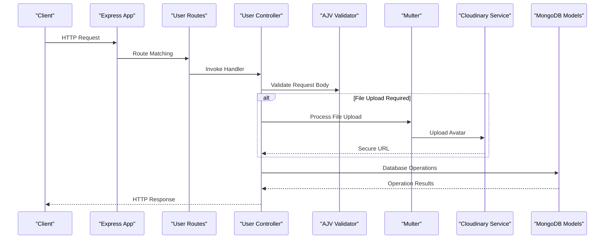
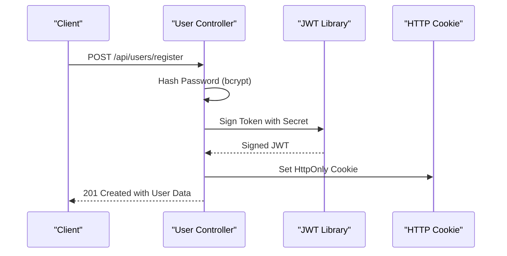
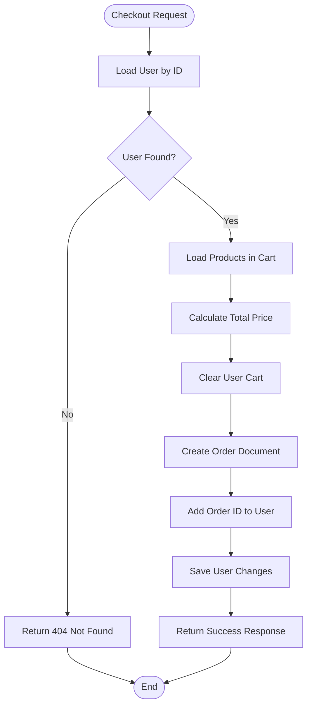
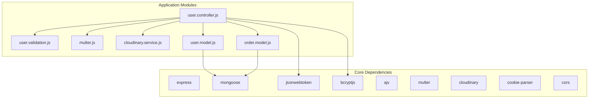

# User Management API

<cite>
**Referenced Files in This Document**
- [user.routes.js](file://Back-end/src/Routes/user.routes.js)
- [user.controller.js](file://Back-end/src/Controllers/user.controller.js)
- [user.validation.js](file://Back-end/src/Middlewares/user.validation.js)
- [multer.js](file://Back-end/src/Middlewares/multer.js)
- [cloudinary.service.js](file://Back-end/src/services/cloudinary.service.js)
- [user.model.js](file://Back-end/src/Models/user.model.js)
- [order.model.js](file://Back-end/src/Models/order.model.js)
- [app.js](file://Back-end/src/app.js)
- [package.json](file://Back-end/package.json)
</cite>

## Table of Contents
1. [Introduction](#introduction)
2. [Project Structure](#project-structure)
3. [Core Components](#core-components)
4. [Architecture Overview](#architecture-overview)
5. [Detailed Component Analysis](#detailed-component-analysis)
6. [Dependency Analysis](#dependency-analysis)
7. [Performance Considerations](#performance-considerations)
8. [Troubleshooting Guide](#troubleshooting-guide)
9. [Conclusion](#conclusion)

## Introduction
This document provides comprehensive API documentation for the user management system. It covers all user-related HTTP endpoints including registration, login, profile management, cart operations, order history, and logout. The system implements JWT-based authentication, handles file uploads via Multer for user avatars, enforces validation rules, and manages password hashing with bcrypt. Practical examples demonstrate typical workflows, while error responses, status codes, and security considerations are documented for robust integration.

## Project Structure
The user management API is organized using a layered architecture:
- Routes define endpoint mappings and HTTP methods
- Controllers implement business logic and coordinate data operations
- Middlewares handle validation and file upload processing
- Models define data schemas for users, orders, and products
- Services integrate external APIs (Cloudinary) for media management
- Application configuration sets up middleware, CORS, cookies, and static file serving

**Diagram sources**
- [app.js](file://Back-end/src/app.js#L38-L42)
- [user.routes.js](file://Back-end/src/Routes/user.routes.js#L1-L24)
- [user.controller.js](file://Back-end/src/Controllers/user.controller.js#L1-L480)
- [user.validation.js](file://Back-end/src/Middlewares/user.validation.js#L1-L29)
- [multer.js](file://Back-end/src/Middlewares/multer.js#L1-L33)
- [cloudinary.service.js](file://Back-end/src/services/cloudinary.service.js#L1-L22)
- [user.model.js](file://Back-end/src/Models/user.model.js#L1-L29)
- [order.model.js](file://Back-end/src/Models/order.model.js#L1-L13)

**Section sources**
- [app.js](file://Back-end/src/app.js#L1-L96)
- [user.routes.js](file://Back-end/src/Routes/user.routes.js#L1-L24)

## Core Components
This section outlines the primary components involved in user management:

- **Routes**: Define HTTP endpoints for user operations, including registration, login, profile updates, cart actions, order retrieval, and logout.
- **Controller**: Implements business logic for user operations, including authentication, password hashing, JWT token generation, cart manipulation, order creation, and profile updates.
- **Validation Middleware**: Enforces schema validation using AJV for user data during registration and updates.
- **Multer Middleware**: Handles file uploads for user avatars with filtering for supported image types and disk storage.
- **Cloudinary Service**: Uploads avatar images to Cloudinary and returns secure URLs for storage.
- **Models**: Define user, order, and product schemas with relationships and constraints.

Key responsibilities:
- Authentication: JWT token generation and verification
- Authorization: Cookie-based session management
- Data Integrity: Validation and sanitization
- Media Handling: Avatar uploads and storage
- Business Logic: Cart operations, order processing, and user profile management

**Section sources**
- [user.controller.js](file://Back-end/src/Controllers/user.controller.js#L1-L480)
- [user.validation.js](file://Back-end/src/Middlewares/user.validation.js#L1-L29)
- [multer.js](file://Back-end/src/Middlewares/multer.js#L1-L33)
- [cloudinary.service.js](file://Back-end/src/services/cloudinary.service.js#L1-L22)
- [user.model.js](file://Back-end/src/Models/user.model.js#L1-L29)
- [order.model.js](file://Back-end/src/Models/order.model.js#L1-L13)

## Architecture Overview
The user management API follows a modular architecture with clear separation of concerns:

**Diagram sources**
- [app.js](file://Back-end/src/app.js#L16-L24)
- [user.routes.js](file://Back-end/src/Routes/user.routes.js#L1-L24)
- [user.controller.js](file://Back-end/src/Controllers/user.controller.js#L32-L57)
- [user.validation.js](file://Back-end/src/Middlewares/user.validation.js#L1-L29)
- [multer.js](file://Back-end/src/Middlewares/multer.js#L19-L32)
- [cloudinary.service.js](file://Back-end/src/services/cloudinary.service.js#L10-L19)
- [user.model.js](file://Back-end/src/Models/user.model.js#L8-L27)

## Detailed Component Analysis

### Authentication and Session Management
The system implements JWT-based authentication with cookie storage for session management:

Security considerations:
- Passwords are hashed using bcrypt with salt rounds
- JWT tokens are stored as HttpOnly cookies to prevent XSS attacks
- Token expiration is configured for 30 days
- Validation ensures only required fields are processed

**Diagram sources**
- [user.controller.js](file://Back-end/src/Controllers/user.controller.js#L138-L175)
- [user.controller.js](file://Back-end/src/Controllers/user.controller.js#L118-L136)

**Section sources**
- [user.controller.js](file://Back-end/src/Controllers/user.controller.js#L118-L175)

### Registration Endpoint
Endpoint: POST /api/users/register
Purpose: Creates a new user account with avatar upload

Request Schema:
- Content-Type: multipart/form-data
- Fields:
  - username: string (required)
  - email: string (required)
  - password: string (required)
  - gender: string (required, enum: male|female)
  - image: file (required, JPEG/PNG/JPG)

Response Schema:
- 201 Created: User created successfully
- 400 Bad Request: Validation errors or duplicate email
- 500 Internal Server Error: Server-side failures

Example Request:
- Headers: Content-Type: multipart/form-data
- Body: Form fields for username, email, password, gender plus image file

Example Response (Success):
- Status: 201
- Body: { message: "User Created Successfully", user: { username, email, gender, image, isAdmin } }

**Section sources**
- [user.routes.js](file://Back-end/src/Routes/user.routes.js#L16)
- [user.controller.js](file://Back-end/src/Controllers/user.controller.js#L138-L175)
- [user.validation.js](file://Back-end/src/Middlewares/user.validation.js#L4-L24)
- [multer.js](file://Back-end/src/Middlewares/multer.js#L19-L32)
- [cloudinary.service.js](file://Back-end/src/services/cloudinary.service.js#L10-L19)

### Login Endpoint
Endpoint: POST /api/users/login
Purpose: Authenticates existing users and generates JWT session

Request Schema:
- Content-Type: application/json
- Fields:
  - email: string (required)
  - password: string (required)

Response Schema:
- 200 OK: Login successful with user data
- 400 Bad Request: Invalid credentials
- 500 Internal Server Error: Server-side failures

Example Request:
- Body: { email: "user@example.com", password: "securePassword" }

Example Response (Success):
- Status: 200
- Body: { message: "User Logged In Successfully", user: { username, email, gender, image, isAdmin } }
- Cookie: jwt=<token>; Path=/; HttpOnly; Max-Age=2592000

**Section sources**
- [user.routes.js](file://Back-end/src/Routes/user.routes.js#L15)
- [user.controller.js](file://Back-end/src/Controllers/user.controller.js#L118-L136)

### Profile Management Endpoints
Endpoints:
- GET /api/users/:id - Retrieve user by ID
- PUT /api/users/:id - Update user profile (avatar optional)
- DELETE /api/users/:id - Delete user account

Request Schema (PUT):
- Content-Type: multipart/form-data (optional for avatar)
- Fields:
  - username: string
  - email: string
  - password: string (hashed automatically)
  - gender: string
  - image: file (JPEG/PNG/JPG)
  - orders: array of order IDs

Response Schema:
- 200 OK: Updated user data
- 404 Not Found: User not found
- 500 Internal Server Error: Server-side failures

**Section sources**
- [user.routes.js](file://Back-end/src/Routes/user.routes.js#L11-L14)
- [user.controller.js](file://Back-end/src/Controllers/user.controller.js#L59-L105)
- [user.validation.js](file://Back-end/src/Middlewares/user.validation.js#L4-L24)

### Cart Operations
Endpoints:
- POST /api/users/:id/cart - Add product to cart
- GET /api/users/:id/cart - View cart items
- PUT /api/users/cart/increase - Increase product quantity
- PUT /api/users/cart/decrease - Decrease product quantity
- DELETE /api/users/cart/remove - Remove product from cart

Request Schema (Add to Cart):
- Content-Type: application/json
- Fields:
  - user_id: string (required)
  - product: string (required)
  - quantity: number (required)

Response Schema:
- 201 Created: Item added successfully
- 400 Bad Request: Quantity exceeds stock
- 404 Not Found: User or product not found
- 500 Internal Server Error: Server-side failures

Cart Business Logic:
- Stock validation prevents overselling
- Automatic product quantity updates
- Cart item deduplication with quantity accumulation

**Section sources**
- [user.routes.js](file://Back-end/src/Routes/user.routes.js#L6-L21)
- [user.controller.js](file://Back-end/src/Controllers/user.controller.js#L177-L219)
- [user.controller.js](file://Back-end/src/Controllers/user.controller.js#L312-L386)
- [user.controller.js](file://Back-end/src/Controllers/user.controller.js#L389-L403)

### Order History
Endpoints:
- POST /api/users/:id/order - Checkout cart items to create order
- GET /api/users/:id/orders - Retrieve user's order history

Order Creation Workflow:

**Diagram sources**
- [user.controller.js](file://Back-end/src/Controllers/user.controller.js#L224-L270)

**Section sources**
- [user.routes.js](file://Back-end/src/Routes/user.routes.js#L9-L11)
- [user.controller.js](file://Back-end/src/Controllers/user.controller.js#L224-L270)
- [order.model.js](file://Back-end/src/Models/order.model.js#L3-L10)

### Logout Endpoint
Endpoint: POST /api/users/user/logout
Purpose: Clears JWT cookie to end session

Response Schema:
- 200 OK: Logout successful
- 500 Internal Server Error: Server-side failures

**Section sources**
- [user.routes.js](file://Back-end/src/Routes/user.routes.js#L18)
- [user.controller.js](file://Back-end/src/Controllers/user.controller.js#L447-L458)

### Token-Based User Retrieval
Endpoint: GET /api/users/user
Purpose: Retrieves currently authenticated user based on JWT cookie

Response Schema:
- 200 OK: User data without password
- 401 Unauthorized: Missing or invalid JWT cookie/token
- 500 Internal Server Error: Server-side failures

**Section sources**
- [user.routes.js](file://Back-end/src/Routes/user.routes.js#L17)
- [user.controller.js](file://Back-end/src/Controllers/user.controller.js#L421-L445)

## Dependency Analysis
The user management system relies on several key dependencies:

**Diagram sources**
- [package.json](file://Back-end/package.json#L13-L27)
- [user.controller.js](file://Back-end/src/Controllers/user.controller.js#L1-L10)
- [user.validation.js](file://Back-end/src/Middlewares/user.validation.js#L1-L3)
- [multer.js](file://Back-end/src/Middlewares/multer.js#L1-L3)
- [cloudinary.service.js](file://Back-end/src/services/cloudinary.service.js#L1-L8)
- [user.model.js](file://Back-end/src/Models/user.model.js#L1-L2)
- [order.model.js](file://Back-end/src/Models/order.model.js#L1-L2)

Key dependency relationships:
- Express application serves as the entry point
- Mongoose connects to MongoDB for data persistence
- JWT handles authentication tokens
- Bcrypt provides password hashing
- AJV validates request schemas
- Multer processes file uploads
- Cloudinary stores avatar images
- Cookie parser manages session cookies

**Section sources**
- [package.json](file://Back-end/package.json#L1-L29)
- [app.js](file://Back-end/src/app.js#L1-L96)

## Performance Considerations
- Database Indexes: Consider adding indexes on frequently queried fields (email, username) in the user model
- File Storage: Cloudinary provides scalable image storage; ensure appropriate image sizes for optimal loading
- Validation: AJV schema validation occurs before database operations, reducing unnecessary processing
- Caching: Implement Redis caching for frequently accessed user data
- Pagination: For large order histories, implement pagination in GET /api/users/:id/orders
- Connection Pooling: Configure MongoDB connection pooling for high concurrency scenarios

## Troubleshooting Guide
Common issues and resolutions:

**Authentication Failures:**
- Symptom: 401 Unauthorized on protected endpoints
- Cause: Missing or expired JWT cookie
- Resolution: Ensure client sends cookie with requests; verify JWT secret consistency

**File Upload Errors:**
- Symptom: 400 Bad Request during registration/update
- Cause: Unsupported file type or missing image field
- Resolution: Verify file MIME types (image/jpeg, image/png, image/jpg); ensure multipart/form-data encoding

**Validation Errors:**
- Symptom: 400 Bad Request with validation messages
- Cause: Missing required fields or incorrect data types
- Resolution: Review AJV schema requirements; ensure all required fields are present

**Database Connection Issues:**
- Symptom: 500 Internal Server Error on database operations
- Cause: MongoDB connectivity problems
- Resolution: Verify DATABASE_URL environment variable; check network connectivity

**Section sources**
- [user.controller.js](file://Back-end/src/Controllers/user.controller.js#L34-L35)
- [user.controller.js](file://Back-end/src/Controllers/user.controller.js#L421-L445)
- [multer.js](file://Back-end/src/Middlewares/multer.js#L19-L29)
- [user.validation.js](file://Back-end/src/Middlewares/user.validation.js#L22-L24)

## Conclusion
The user management API provides a comprehensive solution for customer lifecycle management with robust authentication, secure file handling, and efficient cart/order operations. The modular architecture ensures maintainability and scalability, while built-in validation and security measures protect against common vulnerabilities. The documented endpoints, schemas, and workflows enable seamless integration with frontend applications and third-party services.