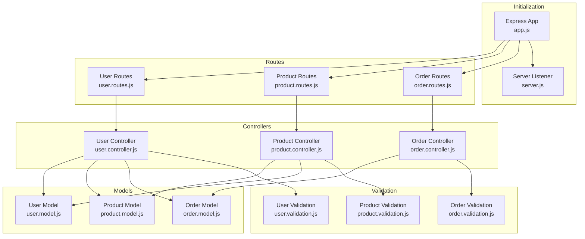
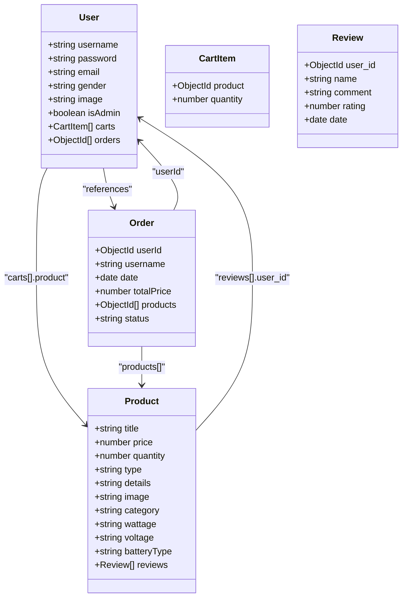
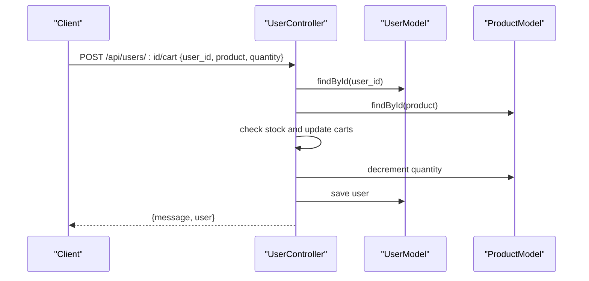
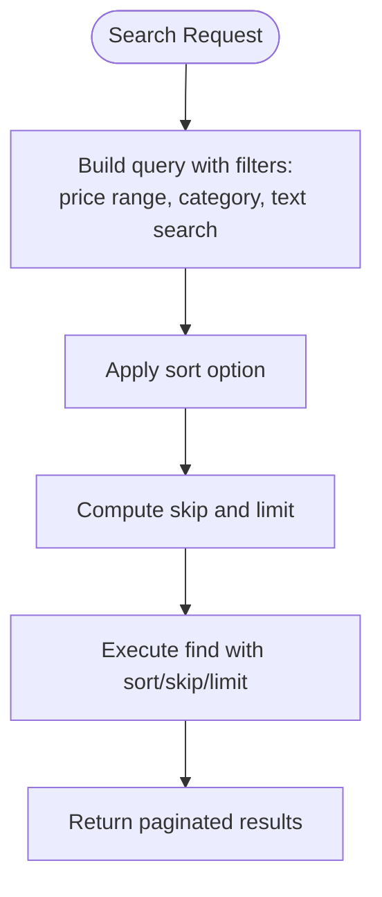
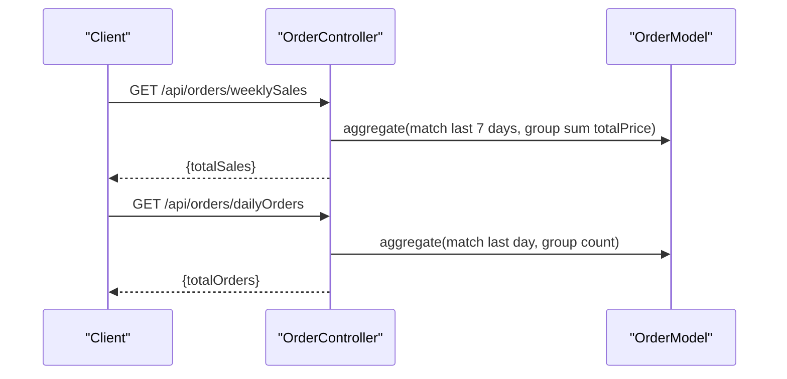
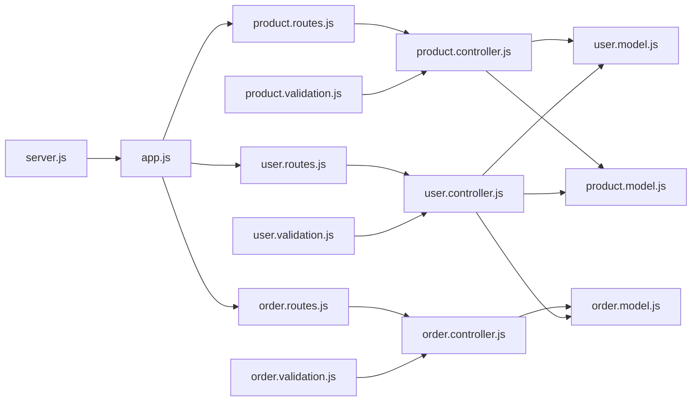

# Database Design and Models

<cite>
**Referenced Files in This Document**
- [user.model.js](file://Back-end/src/Models/user.model.js)
- [product.model.js](file://Back-end/src/Models/product.model.js)
- [order.model.js](file://Back-end/src/Models/order.model.js)
- [user.controller.js](file://Back-end/src/Controllers/user.controller.js)
- [product.controller.js](file://Back-end/src/Controllers/product.controller.js)
- [order.controller.js](file://Back-end/src/Controllers/order.controller.js)
- [user.validation.js](file://Back-end/src/Middlewares/user.validation.js)
- [product.validation.js](file://Back-end/src/Middlewares/product.validation.js)
- [order.validation.js](file://Back-end/src/Middlewares/order.validation.js)
- [user.routes.js](file://Back-end/src/Routes/user.routes.js)
- [product.routes.js](file://Back-end/src/Routes/product.routes.js)
- [order.routes.js](file://Back-end/src/Routes/order.routes.js)
- [app.js](file://Back-end/src/app.js)
- [server.js](file://Back-end/src/Servers/server.js)
- [env.js](file://Back-end/src/config/env.js)
- [create_admin.js](file://Back-end/create_admin.js)
- [solarize_db.js](file://Back-end/solarize_db.js)
</cite>

## Table of Contents
1. [Introduction](#introduction)
2. [Project Structure](#project-structure)
3. [Core Components](#core-components)
4. [Architecture Overview](#architecture-overview)
5. [Detailed Component Analysis](#detailed-component-analysis)
6. [Dependency Analysis](#dependency-analysis)
7. [Performance Considerations](#performance-considerations)
8. [Troubleshooting Guide](#troubleshooting-guide)
9. [Conclusion](#conclusion)
10. [Appendices](#appendices)

## Introduction
This document describes the MongoDB schema design and data model for Lightstorm, focusing on the User, Product, and Order collections. It explains field definitions, data types, validation rules, relationships (references vs embedded), indexing strategies, query patterns, and operational procedures such as database initialization, seeding, migrations, and security considerations. The goal is to provide a clear understanding of how data is structured, validated, queried, and maintained across the system.

## Project Structure
The backend follows a layered architecture with clear separation of concerns:
- Models define Mongoose schemas and indexes.
- Controllers encapsulate business logic and orchestrate model operations.
- Routes expose endpoints for clients.
- Middlewares handle validation and file uploads.
- Initialization connects to MongoDB and serves static assets.

**Diagram sources**
- [app.js](file://Back-end/src/app.js#L1-L96)
- [server.js](file://Back-end/src/Servers/server.js#L1-L6)
- [user.routes.js](file://Back-end/src/Routes/user.routes.js#L1-L24)
- [product.routes.js](file://Back-end/src/Routes/product.routes.js#L1-L20)
- [order.routes.js](file://Back-end/src/Routes/order.routes.js#L1-L19)
- [user.controller.js](file://Back-end/src/Controllers/user.controller.js#L1-L480)
- [product.controller.js](file://Back-end/src/Controllers/product.controller.js#L1-L348)
- [order.controller.js](file://Back-end/src/Controllers/order.controller.js#L1-L258)
- [user.model.js](file://Back-end/src/Models/user.model.js#L1-L29)
- [product.model.js](file://Back-end/src/Models/product.model.js#L1-L29)
- [order.model.js](file://Back-end/src/Models/order.model.js#L1-L13)
- [user.validation.js](file://Back-end/src/Middlewares/user.validation.js#L1-L29)
- [product.validation.js](file://Back-end/src/Middlewares/product.validation.js#L1-L39)
- [order.validation.js](file://Back-end/src/Middlewares/order.validation.js#L1-L39)

**Section sources**
- [app.js](file://Back-end/src/app.js#L1-L96)
- [server.js](file://Back-end/src/Servers/server.js#L1-L6)
- [user.routes.js](file://Back-end/src/Routes/user.routes.js#L1-L24)
- [product.routes.js](file://Back-end/src/Routes/product.routes.js#L1-L20)
- [order.routes.js](file://Back-end/src/Routes/order.routes.js#L1-L19)

## Core Components
This section defines the three primary collections and their fields, types, constraints, and relationships.

### User Collection
- Purpose: Stores customer profiles, authentication credentials, shopping cart, and order history.
- Key fields:
  - username: String, required
  - password: String, required
  - email: String, unique, required
  - gender: String, enum: male, female
  - image: String, default avatar URL
  - orders: Array of ObjectIds referencing orders
  - carts: Embedded array of cart items
    - product: ObjectId referencing products
    - quantity: Number
  - isAdmin: Boolean, default false

Relationships:
- Reference: orders → orders collection
- Reference: carts[].product → products collection
- Embedded: carts within users

Validation:
- AJV schema enforces presence of email, username, password, image, gender, orders, carts, isAdmin; all are required by the schema.

Indexes:
- None explicitly defined in the model.

Typical operations:
- CRUD via user controller endpoints
- Cart manipulation and order creation
- Authentication and session cookies

**Section sources**
- [user.model.js](file://Back-end/src/Models/user.model.js#L1-L29)
- [user.validation.js](file://Back-end/src/Middlewares/user.validation.js#L1-L29)
- [user.controller.js](file://Back-end/src/Controllers/user.controller.js#L1-L480)
- [user.routes.js](file://Back-end/src/Routes/user.routes.js#L1-L24)

### Product Collection
- Purpose: Stores catalog items with optional attributes for solar equipment.
- Key fields:
  - title: String, required
  - price: Number, required, min 0
  - quantity: Number, min 0, default 0
  - type: String, enum: product, service, default product
  - details: String
  - image: String
  - category: String
  - wattage: String
  - voltage: String
  - batteryType: String
  - reviews: Embedded array of review objects
    - user_id: ObjectId referencing users
    - name: String
    - comment: String
    - rating: Integer, min 1, max 5
    - date: Date
  - timestamps: createdAt, updatedAt

Indexes:
- Text index on title and details for full-text search.

Validation:
- AJV schema enforces required fields and numeric constraints.

Typical operations:
- List with filters (price range, category, search), sorting, pagination
- CRUD operations
- Add reviews

**Section sources**
- [product.model.js](file://Back-end/src/Models/product.model.js#L1-L29)
- [product.validation.js](file://Back-end/src/Middlewares/product.validation.js#L1-L39)
- [product.controller.js](file://Back-end/src/Controllers/product.controller.js#L1-L348)
- [product.routes.js](file://Back-end/src/Routes/product.routes.js#L1-L20)

### Order Collection
- Purpose: Tracks customer purchase records with status and product references.
- Key fields:
  - userId: ObjectId referencing users
  - username: String
  - date: Date
  - totalPrice: Number
  - products: Array of ObjectIds referencing products
  - status: String, enum: Pending, Accepted, Rejected

Relationships:
- Reference: userId → users
- Reference: products[] → products

Validation:
- AJV schema enforces ObjectId format and date-time format; enum constraints for status.

Typical operations:
- Aggregate reports (weekly/daily sales and counts)
- CRUD operations
- Status updates

**Section sources**
- [order.model.js](file://Back-end/src/Models/order.model.js#L1-L13)
- [order.validation.js](file://Back-end/src/Middlewares/order.validation.js#L1-L39)
- [order.controller.js](file://Back-end/src/Controllers/order.controller.js#L1-L258)
- [order.routes.js](file://Back-end/src/Routes/order.routes.js#L1-L19)

## Architecture Overview
The system uses Mongoose ODM with explicit references and embedded documents. Controllers coordinate requests, apply validation, and interact with models. Routes define the API surface. Initialization connects to MongoDB and serves the frontend.

**Diagram sources**
- [user.model.js](file://Back-end/src/Models/user.model.js#L1-L29)
- [product.model.js](file://Back-end/src/Models/product.model.js#L1-L29)
- [order.model.js](file://Back-end/src/Models/order.model.js#L1-L13)

## Detailed Component Analysis

### User Schema Patterns and Relationships
- Embedded documents: carts array holds product references and quantities.
- References: orders array and cart.item.product link to orders and products respectively.
- Validation: strict AJV schema requires all declared properties and disallows extra fields.

**Diagram sources**
- [user.controller.js](file://Back-end/src/Controllers/user.controller.js#L176-L219)
- [user.model.js](file://Back-end/src/Models/user.model.js#L1-L29)
- [product.model.js](file://Back-end/src/Models/product.model.js#L1-L29)

**Section sources**
- [user.model.js](file://Back-end/src/Models/user.model.js#L1-L29)
- [user.controller.js](file://Back-end/src/Controllers/user.controller.js#L176-L219)

### Product Schema Patterns and Indexing
- Embedded reviews enable per-product feedback without cross-collection joins.
- Text index on title and details supports efficient text search.
- Validation ensures numeric bounds and categorical enums.

**Diagram sources**
- [product.controller.js](file://Back-end/src/Controllers/product.controller.js#L10-L68)
- [product.model.js](file://Back-end/src/Models/product.model.js#L25-L26)

**Section sources**
- [product.model.js](file://Back-end/src/Models/product.model.js#L1-L29)
- [product.controller.js](file://Back-end/src/Controllers/product.controller.js#L10-L68)

### Order Schema Patterns and Aggregation
- Orders reference users and products via ObjectIds.
- Aggregation pipelines compute weekly/daily sales and counts.

**Diagram sources**
- [order.controller.js](file://Back-end/src/Controllers/order.controller.js#L170-L222)
- [order.model.js](file://Back-end/src/Models/order.model.js#L1-L13)

**Section sources**
- [order.controller.js](file://Back-end/src/Controllers/order.controller.js#L170-L222)
- [order.model.js](file://Back-end/src/Models/order.model.js#L1-L13)

## Dependency Analysis
- Controllers depend on models and validation middlewares.
- Routes depend on controllers.
- Models are independent but referenced by controllers.
- Initialization depends on environment variables and connects to MongoDB.

**Diagram sources**
- [user.validation.js](file://Back-end/src/Middlewares/user.validation.js#L1-L29)
- [product.validation.js](file://Back-end/src/Middlewares/product.validation.js#L1-L39)
- [order.validation.js](file://Back-end/src/Middlewares/order.validation.js#L1-L39)
- [user.controller.js](file://Back-end/src/Controllers/user.controller.js#L1-L480)
- [product.controller.js](file://Back-end/src/Controllers/product.controller.js#L1-L348)
- [order.controller.js](file://Back-end/src/Controllers/order.controller.js#L1-L258)
- [user.routes.js](file://Back-end/src/Routes/user.routes.js#L1-L24)
- [product.routes.js](file://Back-end/src/Routes/product.routes.js#L1-L20)
- [order.routes.js](file://Back-end/src/Routes/order.routes.js#L1-L19)
- [user.model.js](file://Back-end/src/Models/user.model.js#L1-L29)
- [product.model.js](file://Back-end/src/Models/product.model.js#L1-L29)
- [order.model.js](file://Back-end/src/Models/order.model.js#L1-L13)
- [app.js](file://Back-end/src/app.js#L1-L96)
- [server.js](file://Back-end/src/Servers/server.js#L1-L6)

**Section sources**
- [user.controller.js](file://Back-end/src/Controllers/user.controller.js#L1-L480)
- [product.controller.js](file://Back-end/src/Controllers/product.controller.js#L1-L348)
- [order.controller.js](file://Back-end/src/Controllers/order.controller.js#L1-L258)
- [user.routes.js](file://Back-end/src/Routes/user.routes.js#L1-L24)
- [product.routes.js](file://Back-end/src/Routes/product.routes.js#L1-L20)
- [order.routes.js](file://Back-end/src/Routes/order.routes.js#L1-L19)
- [app.js](file://Back-end/src/app.js#L1-L96)

## Performance Considerations
- Text search: Product model defines a text index on title and details to accelerate search queries.
- Pagination: Product listing uses skip/limit with countDocuments for scalable retrieval.
- Aggregation: Order reports leverage aggregation pipelines to compute summaries efficiently.
- Denormalization: Embedding reviews reduces join overhead at the cost of eventual consistency; consider periodic synchronization if needed.
- Indexes: Consider adding compound indexes for frequent query patterns (e.g., price+category, status+date).
- Validation: Pre-validate data to avoid unnecessary writes and reduce downstream errors.

[No sources needed since this section provides general guidance]

## Troubleshooting Guide
Common issues and resolutions:
- Authentication failures: Verify email/password match and token validity; ensure secret alignment in signing/verification.
- Stock overflow: Cart operations prevent adding more than available quantity; ensure product quantity updates occur before saving user.
- Missing ObjectId format: Ensure client sends valid ObjectId strings; validation middleware enforces formats.
- CORS/static serving: Confirm origins and static path resolution; adjust if frontend distribution path changes.

Operational checks:
- Database connectivity: Confirm DATABASE_URL in environment and successful connection logs.
- Admin account: Use the admin creation script to bootstrap credentials securely.
- Seed/solarization: Use the solarization script to enrich product templates and pricing.

**Section sources**
- [user.controller.js](file://Back-end/src/Controllers/user.controller.js#L118-L136)
- [user.controller.js](file://Back-end/src/Controllers/user.controller.js#L176-L219)
- [order.validation.js](file://Back-end/src/Middlewares/order.validation.js#L31-L34)
- [app.js](file://Back-end/src/app.js#L25-L36)
- [create_admin.js](file://Back-end/create_admin.js#L1-L59)
- [solarize_db.js](file://Back-end/solarize_db.js#L1-L92)

## Conclusion
Lightstorm’s schema employs a hybrid approach: embedded documents for cart items and reviews, and references for orders and product associations. Validation, indexing, and aggregation support efficient querying and reporting. The design balances flexibility with performance while maintaining clear relationships among users, products, and orders.

[No sources needed since this section summarizes without analyzing specific files]

## Appendices

### Database Initialization and Environment
- Connection: The Express app reads DATABASE_URL from environment and connects via Mongoose.
- Environment configuration: Application constants include app name and base API path.

**Section sources**
- [app.js](file://Back-end/src/app.js#L25-L36)
- [env.js](file://Back-end/src/config/env.js#L1-L4)

### Seed Data and Migration Procedures
- Admin bootstrap: A dedicated script creates or updates an admin user with hashed credentials.
- Solarization: A script enriches existing products with standardized categories, titles, images, and pricing based on templates.

**Section sources**
- [create_admin.js](file://Back-end/create_admin.js#L1-L59)
- [solarize_db.js](file://Back-end/solarize_db.js#L1-L92)

### Security and Access Control
- Authentication: JWT tokens stored as httpOnly cookies; verification endpoint retrieves user by token.
- Authorization: Admin flag indicates administrative privileges; implement route guards to restrict sensitive actions.
- Data sanitization: Validation schemas enforce field types and constraints; sanitize inputs before persistence.

**Section sources**
- [user.controller.js](file://Back-end/src/Controllers/user.controller.js#L421-L445)
- [user.controller.js](file://Back-end/src/Controllers/user.controller.js#L118-L136)
- [user.model.js](file://Back-end/src/Models/user.model.js#L26-L26)

### Sample Data Structures
- User
  - Fields: username, email, password, gender, image, isAdmin, orders[], carts[{product, quantity}]
- Product
  - Fields: title, price, quantity, type, details, image, category, wattage, voltage, batteryType, reviews[]
- Order
  - Fields: userId, username, date, totalPrice, products[], status

[No sources needed since this section lists representative structures]

### Common Queries and Operations
- Retrieve featured products: Newest first, limited count.
- Filter and paginate products: Price range, category, text search, sort, pagination.
- Add to cart: Validate stock, update user cart and product quantity atomically.
- Create order: Compute total price, clear cart, persist order, update user’s order history.
- Weekly/daily sales: Aggregation pipelines grouped by time windows.

**Section sources**
- [product.controller.js](file://Back-end/src/Controllers/product.controller.js#L73-L80)
- [product.controller.js](file://Back-end/src/Controllers/product.controller.js#L10-L68)
- [user.controller.js](file://Back-end/src/Controllers/user.controller.js#L176-L219)
- [user.controller.js](file://Back-end/src/Controllers/user.controller.js#L224-L270)
- [order.controller.js](file://Back-end/src/Controllers/order.controller.js#L170-L222)