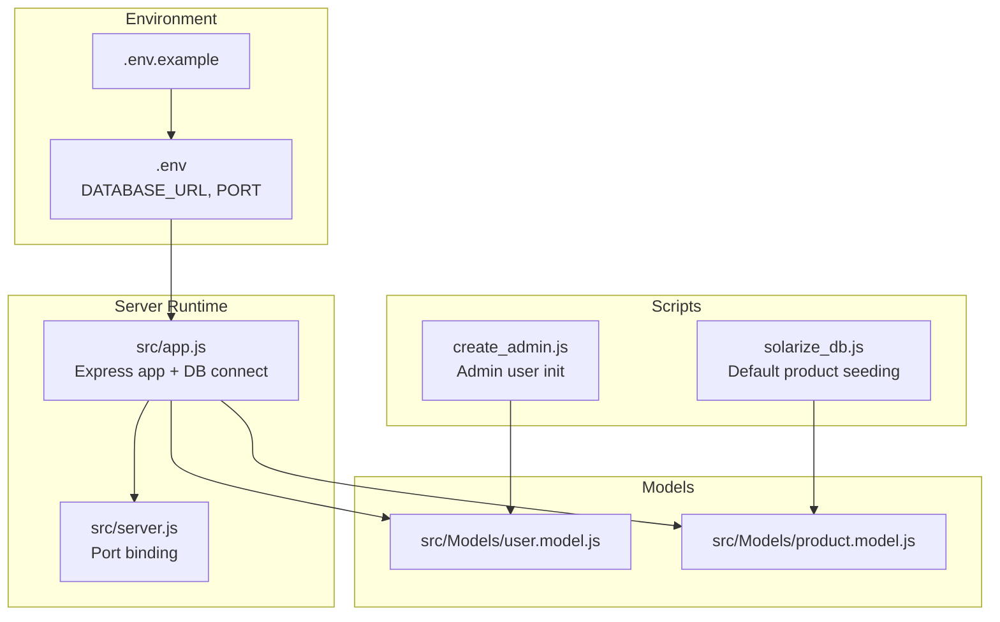
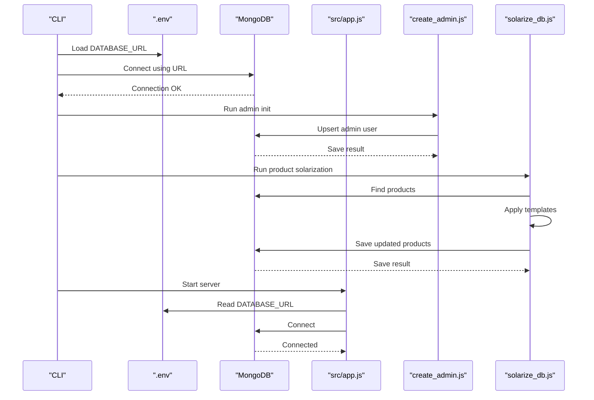
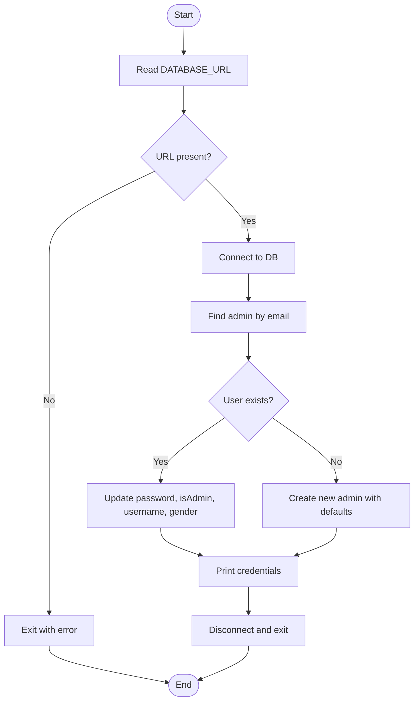
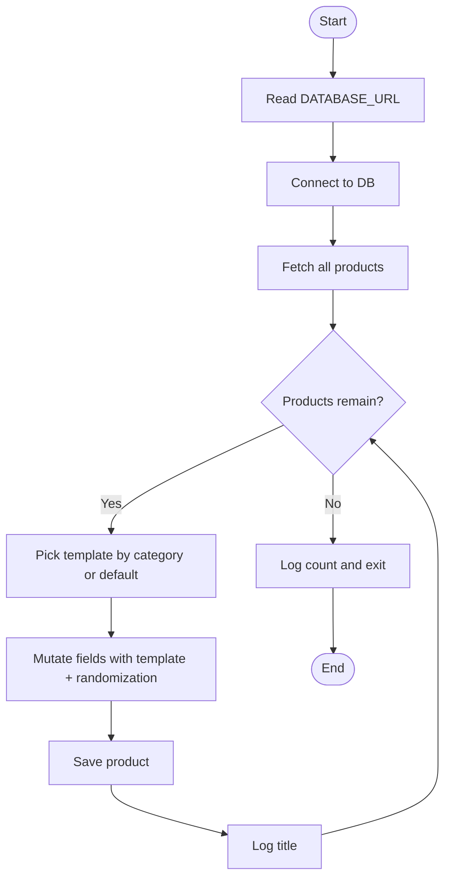
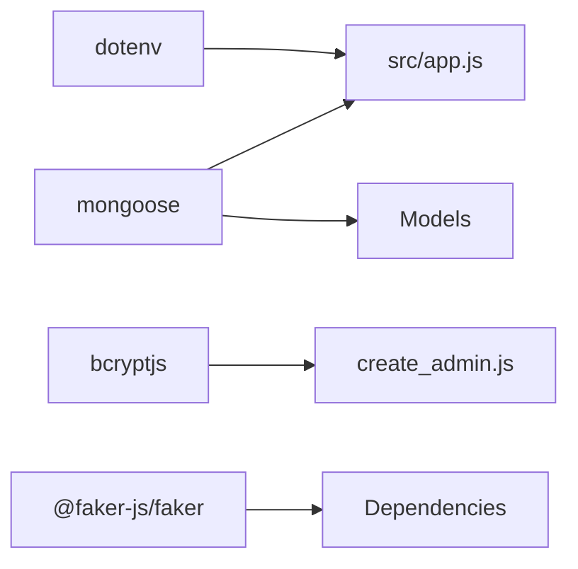

# Database Initialization and Seed Data

<cite>
**Referenced Files in This Document**
- [.env](file://Back-end/.env)
- [.env.example](file://Back-end/.env.example)
- [create_admin.js](file://Back-end/create_admin.js)
- [solarize_db.js](file://Back-end/solarize_db.js)
- [package.json](file://Back-end/package.json)
- [src/app.js](file://Back-end/src/app.js)
- [src/server.js](file://Back-end/src/server.js)
- [src/config/env.js](file://Back-end/src/config/env.js)
- [src/Models/user.model.js](file://Back-end/src/Models/user.model.js)
- [src/Models/product.model.js](file://Back-end/src/Models/product.model.js)
</cite>

## Table of Contents
1. [Introduction](#introduction)
2. [Project Structure](#project-structure)
3. [Core Components](#core-components)
4. [Architecture Overview](#architecture-overview)
5. [Detailed Component Analysis](#detailed-component-analysis)
6. [Dependency Analysis](#dependency-analysis)
7. [Performance Considerations](#performance-considerations)
8. [Troubleshooting Guide](#troubleshooting-guide)
9. [Conclusion](#conclusion)
10. [Appendices](#appendices)

## Introduction
This document explains how the backend initializes the database, manages environment configuration, seeds default data, and prepares the system for development and production. It covers:
- Database creation and connection management
- Collection setup via Mongoose models
- Initial data population strategies
- Admin user creation script
- Default product seeding and test data generation
- Environment-specific configuration
- Migration procedures and operational considerations
- Backup, restore, and export/import processes
- Differences between development and production setups

## Project Structure
The backend uses a standard Express + Mongoose stack. Database configuration is centralized in environment variables, and initialization occurs at runtime for the main server and via dedicated scripts for admin and product seeding.

**Diagram sources**
- [src/app.js](file://Back-end/src/app.js#L25-L36)
- [src/server.js](file://Back-end/src/server.js#L1-L6)
- [create_admin.js](file://Back-end/create_admin.js#L1-L59)
- [solarize_db.js](file://Back-end/solarize_db.js#L1-L92)
- [src/Models/user.model.js](file://Back-end/src/Models/user.model.js#L1-L29)
- [src/Models/product.model.js](file://Back-end/src/Models/product.model.js#L1-L29)

**Section sources**
- [src/app.js](file://Back-end/src/app.js#L1-L96)
- [src/server.js](file://Back-end/src/server.js#L1-L6)
- [package.json](file://Back-end/package.json#L1-L29)

## Core Components
- Environment configuration: Defines the database connection string and port.
- Database connection: Establishes a connection to MongoDB during server startup and logs success or failure.
- Models: Define collections and indexes for users and products.
- Admin initializer: Creates or updates an admin user with a predefined credential.
- Product solarizer: Applies default templates to existing products to bootstrap catalog data.

Key responsibilities:
- Centralized environment management via dotenv.
- Mongoose model-driven collection creation on first write.
- Dedicated scripts for idempotent initialization tasks.

**Section sources**
- [.env](file://Back-end/.env#L1-L3)
- [.env.example](file://Back-end/.env.example#L1-L3)
- [src/app.js](file://Back-end/src/app.js#L25-L36)
- [src/Models/user.model.js](file://Back-end/src/Models/user.model.js#L1-L29)
- [src/Models/product.model.js](file://Back-end/src/Models/product.model.js#L1-L29)
- [create_admin.js](file://Back-end/create_admin.js#L1-L59)
- [solarize_db.js](file://Back-end/solarize_db.js#L1-L92)

## Architecture Overview
The system connects to MongoDB using the configured URL. Collections are created implicitly by Mongoose when documents are inserted. Initialization scripts operate independently of the server to seed data and manage admin credentials.

**Diagram sources**
- [src/app.js](file://Back-end/src/app.js#L25-L36)
- [create_admin.js](file://Back-end/create_admin.js#L6-L56)
- [solarize_db.js](file://Back-end/solarize_db.js#L46-L89)
- [.env](file://Back-end/.env#L1-L3)

## Detailed Component Analysis

### Database Connection Management
- The server reads the database URL from environment variables and attempts to connect on startup.
- On successful connection, it logs confirmation; otherwise, it logs an error.
- The connection is established before routes are registered, ensuring downstream logic can rely on DB availability.

Operational notes:
- Ensure the MongoDB instance is reachable at the configured URL.
- Verify network policies and firewall rules if connecting to remote databases.
- Use separate URLs for development and production environments.

**Section sources**
- [src/app.js](file://Back-end/src/app.js#L25-L36)

### Environment Configuration
- The project defines a database URL and port in environment files.
- An example environment file is provided for reference.
- Scripts load environment variables explicitly to ensure availability.

Best practices:
- Keep secrets out of version control; maintain a local .env per developer.
- Use distinct environment files for development, staging, and production.

**Section sources**
- [.env](file://Back-end/.env#L1-L3)
- [.env.example](file://Back-end/.env.example#L1-L3)
- [package.json](file://Back-end/package.json#L6-L10)

### Admin User Creation Script
Purpose:
- Ensures an administrator account exists with a known credential.
- If the user exists, updates the password and role; otherwise creates a new admin user.

Behavior highlights:
- Hashes the password before saving.
- Requires a gender field as per schema.
- Prints credentials for quick access after completion.

**Diagram sources**
- [create_admin.js](file://Back-end/create_admin.js#L6-L56)

**Section sources**
- [create_admin.js](file://Back-end/create_admin.js#L1-L59)
- [src/Models/user.model.js](file://Back-end/src/Models/user.model.js#L8-L27)

### Default Product Seeding and Test Data Generation
Purpose:
- Applies predefined templates to existing products to populate catalog metadata.
- Uses randomized suffixes to differentiate entries while preserving template categories.

Behavior highlights:
- Iterates over existing products and enriches fields (title, category, details, price, image, attributes).
- Defaults to a panel template if a category is missing.
- Saves each product and logs progress.

**Diagram sources**
- [solarize_db.js](file://Back-end/solarize_db.js#L46-L89)

**Section sources**
- [solarize_db.js](file://Back-end/solarize_db.js#L1-L92)
- [src/Models/product.model.js](file://Back-end/src/Models/product.model.js#L11-L23)

### Models and Collection Setup
- Users model defines schema fields, embedded cart items, and references to orders.
- Products model defines schema fields, embedded reviews, and a text index for search.
- Mongoose creates collections on first insert/update; indexes are applied accordingly.

Implications:
- No explicit collection creation steps are required.
- Indexes are created automatically upon first write or via migrations in other stacks.

**Section sources**
- [src/Models/user.model.js](file://Back-end/src/Models/user.model.js#L1-L29)
- [src/Models/product.model.js](file://Back-end/src/Models/product.model.js#L1-L29)

### Server Startup and Routing
- The server loads environment variables, connects to the database, registers routes, and serves static assets for the Angular frontend.
- It handles uncaught errors and responds consistently depending on whether the request targets API routes.

**Section sources**
- [src/app.js](file://Back-end/src/app.js#L1-L96)
- [src/server.js](file://Back-end/src/server.js#L1-L6)

## Dependency Analysis
Runtime dependencies relevant to database initialization and seeding:
- dotenv: Loads environment variables from .env files.
- mongoose: Provides ODM and connection management.
- bcryptjs: Used by the admin script to hash passwords.
- @faker-js/faker: Present in dependencies; could be leveraged for synthetic data generation if desired.

**Diagram sources**
- [package.json](file://Back-end/package.json#L13-L27)
- [src/app.js](file://Back-end/src/app.js#L8-L36)
- [create_admin.js](file://Back-end/create_admin.js#L1-L59)

**Section sources**
- [package.json](file://Back-end/package.json#L1-L29)

## Performance Considerations
- Connection pooling: Configure connection options (poolSize, maxPoolSize) via Mongoose for production workloads.
- Indexing: The product model includes a text index; ensure appropriate coverage for search queries.
- Batch operations: For large-scale seeding, consider bulk writes to reduce round trips.
- Caching: Use application-level caching for frequently accessed static data.

[No sources needed since this section provides general guidance]

## Troubleshooting Guide
Common initialization issues and resolutions:
- Missing DATABASE_URL:
  - Symptom: Connection errors or script exits early.
  - Resolution: Set DATABASE_URL in .env and ensure it matches the target MongoDB instance.
- Network connectivity:
  - Symptom: Cannot reach MongoDB host/port.
  - Resolution: Verify firewall rules, VPC/security groups, and DNS resolution.
- Authentication failures:
  - Symptom: Access denied errors.
  - Resolution: Confirm credentials and roles; ensure the user has permissions for the target database.
- Admin script errors:
  - Symptom: Errors hashing or saving the admin user.
  - Resolution: Ensure the user model schema allows required fields; check for duplicate emails.
- Product solarization errors:
  - Symptom: Template mismatch or save failures.
  - Resolution: Confirm product documents exist; adjust templates or categories as needed.

**Section sources**
- [src/app.js](file://Back-end/src/app.js#L25-L36)
- [create_admin.js](file://Back-end/create_admin.js#L52-L56)
- [solarize_db.js](file://Back-end/solarize_db.js#L85-L88)

## Conclusion
The backend relies on environment-driven configuration and Mongoose for database initialization. Dedicated scripts enable safe, idempotent setup of administrative access and default product catalogs. By following the provided setup steps and operational guidance, teams can reliably initialize development environments and deploy to production with confidence.

[No sources needed since this section summarizes without analyzing specific files]

## Appendices

### Step-by-Step Setup Instructions
- Prepare environment:
  - Copy .env.example to .env and set DATABASE_URL and PORT.
- Start MongoDB:
  - Ensure the database service is running locally or accessible remotely.
- Initialize admin user:
  - Run the admin script to create or update the admin account.
- Seed default products:
  - Run the solarization script to apply templates to existing products.
- Start the server:
  - Launch the Express server; it connects to the database and serves the frontend.

**Section sources**
- [.env.example](file://Back-end/.env.example#L1-L3)
- [.env](file://Back-end/.env#L1-L3)
- [create_admin.js](file://Back-end/create_admin.js#L1-L59)
- [solarize_db.js](file://Back-end/solarize_db.js#L1-L92)
- [src/app.js](file://Back-end/src/app.js#L25-L36)

### Production Deployment Considerations
- Environment isolation:
  - Use separate .env files for each environment; avoid committing secrets.
- Connection tuning:
  - Increase pool sizes and configure timeouts for production traffic.
- Monitoring:
  - Track connection health and query performance; alert on persistent failures.
- Security:
  - Enforce TLS for connections; restrict network access to the database.

[No sources needed since this section provides general guidance]

### Backup, Restore, and Export/Import
Backup strategies:
- Use MongoDB-native tools (mongodump/mongorestore) for full or logical backups.
- Schedule periodic snapshots for point-in-time recovery.

Restore procedures:
- Stop writes to the database during restore.
- Import data using mongorestore targeting the appropriate database and collections.

Export/import processes:
- Export collections as JSON/BSON for cross-environment transfers.
- Validate data integrity after import; reapply any missing indexes if necessary.

[No sources needed since this section provides general guidance]

### Development vs Production Configuration
- Development:
  - Local MongoDB instance; verbose logging; relaxed security settings.
- Production:
  - Remote MongoDB with TLS; strict access controls; minimal logging; health checks.

[No sources needed since this section provides general guidance]