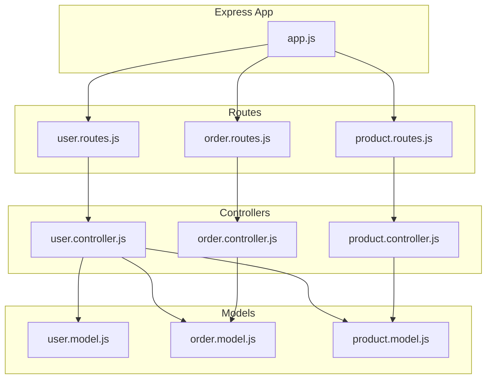
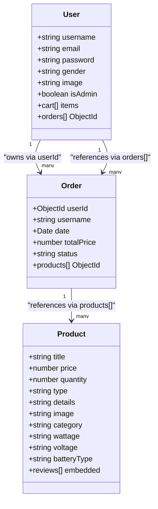
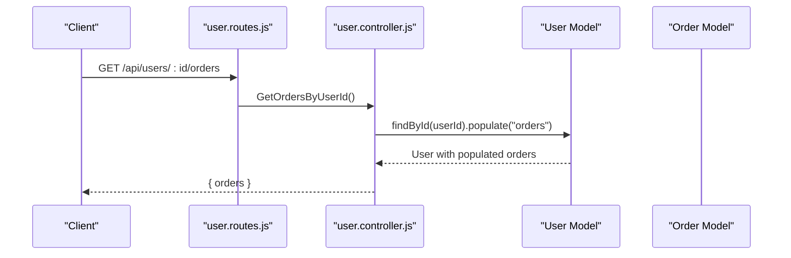
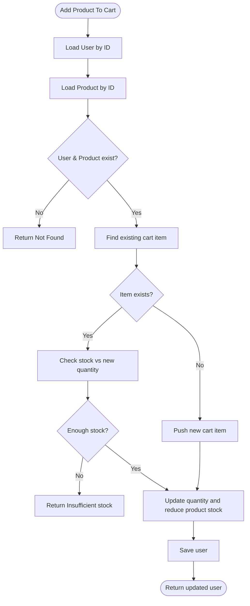
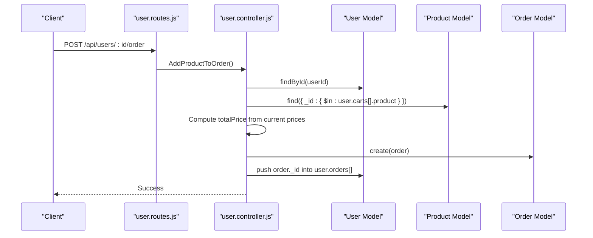
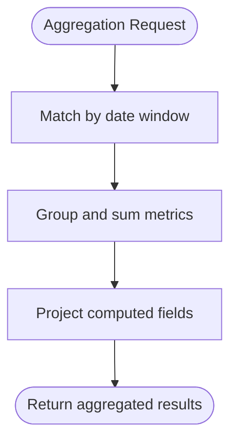
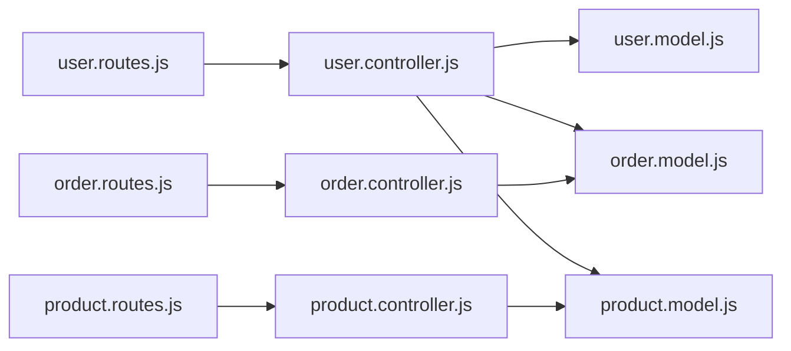

# Database Relationships and References

<cite>
**Referenced Files in This Document**
- [user.model.js](file://Back-end/src/Models/user.model.js)
- [order.model.js](file://Back-end/src/Models/order.model.js)
- [product.model.js](file://Back-end/src/Models/product.model.js)
- [user.controller.js](file://Back-end/src/Controllers/user.controller.js)
- [order.controller.js](file://Back-end/src/Controllers/order.controller.js)
- [product.controller.js](file://Back-end/src/Controllers/product.controller.js)
- [user.routes.js](file://Back-end/src/Routes/user.routes.js)
- [order.routes.js](file://Back-end/src/Routes/order.routes.js)
- [product.routes.js](file://Back-end/src/Routes/product.routes.js)
- [app.js](file://Back-end/src/app.js)
- [env.js](file://Back-end/src/config/env.js)
</cite>

## Table of Contents
1. [Introduction](#introduction)
2. [Project Structure](#project-structure)
3. [Core Components](#core-components)
4. [Architecture Overview](#architecture-overview)
5. [Detailed Component Analysis](#detailed-component-analysis)
6. [Dependency Analysis](#dependency-analysis)
7. [Performance Considerations](#performance-considerations)
8. [Troubleshooting Guide](#troubleshooting-guide)
9. [Conclusion](#conclusion)

## Introduction
This document explains the MongoDB relationships and reference patterns used in the Lightstorm application. It focuses on how users, orders, and products relate to each other, how Mongoose populate is used for relationship traversal, and how the application manages references. It also covers query optimization, indexing strategies, denormalization trade-offs, and operational concerns such as data integrity and cascading behavior.

## Project Structure
The Lightstorm backend follows a layered architecture:
- Models define schemas and references
- Controllers orchestrate business logic and handle requests
- Routes expose endpoints
- Express app wires middleware, database connection, and routes

**Diagram sources**
- [app.js](file://Back-end/src/app.js#L1-L96)
- [user.routes.js](file://Back-end/src/Routes/user.routes.js#L1-L24)
- [order.routes.js](file://Back-end/src/Routes/order.routes.js#L1-L19)
- [product.routes.js](file://Back-end/src/Routes/product.routes.js#L1-L20)
- [user.controller.js](file://Back-end/src/Controllers/user.controller.js#L1-L480)
- [order.controller.js](file://Back-end/src/Controllers/order.controller.js#L1-L258)
- [product.controller.js](file://Back-end/src/Controllers/product.controller.js#L1-L348)
- [user.model.js](file://Back-end/src/Models/user.model.js#L1-L29)
- [order.model.js](file://Back-end/src/Models/order.model.js#L1-L13)
- [product.model.js](file://Back-end/src/Models/product.model.js#L1-L29)

**Section sources**
- [app.js](file://Back-end/src/app.js#L1-L96)
- [user.routes.js](file://Back-end/src/Routes/user.routes.js#L1-L24)
- [order.routes.js](file://Back-end/src/Routes/order.routes.js#L1-L19)
- [product.routes.js](file://Back-end/src/Routes/product.routes.js#L1-L20)

## Core Components
- User model maintains:
  - Embedded shopping cart items (product ObjectId + quantity)
  - Array of order references (ObjectId)
- Order model maintains:
  - Reference to user (ObjectId)
  - Array of product references (ObjectId)
  - Status and pricing metadata
- Product model maintains:
  - Embedded reviews (user_id ObjectId + attributes)
  - Text index for search

These choices reflect a hybrid approach:
- Object references for decoupling related entities
- Embedded arrays for frequently accessed, tightly coupled data (cart, reviews)

**Section sources**
- [user.model.js](file://Back-end/src/Models/user.model.js#L1-L29)
- [order.model.js](file://Back-end/src/Models/order.model.js#L1-L13)
- [product.model.js](file://Back-end/src/Models/product.model.js#L1-L29)

## Architecture Overview
The application uses ObjectId references to connect users, orders, and products. Controllers leverage Mongoose population to expand references into full documents for selected endpoints. Aggregation pipelines are used for reporting.

**Diagram sources**
- [user.model.js](file://Back-end/src/Models/user.model.js#L1-L29)
- [order.model.js](file://Back-end/src/Models/order.model.js#L1-L13)
- [product.model.js](file://Back-end/src/Models/product.model.js#L1-L29)

## Detailed Component Analysis

### User-Orders Relationship
- User schema stores an array of order ObjectIds.
- Controllers populate orders when fetching user orders to render expanded data.
- When updating user data, username changes propagate to related orders to keep audit trails consistent.

**Diagram sources**
- [user.routes.js](file://Back-end/src/Routes/user.routes.js#L8-L10)
- [user.controller.js](file://Back-end/src/Controllers/user.controller.js#L405-L419)

**Section sources**
- [user.controller.js](file://Back-end/src/Controllers/user.controller.js#L405-L419)
- [user.routes.js](file://Back-end/src/Routes/user.routes.js#L8-L10)

### User-Cart Products Relationship
- User schema embeds a cart array containing product ObjectId and quantity.
- Controllers add items to cart by validating user and product existence, checking stock, and updating quantities.
- Cart items are not populated by default; clients fetch product details separately when needed.

**Diagram sources**
- [user.controller.js](file://Back-end/src/Controllers/user.controller.js#L177-L219)

**Section sources**
- [user.controller.js](file://Back-end/src/Controllers/user.controller.js#L177-L219)
- [user.model.js](file://Back-end/src/Models/user.model.js#L3-L6)

### Order-Product Relationship
- Order schema references products via an array of ObjectIds.
- Controllers compute totals from current product prices and persist them, ensuring historical pricing is preserved.

**Diagram sources**
- [user.routes.js](file://Back-end/src/Routes/user.routes.js#L10-L11)
- [user.controller.js](file://Back-end/src/Controllers/user.controller.js#L224-L269)

**Section sources**
- [user.controller.js](file://Back-end/src/Controllers/user.controller.js#L224-L269)
- [order.model.js](file://Back-end/src/Models/order.model.js#L1-L13)

### Product Reviews Embedding
- Product schema embeds reviews with user_id ObjectId and metadata.
- This enables efficient retrieval of product details with associated reviews without additional joins.

**Section sources**
- [product.model.js](file://Back-end/src/Models/product.model.js#L3-L9)

### Reporting with Aggregation Pipelines
- Order controller exposes endpoints that use aggregation to compute daily/weekly metrics and time-based summaries.

**Diagram sources**
- [order.controller.js](file://Back-end/src/Controllers/order.controller.js#L9-L31)
- [order.controller.js](file://Back-end/src/Controllers/order.controller.js#L101-L125)
- [order.controller.js](file://Back-end/src/Controllers/order.controller.js#L169-L194)

**Section sources**
- [order.controller.js](file://Back-end/src/Controllers/order.controller.js#L9-L31)
- [order.controller.js](file://Back-end/src/Controllers/order.controller.js#L101-L125)
- [order.controller.js](file://Back-end/src/Controllers/order.controller.js#L169-L194)

## Dependency Analysis
- Controllers depend on models for persistence and on each other for cross-entity operations (e.g., user controller interacts with product and order models).
- Routes depend on controllers for endpoint logic.
- Express app depends on routes and configures database connection and middleware.

**Diagram sources**
- [user.routes.js](file://Back-end/src/Routes/user.routes.js#L1-L24)
- [order.routes.js](file://Back-end/src/Routes/order.routes.js#L1-L19)
- [product.routes.js](file://Back-end/src/Routes/product.routes.js#L1-L20)
- [user.controller.js](file://Back-end/src/Controllers/user.controller.js#L1-L480)
- [order.controller.js](file://Back-end/src/Controllers/order.controller.js#L1-L258)
- [product.controller.js](file://Back-end/src/Controllers/product.controller.js#L1-L348)
- [user.model.js](file://Back-end/src/Models/user.model.js#L1-L29)
- [order.model.js](file://Back-end/src/Models/order.model.js#L1-L13)
- [product.model.js](file://Back-end/src/Models/product.model.js#L1-L29)

**Section sources**
- [app.js](file://Back-end/src/app.js#L1-L96)
- [env.js](file://Back-end/src/config/env.js#L1-L4)

## Performance Considerations
- Populate strategy
  - Populate only when necessary (e.g., user orders endpoint). Avoid populating large arrays by default to minimize round trips and memory usage.
  - For cart items, keep embedded items to avoid extra lookups during browsing; fetch product details on demand in the client.
- Indexing
  - Product text search index exists on title and details. Consider adding compound indexes for frequent query patterns (e.g., category + price).
  - Add indexes on foreign key fields:
    - orders.userId
    - orders.products
    - users.orders
    - products.reviews.user_id
- Aggregation
  - Use $match early in pipelines to reduce document size before expensive operations.
  - Limit projections to required fields to reduce payload sizes.
- Denormalization
  - Current design keeps product price in order at creation time, preserving historical pricing. This avoids joins for reporting but requires careful consistency when product prices change.
- Cascading and referential integrity
  - No automatic cascading deletes are configured. Deleting users or products may orphan orders or leave dangling references. Implement explicit cleanup or soft-delete patterns if needed.
  - Username updates propagate to related orders to maintain audit trail consistency.

[No sources needed since this section provides general guidance]

## Troubleshooting Guide
- Populate not returning data
  - Ensure the referenced field is an ObjectId and stored in the correct array (e.g., users.orders, orders.products).
  - Verify populate path matches schema definition.
- Inconsistent username in orders
  - When updating a user’s username, controllers update matching orders’ username fields to keep audit trails consistent.
- Stock discrepancies
  - Cart operations adjust product quantities. If stock appears inconsistent, verify that both user cart updates and product quantity updates are applied atomically.
- Aggregation returns empty
  - Confirm date boundaries and timezones match expectations. Adjust $match conditions accordingly.

**Section sources**
- [user.controller.js](file://Back-end/src/Controllers/user.controller.js#L81-L98)
- [order.controller.js](file://Back-end/src/Controllers/order.controller.js#L101-L125)

## Conclusion
Lightstorm employs a pragmatic hybrid of references and embeddings:
- Orders reference users and products via ObjectIds for loose coupling and normalized storage.
- Users embed cart items for fast access during browsing and checkout.
- Products embed reviews for cohesive product detail retrieval.
- Controllers selectively populate references and use aggregation for reporting.
- Indexing and careful denormalization decisions support performance while maintaining data integrity.