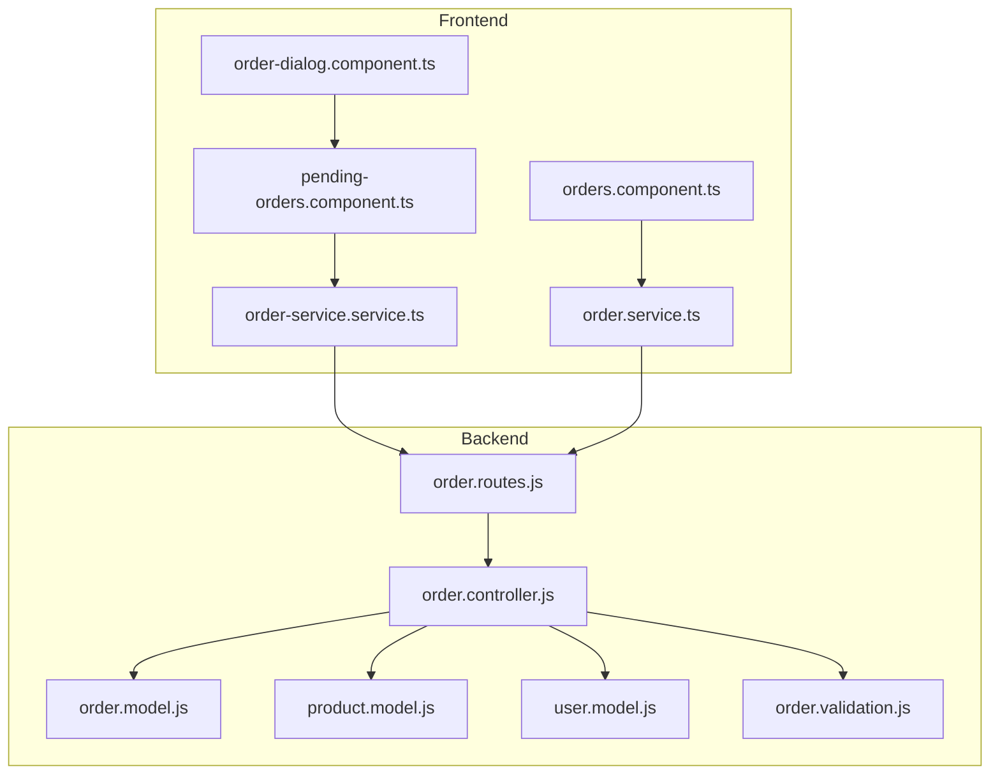
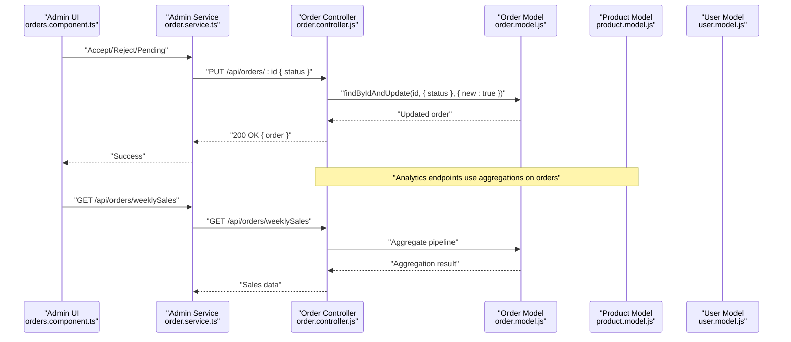
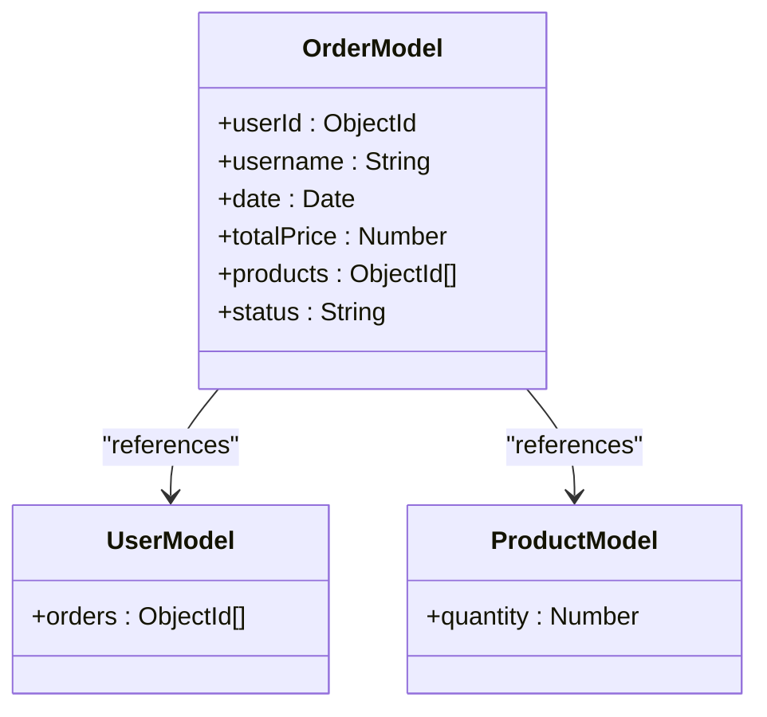

# Order Model

<cite>
**Referenced Files in This Document**
- [order.model.js](file://Back-end/src/Models/order.model.js)
- [order.controller.js](file://Back-end/src/Controllers/order.controller.js)
- [order.validation.js](file://Back-end/src/Middlewares/order.validation.js)
- [order.routes.js](file://Back-end/src/Routes/order.routes.js)
- [product.model.js](file://Back-end/src/Models/product.model.js)
- [user.model.js](file://Back-end/src/Models/user.model.js)
- [order-service.service.ts](file://Front-end/src/app/core/services/order-service.service.ts)
- [order.service.ts](file://Front-end/src/app/features/admin/admin/Services/order.service.ts)
- [orders.component.ts](file://Front-end/src/app/features/admin/components/orders/orders.component.ts)
- [pending-orders.component.ts](file://Front-end/src/app/features/auth/pages/profile/profile components/pending-orders/pending-orders.component.ts)
- [order-dialog.component.ts](file://Front-end/src/app/features/auth/pages/profile/profile components/order-dialog/order-dialog.component.ts)
</cite>

## Table of Contents
1. [Introduction](#introduction)
2. [Project Structure](#project-structure)
3. [Core Components](#core-components)
4. [Architecture Overview](#architecture-overview)
5. [Detailed Component Analysis](#detailed-component-analysis)
6. [Dependency Analysis](#dependency-analysis)
7. [Performance Considerations](#performance-considerations)
8. [Troubleshooting Guide](#troubleshooting-guide)
9. [Conclusion](#conclusion)
10. [Appendices](#appendices)

## Introduction
This document provides comprehensive data model documentation for the Order collection schema used in the Lightstorm e-commerce platform. It details all field definitions, relationships with customers and products, lifecycle states, business rules, and operational workflows. It also covers validation, aggregation analytics, and integration points between backend MongoDB models, Express controllers, and Angular frontend services.

## Project Structure
The order model is part of a layered architecture:
- Backend: Mongoose models define schemas, Express routes expose endpoints, controllers implement business logic, and AJV validates payloads.
- Frontend: Angular services consume REST endpoints to manage orders, display order lists, and update statuses.

**Diagram sources**
- [order.routes.js](file://Back-end/src/Routes/order.routes.js#L1-L19)
- [order.controller.js](file://Back-end/src/Controllers/order.controller.js#L1-L258)
- [order.model.js](file://Back-end/src/Models/order.model.js#L1-L13)
- [product.model.js](file://Back-end/src/Models/product.model.js#L1-L29)
- [user.model.js](file://Back-end/src/Models/user.model.js#L1-L29)
- [order.validation.js](file://Back-end/src/Middlewares/order.validation.js#L1-L39)
- [order-service.service.ts](file://Front-end/src/app/core/services/order-service.service.ts#L1-L62)
- [order.service.ts](file://Front-end/src/app/features/admin/admin/Services/order.service.ts#L1-L56)
- [orders.component.ts](file://Front-end/src/app/features/admin/components/orders/orders.component.ts#L1-L89)
- [pending-orders.component.ts](file://Front-end/src/app/features/auth/pages/profile/profile components/pending-orders/pending-orders.component.ts#L1-L122)
- [order-dialog.component.ts](file://Front-end/src/app/features/auth/pages/profile/profile components/order-dialog/order-dialog.component.ts#L1-L43)

**Section sources**
- [order.routes.js](file://Back-end/src/Routes/order.routes.js#L1-L19)
- [order.controller.js](file://Back-end/src/Controllers/order.controller.js#L1-L258)
- [order.model.js](file://Back-end/src/Models/order.model.js#L1-L13)
- [order.validation.js](file://Back-end/src/Middlewares/order.validation.js#L1-L39)
- [order-service.service.ts](file://Front-end/src/app/core/services/order-service.service.ts#L1-L62)
- [order.service.ts](file://Front-end/src/app/features/admin/admin/Services/order.service.ts#L1-L56)
- [orders.component.ts](file://Front-end/src/app/features/admin/components/orders/orders.component.ts#L1-L89)
- [pending-orders.component.ts](file://Front-end/src/app/features/auth/pages/profile/profile components/pending-orders/pending-orders.component.ts#L1-L122)
- [order-dialog.component.ts](file://Front-end/src/app/features/auth/pages/profile/profile components/order-dialog/order-dialog.component.ts#L1-L43)

## Core Components
- Order Schema: Defines the shape of order documents stored in MongoDB, including customer references, ordered products, totals, status, and timestamps.
- Validation: AJV schema enforces strict payload structure for order creation/update.
- Controller: Implements CRUD operations, analytics aggregations, and status updates.
- Routes: Exposes REST endpoints for order management and analytics.
- Frontend Services: Consume endpoints to list, filter, update, and delete orders.

Key implementation references:
- Order schema definition and references: [order.model.js](file://Back-end/src/Models/order.model.js#L3-L10)
- Validation schema and formats: [order.validation.js](file://Back-end/src/Middlewares/order.validation.js#L4-L34)
- Controller endpoints and aggregations: [order.controller.js](file://Back-end/src/Controllers/order.controller.js#L7-L243)
- Route bindings: [order.routes.js](file://Back-end/src/Routes/order.routes.js#L5-L15)

**Section sources**
- [order.model.js](file://Back-end/src/Models/order.model.js#L1-L13)
- [order.validation.js](file://Back-end/src/Middlewares/order.validation.js#L1-L39)
- [order.controller.js](file://Back-end/src/Controllers/order.controller.js#L1-L258)
- [order.routes.js](file://Back-end/src/Routes/order.routes.js#L1-L19)

## Architecture Overview
The order lifecycle spans frontend interactions, backend validation, persistence, and analytics. The frontend triggers actions (accept/reject/pending), which update the order status in the database. Analytics endpoints compute weekly/daily orders and sales.

**Diagram sources**
- [orders.component.ts](file://Front-end/src/app/features/admin/components/orders/orders.component.ts#L44-L87)
- [order.service.ts](file://Front-end/src/app/features/admin/admin/Services/order.service.ts#L32-L34)
- [order.controller.js](file://Back-end/src/Controllers/order.controller.js#L59-L74)
- [order.model.js](file://Back-end/src/Models/order.model.js#L1-L13)
- [product.model.js](file://Back-end/src/Models/product.model.js#L1-L29)
- [user.model.js](file://Back-end/src/Models/user.model.js#L1-L29)

## Detailed Component Analysis

### Order Schema Definition
The Order collection schema defines:
- Customer references
  - userId: ObjectId referencing users
  - username: String
- Products ordered
  - products: Array of ObjectIds referencing products
- Financials
  - totalPrice: Number
- Lifecycle
  - status: String with enum values
- Timestamps
  - date: Date

Field-level documentation:
- userId
  - Type: ObjectId
  - References: users
  - Purpose: Links order to a user
  - Constraints: Must reference existing user
- username
  - Type: String
  - Purpose: Stores user display name at order time
  - Constraints: Required by validation schema
- date
  - Type: Date
  - Purpose: Order creation timestamp
  - Constraints: Must be a valid date-time
- totalPrice
  - Type: Number
  - Purpose: Total monetary value of the order
  - Constraints: Required by validation schema
- products
  - Type: Array of ObjectIds
  - References: products
  - Purpose: Ordered product identifiers
  - Constraints: Required by validation schema; each element must be a valid ObjectId
- status
  - Type: String
  - Enum: Pending, Accepted, Rejected
  - Purpose: Tracks order lifecycle state
  - Constraints: Required by validation schema

Validation rules and formats:
- userId, products.productId: ObjectId format
- date: date-time format
- status: enum ["Pending", "Accepted", "Rejected"]
- Additional properties disallowed

References:
- Schema definition: [order.model.js](file://Back-end/src/Models/order.model.js#L3-L10)
- Validation schema and formats: [order.validation.js](file://Back-end/src/Middlewares/order.validation.js#L4-L34)

**Section sources**
- [order.model.js](file://Back-end/src/Models/order.model.js#L3-L10)
- [order.validation.js](file://Back-end/src/Middlewares/order.validation.js#L4-L34)

### Order Lifecycle States and Transitions
Supported states:
- Pending
- Accepted
- Rejected

Transitions:
- From Pending to Accepted or Rejected
- From Accepted to Rejected (optional)
- From Rejected to Pending (optional)

Frontend-driven transitions:
- Admin UI buttons trigger PUT requests to update status
- Accept button sets status to Accepted
- Reject button sets status to Rejected
- Pending button sets status to Pending

References:
- Status enum: [order.validation.js](file://Back-end/src/Middlewares/order.validation.js#L24-L24)
- Admin UI status updates: [orders.component.ts](file://Front-end/src/app/features/admin/components/orders/orders.component.ts#L44-L87)
- Admin service PUT endpoint: [order.service.ts](file://Front-end/src/app/features/admin/admin/Services/order.service.ts#L32-L34)

**Section sources**
- [order.validation.js](file://Back-end/src/Middlewares/order.validation.js#L24-L24)
- [orders.component.ts](file://Front-end/src/app/features/admin/components/orders/orders.component.ts#L44-L87)
- [order.service.ts](file://Front-end/src/app/features/admin/admin/Services/order.service.ts#L32-L34)

### Business Rules for Order Processing
- Validation enforced at creation/update via AJV schema
- Status must be one of the allowed enum values
- Products array must contain valid product ObjectIds
- totalPrice must be a number
- date must be a valid date-time
- Additional properties are not permitted

References:
- Validation schema: [order.validation.js](file://Back-end/src/Middlewares/order.validation.js#L4-L28)

**Section sources**
- [order.validation.js](file://Back-end/src/Middlewares/order.validation.js#L4-L28)

### Product Quantity Tracking and Price Calculations
Current implementation highlights:
- Order schema stores products as ObjectIds and totalPrice as a number
- No embedded product quantities or calculated prices in the order schema
- Product inventory is modeled in the product schema with a quantity field

Implications:
- Inventory deduction and price calculation are not implemented in the order model
- Frontend order dialogs fetch product details separately to display product information

References:
- Order products as ObjectIds: [order.model.js](file://Back-end/src/Models/order.model.js#L8-L8)
- Product quantity field: [product.model.js](file://Back-end/src/Models/product.model.js#L14-L14)
- Order dialog fetching product details: [order-dialog.component.ts](file://Front-end/src/app/features/auth/pages/profile/profile components/order-dialog/order-dialog.component.ts#L32-L41)

**Section sources**
- [order.model.js](file://Back-end/src/Models/order.model.js#L8-L8)
- [product.model.js](file://Back-end/src/Models/product.model.js#L14-L14)
- [order-dialog.component.ts](file://Front-end/src/app/features/auth/pages/profile/profile components/order-dialog/order-dialog.component.ts#L32-L41)

### Inventory Deduction Logic
- Not implemented in the order model
- Product quantity is present in the product schema
- No controller logic currently deducts inventory upon order placement

Recommendations:
- Implement inventory checks and deductions during order creation
- Consider atomic operations to prevent overselling

References:
- Product quantity field: [product.model.js](file://Back-end/src/Models/product.model.js#L14-L14)
- Order creation placeholder: [order.controller.js](file://Back-end/src/Controllers/order.controller.js#L52-L54)

**Section sources**
- [product.model.js](file://Back-end/src/Models/product.model.js#L14-L14)
- [order.controller.js](file://Back-end/src/Controllers/order.controller.js#L52-L54)

### Order Fulfillment Workflows
- Admin UI allows changing order status to Accepted or Rejected
- Users can view their orders filtered by status
- Order deletion is supported via backend controller and frontend service

References:
- Admin status updates: [orders.component.ts](file://Front-end/src/app/features/admin/components/orders/orders.component.ts#L44-L87)
- User pending orders filtering: [order-service.service.ts](file://Front-end/src/app/core/services/order-service.service.ts#L14-L31)
- Order deletion: [order.controller.js](file://Back-end/src/Controllers/order.controller.js#L79-L97), [order.service.ts](file://Front-end/src/app/features/admin/admin/Services/order.service.ts#L28-L30)

**Section sources**
- [orders.component.ts](file://Front-end/src/app/features/admin/components/orders/orders.component.ts#L44-L87)
- [order-service.service.ts](file://Front-end/src/app/core/services/order-service.service.ts#L14-L31)
- [order.controller.js](file://Back-end/src/Controllers/order.controller.js#L79-L97)
- [order.service.ts](file://Front-end/src/app/features/admin/admin/Services/order.service.ts#L28-L30)

### Refund Processing
- Not implemented in the current codebase
- No refund-related fields or endpoints exist in the order model or controller

Recommendations:
- Add refund status and amount fields
- Implement refund initiation and reversal workflows

References:
- Current order fields: [order.model.js](file://Back-end/src/Models/order.model.js#L3-L10)

**Section sources**
- [order.model.js](file://Back-end/src/Models/order.model.js#L3-L10)

### Audit Trail Requirements
- No explicit audit trail fields exist in the order schema
- Consider adding fields like lastModifiedBy, modifiedAt, and change history arrays

Recommendations:
- Add audit metadata to track who modified the order and when
- Store previous status values for historical tracking

References:
- Current order fields: [order.model.js](file://Back-end/src/Models/order.model.js#L3-L10)

**Section sources**
- [order.model.js](file://Back-end/src/Models/order.model.js#L3-L10)

### Order Document Structures
Example order document (field names and types):
- userId: ObjectId
- username: String
- date: Date
- totalPrice: Number
- products: Array of ObjectIds
- status: String

References:
- Schema definition: [order.model.js](file://Back-end/src/Models/order.model.js#L3-L10)

**Section sources**
- [order.model.js](file://Back-end/src/Models/order.model.js#L3-L10)

### Common Order Queries
- Get all orders with computed days difference: [order.controller.js](file://Back-end/src/Controllers/order.controller.js#L9-L28)
- Get orders by status: [order.controller.js](file://Back-end/src/Controllers/order.controller.js#L36-L38)
- Get order by ID: [order.controller.js](file://Back-end/src/Controllers/order.controller.js#L43-L47)
- Weekly orders count: [order.controller.js](file://Back-end/src/Controllers/order.controller.js#L101-L125)
- Daily orders count: [order.controller.js](file://Back-end/src/Controllers/order.controller.js#L129-L165)
- Weekly sales: [order.controller.js](file://Back-end/src/Controllers/order.controller.js#L170-L194)
- Daily sales: [order.controller.js](file://Back-end/src/Controllers/order.controller.js#L198-L222)
- Sales per week: [order.controller.js](file://Back-end/src/Controllers/order.controller.js#L226-L243)

**Section sources**
- [order.controller.js](file://Back-end/src/Controllers/order.controller.js#L9-L28)
- [order.controller.js](file://Back-end/src/Controllers/order.controller.js#L36-L38)
- [order.controller.js](file://Back-end/src/Controllers/order.controller.js#L43-L47)
- [order.controller.js](file://Back-end/src/Controllers/order.controller.js#L101-L125)
- [order.controller.js](file://Back-end/src/Controllers/order.controller.js#L129-L165)
- [order.controller.js](file://Back-end/src/Controllers/order.controller.js#L170-L194)
- [order.controller.js](file://Back-end/src/Controllers/order.controller.js#L198-L222)
- [order.controller.js](file://Back-end/src/Controllers/order.controller.js#L226-L243)

### Status Management Operations
- Update order status via PUT: [order.controller.js](file://Back-end/src/Controllers/order.controller.js#L59-L74)
- Admin UI triggers: [orders.component.ts](file://Front-end/src/app/features/admin/components/orders/orders.component.ts#L44-L87)
- Admin service PUT: [order.service.ts](file://Front-end/src/app/features/admin/admin/Services/order.service.ts#L32-L34)

**Section sources**
- [order.controller.js](file://Back-end/src/Controllers/order.controller.js#L59-L74)
- [orders.component.ts](file://Front-end/src/app/features/admin/components/orders/orders.component.ts#L44-L87)
- [order.service.ts](file://Front-end/src/app/features/admin/admin/Services/order.service.ts#L32-L34)

## Dependency Analysis
Order model dependencies:
- References users via userId
- References products via products array
- Used by controller for CRUD and analytics
- Validated by AJV schema middleware

**Diagram sources**
- [order.model.js](file://Back-end/src/Models/order.model.js#L3-L10)
- [user.model.js](file://Back-end/src/Models/user.model.js#L24-L24)
- [product.model.js](file://Back-end/src/Models/product.model.js#L14-L14)

**Section sources**
- [order.model.js](file://Back-end/src/Models/order.model.js#L3-L10)
- [user.model.js](file://Back-end/src/Models/user.model.js#L24-L24)
- [product.model.js](file://Back-end/src/Models/product.model.js#L14-L14)

## Performance Considerations
- Aggregation pipelines for analytics (weekly/daily orders and sales) are efficient for reporting
- Consider indexing on date for faster time-based queries
- Avoid loading unnecessary fields; use projections in queries where possible
- Batch operations for bulk status updates could reduce network overhead

[No sources needed since this section provides general guidance]

## Troubleshooting Guide
- Validation errors: Ensure payloads conform to AJV schema (ObjectId formats, enum values, required fields)
- Order not found: Verify ObjectId format and existence
- Status update failures: Confirm status enum values and presence of order ID

References:
- Validation schema: [order.validation.js](file://Back-end/src/Middlewares/order.validation.js#L4-L34)
- Update order handler: [order.controller.js](file://Back-end/src/Controllers/order.controller.js#L59-L74)
- Delete order handler: [order.controller.js](file://Back-end/src/Controllers/order.controller.js#L79-L97)

**Section sources**
- [order.validation.js](file://Back-end/src/Middlewares/order.validation.js#L4-L34)
- [order.controller.js](file://Back-end/src/Controllers/order.controller.js#L59-L74)
- [order.controller.js](file://Back-end/src/Controllers/order.controller.js#L79-L97)

## Conclusion
The Order model provides a minimal yet extensible foundation for order management. It supports customer and product references, lifecycle states, and analytics. To meet full business requirements, implement inventory deduction, refund processing, and audit trails. The frontend integrates seamlessly with backend endpoints for status management and reporting.

[No sources needed since this section summarizes without analyzing specific files]

## Appendices

### API Endpoints Summary
- GET /api/orders/weeklySales
- GET /api/orders/salesPerWeek
- GET /api/orders/dailySales
- GET /api/orders/weekly
- GET /api/orders/daily
- GET /api/orders/
- GET /api/orders/:id
- GET /api/orders/:status
- POST /api/orders/
- PUT /api/orders/:id
- DELETE /api/orders/:id

References:
- Route bindings: [order.routes.js](file://Back-end/src/Routes/order.routes.js#L5-L15)

**Section sources**
- [order.routes.js](file://Back-end/src/Routes/order.routes.js#L5-L15)