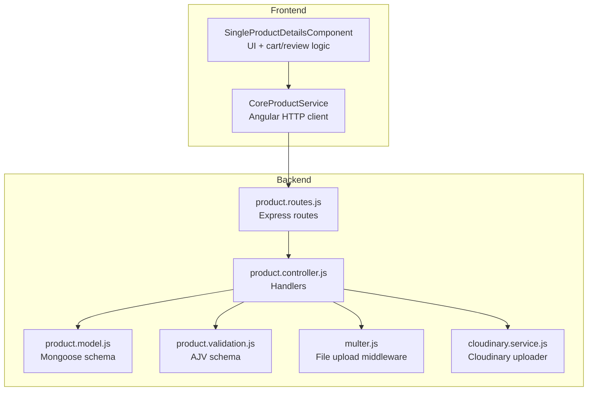
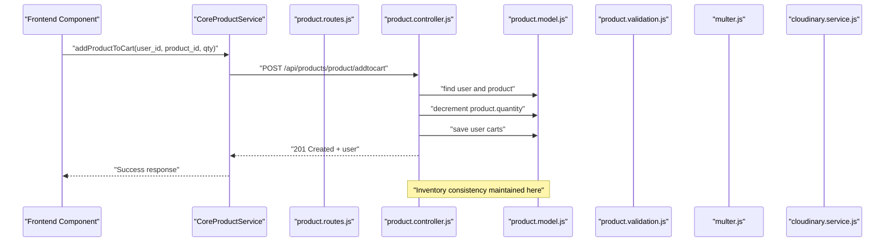
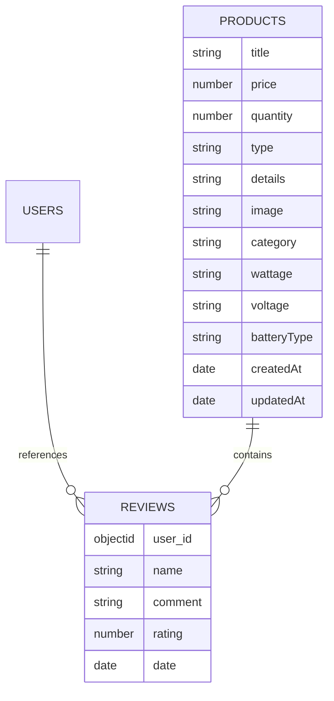
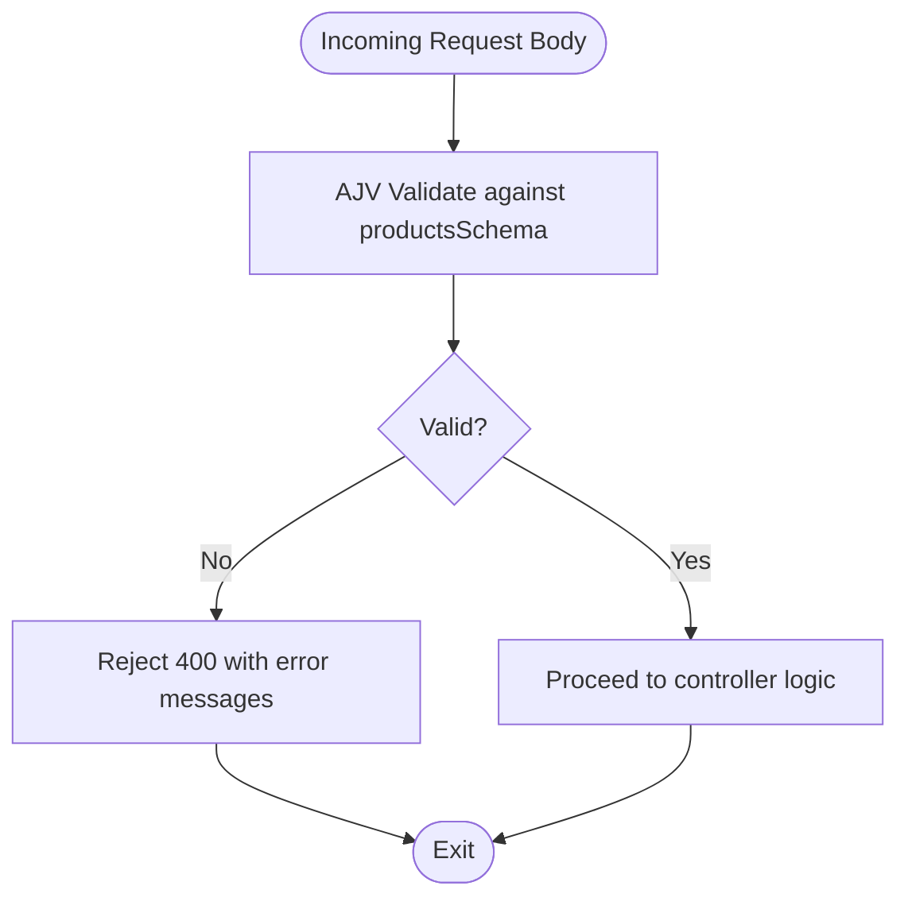
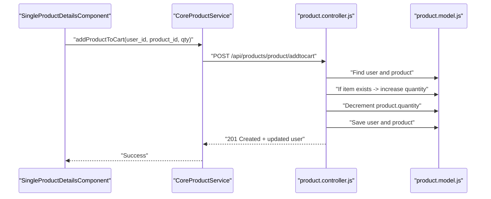
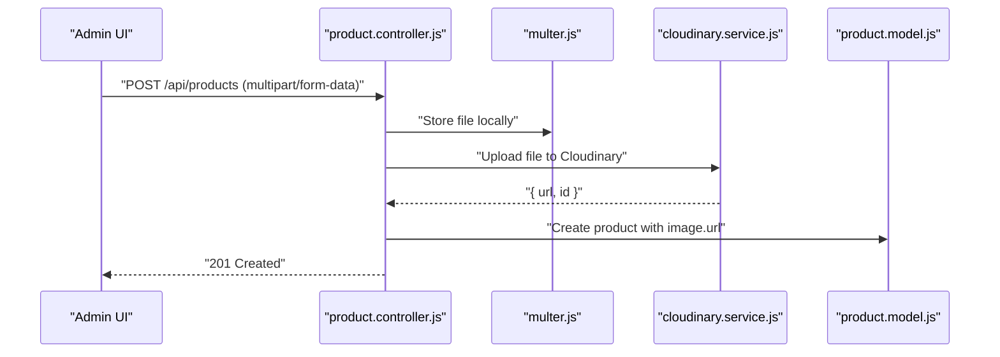
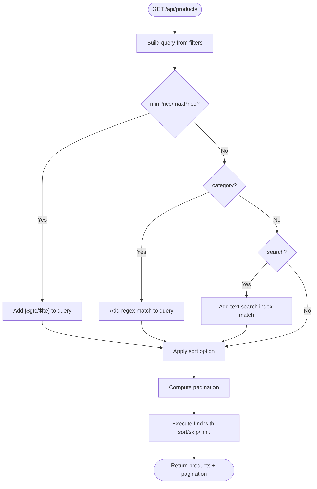
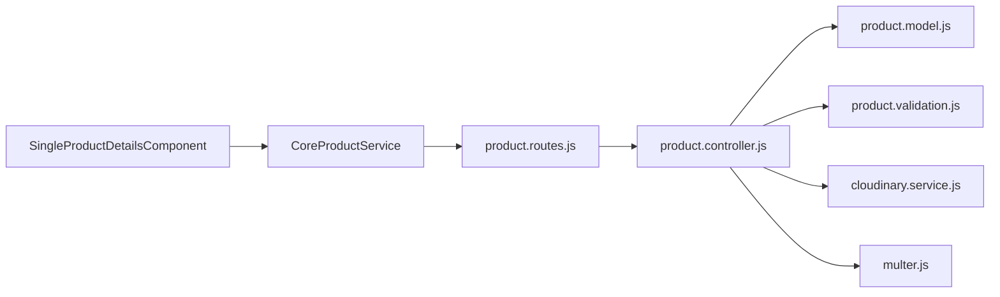

# Product Model

<cite>
**Referenced Files in This Document**
- [product.model.js](file://Back-end/src/Models/product.model.js)
- [product.validation.js](file://Back-end/src/Middlewares/product.validation.js)
- [product.controller.js](file://Back-end/src/Controllers/product.controller.js)
- [product.routes.js](file://Back-end/src/Routes/product.routes.js)
- [cloudinary.service.js](file://Back-end/src/services/cloudinary.service.js)
- [multer.js](file://Back-end/src/Middlewares/multer.js)
- [core-product.service.ts](file://Front-end/src/app/core/services/core-product.service.ts)
- [single-product-details.component.ts](file://Front-end/src/app/features/shop/pages/single-product-details/single-product-details.component.ts)
</cite>

## Table of Contents
1. [Introduction](#introduction)
2. [Project Structure](#project-structure)
3. [Core Components](#core-components)
4. [Architecture Overview](#architecture-overview)
5. [Detailed Component Analysis](#detailed-component-analysis)
6. [Dependency Analysis](#dependency-analysis)
7. [Performance Considerations](#performance-considerations)
8. [Troubleshooting Guide](#troubleshooting-guide)
9. [Conclusion](#conclusion)
10. [Appendices](#appendices)

## Introduction
This document provides comprehensive data model documentation for the Product collection schema used in the Lightstorm e-commerce platform. It covers field definitions, validation rules, pricing and inventory management, categorization, image handling via Cloudinary, review aggregation, and practical examples for querying and filtering. It also outlines product management workflows and data consistency requirements.

## Project Structure
The Product model is implemented in the backend using Mongoose and validated with AJV. It integrates with Multer for image uploads and Cloudinary for image hosting. The frontend interacts with the backend through Angular services and components.

**Diagram sources**
- [product.routes.js](file://Back-end/src/Routes/product.routes.js#L1-L20)
- [product.controller.js](file://Back-end/src/Controllers/product.controller.js#L1-L348)
- [product.model.js](file://Back-end/src/Models/product.model.js#L1-L29)
- [product.validation.js](file://Back-end/src/Middlewares/product.validation.js#L1-L39)
- [multer.js](file://Back-end/src/Middlewares/multer.js#L1-L33)
- [cloudinary.service.js](file://Back-end/src/services/cloudinary.service.js#L1-L22)
- [core-product.service.ts](file://Front-end/src/app/core/services/core-product.service.ts#L1-L75)
- [single-product-details.component.ts](file://Front-end/src/app/features/shop/pages/single-product-details/single-product-details.component.ts#L1-L414)

**Section sources**
- [product.routes.js](file://Back-end/src/Routes/product.routes.js#L1-L20)
- [product.controller.js](file://Back-end/src/Controllers/product.controller.js#L1-L348)
- [product.model.js](file://Back-end/src/Models/product.model.js#L1-L29)
- [product.validation.js](file://Back-end/src/Middlewares/product.validation.js#L1-L39)
- [multer.js](file://Back-end/src/Middlewares/multer.js#L1-L33)
- [cloudinary.service.js](file://Back-end/src/services/cloudinary.service.js#L1-L22)
- [core-product.service.ts](file://Front-end/src/app/core/services/core-product.service.ts#L1-L75)
- [single-product-details.component.ts](file://Front-end/src/app/features/shop/pages/single-product-details/single-product-details.component.ts#L1-L414)

## Core Components
- Product Mongoose Schema: Defines the Product collection structure, including required fields, defaults, enums, and embedded reviews.
- Validation Middleware (AJV): Enforces strict schema validation for incoming product requests.
- Controller: Implements CRUD operations, search/filter/sort/pagination, image upload via Cloudinary, and cart/inventory updates.
- Routes: Exposes REST endpoints for product management and user interactions.
- Image Upload: Multer stores temporary images; Cloudinary uploads and returns secure URLs.
- Frontend Services: Provide typed APIs for product queries, cart operations, and review submissions.

**Section sources**
- [product.model.js](file://Back-end/src/Models/product.model.js#L1-L29)
- [product.validation.js](file://Back-end/src/Middlewares/product.validation.js#L1-L39)
- [product.controller.js](file://Back-end/src/Controllers/product.controller.js#L1-L348)
- [product.routes.js](file://Back-end/src/Routes/product.routes.js#L1-L20)
- [multer.js](file://Back-end/src/Middlewares/multer.js#L1-L33)
- [cloudinary.service.js](file://Back-end/src/services/cloudinary.service.js#L1-L22)
- [core-product.service.ts](file://Front-end/src/app/core/services/core-product.service.ts#L1-L75)

## Architecture Overview
The Product model lifecycle spans frontend requests to backend handlers, validation, persistence, and external integrations.

**Diagram sources**
- [core-product.service.ts](file://Front-end/src/app/core/services/core-product.service.ts#L61-L63)
- [product.routes.js](file://Back-end/src/Routes/product.routes.js#L16)
- [product.controller.js](file://Back-end/src/Controllers/product.controller.js#L302-L334)
- [product.model.js](file://Back-end/src/Models/product.model.js#L1-L29)

## Detailed Component Analysis

### Product Mongoose Schema
The Product schema defines the canonical structure persisted in MongoDB.

- Fields and Types
  - title: String, required
  - price: Number, required
  - quantity: Integer, min 0, default 0
  - type: Enum ["product","service"], default "product"
  - details: String
  - image: String (URL)
  - category: String
  - wattage: String
  - voltage: String
  - batteryType: String
  - reviews: Array of embedded review documents
- Embedded Reviews Subschema
  - user_id: ObjectId referencing users
  - name: String
  - comment: String
  - rating: Number
  - date: Date
- Indexes
  - Text index on title and details for efficient text search

**Diagram sources**
- [product.model.js](file://Back-end/src/Models/product.model.js#L3-L9)
- [product.model.js](file://Back-end/src/Models/product.model.js#L11-L23)

**Section sources**
- [product.model.js](file://Back-end/src/Models/product.model.js#L1-L29)

### Validation Rules (AJV)
The AJV schema enforces strict validation for product creation/update requests.

- Required Fields
  - title, price, quantity, category
- Type Constraints
  - title: string, max length 100
  - price: number, min 0
  - quantity: integer, min 0
  - type: enum ["product","service"]
  - details, image, category: string
  - wattage, voltage, batteryType: string
- Reviews Validation
  - Each review requires name, comment, rating
  - rating is integer between 1 and 5
  - Additional properties not allowed

**Diagram sources**
- [product.validation.js](file://Back-end/src/Middlewares/product.validation.js#L4-L35)

**Section sources**
- [product.validation.js](file://Back-end/src/Middlewares/product.validation.js#L1-L39)

### Pricing Calculations and Inventory Management
- Pricing
  - price is a Number with minimum 0 enforced by both schema and AJV.
  - Frontend and controller convert string inputs to numbers for validation and storage.
- Inventory
  - quantity is an integer with minimum 0 and default 0.
  - Cart operations reduce product quantity atomically during addToCart.
  - Frontend checks availability before allowing add-to-cart.

**Diagram sources**
- [single-product-details.component.ts](file://Front-end/src/app/features/shop/pages/single-product-details/single-product-details.component.ts#L344-L389)
- [core-product.service.ts](file://Front-end/src/app/core/services/core-product.service.ts#L61-L63)
- [product.controller.js](file://Back-end/src/Controllers/product.controller.js#L302-L334)
- [product.model.js](file://Back-end/src/Models/product.model.js#L1-L29)

**Section sources**
- [product.controller.js](file://Back-end/src/Controllers/product.controller.js#L118-L127)
- [product.controller.js](file://Back-end/src/Controllers/product.controller.js#L194-L209)
- [product.controller.js](file://Back-end/src/Controllers/product.controller.js#L302-L334)
- [single-product-details.component.ts](file://Front-end/src/app/features/shop/pages/single-product-details/single-product-details.component.ts#L344-L389)

### Product Categorization
- category is a String used for filtering and related product discovery.
- Filtering by category is supported via regex match with case-insensitive flag.
- Related products are discovered by matching category and excluding the current product.

**Section sources**
- [product.controller.js](file://Back-end/src/Controllers/product.controller.js#L26-L28)
- [single-product-details.component.ts](file://Front-end/src/app/features/shop/pages/single-product-details/single-product-details.component.ts#L113-L118)

### Image Handling via Cloudinary Integration
- Upload Pipeline
  - Multer saves uploaded images to a local disk folder.
  - Controller invokes Cloudinary uploader with the saved file path.
  - Cloudinary returns a secure URL and public ID; the URL is stored in product.image.
- Security
  - Cloudinary configured with secure flag enabled.

**Diagram sources**
- [product.routes.js](file://Back-end/src/Routes/product.routes.js#L9)
- [multer.js](file://Back-end/src/Middlewares/multer.js#L1-L33)
- [cloudinary.service.js](file://Back-end/src/services/cloudinary.service.js#L1-L22)
- [product.controller.js](file://Back-end/src/Controllers/product.controller.js#L154-L167)
- [product.model.js](file://Back-end/src/Models/product.model.js#L17)

**Section sources**
- [multer.js](file://Back-end/src/Middlewares/multer.js#L1-L33)
- [cloudinary.service.js](file://Back-end/src/services/cloudinary.service.js#L1-L22)
- [product.controller.js](file://Back-end/src/Controllers/product.controller.js#L154-L167)

### Rating Aggregation Mechanisms
- Ratings are stored as embedded reviews with individual rating values.
- The schema does not compute an aggregated average; clients or controllers can compute averages from the reviews array.
- Reviews are deduplicated by user_id when adding a new review for the same user.

**Section sources**
- [product.model.js](file://Back-end/src/Models/product.model.js#L3-L9)
- [product.controller.js](file://Back-end/src/Controllers/product.controller.js#L245-L252)

### Field-Level Documentation
- title
  - Type: String
  - Required: Yes
  - Validation: Max length 100
  - Business Logic: Used for display and search indexing
- price
  - Type: Number
  - Required: Yes
  - Validation: Minimum 0
  - Business Logic: Monetary value; converted to Number in controller
- quantity
  - Type: Integer
  - Required: No (defaults to 0)
  - Validation: Minimum 0
  - Business Logic: Available stock; decremented on cart add
- type
  - Type: Enum
  - Values: ["product","service"]
  - Default: "product"
  - Business Logic: Distinguishes physical vs service offerings
- details
  - Type: String
  - Required: No
  - Business Logic: Extended product description
- image
  - Type: String (URL)
  - Required: No
  - Business Logic: Secure Cloudinary URL
- category
  - Type: String
  - Required: Yes (per AJV)
  - Business Logic: Facets for filtering and related products
- wattage, voltage, batteryType
  - Type: String
  - Required: No
  - Business Logic: Specification metadata
- reviews
  - Type: Array of embedded documents
  - Required: No
  - Validation: Each review requires name, comment, rating; rating 1–5

**Section sources**
- [product.validation.js](file://Back-end/src/Middlewares/product.validation.js#L7-L16)
- [product.validation.js](file://Back-end/src/Middlewares/product.validation.js#L17-L31)
- [product.model.js](file://Back-end/src/Models/product.model.js#L11-L23)

### Examples of Product Document Structures
- Minimal Product
  - title, price, quantity, category
- Full Product
  - Includes type, details, image, category, wattage, voltage, batteryType, reviews, timestamps

**Section sources**
- [product.model.js](file://Back-end/src/Models/product.model.js#L11-L23)

### Search Queries and Filtering Operations
- Filtering
  - By price range: minPrice, maxPrice query parameters
  - By category: category query parameter with regex match
  - By text search: search query parameter leveraging text index on title and details
- Sorting
  - Sort by any field; default sorts by createdAt descending
- Pagination
  - page and limit query parameters; computed totalItems and totalPages

**Diagram sources**
- [product.controller.js](file://Back-end/src/Controllers/product.controller.js#L10-L68)

**Section sources**
- [product.controller.js](file://Back-end/src/Controllers/product.controller.js#L14-L40)
- [product.controller.js](file://Back-end/src/Controllers/product.controller.js#L48-L54)

### Product Management Workflows and Data Consistency
- Create Product
  - Validate request body against AJV
  - Store image via Multer
  - Upload to Cloudinary and persist image URL
  - Save product document
- Update Product
  - Optional image replacement via Cloudinary upload
  - Normalize frontend field names to backend schema
  - Persist changes
- Delete Product
  - Remove product by ID
- Add Review
  - Upsert review by user_id
  - Maintain uniqueness per user
- Add to Cart
  - Verify sufficient stock
  - Decrement product quantity
  - Update user cart

**Section sources**
- [product.controller.js](file://Back-end/src/Controllers/product.controller.js#L107-L175)
- [product.controller.js](file://Back-end/src/Controllers/product.controller.js#L177-L218)
- [product.controller.js](file://Back-end/src/Controllers/product.controller.js#L223-L233)
- [product.controller.js](file://Back-end/src/Controllers/product.controller.js#L235-L268)
- [product.controller.js](file://Back-end/src/Controllers/product.controller.js#L302-L334)

## Dependency Analysis
- Internal Dependencies
  - product.controller.js depends on product.model.js, product.validation.js, cloudinary.service.js, and user.model.js for cart operations.
  - product.routes.js wires Express routes to product.controller.js handlers.
- External Dependencies
  - Mongoose for schema definition and text indexing.
  - AJV for runtime validation.
  - Multer for local file storage.
  - Cloudinary SDK for image upload.
- Frontend Dependencies
  - CoreProductService encapsulates HTTP calls to backend endpoints.
  - SingleProductDetailsComponent orchestrates cart and review interactions.

**Diagram sources**
- [product.controller.js](file://Back-end/src/Controllers/product.controller.js#L1-L6)
- [product.model.js](file://Back-end/src/Models/product.model.js#L1-L29)
- [product.validation.js](file://Back-end/src/Middlewares/product.validation.js#L1-L39)
- [cloudinary.service.js](file://Back-end/src/services/cloudinary.service.js#L1-L22)
- [multer.js](file://Back-end/src/Middlewares/multer.js#L1-L33)
- [product.routes.js](file://Back-end/src/Routes/product.routes.js#L1-L20)
- [core-product.service.ts](file://Front-end/src/app/core/services/core-product.service.ts#L1-L75)
- [single-product-details.component.ts](file://Front-end/src/app/features/shop/pages/single-product-details/single-product-details.component.ts#L1-L414)

**Section sources**
- [product.controller.js](file://Back-end/src/Controllers/product.controller.js#L1-L6)
- [product.routes.js](file://Back-end/src/Routes/product.routes.js#L1-L20)
- [core-product.service.ts](file://Front-end/src/app/core/services/core-product.service.ts#L1-L75)

## Performance Considerations
- Text Search Index
  - A text index on title and details enables efficient text search queries.
- Pagination
  - Implemented with skip/limit and computed total pages to handle large datasets.
- Image Storage
  - Local disk storage via Multer reduces initial upload latency; Cloudinary provides CDN delivery.

**Section sources**
- [product.model.js](file://Back-end/src/Models/product.model.js#L25-L26)
- [product.controller.js](file://Back-end/src/Controllers/product.controller.js#L43-L45)

## Troubleshooting Guide
- Validation Failures
  - Ensure required fields (title, price, quantity, category) are present and within constraints.
  - Reviews must include name, comment, and rating (1–5).
- Image Upload Issues
  - Verify file type filter accepts jpeg, png, jpg.
  - Confirm Cloudinary credentials are configured and reachable.
- Stock Errors
  - addToCart fails if requested quantity exceeds available quantity.
- Category Matching
  - Filtering uses regex with case-insensitive match; ensure category casing aligns with stored values.

**Section sources**
- [product.validation.js](file://Back-end/src/Middlewares/product.validation.js#L33-L34)
- [product.validation.js](file://Back-end/src/Middlewares/product.validation.js#L28-L29)
- [multer.js](file://Back-end/src/Middlewares/multer.js#L19-L29)
- [cloudinary.service.js](file://Back-end/src/services/cloudinary.service.js#L3-L8)
- [product.controller.js](file://Back-end/src/Controllers/product.controller.js#L344-L348)
- [product.controller.js](file://Back-end/src/Controllers/product.controller.js#L26-L28)

## Conclusion
The Product model provides a robust foundation for product data in Lightstorm, combining strong schema enforcement, flexible filtering, and integrated image management. Inventory and cart operations are designed to maintain consistency, while reviews enable community-driven feedback. The documented workflows and validations support reliable product management across the stack.

## Appendices

### API Endpoints Reference
- GET /api/products
  - Query parameters: minPrice, maxPrice, category, search, sort, page, limit
- GET /api/products/featured
  - Returns latest featured products
- GET /api/products/:id
  - Retrieve product by ID
- POST /api/products
  - Upload product image; creates product with validated fields
- PUT /api/products/:id
  - Update product; optional image replacement
- DELETE /api/products/:id
  - Remove product by ID
- POST /api/products/:id/reviews
  - Add or update review for a product
- GET /api/products/user/product/token
  - Fetch user by JWT token
- POST /api/products/product/addtocart
  - Add product to user cart; decrements inventory

**Section sources**
- [product.routes.js](file://Back-end/src/Routes/product.routes.js#L6-L16)
- [core-product.service.ts](file://Front-end/src/app/core/services/core-product.service.ts#L15-L63)