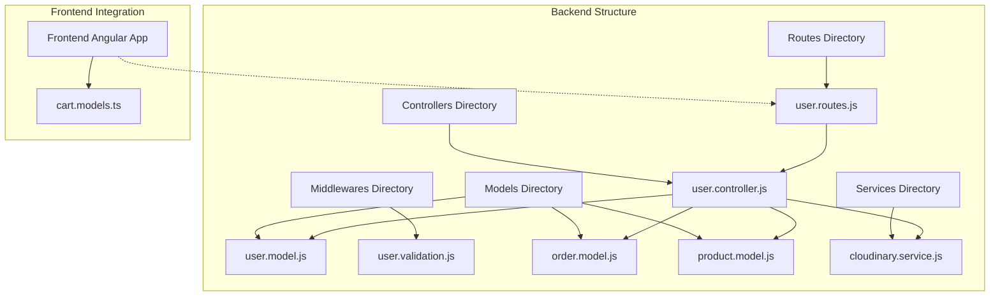
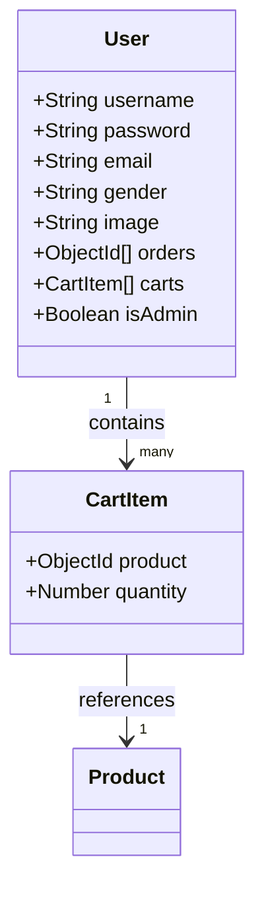
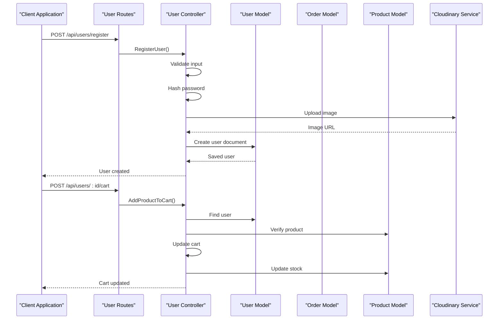
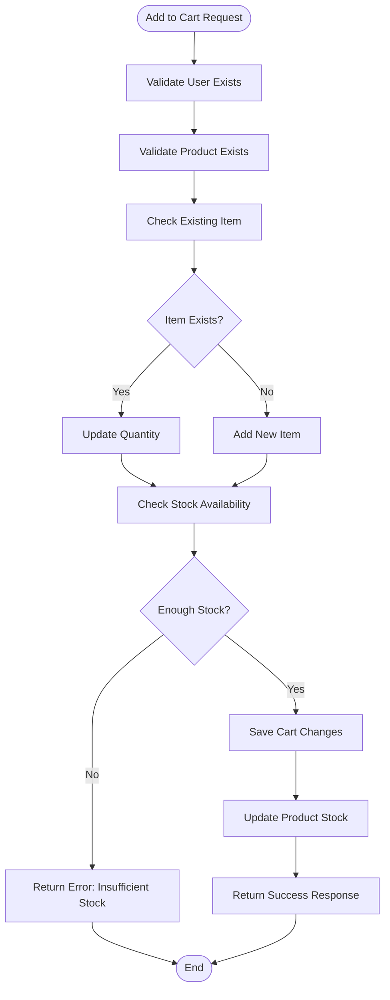
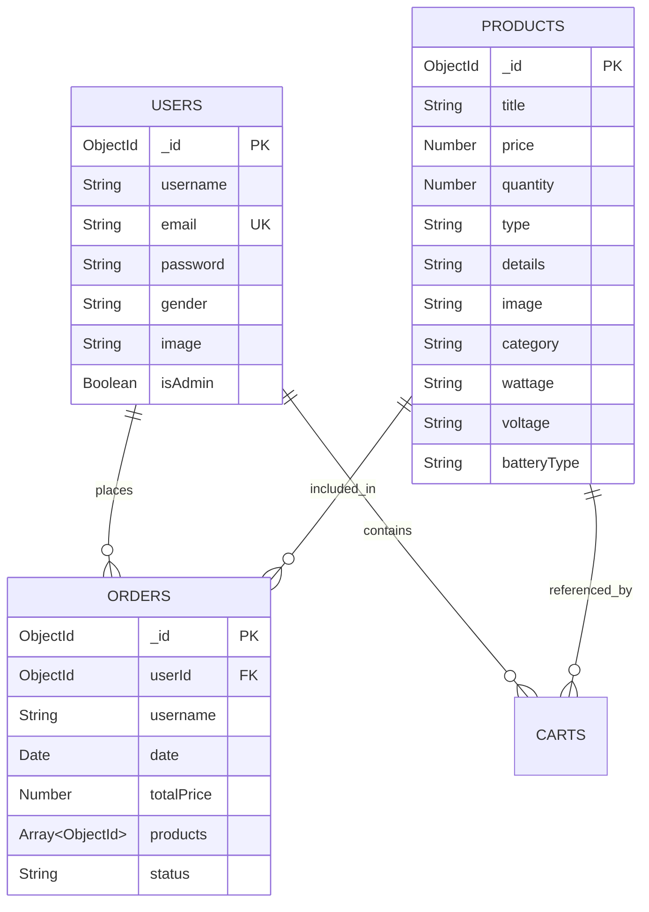
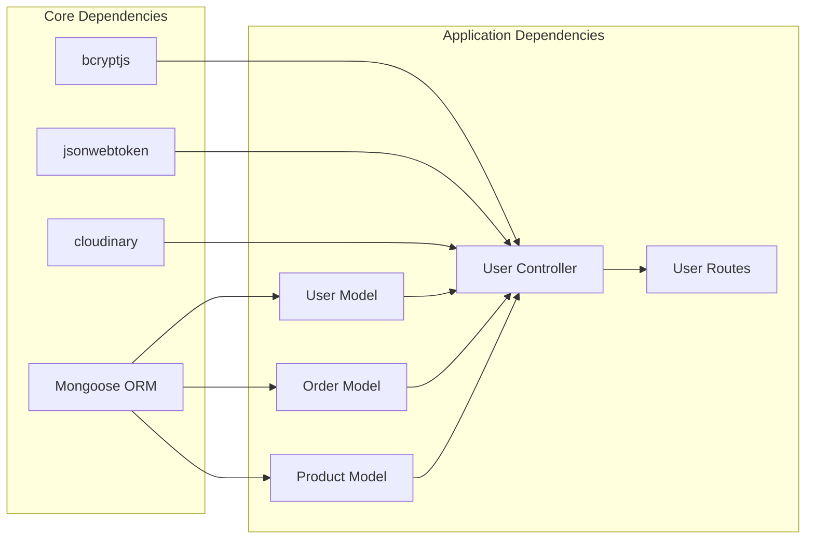

# User Model

<cite>
**Referenced Files in This Document**
- [user.model.js](file://Back-end/src/Models/user.model.js)
- [user.controller.js](file://Back-end/src/Controllers/user.controller.js)
- [user.validation.js](file://Back-end/src/Middlewares/user.validation.js)
- [user.routes.js](file://Back-end/src/Routes/user.routes.js)
- [order.model.js](file://Back-end/src/Models/order.model.js)
- [product.model.js](file://Back-end/src/Models/product.model.js)
- [cloudinary.service.js](file://Back-end/src/services/cloudinary.service.js)
- [app.js](file://Back-end/src/app.js)
- [cart.models.ts](file://Front-end/src/app/core/models/cart.models.ts)
</cite>

## Table of Contents
1. [Introduction](#introduction)
2. [Project Structure](#project-structure)
3. [Core Components](#core-components)
4. [Architecture Overview](#architecture-overview)
5. [Detailed Component Analysis](#detailed-component-analysis)
6. [Dependency Analysis](#dependency-analysis)
7. [Performance Considerations](#performance-considerations)
8. [Troubleshooting Guide](#troubleshooting-guide)
9. [Conclusion](#conclusion)

## Introduction
This document provides comprehensive data model documentation for the User collection schema in the Lightstorm E-commerce application. It details all field definitions, schema validation rules, unique constraints, enum restrictions, and security considerations. The documentation also covers relationships with Orders and Products collections, common query patterns, and practical examples of user document structures.

## Project Structure
The User model is part of a modular Node.js/MongoDB/Express application with clear separation between models, controllers, middlewares, and routes. The user-related components are organized as follows:

**Diagram sources**
- [user.model.js](file://Back-end/src/Models/user.model.js#L1-L29)
- [user.controller.js](file://Back-end/src/Controllers/user.controller.js#L1-L480)
- [user.validation.js](file://Back-end/src/Middlewares/user.validation.js#L1-L29)
- [user.routes.js](file://Back-end/src/Routes/user.routes.js#L1-L24)

**Section sources**
- [user.model.js](file://Back-end/src/Models/user.model.js#L1-L29)
- [user.controller.js](file://Back-end/src/Controllers/user.controller.js#L1-L480)
- [user.validation.js](file://Back-end/src/Middlewares/user.validation.js#L1-L29)
- [user.routes.js](file://Back-end/src/Routes/user.routes.js#L1-L24)

## Core Components
The User model consists of two primary schema definitions: the main User schema and a nested cart sub-schema. These components work together to manage user profiles, shopping cart functionality, and order history.

### Main User Schema Fields
The User schema defines the core user profile structure with comprehensive validation and constraints:

| Field | Type | Required | Unique | Default | Description |
|-------|------|----------|--------|---------|-------------|
| username | String | Yes | No | - | User's display name for identification |
| password | String | Yes | No | - | Hashed password stored in database |
| email | String | Yes | Yes | - | Unique user identifier for authentication |
| gender | String | No | No | - | Gender selection with enum validation |
| image | String | No | No | Default avatar | Profile image URL from Cloudinary |
| orders | Array of ObjectIds | No | No | [] | References to user's order documents |
| carts | Array of Objects | No | No | [] | Shopping cart items with product references |
| isAdmin | Boolean | No | No | false | Administrative privileges flag |

### Cart Sub-Schema Structure
The cart sub-schema manages individual shopping cart items with product references and quantities:

**Diagram sources**
- [user.model.js](file://Back-end/src/Models/user.model.js#L3-L6)
- [user.model.js](file://Back-end/src/Models/user.model.js#L8-L27)

**Section sources**
- [user.model.js](file://Back-end/src/Models/user.model.js#L3-L27)

## Architecture Overview
The User model integrates with multiple system components to provide comprehensive user management functionality:

**Diagram sources**
- [user.routes.js](file://Back-end/src/Routes/user.routes.js#L1-L24)
- [user.controller.js](file://Back-end/src/Controllers/user.controller.js#L138-L175)
- [user.controller.js](file://Back-end/src/Controllers/user.controller.js#L177-L219)

**Section sources**
- [user.routes.js](file://Back-end/src/Routes/user.routes.js#L1-L24)
- [user.controller.js](file://Back-end/src/Controllers/user.controller.js#L1-L480)

## Detailed Component Analysis

### User Schema Definition and Validation
The User schema implements comprehensive validation rules and constraints:

#### Field-Level Specifications
- **username**: String type, required field for user identification
- **password**: String type, required field with automatic hashing
- **email**: String type, required and unique constraint for authentication
- **gender**: String type with enum validation ('male', 'female')
- **image**: String type with default avatar URL from Cloudinary
- **orders**: Array of ObjectId references to orders collection
- **carts**: Array of cart sub-schema objects
- **isAdmin**: Boolean flag with default false value

#### Schema Validation Rules
The schema enforces:
- Required field validation for username, password, and email
- Unique constraint on email field
- Enum restriction on gender field
- Default value assignment for image and isAdmin fields

**Section sources**
- [user.model.js](file://Back-end/src/Models/user.model.js#L8-L27)

### Cart Sub-Schema Implementation
The cart sub-schema provides structured shopping cart management:

**Diagram sources**
- [user.controller.js](file://Back-end/src/Controllers/user.controller.js#L177-L219)

**Section sources**
- [user.model.js](file://Back-end/src/Models/user.model.js#L3-L6)
- [user.controller.js](file://Back-end/src/Controllers/user.controller.js#L177-L219)

### Authentication and Security Implementation
The User model implements robust security measures for user authentication:

#### Password Management
- Passwords are hashed using bcrypt with salt rounds of 10
- Plain text passwords are never stored in the database
- Password comparison occurs during login validation

#### Token-Based Authentication
- JWT tokens are generated for authenticated sessions
- Tokens are stored as HTTP-only cookies with 30-day expiration
- Token verification validates user identity and session authenticity

#### Image Upload Security
- Cloudinary service handles secure image uploads
- Default avatar fallback ensures profile completeness
- File upload validation prevents malicious content

**Section sources**
- [user.controller.js](file://Back-end/src/Controllers/user.controller.js#L37-L49)
- [user.controller.js](file://Back-end/src/Controllers/user.controller.js#L118-L136)
- [cloudinary.service.js](file://Back-end/src/services/cloudinary.service.js#L1-L22)

### Order Management Integration
The User model maintains relationships with orders and products collections:

**Diagram sources**
- [user.model.js](file://Back-end/src/Models/user.model.js#L24-L25)
- [order.model.js](file://Back-end/src/Models/order.model.js#L3-L10)
- [product.model.js](file://Back-end/src/Models/product.model.js#L11-L23)

**Section sources**
- [user.model.js](file://Back-end/src/Models/user.model.js#L24-L25)
- [order.model.js](file://Back-end/src/Models/order.model.js#L1-L13)
- [product.model.js](file://Back-end/src/Models/product.model.js#L1-L29)

### Frontend Integration and Data Models
The frontend consumes the User model through Angular services and interfaces:

#### Cart Data Structure
The frontend cart model mirrors the backend schema for seamless integration:

| Property | Type | Description |
|----------|------|-------------|
| product | Product | Complete product object with all details |
| quantity | Number | Quantity of product in cart |

**Section sources**
- [cart.models.ts](file://Front-end/src/app/core/models/cart.models.ts#L1-L12)

## Dependency Analysis
The User model has well-defined dependencies with other system components:

**Diagram sources**
- [user.model.js](file://Back-end/src/Models/user.model.js#L1-L29)
- [user.controller.js](file://Back-end/src/Controllers/user.controller.js#L1-L10)
- [user.routes.js](file://Back-end/src/Routes/user.routes.js#L1-L5)

**Section sources**
- [user.model.js](file://Back-end/src/Models/user.model.js#L1-L29)
- [user.controller.js](file://Back-end/src/Controllers/user.controller.js#L1-L10)
- [user.routes.js](file://Back-end/src/Routes/user.routes.js#L1-L5)

## Performance Considerations
Several performance optimizations are implemented in the User model:

### Indexing Strategy
- Email field has unique index for fast authentication lookups
- Text indexes on product titles and details for efficient product searches
- Proper ObjectId indexing for foreign key relationships

### Memory Management
- Lazy loading of populated fields (orders are populated only when requested)
- Efficient cart operations using array methods
- Batch operations for order creation and updates

### Scalability Features
- Modular design allows for horizontal scaling
- Stateless authentication reduces server memory footprint
- Cloud storage integration for scalable image hosting

## Troubleshooting Guide

### Common Issues and Solutions

#### Authentication Problems
- **Issue**: Invalid email or password errors
- **Cause**: Incorrect credentials or unhashed passwords
- **Solution**: Verify email uniqueness and ensure proper password hashing

#### Cart Operations Failures
- **Issue**: "Quantity exceeds stock" errors
- **Cause**: Attempting to add more items than available
- **Solution**: Check product availability before adding to cart

#### Image Upload Issues
- **Issue**: Default avatar appears instead of uploaded image
- **Cause**: Cloudinary upload failures or missing file paths
- **Solution**: Verify Cloudinary configuration and file permissions

#### Order Creation Problems
- **Issue**: Empty cart after order creation
- **Cause**: Cart clearing before order completion
- **Solution**: Ensure cart persistence until order is finalized

**Section sources**
- [user.controller.js](file://Back-end/src/Controllers/user.controller.js#L118-L136)
- [user.controller.js](file://Back-end/src/Controllers/user.controller.js#L177-L219)
- [cloudinary.service.js](file://Back-end/src/services/cloudinary.service.js#L10-L19)

## Conclusion
The User model provides a comprehensive foundation for user management in the Lightstorm E-commerce platform. Its well-structured schema, robust validation rules, and integrated security measures ensure reliable operation while maintaining flexibility for future enhancements. The clear separation of concerns and modular architecture support scalability and maintainability as the application grows.

The implementation demonstrates best practices in modern web development, including proper password hashing, secure token-based authentication, and efficient data modeling with MongoDB. The relationships with Orders and Products collections create a cohesive ecosystem for e-commerce functionality while maintaining data integrity and performance standards.