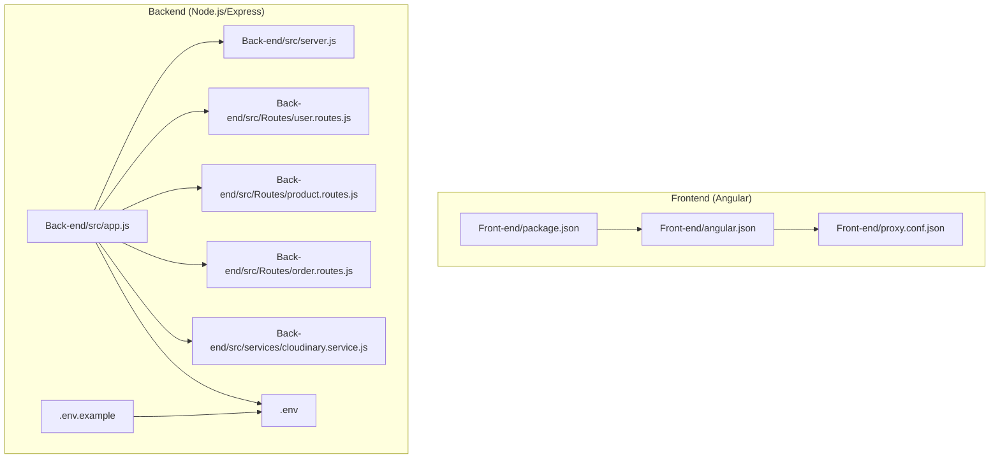
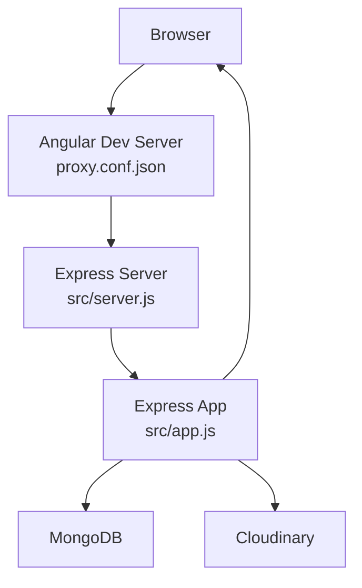
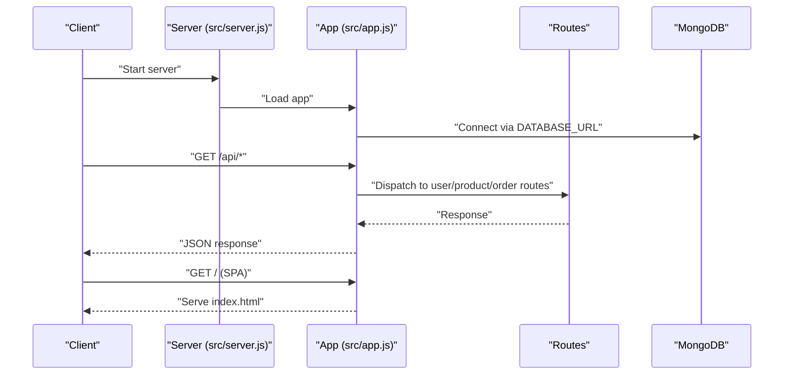
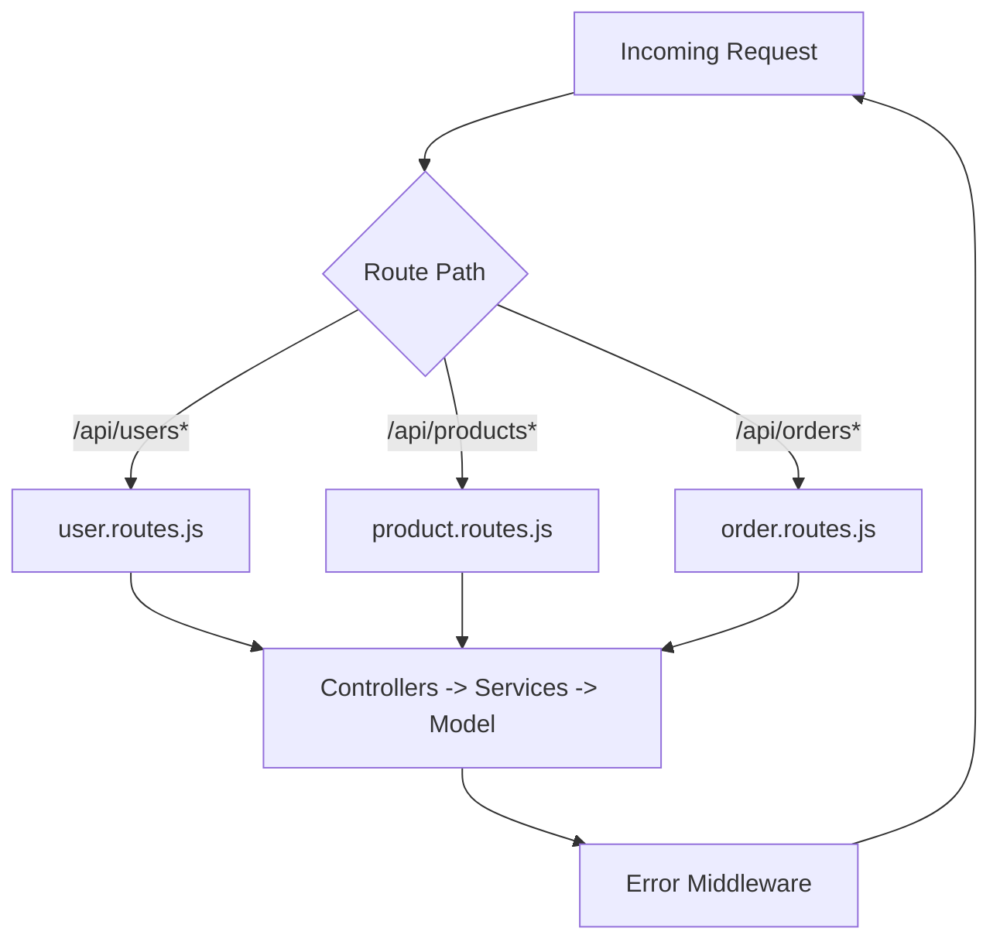
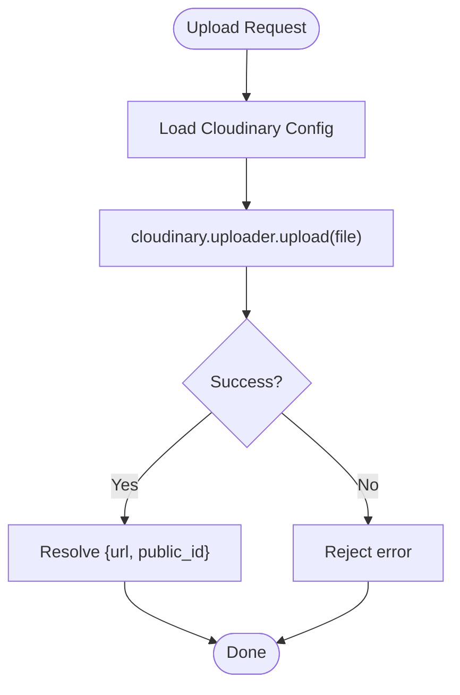
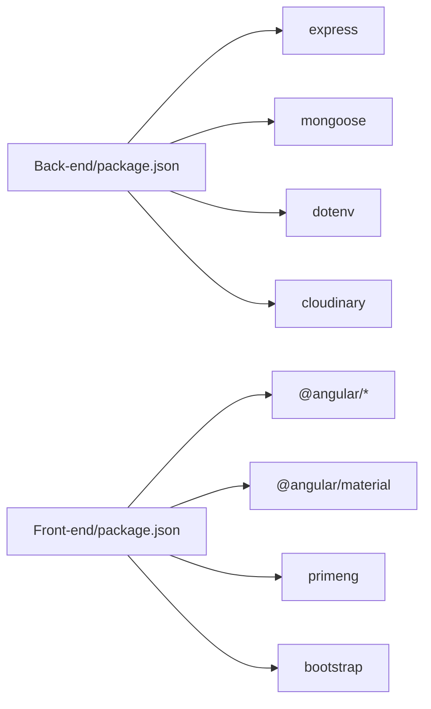

# Deployment and Configuration

<cite>
**Referenced Files in This Document**
- [Back-end/.env](file://Back-end/.env)
- [Back-end/.env.example](file://Back-end/.env.example)
- [Back-end/package.json](file://Back-end/package.json)
- [Back-end/src/app.js](file://Back-end/src/app.js)
- [Back-end/src/server.js](file://Back-end/src/server.js)
- [Back-end/src/config/env.js](file://Back-end/src/config/env.js)
- [Back-end/src/Routes/user.routes.js](file://Back-end/src/Routes/user.routes.js)
- [Back-end/src/Routes/product.routes.js](file://Back-end/src/Routes/product.routes.js)
- [Back-end/src/Routes/order.routes.js](file://Back-end/src/Routes/order.routes.js)
- [Back-end/src/services/cloudinary.service.js](file://Back-end/src/services/cloudinary.service.js)
- [Front-end/package.json](file://Front-end/package.json)
- [Front-end/angular.json](file://Front-end/angular.json)
- [Front-end/proxy.conf.json](file://Front-end/proxy.conf.json)
</cite>

## Table of Contents
1. [Introduction](#introduction)
2. [Project Structure](#project-structure)
3. [Core Components](#core-components)
4. [Architecture Overview](#architecture-overview)
5. [Detailed Component Analysis](#detailed-component-analysis)
6. [Dependency Analysis](#dependency-analysis)
7. [Environment Configuration](#environment-configuration)
8. [Production Setup](#production-setup)
9. [Containerization with Docker](#containerization-with-docker)
10. [Cloud Deployment Options](#cloud-deployment-options)
11. [CI/CD Pipeline Setup](#cicd-pipeline-setup)
12. [Reverse Proxy, SSL, and Load Balancing](#reverse-proxy-ssl-and-load-balancing)
13. [Monitoring, Logging, and Maintenance](#monitoring-logging-and-maintenance)
14. [Scaling and Performance Optimization](#scaling-and-performance-optimization)
15. [Troubleshooting Guide](#troubleshooting-guide)
16. [Conclusion](#conclusion)

## Introduction
This document provides comprehensive deployment guidance for Lightstorm Technologies’ e-commerce platform. It covers environment configuration, production setup, frontend and backend deployment strategies, containerization, cloud deployment options, CI/CD pipeline setup, reverse proxy and SSL configuration, load balancing, monitoring and logging, maintenance procedures, and production performance optimization. The guidance is grounded in the repository’s current configuration and code structure.

## Project Structure
The repository comprises:
- A Node.js/Express backend under Back-end/
- An Angular frontend under Front-end/
- A landing page and website projects under landing-page/ and lightstorm-website/

Key runtime characteristics:
- Backend listens on a configurable port and connects to MongoDB via a DATABASE_URL environment variable.
- The backend serves the Angular application built artifacts statically and acts as a reverse proxy for API requests.
- The Angular CLI dev server proxies API calls to the backend during local development.

**Diagram sources**
- [Front-end/package.json](file://Front-end/package.json#L1-L55)
- [Front-end/angular.json](file://Front-end/angular.json#L1-L114)
- [Front-end/proxy.conf.json](file://Front-end/proxy.conf.json#L1-L8)
- [Back-end/src/app.js](file://Back-end/src/app.js#L1-L96)
- [Back-end/src/server.js](file://Back-end/src/server.js#L1-L6)
- [Back-end/.env](file://Back-end/.env#L1-L3)
- [Back-end/.env.example](file://Back-end/.env.example#L1-L3)
- [Back-end/src/Routes/user.routes.js](file://Back-end/src/Routes/user.routes.js#L1-L24)
- [Back-end/src/Routes/product.routes.js](file://Back-end/src/Routes/product.routes.js#L1-L20)
- [Back-end/src/Routes/order.routes.js](file://Back-end/src/Routes/order.routes.js#L1-L19)
- [Back-end/src/services/cloudinary.service.js](file://Back-end/src/services/cloudinary.service.js#L1-L22)

**Section sources**
- [Back-end/src/app.js](file://Back-end/src/app.js#L1-L96)
- [Back-end/src/server.js](file://Back-end/src/server.js#L1-L6)
- [Front-end/angular.json](file://Front-end/angular.json#L1-L114)
- [Front-end/proxy.conf.json](file://Front-end/proxy.conf.json#L1-L8)

## Core Components
- Backend Express application:
  - Environment-driven configuration for port and database connection.
  - CORS policy configured for local development origins.
  - Static serving of Angular build artifacts with catch-all routing to index.html.
  - Centralized error handling middleware.
- Frontend Angular application:
  - Build outputs to Front-end/dist/lightstorm-ecommerce/browser.
  - Base href set for sub-path deployment under /shop/.
  - Dev server proxy configured to forward /api to the backend.

**Section sources**
- [Back-end/src/app.js](file://Back-end/src/app.js#L1-L96)
- [Back-end/src/server.js](file://Back-end/src/server.js#L1-L6)
- [Front-end/angular.json](file://Front-end/angular.json#L13-L66)
- [Front-end/proxy.conf.json](file://Front-end/proxy.conf.json#L1-L8)

## Architecture Overview
The backend exposes REST endpoints for users, products, and orders. It also serves the Angular SPA at the root path and forwards API traffic to itself. During development, the Angular dev server proxies API requests to the backend.

**Diagram sources**
- [Front-end/proxy.conf.json](file://Front-end/proxy.conf.json#L1-L8)
- [Back-end/src/server.js](file://Back-end/src/server.js#L1-L6)
- [Back-end/src/app.js](file://Back-end/src/app.js#L1-L96)
- [Back-end/src/services/cloudinary.service.js](file://Back-end/src/services/cloudinary.service.js#L1-L22)

## Detailed Component Analysis

### Backend Application Flow

**Diagram sources**
- [Back-end/src/server.js](file://Back-end/src/server.js#L1-L6)
- [Back-end/src/app.js](file://Back-end/src/app.js#L1-L96)
- [Back-end/src/Routes/user.routes.js](file://Back-end/src/Routes/user.routes.js#L1-L24)
- [Back-end/src/Routes/product.routes.js](file://Back-end/src/Routes/product.routes.js#L1-L20)
- [Back-end/src/Routes/order.routes.js](file://Back-end/src/Routes/order.routes.js#L1-L19)

**Section sources**
- [Back-end/src/app.js](file://Back-end/src/app.js#L1-L96)
- [Back-end/src/server.js](file://Back-end/src/server.js#L1-L6)

### API Route Coverage
- Users: CRUD, authentication, cart, and order retrieval endpoints.
- Products: listing, featured items, reviews, and cart operations.
- Orders: analytics and lifecycle management.

**Diagram sources**
- [Back-end/src/Routes/user.routes.js](file://Back-end/src/Routes/user.routes.js#L1-L24)
- [Back-end/src/Routes/product.routes.js](file://Back-end/src/Routes/product.routes.js#L1-L20)
- [Back-end/src/Routes/order.routes.js](file://Back-end/src/Routes/order.routes.js#L1-L19)
- [Back-end/src/app.js](file://Back-end/src/app.js#L81-L93)

**Section sources**
- [Back-end/src/Routes/user.routes.js](file://Back-end/src/Routes/user.routes.js#L1-L24)
- [Back-end/src/Routes/product.routes.js](file://Back-end/src/Routes/product.routes.js#L1-L20)
- [Back-end/src/Routes/order.routes.js](file://Back-end/src/Routes/order.routes.js#L1-L19)

### Cloudinary Upload Service
- Configured with hardcoded credentials in the service module.
- Exposed as a promise-returning uploader for file uploads.

**Diagram sources**
- [Back-end/src/services/cloudinary.service.js](file://Back-end/src/services/cloudinary.service.js#L1-L22)

**Section sources**
- [Back-end/src/services/cloudinary.service.js](file://Back-end/src/services/cloudinary.service.js#L1-L22)

## Dependency Analysis
- Backend dependencies include Express, Mongoose, CORS, body-parser, cookie-parser, dotenv, bcryptjs, jsonwebtoken, multer, and cloudinary.
- Frontend dependencies include Angular core packages, Material, PrimeNG, Bootstrap, and RxJS.

**Diagram sources**
- [Back-end/package.json](file://Back-end/package.json#L13-L27)
- [Front-end/package.json](file://Front-end/package.json#L13-L40)

**Section sources**
- [Back-end/package.json](file://Back-end/package.json#L1-L29)
- [Front-end/package.json](file://Front-end/package.json#L1-L55)

## Environment Configuration
- Port and database URL are controlled via environment variables.
- Example environment file is provided for reference.

Recommended environment variables:
- PORT: Listening port for the backend server.
- DATABASE_URL: MongoDB connection string.
- NODE_ENV: Set to production for optimized behavior.

Notes:
- The backend logs the DATABASE_URL at startup for verification.
- CORS allows localhost origins for development; adjust origins for production.

**Section sources**
- [Back-end/.env](file://Back-end/.env#L1-L3)
- [Back-end/.env.example](file://Back-end/.env.example#L1-L3)
- [Back-end/src/app.js](file://Back-end/src/app.js#L25-L36)
- [Back-end/src/app.js](file://Back-end/src/app.js#L19-L22)

## Production Setup
- Build the Angular application for production using the Angular CLI.
- Serve the backend in production mode with the production build of the Angular app statically served.
- Ensure the MongoDB instance is reachable from the production host.

Build and run steps:
- Frontend build: ng build (production configuration).
- Backend start: node src/server.js (ensure environment variables are loaded).

Base href and static path:
- The backend resolves the Angular build directory and serves index.html for client-side routing.

**Section sources**
- [Front-end/angular.json](file://Front-end/angular.json#L38-L66)
- [Back-end/src/app.js](file://Back-end/src/app.js#L56-L79)
- [Back-end/src/server.js](file://Back-end/src/server.js#L1-L6)

## Containerization with Docker
Proposed approach:
- Multi-stage build for the Angular app (frontend) and a Node.js runtime image for the backend.
- Mount or copy the Angular dist folder into the backend image for static serving.
- Expose the configured PORT.
- Use environment variables for DATABASE_URL and PORT.
- Add health checks and non-root user for security.

Example outline (no code content):
- Build Angular dist in a separate stage.
- Copy dist into the Node.js image.
- Install backend dependencies and copy server code.
- Set NODE_ENV=production and configure environment variables.
- Entrypoint runs node src/server.js.

[No sources needed since this section provides general guidance]

## Cloud Deployment Options
- Platform-as-a-Service (PaaS): Deploy the backend to platforms supporting Node.js and connect to a managed MongoDB service. Configure environment variables for PORT and DATABASE_URL.
- Infrastructure-as-a-Service (IaaS): Provision VMs, deploy containers, and manage databases separately. Use reverse proxies and load balancers for traffic distribution.
- Static hosting: Host the Angular dist on CDN or static hosting and deploy the backend as a serverless function or container with a database endpoint.

[No sources needed since this section provides general guidance]

## CI/CD Pipeline Setup
Recommended stages:
- Build: Install dependencies for both frontend and backend, run Angular build, and compile backend.
- Test: Run unit tests and lint checks.
- Package: Produce deployable artifacts (Docker images or zip archives).
- Deploy: Push images to registry and deploy to target environment; apply database migrations if applicable.
- Rollback: Keep previous versions tagged and ready for quick rollback.

[No sources needed since this section provides general guidance]

## Reverse Proxy, SSL, and Load Balancing
Reverse proxy and SSL:
- Place NGINX or Apache in front of the backend to terminate TLS and proxy /api to the backend.
- Configure SSL certificates and redirect HTTP to HTTPS.
- Set up caching for static assets served by the backend.

Load balancing:
- Use a load balancer to distribute traffic across multiple backend instances.
- Enable sticky sessions if required by session-based authentication.

[No sources needed since this section provides general guidance]

## Monitoring, Logging, and Maintenance
Monitoring:
- Use application performance monitoring (APM) tools to track backend metrics and errors.
- Monitor database connectivity and query performance.

Logging:
- Standardize log formats and rotate logs.
- Forward logs to centralized logging systems (e.g., ELK stack or cloud-native solutions).

Maintenance:
- Schedule database backups and monitor disk usage.
- Apply security patches to OS, Node.js, and dependencies regularly.
- Review and update CORS policies and API keys periodically.

[No sources needed since this section provides general guidance]

## Scaling and Performance Optimization
Horizontal scaling:
- Stateless backend design enables easy horizontal scaling behind a load balancer.
- Use auto-scaling groups with CPU or request-based triggers.

Database optimization:
- Ensure proper indexing on frequently queried fields.
- Use replica sets for high availability and read replicas for reporting.

Frontend optimization:
- Enable gzip/brotli compression.
- Use base href and asset hashing for cache-friendly updates.

Caching:
- Implement Redis/Memcached for session storage and caching.
- Cache static assets at CDN level.

[No sources needed since this section provides general guidance]

## Troubleshooting Guide
Common issues and resolutions:
- Database connection failures: Verify DATABASE_URL and network connectivity; check MongoDB logs.
- CORS errors: Confirm allowed origins and credentials configuration.
- SPA routing issues: Ensure catch-all route serves index.html and base href matches deployment path.
- Cloudinary upload failures: Validate credentials and network access to Cloudinary endpoints.

**Section sources**
- [Back-end/src/app.js](file://Back-end/src/app.js#L25-L36)
- [Back-end/src/app.js](file://Back-end/src/app.js#L19-L22)
- [Back-end/src/app.js](file://Back-end/src/app.js#L71-L79)
- [Back-end/src/services/cloudinary.service.js](file://Back-end/src/services/cloudinary.service.js#L10-L19)

## Conclusion
This guide outlines a practical deployment strategy for Lightstorm Technologies, aligning the current backend and frontend configurations with production-grade practices. By leveraging environment-driven configuration, containerization, robust reverse proxy and SSL setup, scalable infrastructure, and comprehensive monitoring, the platform can achieve reliable, secure, and high-performing operations in production.