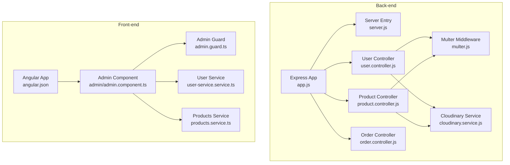
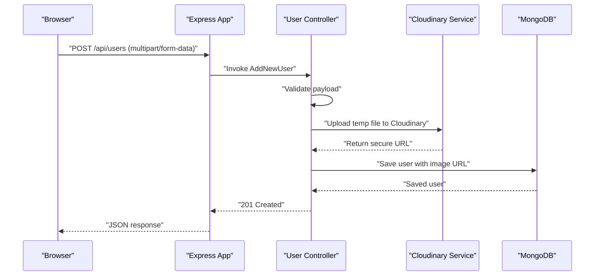
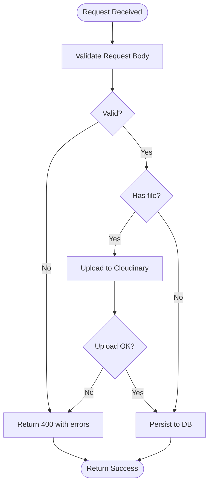
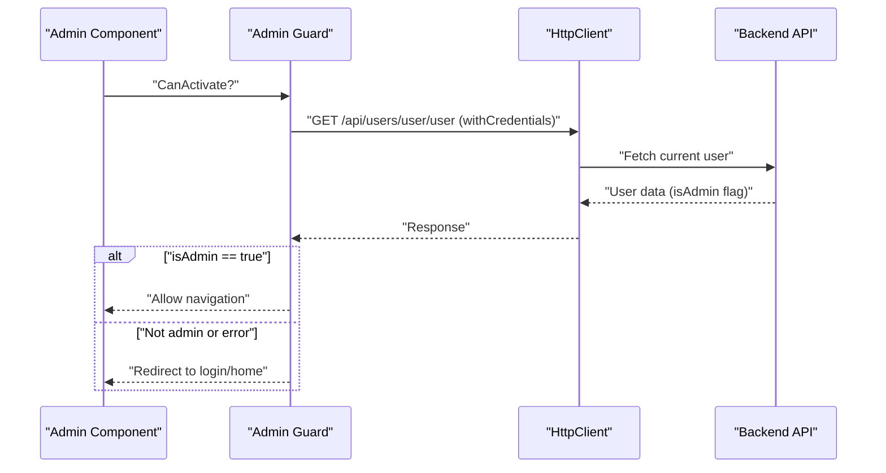
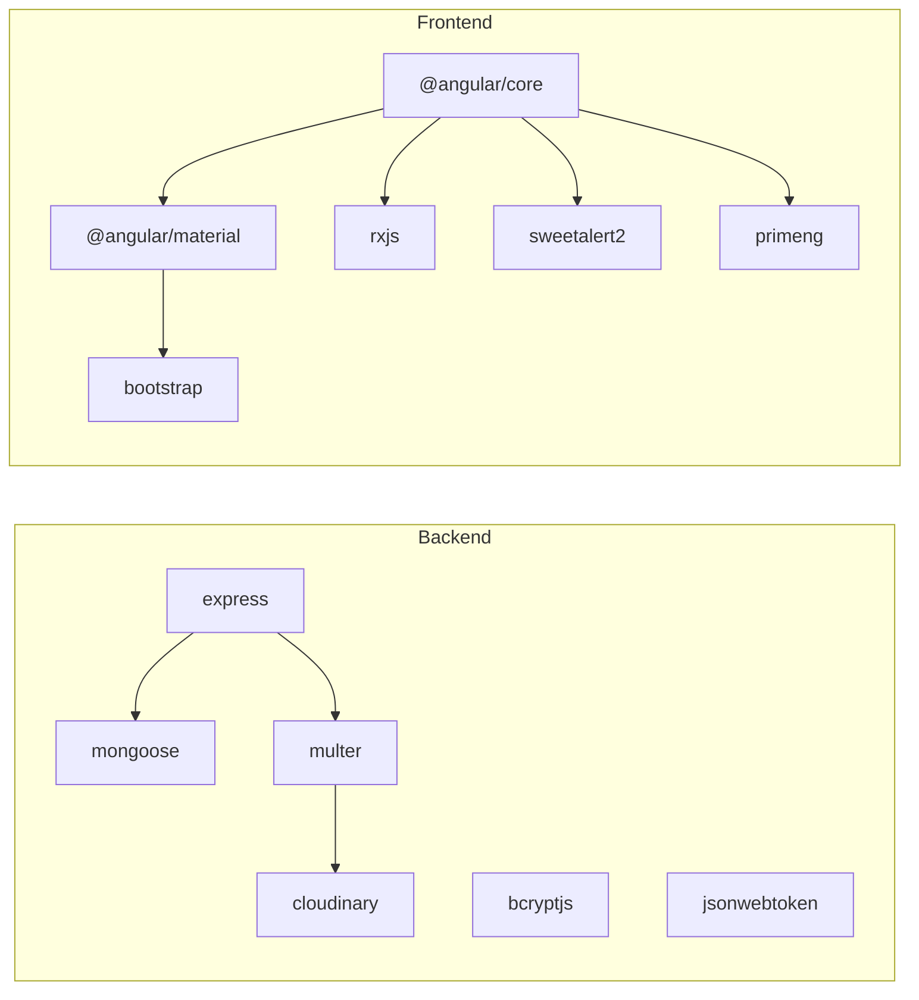

# Development Guide

<cite>
**Referenced Files in This Document**
- [PROJECT_STRUCTURE.md](file://PROJECT_STRUCTURE.md)
- [Back-end/src/app.js](file://Back-end/src/app.js)
- [Back-end/src/Servers/server.js](file://Back-end/src/Servers/server.js)
- [Back-end/package.json](file://Back-end/package.json)
- [Back-end/src/Middlewares/multer.js](file://Back-end/src/Middlewares/multer.js)
- [Back-end/src/services/cloudinary.service.js](file://Back-end/src/services/cloudinary.service.js)
- [Back-end/src/Controllers/user.controller.js](file://Back-end/src/Controllers/user.controller.js)
- [Back-end/src/Controllers/product.controller.js](file://Back-end/src/Controllers/product.controller.js)
- [Back-end/src/Controllers/order.controller.js](file://Back-end/src/Controllers/order.controller.js)
- [Front-end/package.json](file://Front-end/package.json)
- [Front-end/angular.json](file://Front-end/angular.json)
- [Front-end/src/app/features/admin/admin/admin.component.ts](file://Front-end/src/app/features/admin/admin/admin.component.ts)
- [Front-end/src/app/core/guards/admin.guard.ts](file://Front-end/src/app/core/guards/admin.guard.ts)
- [Front-end/src/app/core/services/user-service.service.ts](file://Front-end/src/app/core/services/user-service.service.ts)
- [Front-end/src/app/core/services/products.service.ts](file://Front-end/src/app/core/services/products.service.ts)
</cite>

## Table of Contents
1. [Introduction](#introduction)
2. [Project Structure](#project-structure)
3. [Core Components](#core-components)
4. [Architecture Overview](#architecture-overview)
5. [Detailed Component Analysis](#detailed-component-analysis)
6. [Dependency Analysis](#dependency-analysis)
7. [Performance Considerations](#performance-considerations)
8. [Troubleshooting Guide](#troubleshooting-guide)
9. [Conclusion](#conclusion)
10. [Appendices](#appendices)

## Introduction
This development guide provides a comprehensive, contributor-friendly overview of Lightstorm Technologies’ full-stack e-commerce platform. It covers coding standards, development workflow, frontend and backend best practices, Angular component development, Node.js controller implementation, database modeling guidelines, build and testing procedures, quality assurance, Cloudinary integration, multer configuration, and development tools setup. It also outlines feature development, bug fixing, and code review processes to ensure consistent, maintainable contributions across the team.

## Project Structure
The repository follows a clear separation of concerns:
- Back-end: Node.js/Express API with controllers, models, middlewares, routes, services, and server configuration.
- Front-end: Angular 17 application with standalone components, services, guards, and feature modules.
- Landing page and website projects for marketing and alternate UI contexts.
- Centralized documentation and environment configuration.

Key backend endpoints and frontend routes are documented to align development efforts with the intended API surface and navigation.

**Diagram sources**
- [Back-end/src/app.js](file://Back-end/src/app.js#L1-L96)
- [Back-end/src/Servers/server.js](file://Back-end/src/Servers/server.js#L1-L6)
- [Back-end/src/Controllers/user.controller.js](file://Back-end/src/Controllers/user.controller.js#L1-L480)
- [Back-end/src/Controllers/product.controller.js](file://Back-end/src/Controllers/product.controller.js#L1-L348)
- [Back-end/src/Controllers/order.controller.js](file://Back-end/src/Controllers/order.controller.js#L1-L258)
- [Back-end/src/Middlewares/multer.js](file://Back-end/src/Middlewares/multer.js#L1-L33)
- [Back-end/src/services/cloudinary.service.js](file://Back-end/src/services/cloudinary.service.js#L1-L22)
- [Front-end/angular.json](file://Front-end/angular.json#L1-L114)
- [Front-end/src/app/features/admin/admin/admin.component.ts](file://Front-end/src/app/features/admin/admin/admin.component.ts#L1-L38)
- [Front-end/src/app/core/guards/admin.guard.ts](file://Front-end/src/app/core/guards/admin.guard.ts#L1-L46)
- [Front-end/src/app/core/services/user-service.service.ts](file://Front-end/src/app/core/services/user-service.service.ts#L1-L25)
- [Front-end/src/app/core/services/products.service.ts](file://Front-end/src/app/core/services/products.service.ts#L1-L31)

**Section sources**
- [PROJECT_STRUCTURE.md](file://PROJECT_STRUCTURE.md#L1-L448)
- [Back-end/src/app.js](file://Back-end/src/app.js#L1-L96)
- [Front-end/angular.json](file://Front-end/angular.json#L1-L114)

## Core Components
- Express application bootstrapping and middleware pipeline.
- Controllers implementing CRUD and domain logic for users, products, and orders.
- Multer middleware for local disk storage and file filtering prior to Cloudinary upload.
- Cloudinary service for secure image upload and retrieval.
- Angular services for HTTP communication and stateless API consumption.
- Route guards enforcing authentication and authorization.

Best practices:
- Keep controllers thin; delegate business logic to services where applicable.
- Validate inputs early using AJV-based validators and sanitize payloads.
- Use consistent HTTP status codes and structured error responses.
- Centralize environment configuration and secrets via .env and config modules.
- Prefer immutable updates and explicit error handling in both backend and frontend.

**Section sources**
- [Back-end/src/app.js](file://Back-end/src/app.js#L1-L96)
- [Back-end/src/Controllers/user.controller.js](file://Back-end/src/Controllers/user.controller.js#L1-L480)
- [Back-end/src/Controllers/product.controller.js](file://Back-end/src/Controllers/product.controller.js#L1-L348)
- [Back-end/src/Controllers/order.controller.js](file://Back-end/src/Controllers/order.controller.js#L1-L258)
- [Back-end/src/Middlewares/multer.js](file://Back-end/src/Middlewares/multer.js#L1-L33)
- [Back-end/src/services/cloudinary.service.js](file://Back-end/src/services/cloudinary.service.js#L1-L22)
- [Front-end/src/app/core/services/user-service.service.ts](file://Front-end/src/app/core/services/user-service.service.ts#L1-L25)
- [Front-end/src/app/core/services/products.service.ts](file://Front-end/src/app/core/services/products.service.ts#L1-L31)

## Architecture Overview
The system integrates an Angular SPA served by Express. Express serves static assets from the Angular build and proxies API requests. Authentication relies on JWT stored in httpOnly cookies. File uploads are handled via multer to disk and then uploaded to Cloudinary.

**Diagram sources**
- [Back-end/src/Controllers/user.controller.js](file://Back-end/src/Controllers/user.controller.js#L32-L57)
- [Back-end/src/services/cloudinary.service.js](file://Back-end/src/services/cloudinary.service.js#L10-L19)
- [Back-end/src/app.js](file://Back-end/src/app.js#L38-L41)

**Section sources**
- [Back-end/src/app.js](file://Back-end/src/app.js#L1-L96)
- [Back-end/src/Controllers/user.controller.js](file://Back-end/src/Controllers/user.controller.js#L1-L480)
- [Back-end/src/services/cloudinary.service.js](file://Back-end/src/services/cloudinary.service.js#L1-L22)

## Detailed Component Analysis

### Backend: Controllers and Data Flow
Controllers encapsulate route handlers and orchestrate model interactions. They leverage multer for file intake and Cloudinary for image storage. Error handling is centralized in the Express app middleware.

Key patterns:
- Validation before persistence.
- Atomic updates with proper error propagation.
- JWT verification for protected routes.
- Structured pagination and filtering for product listings.

**Diagram sources**
- [Back-end/src/Controllers/product.controller.js](file://Back-end/src/Controllers/product.controller.js#L107-L175)
- [Back-end/src/Middlewares/multer.js](file://Back-end/src/Middlewares/multer.js#L19-L30)
- [Back-end/src/services/cloudinary.service.js](file://Back-end/src/services/cloudinary.service.js#L10-L19)

**Section sources**
- [Back-end/src/Controllers/user.controller.js](file://Back-end/src/Controllers/user.controller.js#L1-L480)
- [Back-end/src/Controllers/product.controller.js](file://Back-end/src/Controllers/product.controller.js#L1-L348)
- [Back-end/src/Controllers/order.controller.js](file://Back-end/src/Controllers/order.controller.js#L1-L258)
- [Back-end/src/Middlewares/multer.js](file://Back-end/src/Middlewares/multer.js#L1-L33)
- [Back-end/src/services/cloudinary.service.js](file://Back-end/src/services/cloudinary.service.js#L1-L22)

### Frontend: Angular Component Development and Guards
Admin component demonstrates integration with HTTP services and route guards. The admin guard verifies admin privileges via a backend endpoint and redirects unauthorized users.

Patterns:
- Use standalone components for modularity.
- Centralize API endpoints in services.
- Leverage guards for route protection.
- Use RxJS observables for reactive data flows.

**Diagram sources**
- [Front-end/src/app/features/admin/admin/admin.component.ts](file://Front-end/src/app/features/admin/admin/admin.component.ts#L25-L36)
- [Front-end/src/app/core/guards/admin.guard.ts](file://Front-end/src/app/core/guards/admin.guard.ts#L15-L44)
- [Front-end/src/app/core/services/user-service.service.ts](file://Front-end/src/app/core/services/user-service.service.ts#L13-L22)

**Section sources**
- [Front-end/src/app/features/admin/admin/admin.component.ts](file://Front-end/src/app/features/admin/admin/admin.component.ts#L1-L38)
- [Front-end/src/app/core/guards/admin.guard.ts](file://Front-end/src/app/core/guards/admin.guard.ts#L1-L46)
- [Front-end/src/app/core/services/user-service.service.ts](file://Front-end/src/app/core/services/user-service.service.ts#L1-L25)
- [Front-end/src/app/core/services/products.service.ts](file://Front-end/src/app/core/services/products.service.ts#L1-L31)

### Database Modeling Guidelines
Models define schemas and indexes. Use Mongoose for type enforcement and populate relationships. Text indexes support product search.

Guidelines:
- Define required fields and defaults explicitly.
- Use enums or constrained strings for categorical fields.
- Index frequently queried fields (e.g., text index on product title/details).
- Reference related documents with ObjectId and populate when needed.

**Section sources**
- [PROJECT_STRUCTURE.md](file://PROJECT_STRUCTURE.md#L264-L321)

### Build Process
- Backend: Use npm scripts to start development (nodemon) and production (node).
- Frontend: Angular CLI builds the app with configurable base href and asset handling. Proxy configuration supports local API integration.

Recommendations:
- Use development configuration for fast rebuilds during iteration.
- Enable source maps for debugging.
- Configure baseHref appropriately for deployment paths.

**Section sources**
- [Back-end/package.json](file://Back-end/package.json#L6-L10)
- [Front-end/angular.json](file://Front-end/angular.json#L13-L81)

### Testing Strategies and Quality Assurance
- Backend: Add unit tests for controllers and services; mock external dependencies (e.g., Cloudinary) and database calls.
- Frontend: Use Karma/Jasmine for component and service tests; mock HttpClient for isolated testing.
- CI/CD: Integrate linting, unit tests, and build verification in automated pipelines.

**Section sources**
- [Front-end/package.json](file://Front-end/package.json#L10-L10)
- [Front-end/angular.json](file://Front-end/angular.json#L88-L107)

### Cloudinary Integration and Multer Configuration
- Multer stores uploaded files locally with a strict file filter for image types and writes files to a dedicated directory.
- Cloudinary service wraps uploader in a Promise to return secure URLs and public IDs.
- Controllers call Cloudinary after multer completes to persist images.

Best practices:
- Validate file types and sizes before upload.
- Clean up temporary files after successful upload.
- Store only secure URLs in the database; keep Cloudinary IDs for future operations.

**Section sources**
- [Back-end/src/Middlewares/multer.js](file://Back-end/src/Middlewares/multer.js#L1-L33)
- [Back-end/src/services/cloudinary.service.js](file://Back-end/src/services/cloudinary.service.js#L1-L22)
- [Back-end/src/Controllers/user.controller.js](file://Back-end/src/Controllers/user.controller.js#L42-L48)
- [Back-end/src/Controllers/product.controller.js](file://Back-end/src/Controllers/product.controller.js#L154-L167)

### Development Tools Setup
- Backend: nodemon for auto-restarts during development; dotenv for environment variables; AJV for validation.
- Frontend: Angular CLI for scaffolding and serving; Bootstrap and Angular Material for UI; SweetAlert2 for notifications.

**Section sources**
- [Back-end/package.json](file://Back-end/package.json#L13-L27)
- [Front-end/package.json](file://Front-end/package.json#L13-L53)

### Feature Development Workflow
- Plan feature scope and API endpoints.
- Implement backend routes, controllers, and validations.
- Add frontend services and components; wire guards and navigation.
- Write tests for new functionality.
- Perform peer review and integrate via pull requests.

### Bug Fixing Process
- Reproduce the issue with clear steps.
- Isolate backend vs. frontend causes.
- Add targeted tests to prevent regressions.
- Document fixes and update changelog entries.

### Code Review Guidelines
- Consistency: Follow established patterns for controllers, services, and guards.
- Security: Validate inputs, sanitize outputs, and enforce authentication/authorization.
- Reliability: Handle errors gracefully and log meaningful messages.
- Performance: Optimize queries, avoid N+1 selects, and use pagination.

## Dependency Analysis
Backend and frontend dependencies are declared in their respective package.json files. The backend depends on Express, Mongoose, bcrypt, JWT, multer, and Cloudinary. The frontend depends on Angular, Material, Bootstrap, PrimeNG, RxJS, and SweetAlert2.

**Diagram sources**
- [Back-end/package.json](file://Back-end/package.json#L13-L27)
- [Front-end/package.json](file://Front-end/package.json#L13-L40)

**Section sources**
- [Back-end/package.json](file://Back-end/package.json#L1-L29)
- [Front-end/package.json](file://Front-end/package.json#L1-L55)

## Performance Considerations
- Use pagination and sorting for product listings.
- Index text search fields and frequently filtered categories.
- Minimize payload sizes; avoid sending full documents when partial data suffices.
- Cache static assets and enable gzip compression in production.
- Monitor Cloudinary upload times and handle retries.

## Troubleshooting Guide
Common issues and resolutions:
- CORS errors: Verify allowed origins and credentials in Express CORS configuration.
- Multer file upload failures: Ensure upload directory exists and file types match filters.
- Cloudinary upload errors: Check credentials and network connectivity; validate file paths.
- JWT cookie problems: Confirm httpOnly cookie settings and same-site policy compatibility.
- Angular proxy misconfiguration: Align proxy target with backend port and base path.

**Section sources**
- [Back-end/src/app.js](file://Back-end/src/app.js#L19-L22)
- [Back-end/src/Middlewares/multer.js](file://Back-end/src/Middlewares/multer.js#L5-L9)
- [Back-end/src/services/cloudinary.service.js](file://Back-end/src/services/cloudinary.service.js#L3-L8)
- [Front-end/angular.json](file://Front-end/angular.json#L67-L81)

## Conclusion
This guide establishes a unified development approach for Lightstorm Technologies, ensuring consistent backend and frontend practices, robust integrations with Cloudinary and MongoDB, and a reliable build and testing pipeline. Contributors should adhere to the outlined standards, leverage the provided patterns, and follow the workflow and review processes to maintain code quality and system reliability.

## Appendices
- Environment variables and scripts are defined in the project documentation and package configurations.
- Refer to the project structure document for endpoint definitions and component organization.

**Section sources**
- [PROJECT_STRUCTURE.md](file://PROJECT_STRUCTURE.md#L409-L421)
- [Back-end/package.json](file://Back-end/package.json#L6-L10)
- [Front-end/package.json](file://Front-end/package.json#L5-L11)