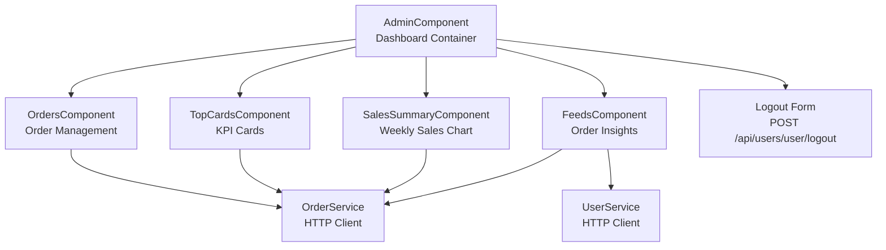
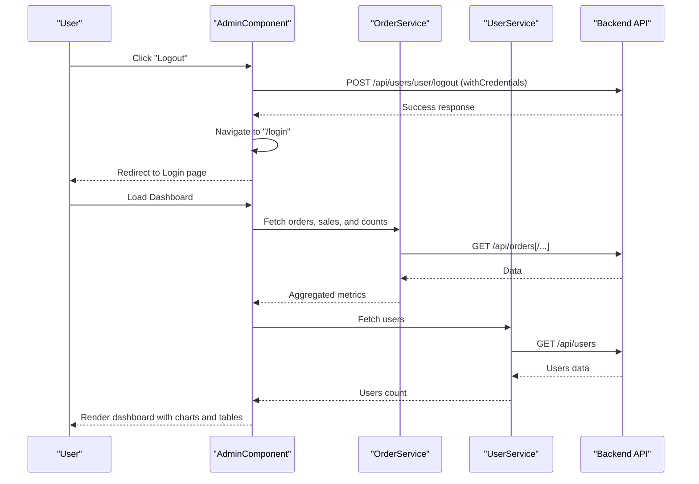
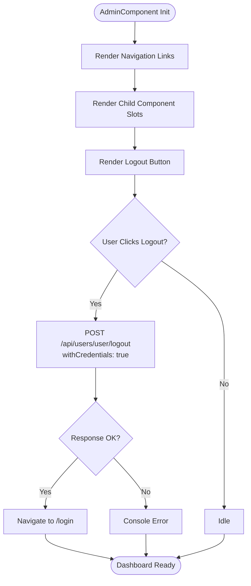
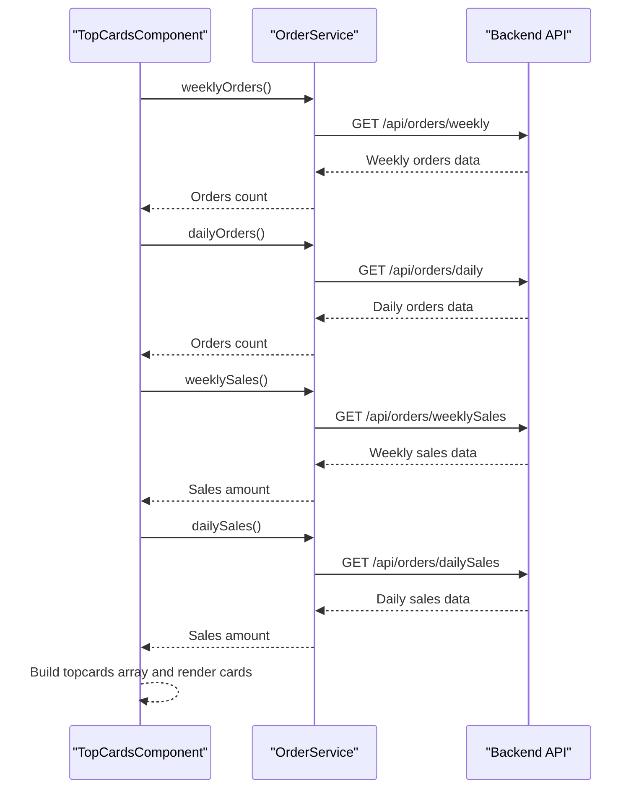
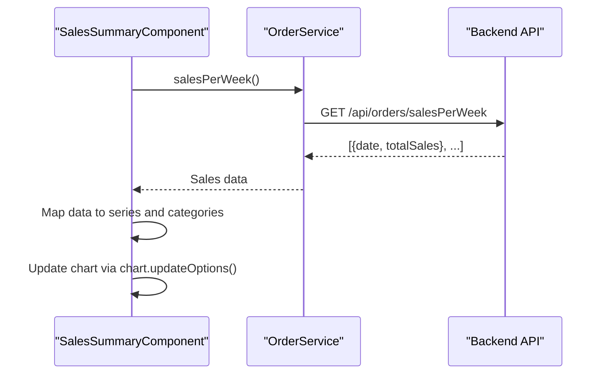
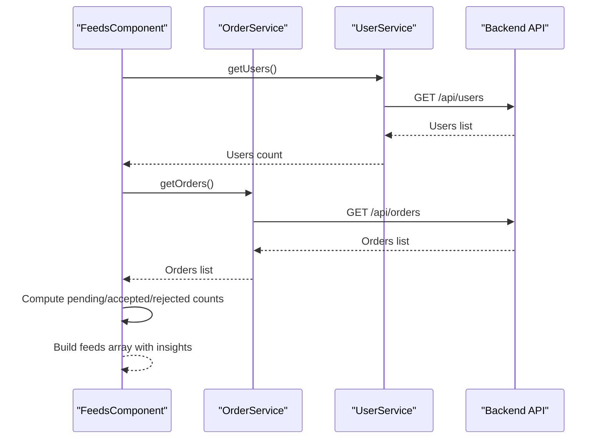
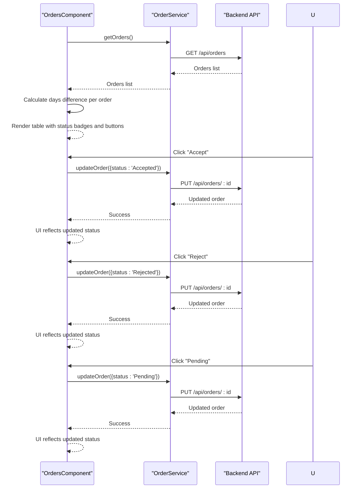
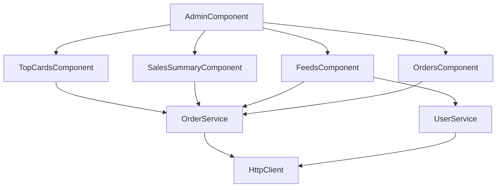

# Admin Dashboard Overview

<cite>
**Referenced Files in This Document**
- [admin.component.html](file://Front-end/src/app/features/admin/admin/admin.component.html)
- [admin.component.ts](file://Front-end/src/app/features/admin/admin/admin.component.ts)
- [admin.component.css](file://Front-end/src/app/features/admin/admin/admin.component.css)
- [top-cards.component.html](file://Front-end/src/app/features/admin/components/top-cards/top-cards.component.html)
- [top-cards.component.ts](file://Front-end/src/app/features/admin/components/top-cards/top-cards.component.ts)
- [sales-summary.component.html](file://Front-end/src/app/features/admin/components/sales-summary/sales-summary.component.html)
- [sales-summary.component.ts](file://Front-end/src/app/features/admin/components/sales-summary/sales-summary.component.ts)
- [feeds.component.html](file://Front-end/src/app/features/admin/components/feeds/feeds.component.html)
- [feeds.component.ts](file://Front-end/src/app/features/admin/components/feeds/feeds.component.ts)
- [orders.component.html](file://Front-end/src/app/features/admin/components/orders/orders.component.html)
- [orders.component.ts](file://Front-end/src/app/features/admin/components/orders/orders.component.ts)
- [order.service.ts](file://Front-end/src/app/features/admin/admin/services/order.service.ts)
- [user.service.ts](file://Front-end/src/app/features/admin/admin/services/user.service.ts)
- [product.service.ts](file://Front-end/src/app/features/admin/admin/services/product.service.ts)
</cite>

## Table of Contents
1. [Introduction](#introduction)
2. [Project Structure](#project-structure)
3. [Core Components](#core-components)
4. [Architecture Overview](#architecture-overview)
5. [Detailed Component Analysis](#detailed-component-analysis)
6. [Dependency Analysis](#dependency-analysis)
7. [Performance Considerations](#performance-considerations)
8. [Troubleshooting Guide](#troubleshooting-guide)
9. [Conclusion](#conclusion)

## Introduction
This document provides comprehensive documentation for the main admin dashboard overview component. It explains the dashboard layout structure, navigation system, and overall administrative interface design. It also documents the logout functionality, component integration patterns, and how the admin dashboard serves as the central hub for all administrative operations. The document covers the dashboard's role in the admin workflow and its relationship with child components such as top cards, feeds, sales summary, and orders.

## Project Structure
The admin dashboard is part of the Angular application under the features/admin/admin module. The main dashboard component integrates several child components that present analytics, feeds, and order management views. The dashboard also exposes a logout mechanism that communicates with the backend user service.

**Diagram sources**
- [admin.component.html](file://Front-end/src/app/features/admin/admin/admin.component.html#L38-L74)
- [admin.component.ts](file://Front-end/src/app/features/admin/admin/admin.component.ts#L10-L23)
- [top-cards.component.ts](file://Front-end/src/app/features/admin/components/top-cards/top-cards.component.ts#L6-L13)
- [sales-summary.component.ts](file://Front-end/src/app/features/admin/components/sales-summary/sales-summary.component.ts#L35-L42)
- [feeds.component.ts](file://Front-end/src/app/features/admin/components/feeds/feeds.component.ts#L14-L21)
- [orders.component.ts](file://Front-end/src/app/features/admin/components/orders/orders.component.ts#L7-L14)
- [order.service.ts](file://Front-end/src/app/features/admin/admin/services/order.service.ts#L4-L10)
- [user.service.ts](file://Front-end/src/app/features/admin/admin/services/user.service.ts#L4-L9)

**Section sources**
- [admin.component.html](file://Front-end/src/app/features/admin/admin/admin.component.html#L1-L75)
- [admin.component.ts](file://Front-end/src/app/features/admin/admin/admin.component.ts#L1-L38)

## Core Components
The admin dashboard is composed of the main AdminComponent and several child components that render distinct functional areas:
- TopCardsComponent: Displays key performance indicators (KPIs) such as weekly sales, daily sales, weekly orders, and daily orders.
- SalesSummaryComponent: Renders an area chart showing weekly sales trends using ApexCharts.
- FeedsComponent: Provides contextual insights about orders and user counts.
- OrdersComponent: Presents a table of orders with controls to update statuses (accept, reject, pending).

These components are integrated into the AdminComponent template and are configured as standalone components with their own providers and imports.

**Section sources**
- [admin.component.html](file://Front-end/src/app/features/admin/admin/admin.component.html#L38-L64)
- [admin.component.ts](file://Front-end/src/app/features/admin/admin/admin.component.ts#L10-L23)
- [top-cards.component.ts](file://Front-end/src/app/features/admin/components/top-cards/top-cards.component.ts#L6-L13)
- [sales-summary.component.ts](file://Front-end/src/app/features/admin/components/sales-summary/sales-summary.component.ts#L35-L42)
- [feeds.component.ts](file://Front-end/src/app/features/admin/components/feeds/feeds.component.ts#L14-L21)
- [orders.component.ts](file://Front-end/src/app/features/admin/components/orders/orders.component.ts#L7-L14)

## Architecture Overview
The admin dashboard follows a modular, component-driven architecture. The AdminComponent acts as the container and orchestrates navigation and logout. Child components encapsulate presentation and data fetching responsibilities, communicating with backend services via HTTP clients.

**Diagram sources**
- [admin.component.ts](file://Front-end/src/app/features/admin/admin/admin.component.ts#L26-L36)
- [order.service.ts](file://Front-end/src/app/features/admin/admin/services/order.service.ts#L12-L54)
- [user.service.ts](file://Front-end/src/app/features/admin/admin/services/user.service.ts#L11-L13)

## Detailed Component Analysis

### AdminComponent: Dashboard Container
The AdminComponent defines the dashboard layout, navigation, and logout flow. It registers child components as imports and provides the OrderService for child components. The logout method performs a POST request to the backend with credentials and navigates to the login route upon completion.

Key responsibilities:
- Layout composition: Header, navigation, child component slots, and logout form.
- Navigation: Router links for Orders, Products, and Users.
- Logout: HTTP POST to backend logout endpoint with credentials and route redirection.

**Diagram sources**
- [admin.component.html](file://Front-end/src/app/features/admin/admin/admin.component.html#L2-L37)
- [admin.component.html](file://Front-end/src/app/features/admin/admin/admin.component.html#L65-L74)
- [admin.component.ts](file://Front-end/src/app/features/admin/admin/admin.component.ts#L26-L36)

**Section sources**
- [admin.component.html](file://Front-end/src/app/features/admin/admin/admin.component.html#L1-L75)
- [admin.component.ts](file://Front-end/src/app/features/admin/admin/admin.component.ts#L10-L38)
- [admin.component.css](file://Front-end/src/app/features/admin/admin/admin.component.css#L1-L29)

### TopCardsComponent: KPI Cards
The TopCardsComponent fetches aggregated order statistics and renders four KPI cards displaying weekly sales, daily sales, weekly orders, and daily orders. It initializes metrics by subscribing to multiple endpoints exposed by OrderService.

**Diagram sources**
- [top-cards.component.ts](file://Front-end/src/app/features/admin/components/top-cards/top-cards.component.ts#L29-L77)
- [order.service.ts](file://Front-end/src/app/features/admin/admin/services/order.service.ts#L36-L50)

**Section sources**
- [top-cards.component.html](file://Front-end/src/app/features/admin/components/top-cards/top-cards.component.html#L1-L83)
- [top-cards.component.ts](file://Front-end/src/app/features/admin/components/top-cards/top-cards.component.ts#L1-L107)

### SalesSummaryComponent: Weekly Sales Chart
The SalesSummaryComponent renders an ApexCharts area chart to visualize weekly sales. It subscribes to salesPerWeek from OrderService and updates the chart options dynamically.

**Diagram sources**
- [sales-summary.component.ts](file://Front-end/src/app/features/admin/components/sales-summary/sales-summary.component.ts#L82-L108)
- [order.service.ts](file://Front-end/src/app/features/admin/admin/services/order.service.ts#L52-L54)

**Section sources**
- [sales-summary.component.html](file://Front-end/src/app/features/admin/components/sales-summary/sales-summary.component.html#L1-L37)
- [sales-summary.component.ts](file://Front-end/src/app/features/admin/components/sales-summary/sales-summary.component.ts#L1-L111)

### FeedsComponent: Order Insights
The FeedsComponent aggregates order and user data to generate contextual insights. It fetches orders and computes counts for pending, accepted, and rejected orders, and displays them alongside a total user count.

**Diagram sources**
- [feeds.component.ts](file://Front-end/src/app/features/admin/components/feeds/feeds.component.ts#L35-L94)
- [user.service.ts](file://Front-end/src/app/features/admin/admin/services/user.service.ts#L11-L13)
- [order.service.ts](file://Front-end/src/app/features/admin/admin/services/order.service.ts#L12-L14)

**Section sources**
- [feeds.component.html](file://Front-end/src/app/features/admin/components/feeds/feeds.component.html#L1-L28)
- [feeds.component.ts](file://Front-end/src/app/features/admin/components/feeds/feeds.component.ts#L1-L96)

### OrdersComponent: Order Management
The OrdersComponent presents a responsive table of orders with actions to update status. It calculates the number of days since each order's creation date and supports accepting, rejecting, and setting orders to pending.

**Diagram sources**
- [orders.component.ts](file://Front-end/src/app/features/admin/components/orders/orders.component.ts#L32-L87)
- [order.service.ts](file://Front-end/src/app/features/admin/admin/services/order.service.ts#L24-L26)

**Section sources**
- [orders.component.html](file://Front-end/src/app/features/admin/components/orders/orders.component.html#L1-L93)
- [orders.component.ts](file://Front-end/src/app/features/admin/components/orders/orders.component.ts#L1-L89)

## Dependency Analysis
The dashboard components rely on shared services for HTTP communication. The OrderService and UserService abstract backend interactions, enabling loose coupling between components and data sources.

**Diagram sources**
- [admin.component.ts](file://Front-end/src/app/features/admin/admin/admin.component.ts#L10-L23)
- [top-cards.component.ts](file://Front-end/src/app/features/admin/components/top-cards/top-cards.component.ts#L6-L13)
- [sales-summary.component.ts](file://Front-end/src/app/features/admin/components/sales-summary/sales-summary.component.ts#L35-L42)
- [feeds.component.ts](file://Front-end/src/app/features/admin/components/feeds/feeds.component.ts#L14-L21)
- [orders.component.ts](file://Front-end/src/app/features/admin/components/orders/orders.component.ts#L7-L14)
- [order.service.ts](file://Front-end/src/app/features/admin/admin/services/order.service.ts#L4-L10)
- [user.service.ts](file://Front-end/src/app/features/admin/admin/services/user.service.ts#L4-L9)

**Section sources**
- [order.service.ts](file://Front-end/src/app/features/admin/admin/services/order.service.ts#L1-L56)
- [user.service.ts](file://Front-end/src/app/features/admin/admin/services/user.service.ts#L1-L31)
- [product.service.ts](file://Front-end/src/app/features/admin/admin/services/product.service.ts#L1-L26)

## Performance Considerations
- Minimize redundant HTTP requests: Consolidate data fetching where possible to reduce network overhead.
- Debounce or throttle UI interactions: For frequent updates (e.g., real-time dashboards), consider debouncing chart updates.
- Lazy loading: For large datasets, implement pagination or virtual scrolling in the orders table.
- Caching: Introduce caching strategies for static or slowly changing data to improve responsiveness.
- Chart rendering: Avoid unnecessary chart re-initializations; update options instead of recreating components.

## Troubleshooting Guide
Common issues and resolutions:
- Logout does not redirect: Verify the backend logout endpoint responds successfully and credentials are included in the request.
- Empty charts or missing data: Confirm that the salesPerWeek endpoint returns expected data and that chart update logic executes after data arrives.
- Order status updates failing: Ensure the order ID is correctly passed and the backend accepts PUT requests to the order endpoint.
- KPI cards show zero: Validate that the weekly/daily endpoints return data and that null/undefined cases are handled gracefully.

**Section sources**
- [admin.component.ts](file://Front-end/src/app/features/admin/admin/admin.component.ts#L26-L36)
- [sales-summary.component.ts](file://Front-end/src/app/features/admin/components/sales-summary/sales-summary.component.ts#L82-L108)
- [orders.component.ts](file://Front-end/src/app/features/admin/components/orders/orders.component.ts#L44-L87)
- [top-cards.component.ts](file://Front-end/src/app/features/admin/components/top-cards/top-cards.component.ts#L64-L77)

## Conclusion
The admin dashboard overview component serves as the central hub for administrative operations, integrating navigation, analytics, feeds, and order management. Its modular design enables maintainability and scalability, while the service layer abstracts backend interactions. The logout functionality provides a secure exit mechanism, and the child components deliver focused functionality for monitoring and control.