# Admin Dashboard

<cite>
**Referenced Files in This Document**
- [admin.component.html](file://Front-end/src/app/features/admin/admin/admin.component.html)
- [admin.component.ts](file://Front-end/src/app/features/admin/admin/admin.component.ts)
- [productlist.component.html](file://Front-end/src/app/features/admin/components/productlist/productlist.component.html)
- [productlist.component.ts](file://Front-end/src/app/features/admin/components/productlist/productlist.component.ts)
- [users.component.html](file://Front-end/src/app/features/admin/components/users/users.component.html)
- [users.component.ts](file://Front-end/src/app/features/admin/components/users/users.component.ts)
- [orders.component.html](file://Front-end/src/app/features/admin/components/orders/orders.component.html)
- [orders.component.ts](file://Front-end/src/app/features/admin/components/orders/orders.component.ts)
- [create-product-dialog.component.html](file://Front-end/src/app/features/admin/components/productlist/create-product-dialog/create-product-dialog.component.html)
- [create-product-dialog.component.ts](file://Front-end/src/app/features/admin/components/productlist/create-product-dialog/create-product-dialog.component.ts)
- [edit-product-dialog.component.html](file://Front-end/src/app/features/admin/components/productlist/edit-product-dialog/edit-product-dialog.component.html)
- [edit-product-dialog.component.ts](file://Front-end/src/app/features/admin/components/productlist/edit-product-dialog/edit-product-dialog.component.ts)
- [view-product-dialog.component.html](file://Front-end/src/app/features/admin/components/productlist/view-product-dialog/view-product-dialog.component.html)
- [view-product-dialog.component.ts](file://Front-end/src/app/features/admin/components/productlist/view-product-dialog/view-product-dialog.component.ts)
- [create-user.component.html](file://Front-end/src/app/features/admin/components/users/create-user/create-user.component.html)
- [create-user.component.ts](file://Front-end/src/app/features/admin/components/users/create-user/create-user.component.ts)
</cite>

## Table of Contents
1. [Introduction](#introduction)
2. [Project Structure](#project-structure)
3. [Core Components](#core-components)
4. [Architecture Overview](#architecture-overview)
5. [Detailed Component Analysis](#detailed-component-analysis)
6. [Dependency Analysis](#dependency-analysis)
7. [Performance Considerations](#performance-considerations)
8. [Troubleshooting Guide](#troubleshooting-guide)
9. [Conclusion](#conclusion)

## Introduction
This document describes the admin dashboard functionality for managing products, users, orders, and sales analytics. It covers the main admin layout, dialog-based interfaces for product and user CRUD operations, order processing workflows, and visualization components. It also explains administrative workflows, data visualization components, and mechanisms for real-time-like updates via client-side navigation refreshes.

## Project Structure
The admin dashboard is implemented as Angular standalone components organized under the admin feature module. The main admin shell hosts navigation and three primary views:
- Orders dashboard for processing order statuses
- Products list with CRUD dialogs
- Users list with CRUD dialogs

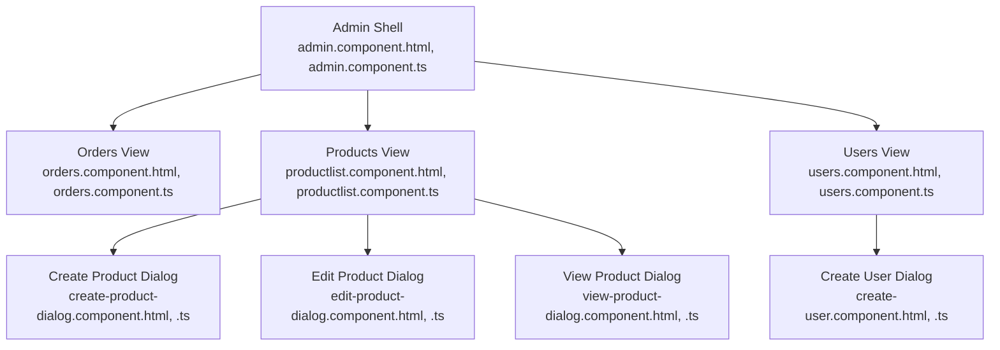

**Diagram sources**
- [admin.component.html](file://Front-end/src/app/features/admin/admin/admin.component.html#L1-L75)
- [admin.component.ts](file://Front-end/src/app/features/admin/admin/admin.component.ts#L1-L38)
- [orders.component.html](file://Front-end/src/app/features/admin/components/orders/orders.component.html#L1-L93)
- [orders.component.ts](file://Front-end/src/app/features/admin/components/orders/orders.component.ts#L1-L89)
- [productlist.component.html](file://Front-end/src/app/features/admin/components/productlist/productlist.component.html#L1-L120)
- [productlist.component.ts](file://Front-end/src/app/features/admin/components/productlist/productlist.component.ts#L1-L97)
- [create-product-dialog.component.html](file://Front-end/src/app/features/admin/components/productlist/create-product-dialog/create-product-dialog.component.html#L1-L68)
- [create-product-dialog.component.ts](file://Front-end/src/app/features/admin/components/productlist/create-product-dialog/create-product-dialog.component.ts#L1-L92)
- [edit-product-dialog.component.html](file://Front-end/src/app/features/admin/components/productlist/edit-product-dialog/edit-product-dialog.component.html#L1-L72)
- [edit-product-dialog.component.ts](file://Front-end/src/app/features/admin/components/productlist/edit-product-dialog/edit-product-dialog.component.ts#L1-L101)
- [view-product-dialog.component.html](file://Front-end/src/app/features/admin/components/productlist/view-product-dialog/view-product-dialog.component.html#L1-L40)
- [view-product-dialog.component.ts](file://Front-end/src/app/features/admin/components/productlist/view-product-dialog/view-product-dialog.component.ts#L1-L18)
- [users.component.html](file://Front-end/src/app/features/admin/components/users/users.component.html#L1-L105)
- [users.component.ts](file://Front-end/src/app/features/admin/components/users/users.component.ts#L1-L96)
- [create-user.component.html](file://Front-end/src/app/features/admin/components/users/create-user/create-user.component.html#L1-L89)
- [create-user.component.ts](file://Front-end/src/app/features/admin/components/users/create-user/create-user.component.ts#L1-L88)

**Section sources**
- [admin.component.html](file://Front-end/src/app/features/admin/admin/admin.component.html#L1-L75)
- [admin.component.ts](file://Front-end/src/app/features/admin/admin/admin.component.ts#L1-L38)

## Core Components
- Admin shell: Provides top-level navigation among Orders, Products, and Users, and a logout mechanism.
- Orders view: Displays orders with status indicators and action buttons to change status.
- Products view: Lists products with actions to view, edit, and delete; opens dialogs for create/edit/view.
- Users view: Lists users with actions to view, edit, and delete; opens dialogs for create/edit/view.
- Dialogs: Encapsulate forms for creating and editing products and users, and read-only views for products and users.

Key responsibilities:
- Navigation and routing between admin sections
- Fetching and mutating data via injected services
- Presenting actionable UI with confirmation feedback
- Handling file uploads for images during product and user creation

**Section sources**
- [admin.component.html](file://Front-end/src/app/features/admin/admin/admin.component.html#L1-L75)
- [admin.component.ts](file://Front-end/src/app/features/admin/admin/admin.component.ts#L1-L38)
- [orders.component.html](file://Front-end/src/app/features/admin/components/orders/orders.component.html#L1-L93)
- [orders.component.ts](file://Front-end/src/app/features/admin/components/orders/orders.component.ts#L1-L89)
- [productlist.component.html](file://Front-end/src/app/features/admin/components/productlist/productlist.component.html#L1-L120)
- [productlist.component.ts](file://Front-end/src/app/features/admin/components/productlist/productlist.component.ts#L1-L97)
- [users.component.html](file://Front-end/src/app/features/admin/components/users/users.component.html#L1-L105)
- [users.component.ts](file://Front-end/src/app/features/admin/components/users/users.component.ts#L1-L96)

## Architecture Overview
The admin dashboard follows a component-driven architecture with dialog modals for CRUD operations. Services are injected per component or provided locally to encapsulate HTTP interactions. The shell component orchestrates navigation and logout.

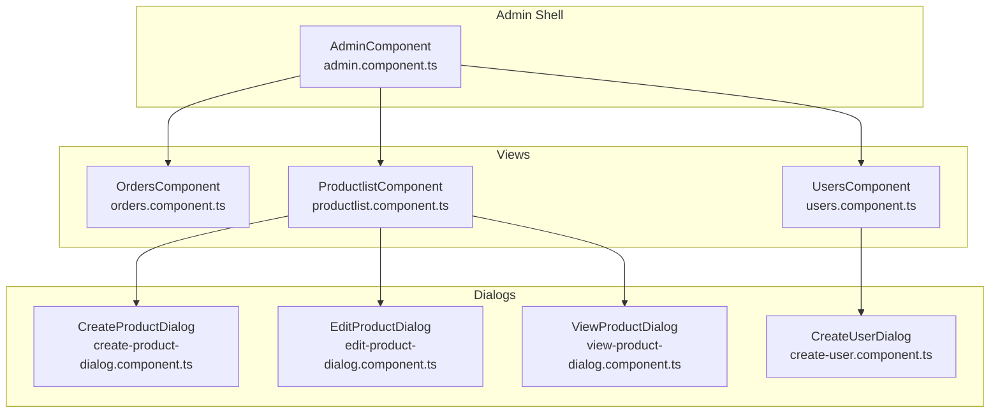

**Diagram sources**
- [admin.component.ts](file://Front-end/src/app/features/admin/admin/admin.component.ts#L1-L38)
- [orders.component.ts](file://Front-end/src/app/features/admin/components/orders/orders.component.ts#L1-L89)
- [productlist.component.ts](file://Front-end/src/app/features/admin/components/productlist/productlist.component.ts#L1-L97)
- [create-product-dialog.component.ts](file://Front-end/src/app/features/admin/components/productlist/create-product-dialog/create-product-dialog.component.ts#L1-L92)
- [edit-product-dialog.component.ts](file://Front-end/src/app/features/admin/components/productlist/edit-product-dialog/edit-product-dialog.component.ts#L1-L101)
- [view-product-dialog.component.ts](file://Front-end/src/app/features/admin/components/productlist/view-product-dialog/view-product-dialog.component.ts#L1-L18)
- [create-user.component.ts](file://Front-end/src/app/features/admin/components/users/create-user/create-user.component.ts#L1-L88)

## Detailed Component Analysis

### Admin Shell Layout
- Provides navigation tabs for Orders, Products, and Users.
- Hosts summary cards and sales charts.
- Includes a logout button that posts to the backend and navigates to the login page.

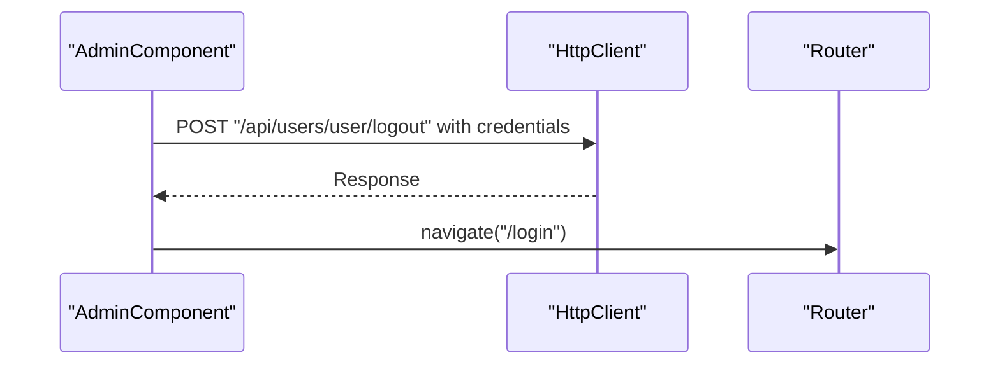

**Diagram sources**
- [admin.component.ts](file://Front-end/src/app/features/admin/admin/admin.component.ts#L25-L36)

**Section sources**
- [admin.component.html](file://Front-end/src/app/features/admin/admin/admin.component.html#L1-L75)
- [admin.component.ts](file://Front-end/src/app/features/admin/admin/admin.component.ts#L1-L38)

### Orders Dashboard
- Displays a table of orders with user avatar, status badges, days elapsed, and total price.
- Buttons to set status to Accepted, Rejected, or Pending.
- Status transitions update the order model and call the order service to persist changes.

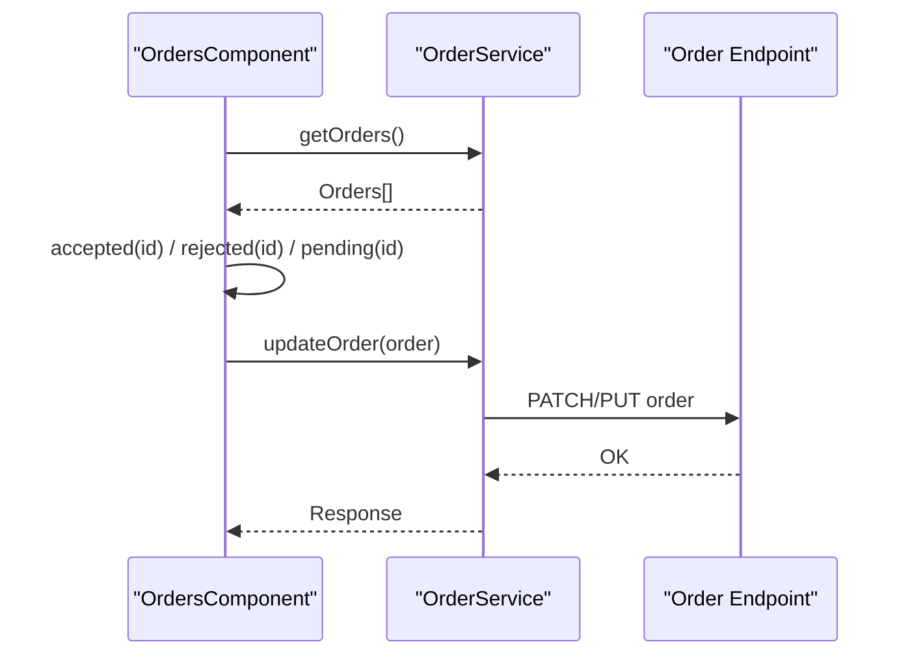

**Diagram sources**
- [orders.component.ts](file://Front-end/src/app/features/admin/components/orders/orders.component.ts#L32-L87)

**Section sources**
- [orders.component.html](file://Front-end/src/app/features/admin/components/orders/orders.component.html#L1-L93)
- [orders.component.ts](file://Front-end/src/app/features/admin/components/orders/orders.component.ts#L1-L89)

### Products Management
- Product list displays image, title, price, description, and action buttons.
- Actions open dialogs for View, Edit, or Delete.
- Delete triggers a service call and refreshes the list with a client-side filter and a success notification.

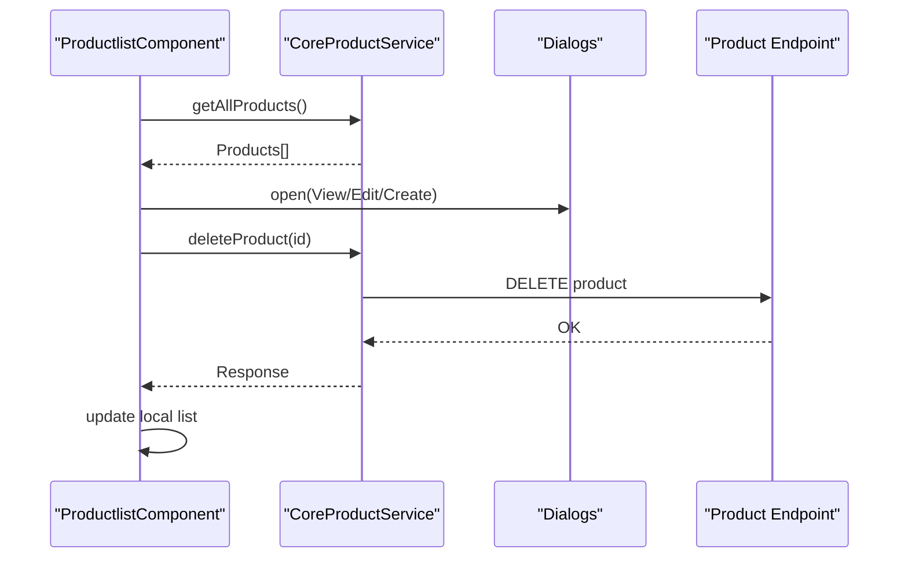

**Diagram sources**
- [productlist.component.ts](file://Front-end/src/app/features/admin/components/productlist/productlist.component.ts#L29-L51)

**Section sources**
- [productlist.component.html](file://Front-end/src/app/features/admin/components/productlist/productlist.component.html#L1-L120)
- [productlist.component.ts](file://Front-end/src/app/features/admin/components/productlist/productlist.component.ts#L1-L97)

#### Dialogs: Create, Edit, View Products
- Create Product Dialog: Reactive form with optional attributes (wattage, voltage, battery type), category selection, and image upload. Submits a FormData payload to create a product.
- Edit Product Dialog: Pre-populated form from selected product data; supports optional image replacement. Submits a FormData payload to update.
- View Product Dialog: Read-only display of product image, title, description, price, and quantity.

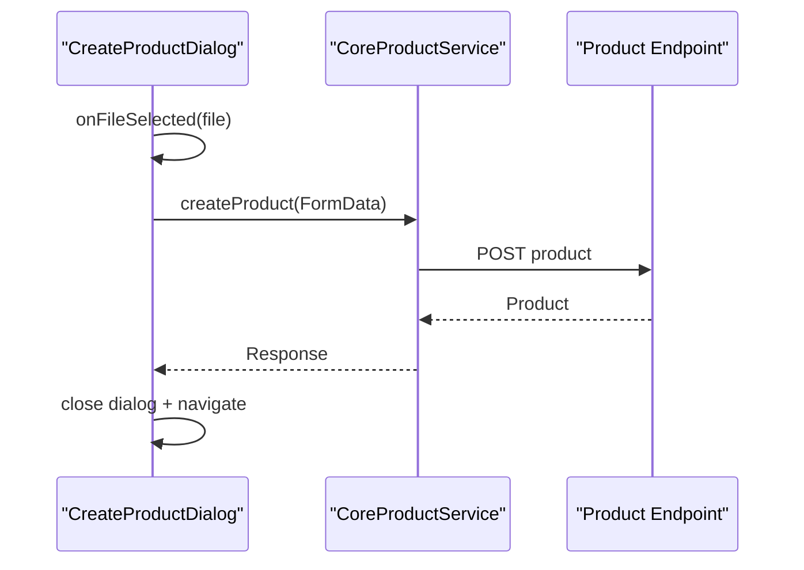

**Diagram sources**
- [create-product-dialog.component.ts](file://Front-end/src/app/features/admin/components/productlist/create-product-dialog/create-product-dialog.component.ts#L49-L89)

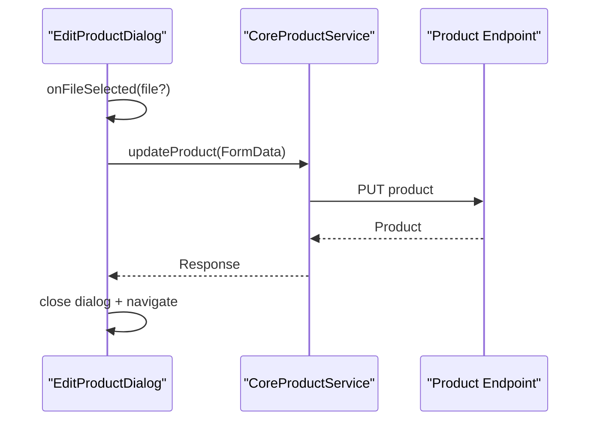

**Diagram sources**
- [edit-product-dialog.component.ts](file://Front-end/src/app/features/admin/components/productlist/edit-product-dialog/edit-product-dialog.component.ts#L61-L95)

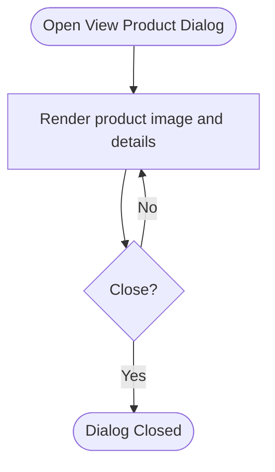

**Diagram sources**
- [view-product-dialog.component.html](file://Front-end/src/app/features/admin/components/productlist/view-product-dialog/view-product-dialog.component.html#L1-L40)

**Section sources**
- [create-product-dialog.component.html](file://Front-end/src/app/features/admin/components/productlist/create-product-dialog/create-product-dialog.component.html#L1-L68)
- [create-product-dialog.component.ts](file://Front-end/src/app/features/admin/components/productlist/create-product-dialog/create-product-dialog.component.ts#L1-L92)
- [edit-product-dialog.component.html](file://Front-end/src/app/features/admin/components/productlist/edit-product-dialog/edit-product-dialog.component.html#L1-L72)
- [edit-product-dialog.component.ts](file://Front-end/src/app/features/admin/components/productlist/edit-product-dialog/edit-product-dialog.component.ts#L1-L101)
- [view-product-dialog.component.html](file://Front-end/src/app/features/admin/components/productlist/view-product-dialog/view-product-dialog.component.html#L1-L40)
- [view-product-dialog.component.ts](file://Front-end/src/app/features/admin/components/productlist/view-product-dialog/view-product-dialog.component.ts#L1-L18)

### Users Administration
- Users list displays user avatar, username, and email with action buttons.
- Actions open dialogs for View, Edit, or Delete.
- Delete triggers a service call and refreshes the list with a client-side filter and a success notification.

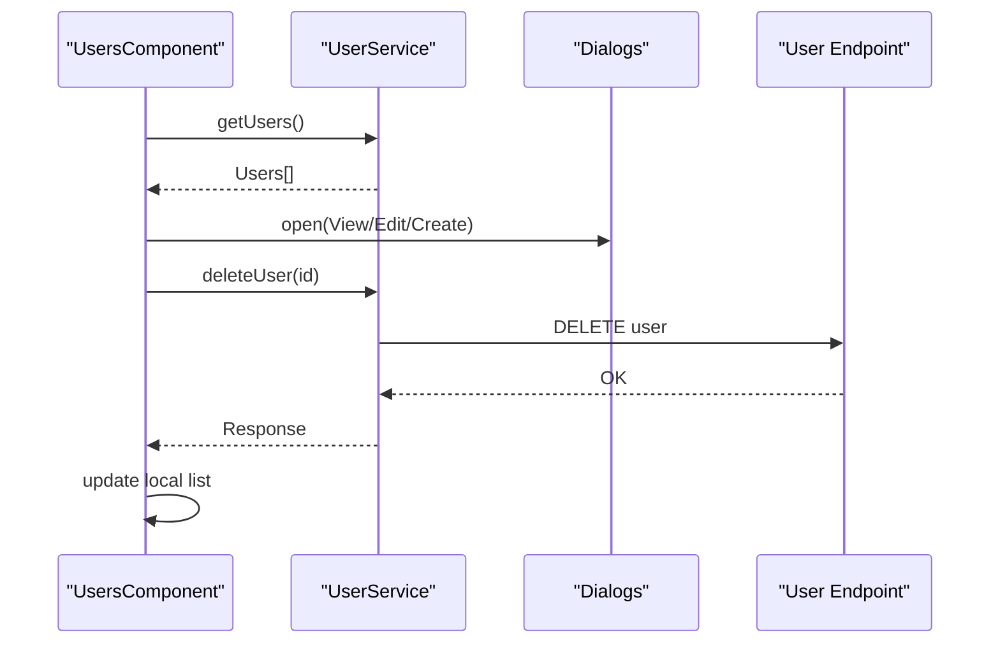

**Diagram sources**
- [users.component.ts](file://Front-end/src/app/features/admin/components/users/users.component.ts#L30-L52)

**Section sources**
- [users.component.html](file://Front-end/src/app/features/admin/components/users/users.component.html#L1-L105)
- [users.component.ts](file://Front-end/src/app/features/admin/components/users/users.component.ts#L1-L96)

#### Dialog: Create User
- Create User Dialog: Reactive form with username, email, gender, password, and password confirmation; image upload. Validates password confirmation before submission. Submits a FormData payload to create a user.

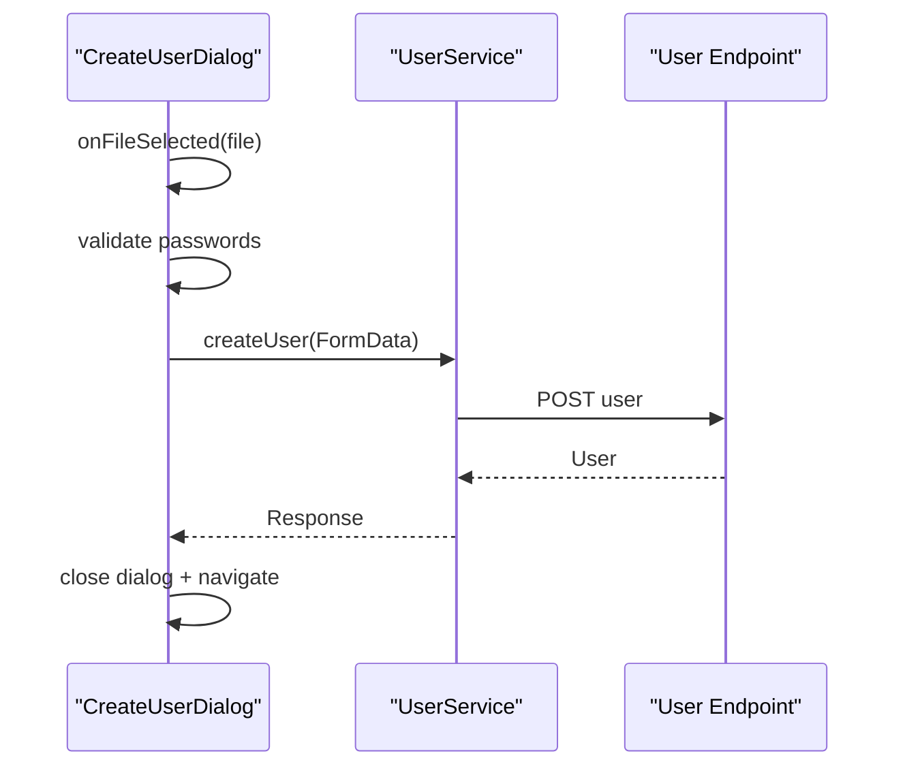

**Diagram sources**
- [create-user.component.ts](file://Front-end/src/app/features/admin/components/users/create-user/create-user.component.ts#L49-L85)

**Section sources**
- [create-user.component.html](file://Front-end/src/app/features/admin/components/users/create-user/create-user.component.html#L1-L89)
- [create-user.component.ts](file://Front-end/src/app/features/admin/components/users/create-user/create-user.component.ts#L1-L88)

### Administrative Workflow
- Navigation: Admin shell routes to Orders, Products, and Users.
- Product CRUD:
  - Create: Open dialog, fill form, select category and image, submit.
  - Edit: Open dialog, pre-filled form, optionally replace image, submit.
  - View: Read-only dialog with product details.
  - Delete: Confirm deletion, remove from local list, notify success.
- User CRUD:
  - Create: Open dialog, fill form, select gender, upload image, submit after validating password confirmation.
  - Edit: Not shown in current dialogs; would follow similar pattern.
  - View: Read-only dialog with user details.
  - Delete: Confirm deletion, remove from local list, notify success.
- Order Processing:
  - Accept/Reject/Pending buttons update order status in memory and persist via service.

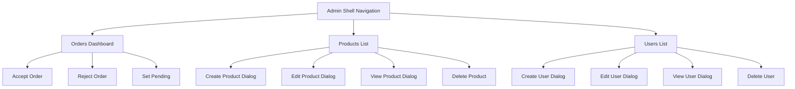

[No sources needed since this diagram shows conceptual workflow, not actual code structure]

## Dependency Analysis
- Components depend on injected services for HTTP operations.
- Dialogs receive data via Angular Material’s MAT_DIALOG_DATA and communicate via MatDialogRef.
- Routing is handled by Angular Router; navigation refreshes views after successful mutations.

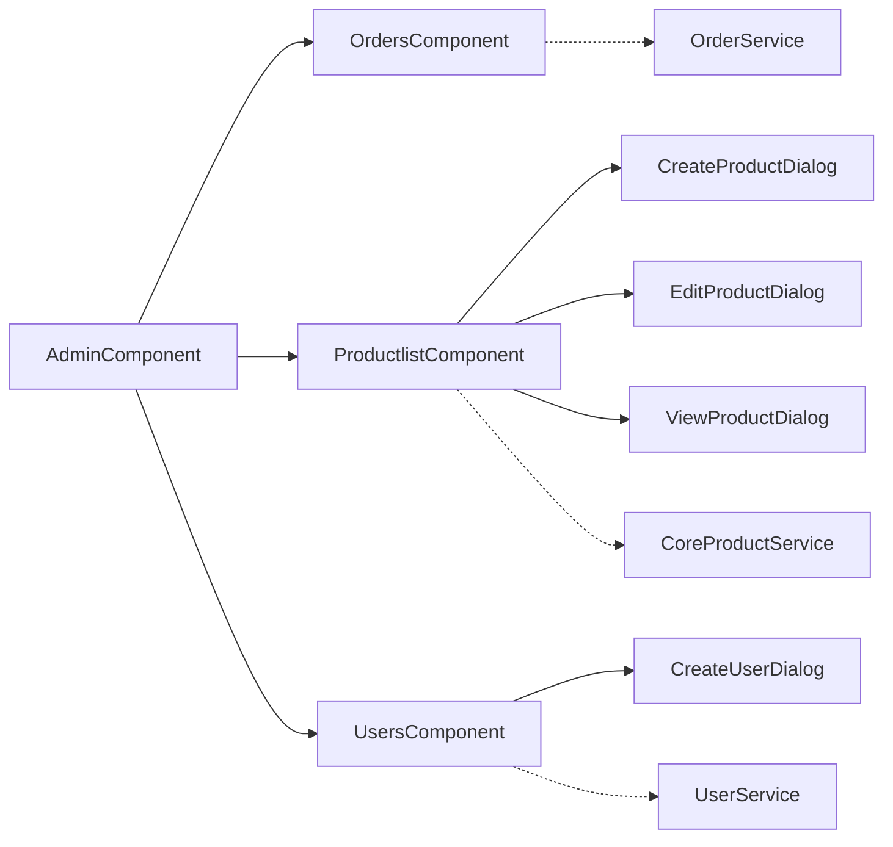

**Diagram sources**
- [admin.component.ts](file://Front-end/src/app/features/admin/admin/admin.component.ts#L1-L38)
- [orders.component.ts](file://Front-end/src/app/features/admin/components/orders/orders.component.ts#L1-L89)
- [productlist.component.ts](file://Front-end/src/app/features/admin/components/productlist/productlist.component.ts#L1-L97)
- [users.component.ts](file://Front-end/src/app/features/admin/components/users/users.component.ts#L1-L96)
- [create-product-dialog.component.ts](file://Front-end/src/app/features/admin/components/productlist/create-product-dialog/create-product-dialog.component.ts#L1-L92)
- [edit-product-dialog.component.ts](file://Front-end/src/app/features/admin/components/productlist/edit-product-dialog/edit-product-dialog.component.ts#L1-L101)
- [view-product-dialog.component.ts](file://Front-end/src/app/features/admin/components/productlist/view-product-dialog/view-product-dialog.component.ts#L1-L18)
- [create-user.component.ts](file://Front-end/src/app/features/admin/components/users/create-user/create-user.component.ts#L1-L88)

**Section sources**
- [admin.component.ts](file://Front-end/src/app/features/admin/admin/admin.component.ts#L1-L38)
- [orders.component.ts](file://Front-end/src/app/features/admin/components/orders/orders.component.ts#L1-L89)
- [productlist.component.ts](file://Front-end/src/app/features/admin/components/productlist/productlist.component.ts#L1-L97)
- [users.component.ts](file://Front-end/src/app/features/admin/components/users/users.component.ts#L1-L96)

## Performance Considerations
- Client-side filtering after delete reduces unnecessary network calls but may not reflect backend deletions immediately if the backend does not re-fetch.
- Navigating away and back to the view triggers a refetch of data, ensuring UI consistency.
- Image uploads use FormData; consider chunked uploads for very large files and implement progress indicators if needed.

[No sources needed since this section provides general guidance]

## Troubleshooting Guide
- Logout does not redirect:
  - Verify the backend endpoint responds to the POST request and sets appropriate cookies.
  - Ensure credentials are included in the request.
- Product/Order updates not reflected:
  - Confirm the service calls succeed and the component navigates to refresh the view.
  - Check console logs for errors returned by the backend.
- Dialogs not closing after success:
  - Ensure dialog.close() is called after successful service responses.
- Password mismatch on user creation:
  - The dialog validates password confirmation and shows an error; correct the mismatch before resubmitting.

**Section sources**
- [admin.component.ts](file://Front-end/src/app/features/admin/admin/admin.component.ts#L25-L36)
- [orders.component.ts](file://Front-end/src/app/features/admin/components/orders/orders.component.ts#L44-L87)
- [productlist.component.ts](file://Front-end/src/app/features/admin/components/productlist/productlist.component.ts#L36-L51)
- [users.component.ts](file://Front-end/src/app/features/admin/components/users/users.component.ts#L36-L52)
- [create-user.component.ts](file://Front-end/src/app/features/admin/components/users/create-user/create-user.component.ts#L57-L66)

## Conclusion
The admin dashboard provides a cohesive set of components for managing products, users, and orders. Dialog-based interfaces streamline CRUD operations with clear feedback and navigation. While real-time updates are not implemented, the design leverages client-side navigation to keep the UI consistent with backend changes.