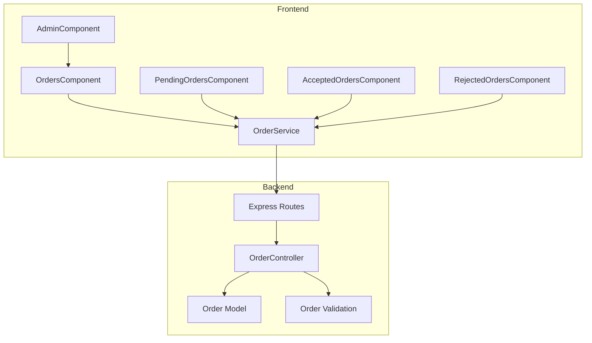
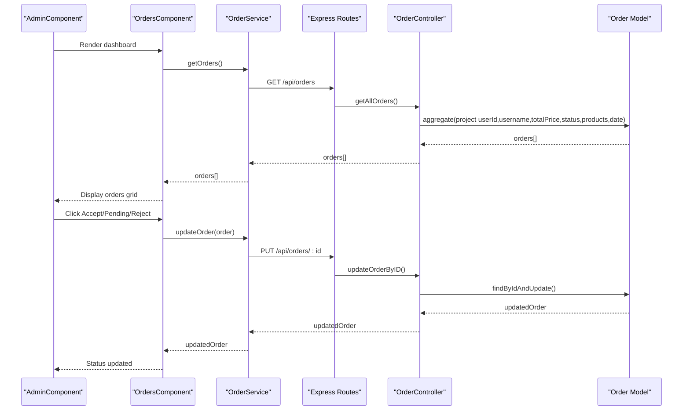
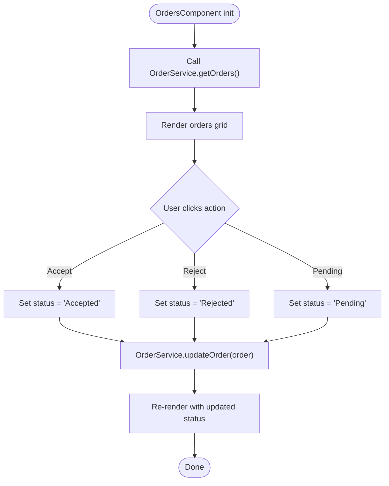
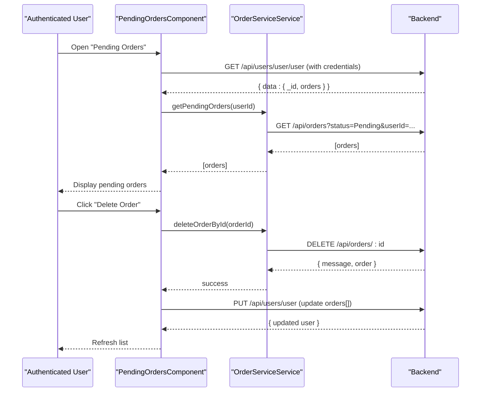
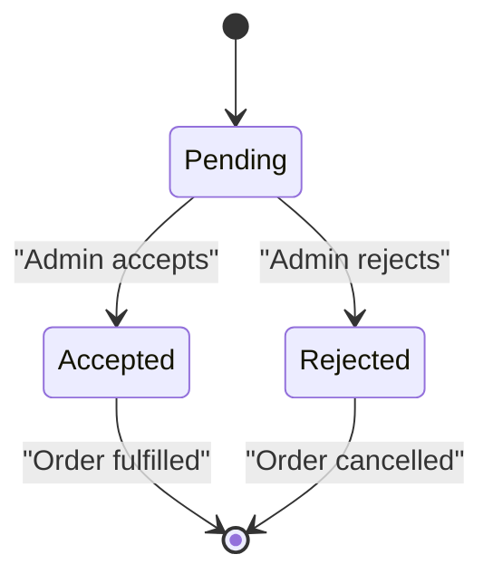
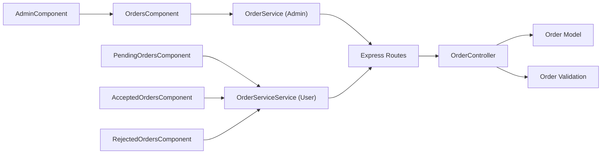

# Order Processing System

<cite>
**Referenced Files in This Document**
- [order.controller.js](file://Back-end/src/Controllers/order.controller.js)
- [order.routes.js](file://Back-end/src/Routes/order.routes.js)
- [order.model.js](file://Back-end/src/Models/order.model.js)
- [order.validation.js](file://Back-end/src/Middlewares/order.validation.js)
- [order.service.ts](file://Front-end/src/app/features/admin/admin/Services/order.service.ts)
- [orders.component.ts](file://Front-end/src/app/features/admin/components/orders/orders.component.ts)
- [orders.component.html](file://Front-end/src/app/features/admin/components/orders/orders.component.html)
- [admin.component.ts](file://Front-end/src/app/features/admin/admin/admin.component.ts)
- [pending-orders.component.ts](file://Front-end/src/app/features/auth/pages/profile/profile components/pending-orders/pending-orders.component.ts)
- [accepted-orders.component.ts](file://Front-end/src/app/features/auth/pages/profile/profile components/accepted-orders/accepted-orders.component.ts)
- [rejected-orders.component.ts](file://Front-end/src/app/features/auth/pages/profile/profile components/rejected-orders/rejected-orders.component.ts)
</cite>

## Table of Contents
1. [Introduction](#introduction)
2. [Project Structure](#project-structure)
3. [Core Components](#core-components)
4. [Architecture Overview](#architecture-overview)
5. [Detailed Component Analysis](#detailed-component-analysis)
6. [Dependency Analysis](#dependency-analysis)
7. [Performance Considerations](#performance-considerations)
8. [Troubleshooting Guide](#troubleshooting-guide)
9. [Conclusion](#conclusion)

## Introduction
This document describes the order processing system within the admin dashboard. It covers the order management interface, order status tracking, administrative order operations, the order service functionality, real-time order updates, filtering and search capabilities, and integration with the order management backend. It also explains the order workflow from creation to completion and how administrators can monitor and manage customer orders.

## Project Structure
The order processing system spans the backend REST API and the Angular frontend admin panel:
- Backend: Express routes expose endpoints for retrieving, creating, updating, and deleting orders, as well as computing daily and weekly order and sales metrics. Validation middleware enforces schema compliance for incoming order documents.
- Frontend: The admin dashboard displays orders, allows changing statuses, and integrates with the backend via an order service. Separate components handle pending, accepted, and rejected orders for authenticated users.

**Diagram sources**
- [admin.component.ts](file://Front-end/src/app/features/admin/admin/admin.component.ts#L10-L23)
- [orders.component.ts](file://Front-end/src/app/features/admin/components/orders/orders.component.ts#L15-L42)
- [order.service.ts](file://Front-end/src/app/features/admin/admin/Services/order.service.ts#L7-L14)
- [order.routes.js](file://Back-end/src/Routes/order.routes.js#L1-L18)
- [order.controller.js](file://Back-end/src/Controllers/order.controller.js#L7-L31)
- [order.model.js](file://Back-end/src/Models/order.model.js#L3-L10)
- [order.validation.js](file://Back-end/src/Middlewares/order.validation.js#L4-L28)

**Section sources**
- [order.routes.js](file://Back-end/src/Routes/order.routes.js#L1-L18)
- [order.controller.js](file://Back-end/src/Controllers/order.controller.js#L7-L31)
- [order.model.js](file://Back-end/src/Models/order.model.js#L3-L10)
- [order.validation.js](file://Back-end/src/Middlewares/order.validation.js#L4-L28)
- [order.service.ts](file://Front-end/src/app/features/admin/admin/Services/order.service.ts#L7-L14)
- [orders.component.ts](file://Front-end/src/app/features/admin/components/orders/orders.component.ts#L15-L42)

## Core Components
- Order model defines the schema for orders, including user reference, username, date, total price, product references, and status.
- Order controller exposes endpoints for listing orders, retrieving by ID, updating, deleting, and computing daily/weekly order and sales metrics.
- Order validation middleware enforces a strict schema for order documents, ensuring required fields and acceptable status values.
- Order service in the frontend encapsulates HTTP calls to the backend endpoints for orders and metrics.
- Orders component renders the admin dashboard grid, enabling status transitions and displaying computed age and totals.
- User-specific order components (pending, accepted, rejected) fetch and display orders filtered by status for authenticated users.

**Section sources**
- [order.model.js](file://Back-end/src/Models/order.model.js#L3-L10)
- [order.controller.js](file://Back-end/src/Controllers/order.controller.js#L7-L31)
- [order.validation.js](file://Back-end/src/Middlewares/order.validation.js#L4-L28)
- [order.service.ts](file://Front-end/src/app/features/admin/admin/Services/order.service.ts#L7-L55)
- [orders.component.ts](file://Front-end/src/app/features/admin/components/orders/orders.component.ts#L15-L88)
- [pending-orders.component.ts](file://Front-end/src/app/features/auth/pages/profile/profile components/pending-orders/pending-orders.component.ts#L25-L119)
- [accepted-orders.component.ts](file://Front-end/src/app/features/auth/pages/profile/profile components/accepted-orders/accepted-orders.component.ts#L24-L75)
- [rejected-orders.component.ts](file://Front-end/src/app/features/auth/pages/profile/profile components/rejected-orders/rejected-orders.component.ts#L25-L78)

## Architecture Overview
The admin dashboard integrates with the backend through typed HTTP endpoints. Administrators can view orders, change their status, and see derived metrics. Users can view their own orders grouped by status.

**Diagram sources**
- [admin.component.ts](file://Front-end/src/app/features/admin/admin/admin.component.ts#L10-L23)
- [orders.component.ts](file://Front-end/src/app/features/admin/components/orders/orders.component.ts#L32-L87)
- [order.service.ts](file://Front-end/src/app/features/admin/admin/Services/order.service.ts#L12-L26)
- [order.routes.js](file://Back-end/src/Routes/order.routes.js#L10-L15)
- [order.controller.js](file://Back-end/src/Controllers/order.controller.js#L59-L74)
- [order.model.js](file://Back-end/src/Models/order.model.js#L3-L10)

## Detailed Component Analysis

### Backend: Order Controller and Routes
- Endpoints:
  - GET /api/orders: Returns all orders with computed days difference and selected fields.
  - GET /api/orders/:id: Retrieves a single order by ID.
  - GET /api/orders/:status: Placeholder for status-based retrieval.
  - POST /api/orders: Placeholder for order creation.
  - PUT /api/orders/:id: Updates an order by ID and returns the updated document.
  - DELETE /api/orders/:id: Deletes an order by ID.
  - Metrics endpoints:
    - GET /api/orders/weeklySales, /api/orders/salesPerWeek, /api/orders/dailySales
    - GET /api/orders/weekly, /api/orders/daily
- Aggregation pipeline projects user, pricing, products, and computes days elapsed since order date.
- Error handling returns appropriate HTTP status codes and messages.

**Section sources**
- [order.controller.js](file://Back-end/src/Controllers/order.controller.js#L7-L31)
- [order.controller.js](file://Back-end/src/Controllers/order.controller.js#L43-L47)
- [order.controller.js](file://Back-end/src/Controllers/order.controller.js#L59-L74)
- [order.controller.js](file://Back-end/src/Controllers/order.controller.js#L79-L97)
- [order.controller.js](file://Back-end/src/Controllers/order.controller.js#L101-L125)
- [order.controller.js](file://Back-end/src/Controllers/order.controller.js#L129-L165)
- [order.controller.js](file://Back-end/src/Controllers/order.controller.js#L170-L194)
- [order.controller.js](file://Back-end/src/Controllers/order.controller.js#L198-L222)
- [order.controller.js](file://Back-end/src/Controllers/order.controller.js#L226-L243)
- [order.routes.js](file://Back-end/src/Routes/order.routes.js#L5-L15)

### Backend: Order Model and Validation
- Schema fields:
  - userId: ObjectId referencing users
  - username: String
  - date: Date
  - totalPrice: Number
  - products: Array of ObjectIds referencing products
  - status: String with allowed values Pending, Accepted, Rejected
- Validation schema enforces required fields and enum constraint on status, with custom formats for ObjectId and date-time.

**Section sources**
- [order.model.js](file://Back-end/src/Models/order.model.js#L3-L10)
- [order.validation.js](file://Back-end/src/Middlewares/order.validation.js#L4-L28)
- [order.validation.js](file://Back-end/src/Middlewares/order.validation.js#L31-L34)

### Frontend: Admin Orders Dashboard
- Component responsibilities:
  - Fetches orders via OrderService.getOrders().
  - Computes days since order date for display.
  - Provides actions to set status to Accepted, Rejected, or Pending.
  - Calls OrderService.updateOrder(order) to persist changes.
- Template displays:
  - Username and avatar placeholder
  - Action buttons per order
  - Status indicator with color coding
  - Days elapsed and total price

**Diagram sources**
- [orders.component.ts](file://Front-end/src/app/features/admin/components/orders/orders.component.ts#L32-L87)
- [orders.component.html](file://Front-end/src/app/features/admin/components/orders/orders.component.html#L23-L87)
- [order.service.ts](file://Front-end/src/app/features/admin/admin/Services/order.service.ts#L12-L26)

**Section sources**
- [orders.component.ts](file://Front-end/src/app/features/admin/components/orders/orders.component.ts#L15-L88)
- [orders.component.html](file://Front-end/src/app/features/admin/components/orders/orders.component.html#L1-L93)
- [order.service.ts](file://Front-end/src/app/features/admin/admin/Services/order.service.ts#L12-L26)

### Frontend: User Order Views (Profile)
- Pending Orders:
  - Loads orders filtered by Pending status for the authenticated user.
  - Opens a dialog to inspect order details.
  - Supports deleting orders and updating user’s order list.
- Accepted Orders:
  - Loads orders filtered by Accepted status for the authenticated user.
  - Opens a dialog to inspect order details.
- Rejected Orders:
  - Loads orders filtered by Rejected status for the authenticated user.
  - Opens a dialog to inspect order details.

**Diagram sources**
- [pending-orders.component.ts](file://Front-end/src/app/features/auth/pages/profile/profile components/pending-orders/pending-orders.component.ts#L69-L106)
- [accepted-orders.component.ts](file://Front-end/src/app/features/auth/pages/profile/profile components/accepted-orders/accepted-orders.component.ts#L39-L48)
- [rejected-orders.component.ts](file://Front-end/src/app/features/auth/pages/profile/profile components/rejected-orders/rejected-orders.component.ts#L41-L49)

**Section sources**
- [pending-orders.component.ts](file://Front-end/src/app/features/auth/pages/profile/profile components/pending-orders/pending-orders.component.ts#L25-L119)
- [accepted-orders.component.ts](file://Front-end/src/app/features/auth/pages/profile/profile components/accepted-orders/accepted-orders.component.ts#L24-L75)
- [rejected-orders.component.ts](file://Front-end/src/app/features/auth/pages/profile/profile components/rejected-orders/rejected-orders.component.ts#L25-L78)

### Order Workflow: Creation to Completion
- Creation:
  - The POST endpoint for orders is declared but not implemented in the controller. A validation schema exists for incoming order bodies.
- Processing:
  - Admins can update order status to Accepted or Rejected via the admin dashboard.
  - Users can view their orders grouped by status and delete Pending orders if needed.
- Completion:
  - The model supports status transitions. No explicit “Completed” state is defined in the current schema.

**Diagram sources**
- [order.model.js](file://Back-end/src/Models/order.model.js#L9-L9)
- [orders.component.ts](file://Front-end/src/app/features/admin/components/orders/orders.component.ts#L44-L87)

## Dependency Analysis
- Frontend depends on OrderService for all backend interactions.
- OrderService maps to Express routes under /api/orders.
- OrderController depends on OrderModel for persistence and order.validation for input validation.
- AdminComponent composes OrdersComponent; user profile components depend on OrderServiceService and user service.

**Diagram sources**
- [order.service.ts](file://Front-end/src/app/features/admin/admin/Services/order.service.ts#L7-L55)
- [orders.component.ts](file://Front-end/src/app/features/admin/components/orders/orders.component.ts#L15-L20)
- [admin.component.ts](file://Front-end/src/app/features/admin/admin/admin.component.ts#L10-L19)
- [order.routes.js](file://Back-end/src/Routes/order.routes.js#L1-L18)
- [order.controller.js](file://Back-end/src/Controllers/order.controller.js#L1-L2)
- [order.model.js](file://Back-end/src/Models/order.model.js#L1-L1)
- [order.validation.js](file://Back-end/src/Middlewares/order.validation.js#L1-L2)

**Section sources**
- [order.service.ts](file://Front-end/src/app/features/admin/admin/Services/order.service.ts#L7-L55)
- [orders.component.ts](file://Front-end/src/app/features/admin/components/orders/orders.component.ts#L15-L20)
- [admin.component.ts](file://Front-end/src/app/features/admin/admin/admin.component.ts#L10-L19)
- [order.routes.js](file://Back-end/src/Routes/order.routes.js#L1-L18)
- [order.controller.js](file://Back-end/src/Controllers/order.controller.js#L1-L2)
- [order.model.js](file://Back-end/src/Models/order.model.js#L1-L1)
- [order.validation.js](file://Back-end/src/Middlewares/order.validation.js#L1-L2)

## Performance Considerations
- Aggregation pipeline in the controller computes days difference client-side in the template and server-side in the aggregation. Consider moving the computation to the frontend to reduce backend load and leverage caching.
- Frequent polling of order lists should be avoided; prefer event-driven updates or periodic refresh intervals.
- Filtering by status is currently a placeholder in the controller. Implement efficient queries to avoid scanning entire collections.

## Troubleshooting Guide
- 404 Not Found when updating/deleting:
  - Ensure the order ID is present in the URL and matches a document in the collection.
- 500 Internal Server Error:
  - Check aggregation pipelines and error handling blocks for exceptions during date computations or groupings.
- Validation errors:
  - Verify that the request body conforms to the schema, including ObjectId formats and allowed status values.

**Section sources**
- [order.controller.js](file://Back-end/src/Controllers/order.controller.js#L60-L74)
- [order.controller.js](file://Back-end/src/Controllers/order.controller.js#L86-L97)
- [order.validation.js](file://Back-end/src/Middlewares/order.validation.js#L4-L28)

## Conclusion
The order processing system provides an admin dashboard for viewing and managing orders, with status transitions and metrics endpoints. The frontend integrates with backend APIs through a dedicated service, while the backend validates and persists order data. Enhancements could include implementing the missing POST endpoint, adding a Completed status, and optimizing filtering and real-time updates.