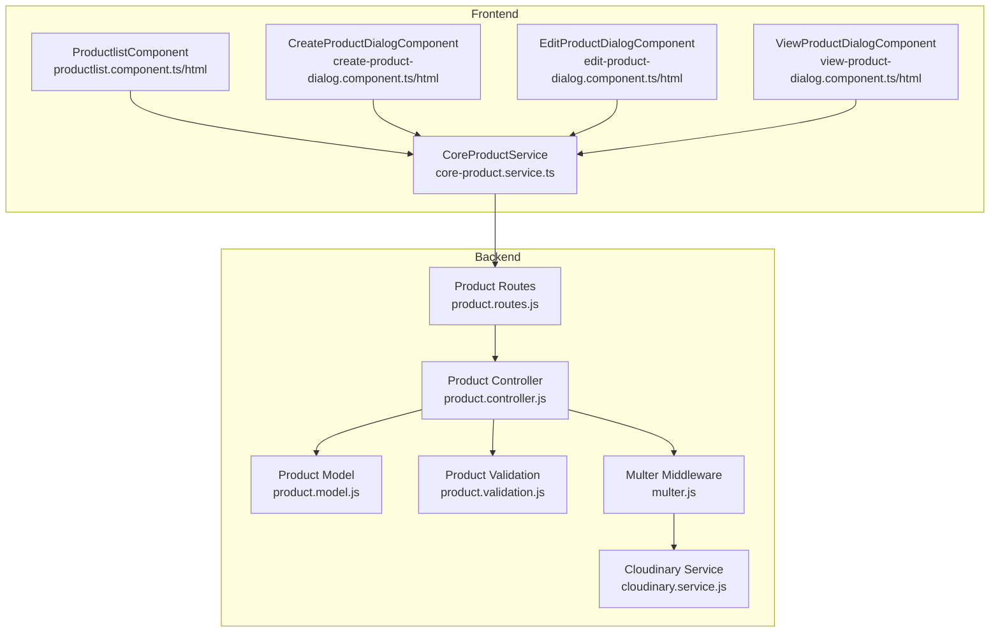
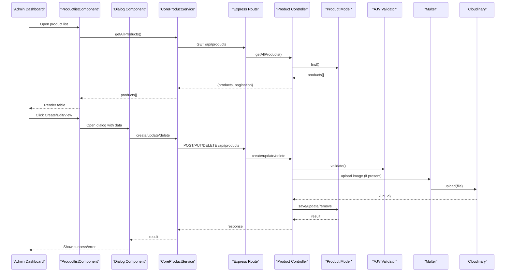
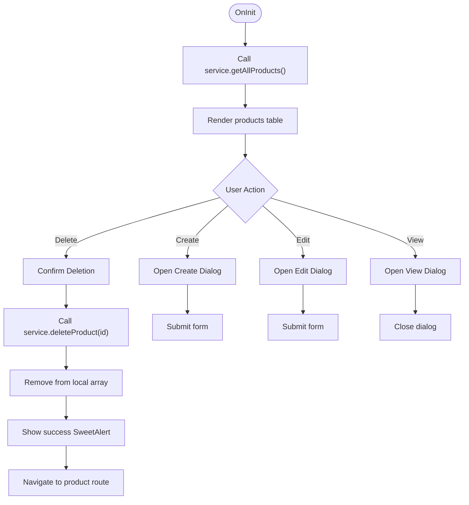
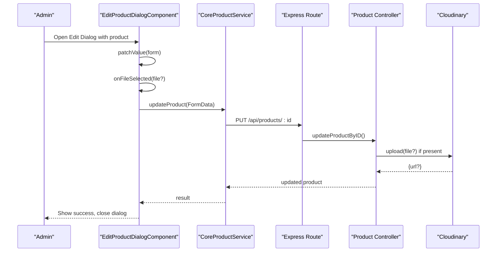
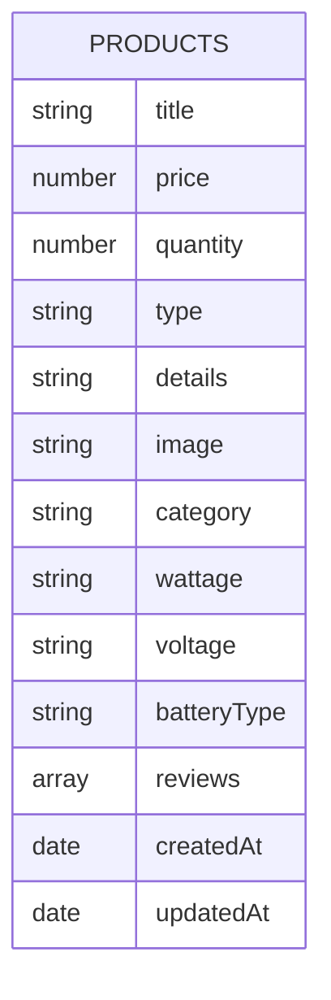
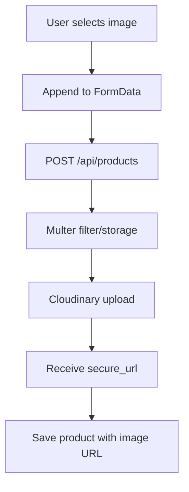
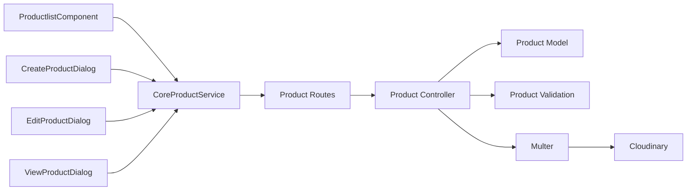

# Product Management System

<cite>
**Referenced Files in This Document**
- [productlist.component.ts](file://Front-end/src/app/features/admin/components/productlist/productlist.component.ts)
- [productlist.component.html](file://Front-end/src/app/features/admin/components/productlist/productlist.component.html)
- [create-product-dialog.component.ts](file://Front-end/src/app/features/admin/components/productlist/create-product-dialog/create-product-dialog.component.ts)
- [create-product-dialog.component.html](file://Front-end/src/app/features/admin/components/productlist/create-product-dialog/create-product-dialog.component.html)
- [edit-product-dialog.component.ts](file://Front-end/src/app/features/admin/components/productlist/edit-product-dialog/edit-product-dialog.component.ts)
- [edit-product-dialog.component.html](file://Front-end/src/app/features/admin/components/productlist/edit-product-dialog/edit-product-dialog.component.html)
- [view-product-dialog.component.ts](file://Front-end/src/app/features/admin/components/productlist/view-product-dialog/view-product-dialog.component.ts)
- [view-product-dialog.component.html](file://Front-end/src/app/features/admin/components/productlist/view-product-dialog/view-product-dialog.component.html)
- [core-product.service.ts](file://Front-end/src/app/core/services/core-product.service.ts)
- [product.model.js](file://Back-end/src/Models/product.model.js)
- [product.controller.js](file://Back-end/src/Controllers/product.controller.js)
- [product.routes.js](file://Back-end/src/Routes/product.routes.js)
- [product.validation.js](file://Back-end/src/Middlewares/product.validation.js)
- [multer.js](file://Back-end/src/Middlewares/multer.js)
- [cloudinary.service.js](file://Back-end/src/services/cloudinary.service.js)
</cite>

## Table of Contents
1. [Introduction](#introduction)
2. [Project Structure](#project-structure)
3. [Core Components](#core-components)
4. [Architecture Overview](#architecture-overview)
5. [Detailed Component Analysis](#detailed-component-analysis)
6. [Dependency Analysis](#dependency-analysis)
7. [Performance Considerations](#performance-considerations)
8. [Troubleshooting Guide](#troubleshooting-guide)
9. [Conclusion](#conclusion)

## Introduction
This document describes the product management system within the admin dashboard. It covers the product listing interface, CRUD operations for products, and dialog-based workflows for creating, editing, and viewing products. It also documents the product data model, form validation, image upload capabilities, and real-time product updates. The relationship between the product list component and individual dialog components is explained, along with backend integration points.

## Project Structure
The product management system spans Angular front-end components and services, and Express.js backend routes, controllers, models, and middleware. The front-end uses Material dialogs for modal forms and a dedicated service to communicate with the backend API. The backend enforces validation, handles file uploads via Multer, and stores images on Cloudinary.



**Diagram sources**
- [productlist.component.ts](file://Front-end/src/app/features/admin/components/productlist/productlist.component.ts#L1-L97)
- [productlist.component.html](file://Front-end/src/app/features/admin/components/productlist/productlist.component.html#L1-L120)
- [create-product-dialog.component.ts](file://Front-end/src/app/features/admin/components/productlist/create-product-dialog/create-product-dialog.component.ts#L1-L92)
- [create-product-dialog.component.html](file://Front-end/src/app/features/admin/components/productlist/create-product-dialog/create-product-dialog.component.html#L1-L68)
- [edit-product-dialog.component.ts](file://Front-end/src/app/features/admin/components/productlist/edit-product-dialog/edit-product-dialog.component.ts#L1-L101)
- [edit-product-dialog.component.html](file://Front-end/src/app/features/admin/components/productlist/edit-product-dialog/edit-product-dialog.component.html#L1-L72)
- [view-product-dialog.component.ts](file://Front-end/src/app/features/admin/components/productlist/view-product-dialog/view-product-dialog.component.ts#L1-L18)
- [view-product-dialog.component.html](file://Front-end/src/app/features/admin/components/productlist/view-product-dialog/view-product-dialog.component.html#L1-L40)
- [core-product.service.ts](file://Front-end/src/app/core/services/core-product.service.ts#L1-L75)
- [product.routes.js](file://Back-end/src/Routes/product.routes.js#L1-L20)
- [product.controller.js](file://Back-end/src/Controllers/product.controller.js#L1-L348)
- [product.model.js](file://Back-end/src/Models/product.model.js#L1-L29)
- [product.validation.js](file://Back-end/src/Middlewares/product.validation.js#L1-L39)
- [multer.js](file://Back-end/src/Middlewares/multer.js#L1-L33)
- [cloudinary.service.js](file://Back-end/src/services/cloudinary.service.js#L1-L22)

**Section sources**
- [productlist.component.ts](file://Front-end/src/app/features/admin/components/productlist/productlist.component.ts#L1-L97)
- [productlist.component.html](file://Front-end/src/app/features/admin/components/productlist/productlist.component.html#L1-L120)
- [core-product.service.ts](file://Front-end/src/app/core/services/core-product.service.ts#L1-L75)
- [product.routes.js](file://Back-end/src/Routes/product.routes.js#L1-L20)

## Core Components
- ProductlistComponent: Renders the product table, triggers CRUD actions, opens dialogs, and refreshes the list after operations.
- Dialog Components: CreateProductDialogComponent, EditProductDialogComponent, and ViewProductDialogComponent encapsulate creation, editing, and viewing workflows.
- CoreProductService: Provides typed HTTP methods to the backend API for listing, retrieving, creating, updating, deleting, and reviewing products.

Key responsibilities:
- ProductlistComponent orchestrates user actions and dialog interactions.
- Dialog components manage form state, file selection, and submission.
- CoreProductService abstracts API endpoints and parameter handling.

**Section sources**
- [productlist.component.ts](file://Front-end/src/app/features/admin/components/productlist/productlist.component.ts#L19-L96)
- [create-product-dialog.component.ts](file://Front-end/src/app/features/admin/components/productlist/create-product-dialog/create-product-dialog.component.ts#L16-L91)
- [edit-product-dialog.component.ts](file://Front-end/src/app/features/admin/components/productlist/edit-product-dialog/edit-product-dialog.component.ts#L16-L100)
- [view-product-dialog.component.ts](file://Front-end/src/app/features/admin/components/productlist/view-product-dialog/view-product-dialog.component.ts#L11-L17)
- [core-product.service.ts](file://Front-end/src/app/core/services/core-product.service.ts#L9-L74)

## Architecture Overview
The system follows a layered architecture:
- Frontend: Angular components and services.
- Backend: Express routes, controller logic, Mongoose model, AJV validation, Multer file handling, and Cloudinary integration.



**Diagram sources**
- [productlist.component.ts](file://Front-end/src/app/features/admin/components/productlist/productlist.component.ts#L29-L84)
- [core-product.service.ts](file://Front-end/src/app/core/services/core-product.service.ts#L14-L53)
- [product.routes.js](file://Back-end/src/Routes/product.routes.js#L6-L16)
- [product.controller.js](file://Back-end/src/Controllers/product.controller.js#L10-L68)
- [product.validation.js](file://Back-end/src/Middlewares/product.validation.js#L4-L38)
- [multer.js](file://Back-end/src/Middlewares/multer.js#L19-L32)
- [cloudinary.service.js](file://Back-end/src/services/cloudinary.service.js#L10-L19)

## Detailed Component Analysis

### Product List Component
Responsibilities:
- Fetch all products on initialization.
- Provide actions to create, edit, view, and delete products.
- Refresh the list after successful deletion and navigate to the product route for consistency.

Behavior highlights:
- Uses CoreProductService to fetch and mutate products.
- Opens Material dialogs for edit/view/create workflows.
- Navigates to the product route after success to refresh state.



**Diagram sources**
- [productlist.component.ts](file://Front-end/src/app/features/admin/components/productlist/productlist.component.ts#L29-L84)

**Section sources**
- [productlist.component.ts](file://Front-end/src/app/features/admin/components/productlist/productlist.component.ts#L19-L96)
- [productlist.component.html](file://Front-end/src/app/features/admin/components/productlist/productlist.component.html#L50-L105)

### Dialog Components

#### Create Product Dialog
Responsibilities:
- Capture product details via reactive form controls.
- Handle image selection and append to FormData.
- Submit to backend via CoreProductService and display success notification.

Key points:
- Reactive form groups map to product fields.
- FormData includes image file for multipart upload.
- On success, closes dialog and navigates to refresh the list.

```mermaid
sequenceDiagram
participant Admin as "Admin"
participant Create as "CreateProductDialogComponent"
participant Service as "CoreProductService"
participant Route as "Express Route"
participant Ctrl as "Product Controller"
participant Cloud as "Cloudinary"
Admin->>Create : Open Create Dialog
Create->>Create : onFileSelected(file)
Create->>Create : build FormData
Create->>Service : createProduct(FormData)
Service->>Route : POST /api/products
Route->>Ctrl : createNewProduct()
Ctrl->>Cloud : upload(file)
Cloud-->>Ctrl : {url}
Ctrl-->>Service : success
Service-->>Create : success
Create-->>Admin : Show success, close dialog
```

**Diagram sources**
- [create-product-dialog.component.ts](file://Front-end/src/app/features/admin/components/productlist/create-product-dialog/create-product-dialog.component.ts#L42-L90)
- [create-product-dialog.component.html](file://Front-end/src/app/features/admin/components/productlist/create-product-dialog/create-product-dialog.component.html#L7-L63)
- [core-product.service.ts](file://Front-end/src/app/core/services/core-product.service.ts#L40-L42)
- [product.routes.js](file://Back-end/src/Routes/product.routes.js#L9-L9)
- [product.controller.js](file://Back-end/src/Controllers/product.controller.js#L107-L175)
- [cloudinary.service.js](file://Back-end/src/services/cloudinary.service.js#L10-L19)

**Section sources**
- [create-product-dialog.component.ts](file://Front-end/src/app/features/admin/components/productlist/create-product-dialog/create-product-dialog.component.ts#L16-L91)
- [create-product-dialog.component.html](file://Front-end/src/app/features/admin/components/productlist/create-product-dialog/create-product-dialog.component.html#L1-L68)

#### Edit Product Dialog
Responsibilities:
- Pre-populate form with existing product data.
- Allow optional image replacement.
- Submit updates via CoreProductService.

Key points:
- Uses MAT_DIALOG_DATA to receive product payload.
- Builds FormData with optional image replacement.
- On success, closes dialog and navigates to refresh the list.



**Diagram sources**
- [edit-product-dialog.component.ts](file://Front-end/src/app/features/admin/components/productlist/edit-product-dialog/edit-product-dialog.component.ts#L30-L96)
- [edit-product-dialog.component.html](file://Front-end/src/app/features/admin/components/productlist/edit-product-dialog/edit-product-dialog.component.html#L7-L67)
- [core-product.service.ts](file://Front-end/src/app/core/services/core-product.service.ts#L44-L48)
- [product.routes.js](file://Back-end/src/Routes/product.routes.js#L12-L12)
- [product.controller.js](file://Back-end/src/Controllers/product.controller.js#L179-L218)
- [cloudinary.service.js](file://Back-end/src/services/cloudinary.service.js#L10-L19)

**Section sources**
- [edit-product-dialog.component.ts](file://Front-end/src/app/features/admin/components/productlist/edit-product-dialog/edit-product-dialog.component.ts#L16-L100)
- [edit-product-dialog.component.html](file://Front-end/src/app/features/admin/components/productlist/edit-product-dialog/edit-product-dialog.component.html#L1-L72)

#### View Product Dialog
Responsibilities:
- Display product details in a read-only dialog.
- Show image and key attributes.

Key points:
- Receives product data via MAT_DIALOG_DATA.
- Minimal logic; focuses on presentation.

**Section sources**
- [view-product-dialog.component.ts](file://Front-end/src/app/features/admin/components/productlist/view-product-dialog/view-product-dialog.component.ts#L11-L17)
- [view-product-dialog.component.html](file://Front-end/src/app/features/admin/components/productlist/view-product-dialog/view-product-dialog.component.html#L1-L40)

### Product Data Model
The product model defines the schema stored in MongoDB, including required and optional fields, and a text index for search.



**Diagram sources**
- [product.model.js](file://Back-end/src/Models/product.model.js#L11-L26)

**Section sources**
- [product.model.js](file://Back-end/src/Models/product.model.js#L1-L29)

### Form Validation
Frontend forms use Angular reactive forms to capture data. Backend validation uses AJV with a strict schema that requires title, price, quantity, and category, while allowing optional fields like type, details, image, wattage, voltage, and batteryType.

Validation characteristics:
- Required: title, price, quantity, category.
- Optional: type, details, image, wattage, voltage, batteryType.
- Reviews array has nested constraints.

**Section sources**
- [create-product-dialog.component.ts](file://Front-end/src/app/features/admin/components/productlist/create-product-dialog/create-product-dialog.component.ts#L29-L38)
- [edit-product-dialog.component.ts](file://Front-end/src/app/features/admin/components/productlist/edit-product-dialog/edit-product-dialog.component.ts#L19-L29)
- [product.validation.js](file://Back-end/src/Middlewares/product.validation.js#L4-L35)

### Image Upload Capabilities
The system supports image uploads:
- Frontend: File input captured and appended to FormData.
- Backend: Multer middleware validates and stores temporary files.
- Cloudinary service uploads the file and returns a secure URL.
- Controller updates the product record with the image URL.



**Diagram sources**
- [create-product-dialog.component.ts](file://Front-end/src/app/features/admin/components/productlist/create-product-dialog/create-product-dialog.component.ts#L42-L59)
- [edit-product-dialog.component.ts](file://Front-end/src/app/features/admin/components/productlist/edit-product-dialog/edit-product-dialog.component.ts#L50-L75)
- [multer.js](file://Back-end/src/Middlewares/multer.js#L19-L32)
- [cloudinary.service.js](file://Back-end/src/services/cloudinary.service.js#L10-L19)
- [product.controller.js](file://Back-end/src/Controllers/product.controller.js#L154-L167)

**Section sources**
- [multer.js](file://Back-end/src/Middlewares/multer.js#L1-L33)
- [cloudinary.service.js](file://Back-end/src/services/cloudinary.service.js#L1-L22)
- [product.controller.js](file://Back-end/src/Controllers/product.controller.js#L107-L175)

### Real-Time Product Updates
Real-time behavior:
- After successful create/update/delete, the frontend navigates away and back to the product route to refresh the list.
- The list component subscribes to getAllProducts on init, ensuring the latest data is displayed after navigation.

Limitations:
- No WebSocket or live subscription is implemented; navigation-driven refresh ensures eventual consistency.

**Section sources**
- [productlist.component.ts](file://Front-end/src/app/features/admin/components/productlist/productlist.component.ts#L36-L51)
- [create-product-dialog.component.ts](file://Front-end/src/app/features/admin/components/productlist/create-product-dialog/create-product-dialog.component.ts#L74-L83)
- [edit-product-dialog.component.ts](file://Front-end/src/app/features/admin/components/productlist/edit-product-dialog/edit-product-dialog.component.ts#L79-L89)

## Dependency Analysis
Frontend dependencies:
- ProductlistComponent depends on CoreProductService, Angular Router, HttpClient, and Material dialogs.
- Dialog components depend on CoreProductService, MAT_DIALOG_DATA, and Angular reactive forms.

Backend dependencies:
- Routes delegate to the controller.
- Controller uses the model, validator, Multer middleware, and Cloudinary service.



**Diagram sources**
- [productlist.component.ts](file://Front-end/src/app/features/admin/components/productlist/productlist.component.ts#L23-L28)
- [core-product.service.ts](file://Front-end/src/app/core/services/core-product.service.ts#L10-L12)
- [product.routes.js](file://Back-end/src/Routes/product.routes.js#L1-L19)
- [product.controller.js](file://Back-end/src/Controllers/product.controller.js#L1-L6)
- [product.model.js](file://Back-end/src/Models/product.model.js#L1-L1)
- [product.validation.js](file://Back-end/src/Middlewares/product.validation.js#L1-L2)
- [multer.js](file://Back-end/src/Middlewares/multer.js#L1-L3)
- [cloudinary.service.js](file://Back-end/src/services/cloudinary.service.js#L1-L1)

**Section sources**
- [productlist.component.ts](file://Front-end/src/app/features/admin/components/productlist/productlist.component.ts#L1-L10)
- [core-product.service.ts](file://Front-end/src/app/core/services/core-product.service.ts#L1-L9)
- [product.routes.js](file://Back-end/src/Routes/product.routes.js#L1-L4)

## Performance Considerations
- Pagination and filtering: The backend supports minPrice, maxPrice, category, search, and sort with pagination, enabling efficient large dataset browsing.
- Text search index: A text index on title and details improves search performance.
- Image optimization: Uploading to Cloudinary provides scalable image delivery.

Recommendations:
- Debounce search queries on the frontend to reduce backend load.
- Lazy-load images in the product table to improve initial render performance.
- Consider implementing server-sent events or WebSocket for true real-time updates if frequent changes occur.

**Section sources**
- [product.controller.js](file://Back-end/src/Controllers/product.controller.js#L10-L68)
- [product.model.js](file://Back-end/src/Models/product.model.js#L25-L26)

## Troubleshooting Guide
Common issues and resolutions:
- Validation errors on create/update: Ensure required fields (title, price, quantity, category) are provided and numeric fields are valid. Check the validation schema for constraints.
- Image upload failures: Verify file type filters and that the image is selected before submission. Confirm Cloudinary credentials and network connectivity.
- Navigation refresh not updating list: The current implementation relies on route navigation to refresh; ensure navigation occurs after successful operations.
- Multer file filter errors: Confirm the selected file is a JPEG, PNG, or JPG.

**Section sources**
- [product.validation.js](file://Back-end/src/Middlewares/product.validation.js#L4-L35)
- [multer.js](file://Back-end/src/Middlewares/multer.js#L19-L32)
- [cloudinary.service.js](file://Back-end/src/services/cloudinary.service.js#L3-L8)
- [productlist.component.ts](file://Front-end/src/app/features/admin/components/productlist/productlist.component.ts#L40-L49)

## Conclusion
The product management system integrates Angular dialogs with a robust backend pipeline. The frontend provides intuitive workflows for creating, editing, viewing, and deleting products, while the backend enforces validation, manages file uploads, and persists data. The current design uses navigation-driven refresh for list updates; extending to real-time updates could further enhance user experience.