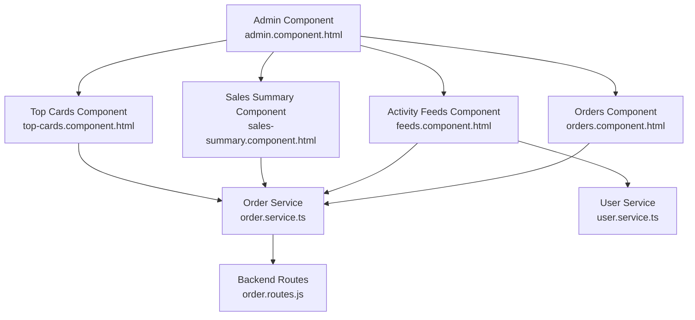
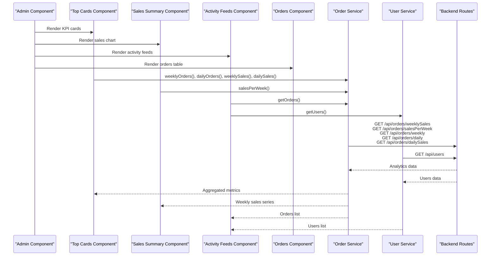
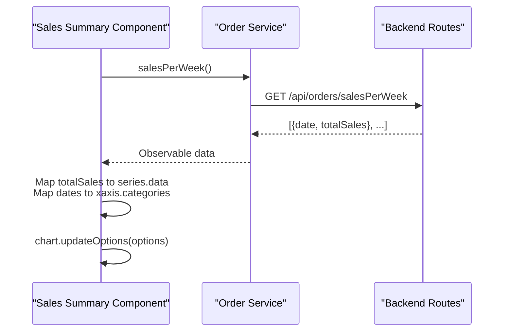
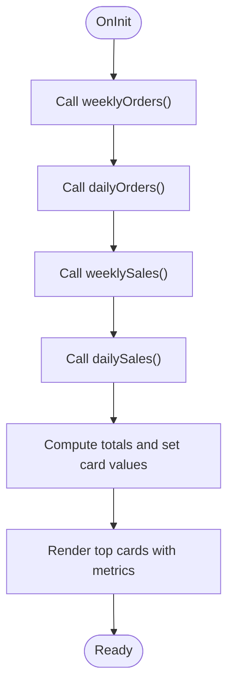
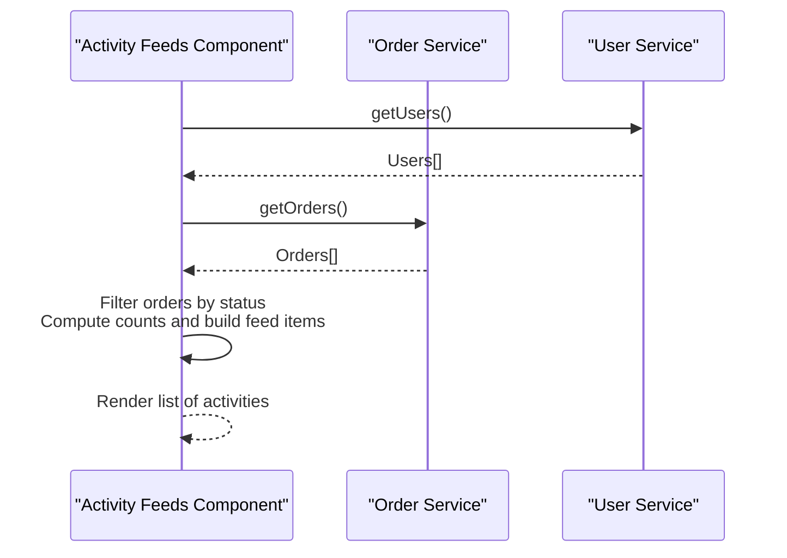
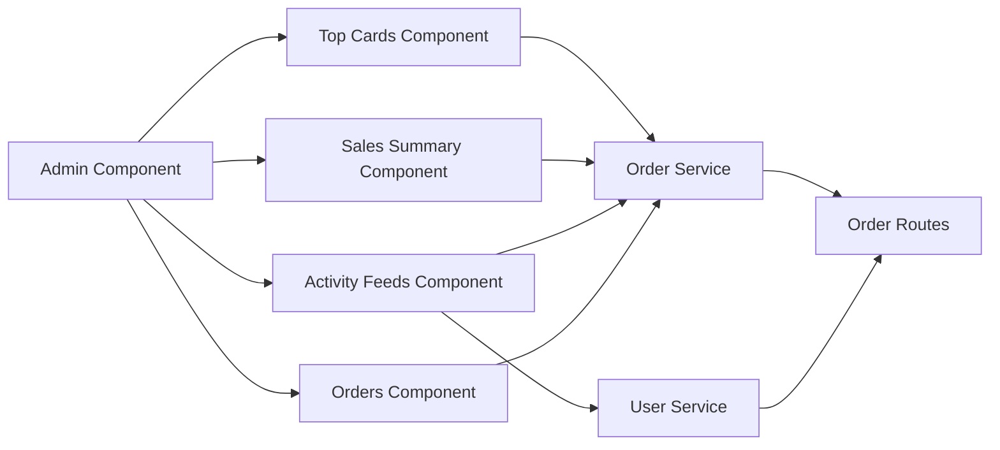

# Sales Analytics and Reporting

<cite>
**Referenced Files in This Document**
- [sales-summary.component.ts](file://Front-end/src/app/features/admin/components/sales-summary/sales-summary.component.ts)
- [sales-summary.component.html](file://Front-end/src/app/features/admin/components/sales-summary/sales-summary.component.html)
- [top-cards.component.ts](file://Front-end/src/app/features/admin/components/top-cards/top-cards.component.ts)
- [top-cards.component.html](file://Front-end/src/app/features/admin/components/top-cards/top-cards.component.html)
- [feeds.component.ts](file://Front-end/src/app/features/admin/components/feeds/feeds.component.ts)
- [feeds.component.html](file://Front-end/src/app/features/admin/components/feeds/feeds.component.html)
- [order.service.ts](file://Front-end/src/app/features/admin/admin/Services/order.service.ts)
- [user.service.ts](file://Front-end/src/app/features/admin/admin/Services/user.service.ts)
- [admin.component.ts](file://Front-end/src/app/features/admin/admin/admin.component.ts)
- [admin.component.html](file://Front-end/src/app/features/admin/admin/admin.component.html)
- [orders.component.ts](file://Front-end/src/app/features/admin/components/orders/orders.component.ts)
- [orders.component.html](file://Front-end/src/app/features/admin/components/orders/orders.component.html)
- [order.routes.js](file://Back-end/src/Routes/order.routes.js)
</cite>

## Table of Contents
1. [Introduction](#introduction)
2. [Project Structure](#project-structure)
3. [Core Components](#core-components)
4. [Architecture Overview](#architecture-overview)
5. [Detailed Component Analysis](#detailed-component-analysis)
6. [Dependency Analysis](#dependency-analysis)
7. [Performance Considerations](#performance-considerations)
8. [Troubleshooting Guide](#troubleshooting-guide)
9. [Conclusion](#conclusion)

## Introduction
This document explains the sales analytics and reporting components in the admin dashboard. It covers the sales summary chart, top cards for key metrics, and activity feeds for real-time updates. It also documents data visualization techniques, metric calculations, real-time data updates, and integration with backend analytics services. Together, these components provide comprehensive business insights and performance monitoring for administrators.

## Project Structure
The admin dashboard integrates three primary analytics components:
- Sales Summary: An area chart visualizing weekly sales trends.
- Top Cards: KPI cards summarizing weekly sales, daily sales, weekly orders, and daily orders.
- Activity Feeds: Real-time notifications about pending, accepted, rejected orders, and total users.

These components are orchestrated by the Admin Component and consume data via dedicated services.

**Diagram sources**
- [admin.component.html](file://Front-end/src/app/features/admin/admin/admin.component.html#L38-L64)
- [top-cards.component.html](file://Front-end/src/app/features/admin/components/top-cards/top-cards.component.html#L1-L83)
- [sales-summary.component.html](file://Front-end/src/app/features/admin/components/sales-summary/sales-summary.component.html#L1-L37)
- [feeds.component.html](file://Front-end/src/app/features/admin/components/feeds/feeds.component.html#L1-L28)
- [orders.component.html](file://Front-end/src/app/features/admin/components/orders/orders.component.html#L1-L93)
- [order.service.ts](file://Front-end/src/app/features/admin/admin/Services/order.service.ts#L1-L56)
- [user.service.ts](file://Front-end/src/app/features/admin/admin/Services/user.service.ts#L1-L31)
- [order.routes.js](file://Back-end/src/Routes/order.routes.js#L1-L19)

**Section sources**
- [admin.component.html](file://Front-end/src/app/features/admin/admin/admin.component.html#L38-L64)
- [admin.component.ts](file://Front-end/src/app/features/admin/admin/admin.component.ts#L10-L23)

## Core Components
- Sales Summary Component
  - Renders an area chart of weekly sales.
  - Fetches aggregated sales per week from the backend and updates the chart dynamically.
  - Uses ng-apexcharts for visualization.

- Top Cards Component
  - Displays four KPIs: weekly sales, daily sales, weekly orders, and daily orders.
  - Subscribes to multiple endpoints to compute totals and present them in visually distinct cards.

- Activity Feeds Component
  - Aggregates recent events: pending orders, total orders, accepted/rejected counts, and total users.
  - Provides contextual icons and timestamps for quick situational awareness.

**Section sources**
- [sales-summary.component.ts](file://Front-end/src/app/features/admin/components/sales-summary/sales-summary.component.ts#L43-L109)
- [sales-summary.component.html](file://Front-end/src/app/features/admin/components/sales-summary/sales-summary.component.html#L1-L37)
- [top-cards.component.ts](file://Front-end/src/app/features/admin/components/top-cards/top-cards.component.ts#L14-L106)
- [top-cards.component.html](file://Front-end/src/app/features/admin/components/top-cards/top-cards.component.html#L1-L83)
- [feeds.component.ts](file://Front-end/src/app/features/admin/components/feeds/feeds.component.ts#L22-L95)
- [feeds.component.html](file://Front-end/src/app/features/admin/components/feeds/feeds.component.html#L1-L28)

## Architecture Overview
The analytics pipeline connects frontend components to backend endpoints through Angular services. The Admin Component composes the analytics widgets and the orders table. Data flows from backend controllers to frontend services and then to components for rendering.

**Diagram sources**
- [admin.component.ts](file://Front-end/src/app/features/admin/admin/admin.component.ts#L10-L23)
- [top-cards.component.ts](file://Front-end/src/app/features/admin/components/top-cards/top-cards.component.ts#L29-L77)
- [sales-summary.component.ts](file://Front-end/src/app/features/admin/components/sales-summary/sales-summary.component.ts#L82-L108)
- [feeds.component.ts](file://Front-end/src/app/features/admin/components/feeds/feeds.component.ts#L35-L93)
- [order.service.ts](file://Front-end/src/app/features/admin/admin/Services/order.service.ts#L36-L54)
- [user.service.ts](file://Front-end/src/app/features/admin/admin/Services/user.service.ts#L11-L13)
- [order.routes.js](file://Back-end/src/Routes/order.routes.js#L5-L15)

## Detailed Component Analysis

### Sales Summary Component
- Purpose: Visualize weekly sales trends using an area chart.
- Data Source: Aggregated sales per week endpoint.
- Visualization: Smoothed area chart with dynamic series and categories.
- Update Mechanism: Subscribes to sales data and updates chart options, then triggers a chart refresh.

**Diagram sources**
- [sales-summary.component.ts](file://Front-end/src/app/features/admin/components/sales-summary/sales-summary.component.ts#L82-L108)
- [order.service.ts](file://Front-end/src/app/features/admin/admin/Services/order.service.ts#L52-L54)
- [order.routes.js](file://Back-end/src/Routes/order.routes.js#L6-L6)

**Section sources**
- [sales-summary.component.ts](file://Front-end/src/app/features/admin/components/sales-summary/sales-summary.component.ts#L43-L109)
- [sales-summary.component.html](file://Front-end/src/app/features/admin/components/sales-summary/sales-summary.component.html#L1-L37)

### Top Cards Component
- Purpose: Present key performance indicators in a compact card layout.
- Metrics:
  - Weekly Sales: Sum of sales over the current week.
  - Daily Sales: Sum of sales for today.
  - Weekly Orders: Total orders placed in the current week.
  - Daily Orders: Total orders placed today.
- Data Sources: Dedicated endpoints for weekly sales, daily sales, weekly orders, and daily orders.
- Rendering: Four cards with color-coded backgrounds and icons.

**Diagram sources**
- [top-cards.component.ts](file://Front-end/src/app/features/admin/components/top-cards/top-cards.component.ts#L29-L104)

**Section sources**
- [top-cards.component.ts](file://Front-end/src/app/features/admin/components/top-cards/top-cards.component.ts#L14-L106)
- [top-cards.component.html](file://Front-end/src/app/features/admin/components/top-cards/top-cards.component.html#L1-L83)

### Activity Feeds Component
- Purpose: Provide real-time insights and highlights about orders and users.
- Highlights:
  - Pending orders count.
  - Total orders count.
  - Accepted orders count.
  - Rejected orders count.
  - Total users count.
- Data Sources: Orders list and users list.
- Rendering: List items with colored badges and timestamps.

**Diagram sources**
- [feeds.component.ts](file://Front-end/src/app/features/admin/components/feeds/feeds.component.ts#L35-L93)
- [user.service.ts](file://Front-end/src/app/features/admin/admin/Services/user.service.ts#L11-L13)
- [order.service.ts](file://Front-end/src/app/features/admin/admin/Services/order.service.ts#L12-L14)

**Section sources**
- [feeds.component.ts](file://Front-end/src/app/features/admin/components/feeds/feeds.component.ts#L22-L95)
- [feeds.component.html](file://Front-end/src/app/features/admin/components/feeds/feeds.component.html#L1-L28)

### Orders Component (Context)
- Purpose: Display the full orders table with actions to update statuses.
- Data Source: Orders list endpoint.
- Behavior: Computes days since order date and supports accepting, rejecting, and setting orders to pending.

**Section sources**
- [orders.component.ts](file://Front-end/src/app/features/admin/components/orders/orders.component.ts#L15-L88)
- [orders.component.html](file://Front-end/src/app/features/admin/components/orders/orders.component.html#L1-L93)

## Dependency Analysis
- Component Dependencies
  - Admin Component composes Top Cards, Sales Summary, Activity Feeds, and Orders components.
  - Each analytics component depends on Order Service for metrics and on User Service for user counts.
- Service Dependencies
  - Order Service exposes endpoints for weekly/daily sales and orders.
  - User Service exposes endpoint for users.
- Backend Dependencies
  - Express routes define analytics endpoints consumed by the frontend.

**Diagram sources**
- [admin.component.ts](file://Front-end/src/app/features/admin/admin/admin.component.ts#L10-L23)
- [order.service.ts](file://Front-end/src/app/features/admin/admin/Services/order.service.ts#L1-L56)
- [user.service.ts](file://Front-end/src/app/features/admin/admin/Services/user.service.ts#L1-L31)
- [order.routes.js](file://Back-end/src/Routes/order.routes.js#L1-L19)

**Section sources**
- [admin.component.ts](file://Front-end/src/app/features/admin/admin/admin.component.ts#L10-L23)
- [order.service.ts](file://Front-end/src/app/features/admin/admin/Services/order.service.ts#L1-L56)
- [user.service.ts](file://Front-end/src/app/features/admin/admin/Services/user.service.ts#L1-L31)
- [order.routes.js](file://Back-end/src/Routes/order.routes.js#L1-L19)

## Performance Considerations
- Data Fetching
  - Use pagination or limit queries on large datasets to avoid heavy payloads.
  - Debounce or throttle frequent polling to reduce network overhead.
- Rendering
  - Prefer virtual scrolling for large tables to minimize DOM nodes.
  - Optimize chart rendering by batching updates and avoiding unnecessary redraws.
- Caching
  - Cache frequently accessed analytics data with appropriate TTL to reduce backend load.
- Network
  - Enable compression and use efficient serialization formats.
- UI Responsiveness
  - Offload heavy computations to Web Workers if needed.
  - Use lazy loading for components and services.

## Troubleshooting Guide
- No Data in Charts or Cards
  - Verify backend endpoints are reachable and returning expected structures.
  - Confirm frontend service calls match backend route definitions.
- Incorrect Totals
  - Inspect aggregation logic in components and ensure correct field mapping.
  - Validate date boundaries for daily/weekly calculations.
- Chart Not Updating
  - Ensure chart update methods are invoked after data binding.
  - Check for errors in subscription callbacks.
- Activity Feed Counts Mismatch
  - Review filtering logic for order statuses and user counts.
  - Confirm data availability and absence of null/undefined values.

**Section sources**
- [sales-summary.component.ts](file://Front-end/src/app/features/admin/components/sales-summary/sales-summary.component.ts#L82-L108)
- [top-cards.component.ts](file://Front-end/src/app/features/admin/components/top-cards/top-cards.component.ts#L29-L77)
- [feeds.component.ts](file://Front-end/src/app/features/admin/components/feeds/feeds.component.ts#L35-L93)
- [order.routes.js](file://Back-end/src/Routes/order.routes.js#L5-L15)

## Conclusion
The sales analytics and reporting system integrates three complementary components—sales summary, top cards, and activity feeds—to deliver actionable insights and real-time visibility. Through well-defined services and backend routes, these components transform raw order and user data into meaningful metrics and visualizations, enabling effective performance monitoring and informed decision-making for administrators.