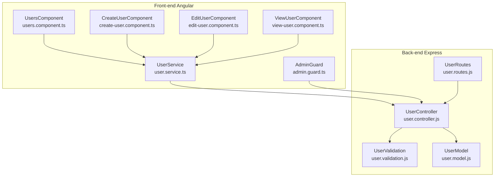
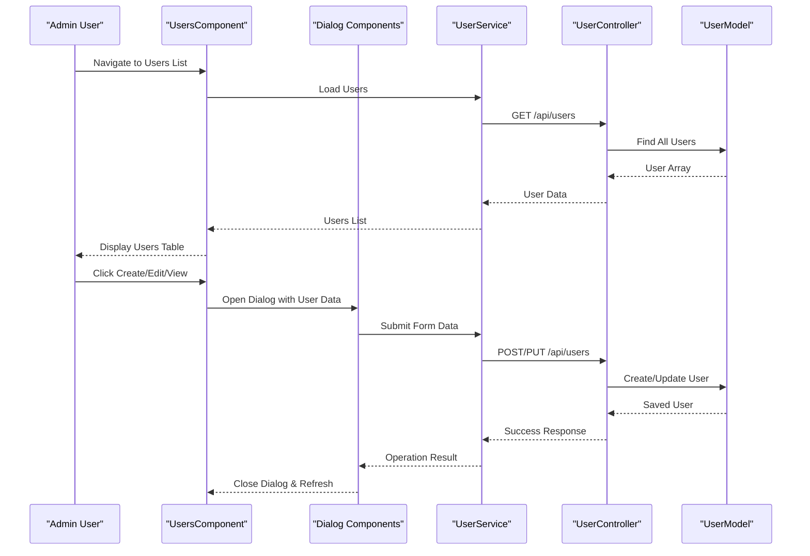
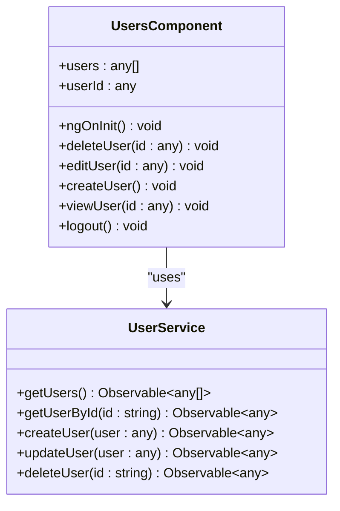
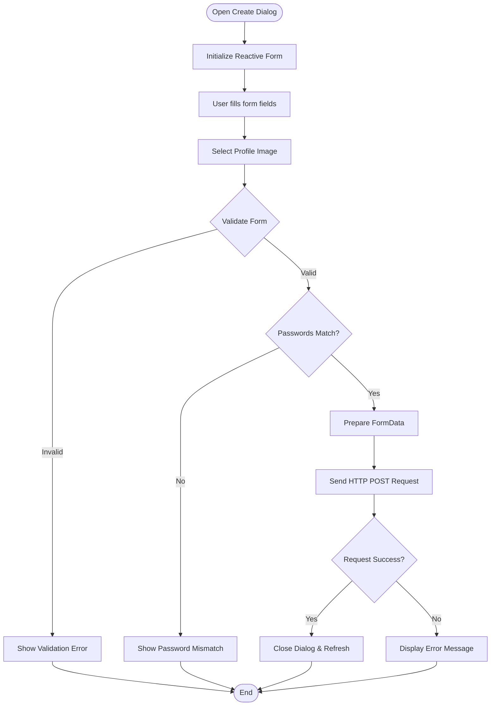
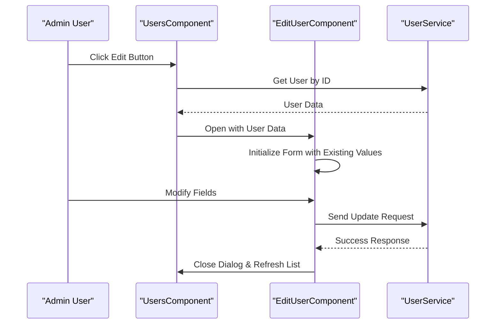
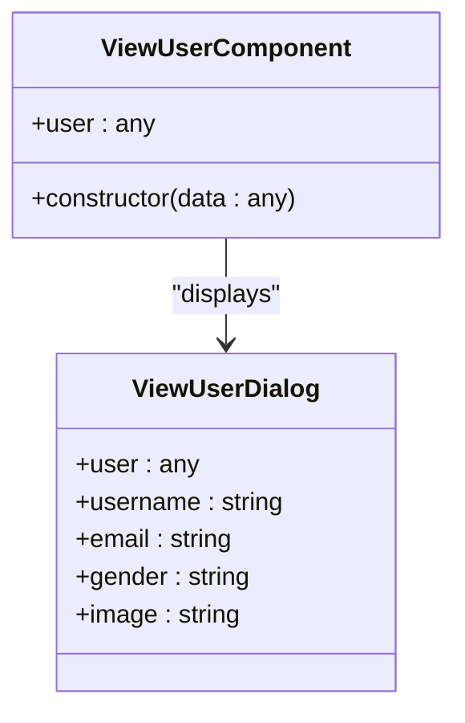
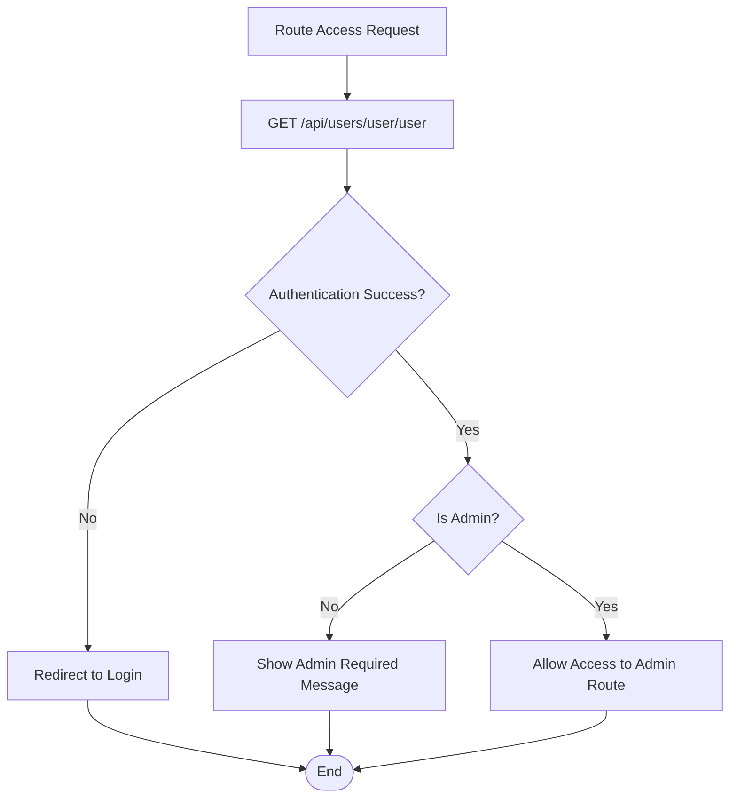
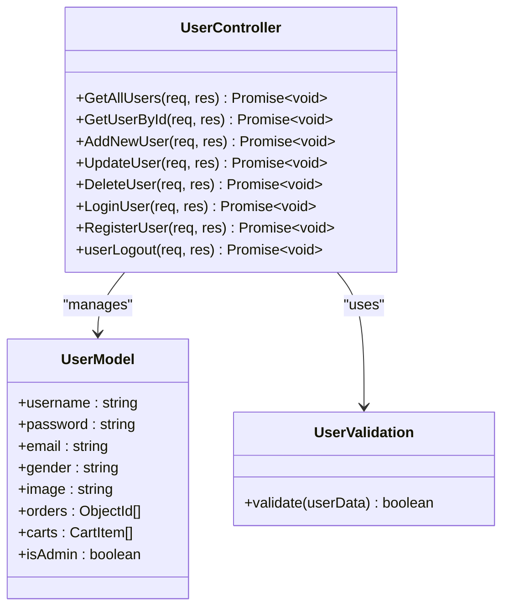
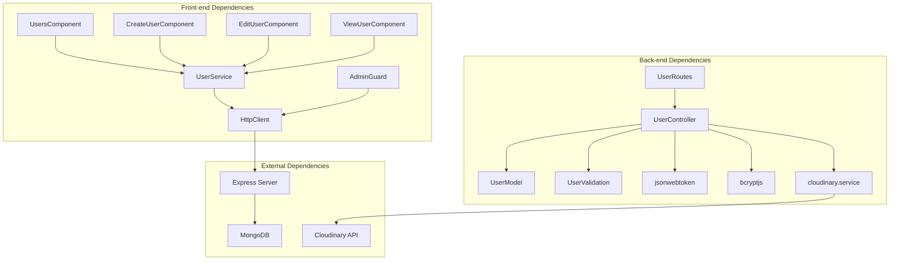

# User Administration System

<cite>
**Referenced Files in This Document**
- [users.component.ts](file://Front-end/src/app/features/admin/components/users/users.component.ts)
- [users.component.html](file://Front-end/src/app/features/admin/components/users/users.component.html)
- [users.component.css](file://Front-end/src/app/features/admin/components/users/users.component.css)
- [create-user.component.ts](file://Front-end/src/app/features/admin/components/users/create-user/create-user.component.ts)
- [create-user.component.html](file://Front-end/src/app/features/admin/components/users/create-user/create-user.component.html)
- [edit-user.component.ts](file://Front-end/src/app/features/admin/components/users/edit-user/edit-user.component.ts)
- [edit-user.component.html](file://Front-end/src/app/features/admin/components/users/edit-user/edit-user.component.html)
- [view-user.component.ts](file://Front-end/src/app/features/admin/components/users/view-user/view-user.component.ts)
- [view-user.component.html](file://Front-end/src/app/features/admin/components/users/view-user/view-user.component.html)
- [user.service.ts](file://Front-end/src/app/features/admin/admin/Services/user.service.ts)
- [admin.guard.ts](file://Front-end/src/app/core/guards/admin.guard.ts)
- [user.controller.js](file://Back-end/src/Controllers/user.controller.js)
- [user.routes.js](file://Back-end/src/Routes/user.routes.js)
- [user.validation.js](file://Back-end/src/Middlewares/user.validation.js)
- [user.model.js](file://Back-end/src/Models/user.model.js)
</cite>

## Table of Contents
1. [Introduction](#introduction)
2. [Project Structure](#project-structure)
3. [Core Components](#core-components)
4. [Architecture Overview](#architecture-overview)
5. [Detailed Component Analysis](#detailed-component-analysis)
6. [Dependency Analysis](#dependency-analysis)
7. [Performance Considerations](#performance-considerations)
8. [Troubleshooting Guide](#troubleshooting-guide)
9. [Conclusion](#conclusion)

## Introduction
This document provides comprehensive documentation for the user administration system within the admin dashboard. It covers the user management interface, CRUD operations, dialog-based workflows for creating, editing, and viewing user profiles, user roles and permissions, account management features, and user data validation. The documentation explains the integration between the user list component and individual dialog components to support complete user administration tasks.

## Project Structure
The user administration system spans both the front-end Angular application and the back-end Node.js/Express server. The front-end includes a dedicated users component and three dialog components for create, edit, and view operations. The back-end exposes REST endpoints for user management with validation middleware and MongoDB models.

**Diagram sources**
- [users.component.ts](file://Front-end/src/app/features/admin/components/users/users.component.ts#L1-L96)
- [create-user.component.ts](file://Front-end/src/app/features/admin/components/users/create-user/create-user.component.ts#L1-L88)
- [edit-user.component.ts](file://Front-end/src/app/features/admin/components/users/edit-user/edit-user.component.ts#L1-L64)
- [view-user.component.ts](file://Front-end/src/app/features/admin/components/users/view-user/view-user.component.ts#L1-L19)
- [user.service.ts](file://Front-end/src/app/features/admin/admin/Services/user.service.ts#L1-L31)
- [admin.guard.ts](file://Front-end/src/app/core/guards/admin.guard.ts#L1-L46)
- [user.controller.js](file://Back-end/src/Controllers/user.controller.js#L1-L480)
- [user.routes.js](file://Back-end/src/Routes/user.routes.js#L1-L24)
- [user.validation.js](file://Back-end/src/Middlewares/user.validation.js#L1-L29)
- [user.model.js](file://Back-end/src/Models/user.model.js#L1-L29)

**Section sources**
- [users.component.ts](file://Front-end/src/app/features/admin/components/users/users.component.ts#L1-L96)
- [user.service.ts](file://Front-end/src/app/features/admin/admin/Services/user.service.ts#L1-L31)
- [user.controller.js](file://Back-end/src/Controllers/user.controller.js#L1-L480)
- [user.routes.js](file://Back-end/src/Routes/user.routes.js#L1-L24)

## Core Components
The user administration system consists of the following core components:

- UsersComponent: Main user list page with navigation, user table display, and action buttons for create, edit, view, and delete operations.
- CreateUserComponent: Dialog-based form for creating new users with validation and image upload capabilities.
- EditUserComponent: Dialog-based form for editing existing user profiles.
- ViewUserComponent: Dialog-based read-only view of user details.
- UserService: Front-end service that encapsulates HTTP communication with the back-end user API.
- AdminGuard: Route guard enforcing admin-only access to the admin area.

Key responsibilities:
- UsersComponent manages user lifecycle operations and dialog orchestration
- Dialog components handle form validation and user input processing
- UserService abstracts API endpoints for CRUD operations
- AdminGuard ensures only administrators can access admin functionality

**Section sources**
- [users.component.ts](file://Front-end/src/app/features/admin/components/users/users.component.ts#L12-L96)
- [create-user.component.ts](file://Front-end/src/app/features/admin/components/users/create-user/create-user.component.ts#L10-L88)
- [edit-user.component.ts](file://Front-end/src/app/features/admin/components/users/edit-user/edit-user.component.ts#L9-L64)
- [view-user.component.ts](file://Front-end/src/app/features/admin/components/users/view-user/view-user.component.ts#L4-L19)
- [user.service.ts](file://Front-end/src/app/features/admin/admin/Services/user.service.ts#L4-L31)
- [admin.guard.ts](file://Front-end/src/app/core/guards/admin.guard.ts#L8-L46)

## Architecture Overview
The user administration system follows a layered architecture with clear separation between presentation, business logic, and data persistence layers.

**Diagram sources**
- [users.component.ts](file://Front-end/src/app/features/admin/components/users/users.component.ts#L30-L83)
- [user.service.ts](file://Front-end/src/app/features/admin/admin/Services/user.service.ts#L11-L29)
- [user.controller.js](file://Back-end/src/Controllers/user.controller.js#L11-L116)
- [user.routes.js](file://Back-end/src/Routes/user.routes.js#L7-L18)

The system integrates Material Dialog components for modal workflows, reactive forms for data binding, and SweetAlert2 for user feedback. The back-end employs JWT authentication, bcrypt password hashing, and Cloudinary for image storage.

**Section sources**
- [users.component.html](file://Front-end/src/app/features/admin/components/users/users.component.html#L40-L90)
- [create-user.component.html](file://Front-end/src/app/features/admin/components/users/create-user/create-user.component.html#L7-L83)
- [edit-user.component.html](file://Front-end/src/app/features/admin/components/users/edit-user/edit-user.component.html#L7-L40)
- [view-user.component.html](file://Front-end/src/app/features/admin/components/users/view-user/view-user.component.html#L5-L32)

## Detailed Component Analysis

### Users Component
The UsersComponent serves as the central hub for user administration, managing the user list display and coordinating dialog-based operations.

**Diagram sources**
- [users.component.ts](file://Front-end/src/app/features/admin/components/users/users.component.ts#L20-L96)
- [user.service.ts](file://Front-end/src/app/features/admin/admin/Services/user.service.ts#L7-L31)

Key features:
- Real-time user list loading via HTTP GET requests
- Interactive CRUD operations triggered by button clicks
- Dialog-based workflows for user management
- Built-in logout functionality with credential-based authentication

**Section sources**
- [users.component.ts](file://Front-end/src/app/features/admin/components/users/users.component.ts#L20-L96)
- [users.component.html](file://Front-end/src/app/features/admin/components/users/users.component.html#L40-L90)

### Dialog-Based Workflows

#### Create User Dialog
The CreateUserComponent implements a comprehensive form with validation and image upload capabilities.

**Diagram sources**
- [create-user.component.ts](file://Front-end/src/app/features/admin/components/users/create-user/create-user.component.ts#L32-L86)
- [create-user.component.html](file://Front-end/src/app/features/admin/components/users/create-user/create-user.component.html#L7-L83)

Implementation highlights:
- Reactive form with controls for username, email, password, password confirmation, and gender
- File selection handler for profile image uploads
- Client-side password confirmation validation
- FormData construction for multipart form submissions
- SweetAlert2 integration for user feedback

#### Edit User Dialog
The EditUserComponent provides a streamlined form for modifying existing user information.

**Diagram sources**
- [edit-user.component.ts](file://Front-end/src/app/features/admin/components/users/edit-user/edit-user.component.ts#L17-L62)
- [users.component.ts](file://Front-end/src/app/features/admin/components/users/users.component.ts#L54-L64)

#### View User Dialog
The ViewUserComponent presents user information in a read-only format.

**Diagram sources**
- [view-user.component.ts](file://Front-end/src/app/features/admin/components/users/view-user/view-user.component.ts#L11-L18)
- [view-user.component.html](file://Front-end/src/app/features/admin/components/users/view-user/view-user.component.html#L5-L32)

**Section sources**
- [create-user.component.ts](file://Front-end/src/app/features/admin/components/users/create-user/create-user.component.ts#L18-L88)
- [edit-user.component.ts](file://Front-end/src/app/features/admin/components/users/edit-user/edit-user.component.ts#L17-L64)
- [view-user.component.ts](file://Front-end/src/app/features/admin/components/users/view-user/view-user.component.ts#L11-L19)

### Role-Based Access Control
The AdminGuard enforces administrator-only access to the admin dashboard and protected routes.

**Diagram sources**
- [admin.guard.ts](file://Front-end/src/app/core/guards/admin.guard.ts#L15-L44)

The guard performs two critical checks:
- Authentication verification via JWT cookie validation
- Authorization check ensuring the user has isAdmin flag set to true

**Section sources**
- [admin.guard.ts](file://Front-end/src/app/core/guards/admin.guard.ts#L11-L46)

### Backend User Management
The back-end implements comprehensive user management with robust validation and security measures.

**Diagram sources**
- [user.controller.js](file://Back-end/src/Controllers/user.controller.js#L11-L116)
- [user.model.js](file://Back-end/src/Models/user.model.js#L8-L27)
- [user.validation.js](file://Back-end/src/Middlewares/user.validation.js#L4-L26)

Key backend features:
- Full CRUD operations with proper HTTP status codes
- JWT-based authentication with secure cookie handling
- Password hashing using bcrypt with salt rounds
- Cloudinary integration for image storage
- Comprehensive input validation using AJV schema
- Automatic order username updates during user profile changes

**Section sources**
- [user.controller.js](file://Back-end/src/Controllers/user.controller.js#L32-L116)
- [user.routes.js](file://Back-end/src/Routes/user.routes.js#L6-L22)
- [user.validation.js](file://Back-end/src/Middlewares/user.validation.js#L4-L26)
- [user.model.js](file://Back-end/src/Models/user.model.js#L8-L27)

## Dependency Analysis
The user administration system exhibits clean dependency management with clear separation of concerns.

**Diagram sources**
- [users.component.ts](file://Front-end/src/app/features/admin/components/users/users.component.ts#L21-L26)
- [user.service.ts](file://Front-end/src/app/features/admin/admin/Services/user.service.ts#L1-L9)
- [user.controller.js](file://Back-end/src/Controllers/user.controller.js#L1-L9)
- [user.routes.js](file://Back-end/src/Routes/user.routes.js#L1-L4)

The dependency graph reveals:
- Front-end components depend on a single UserService abstraction
- Back-end controllers maintain loose coupling through modular design
- External services are properly abstracted behind service interfaces
- No circular dependencies exist between major modules

**Section sources**
- [users.component.ts](file://Front-end/src/app/features/admin/components/users/users.component.ts#L1-L10)
- [user.service.ts](file://Front-end/src/app/features/admin/admin/Services/user.service.ts#L1-L9)
- [user.controller.js](file://Back-end/src/Controllers/user.controller.js#L1-L9)

## Performance Considerations
The user administration system incorporates several performance optimization strategies:

- **Lazy Loading**: Dialog components are loaded on-demand, reducing initial bundle size
- **Efficient Data Fetching**: Single API call retrieves complete user datasets
- **Client-Side Caching**: Local state management reduces redundant API calls
- **Optimized Rendering**: Angular's change detection minimizes DOM updates
- **Image Optimization**: Cloudinary integration provides scalable image delivery

Recommendations for further optimization:
- Implement pagination for large user datasets
- Add debounced search functionality for user filtering
- Consider virtual scrolling for long user lists
- Implement request cancellation for aborted navigation
- Add caching strategies for frequently accessed user data

## Troubleshooting Guide

### Common Issues and Solutions

**Authentication Problems**
- Symptom: AdminGuard redirects to login page
- Solution: Verify JWT cookie presence and validity
- Check: `/api/users/user/user` endpoint response

**User Creation Failures**
- Symptom: Create user dialog shows validation errors
- Solution: Verify form field requirements and password matching
- Check: Backend validation schema compliance

**Image Upload Issues**
- Symptom: Profile image not saving during user creation
- Solution: Ensure file selection and FormData construction
- Check: Cloudinary service availability and configuration

**Authorization Errors**
- Symptom: Non-admin users cannot access admin routes
- Solution: Verify isAdmin flag in user model
- Check: JWT token claims and user permissions

**Data Synchronization Issues**
- Symptom: User list not updating after operations
- Solution: Implement proper state refresh mechanisms
- Check: Router navigation and component lifecycle hooks

**Section sources**
- [admin.guard.ts](file://Front-end/src/app/core/guards/admin.guard.ts#L25-L42)
- [create-user.component.ts](file://Front-end/src/app/features/admin/components/users/create-user/create-user.component.ts#L57-L66)
- [users.component.ts](file://Front-end/src/app/features/admin/components/users/users.component.ts#L36-L52)

## Conclusion
The user administration system provides a comprehensive, secure, and user-friendly solution for managing user accounts within the admin dashboard. The system successfully combines Angular's reactive programming model with Express.js backend services to deliver a seamless user experience.

Key strengths of the implementation include:
- Clean separation of concerns with well-defined component boundaries
- Robust security measures including JWT authentication and password hashing
- Comprehensive validation at both client and server levels
- Intuitive dialog-based workflows for user operations
- Role-based access control ensuring proper authorization
- Scalable architecture supporting future enhancements

The system effectively balances functionality with maintainability, providing a solid foundation for user administration tasks while maintaining high standards for security and performance.