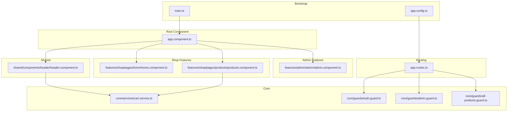
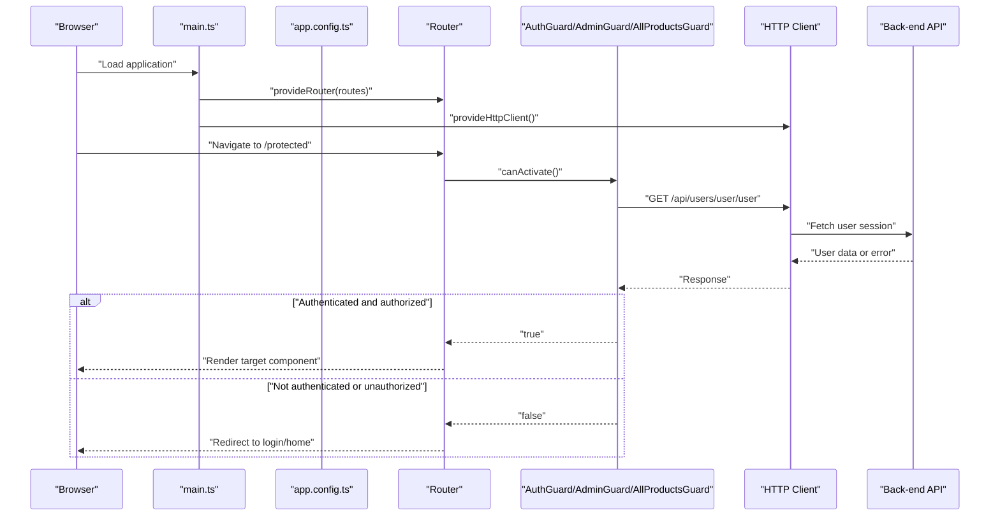
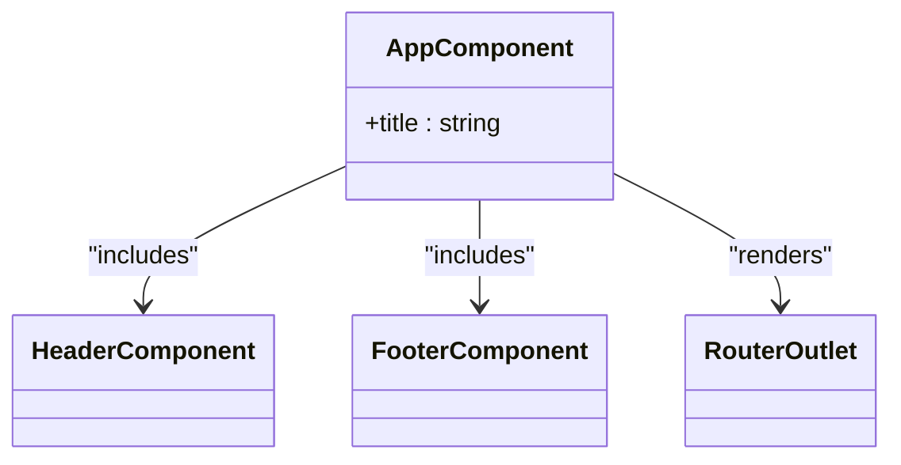
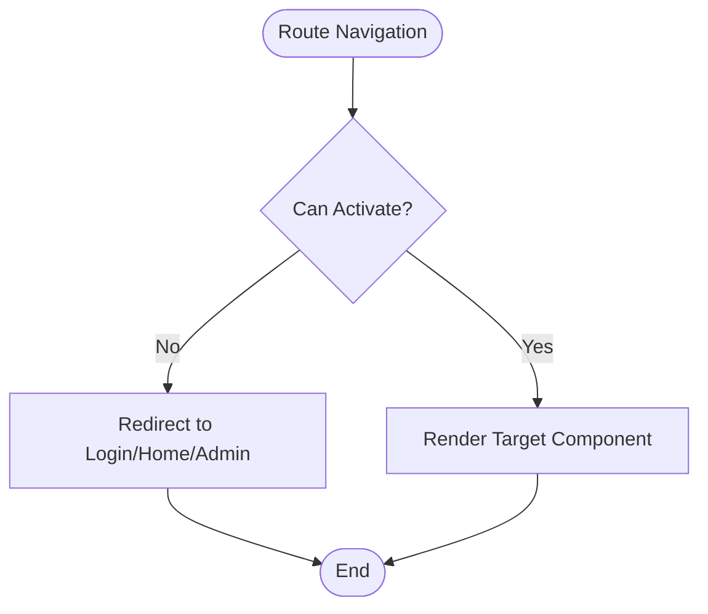
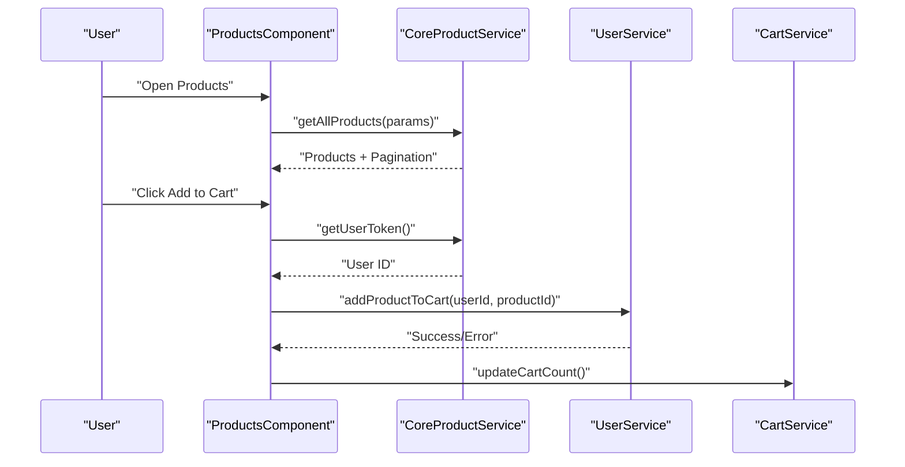
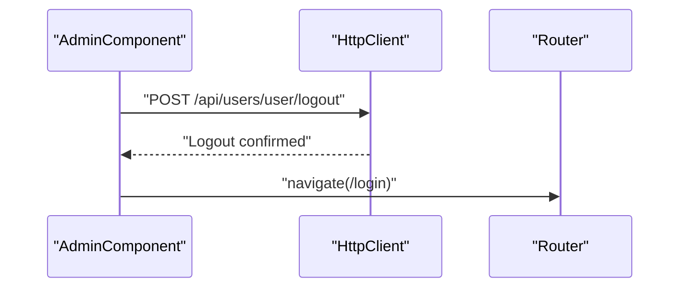
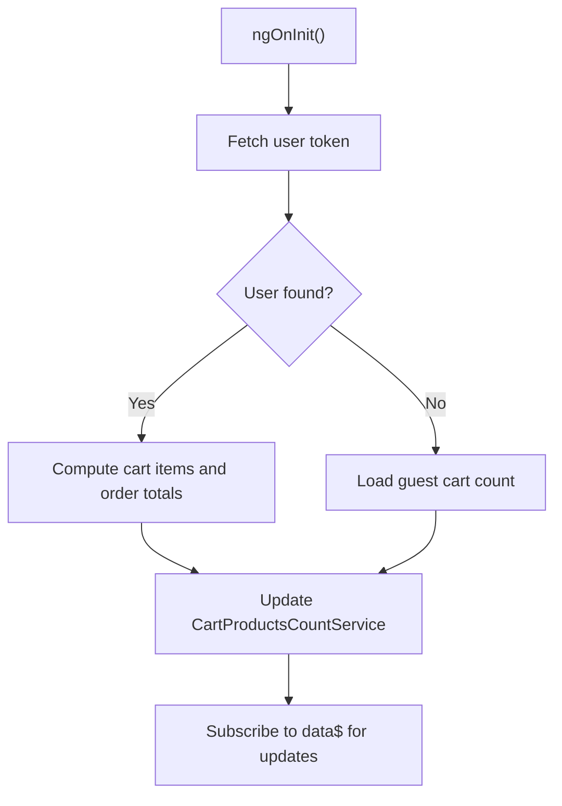
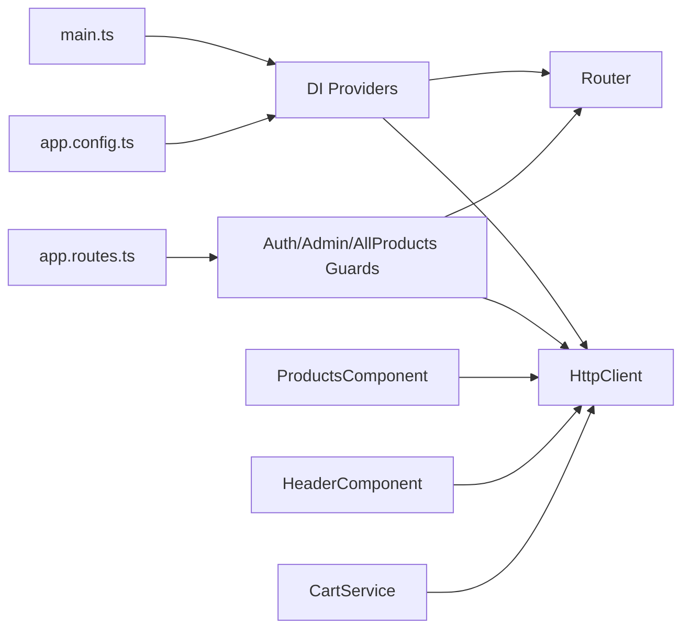

# Angular Application Structure

<cite>
**Referenced Files in This Document**
- [main.ts](file://Front-end/src/main.ts)
- [app.config.ts](file://Front-end/src/app/app.config.ts)
- [app.component.ts](file://Front-end/src/app/app.component.ts)
- [app.routes.ts](file://Front-end/src/app/app.routes.ts)
- [auth.guard.ts](file://Front-end/src/app/core/guards/auth.guard.ts)
- [admin.guard.ts](file://Front-end/src/app/core/guards/admin.guard.ts)
- [all-products.guard.ts](file://Front-end/src/app/core/guards/all-products.guard.ts)
- [header.component.ts](file://Front-end/src/app/shared/components/header/header.component.ts)
- [cart.service.ts](file://Front-end/src/app/core/services/cart.service.ts)
- [home.component.ts](file://Front-end/src/app/features/shop/pages/home/home.component.ts)
- [products.component.ts](file://Front-end/src/app/features/shop/pages/products/products.component.ts)
- [admin.component.ts](file://Front-end/src/app/features/admin/admin/admin.component.ts)
- [angular.json](file://Front-end/angular.json)
- [package.json](file://Front-end/package.json)
- [tsconfig.app.json](file://Front-end/tsconfig.app.json)
</cite>

## Table of Contents
1. [Introduction](#introduction)
2. [Project Structure](#project-structure)
3. [Core Components](#core-components)
4. [Architecture Overview](#architecture-overview)
5. [Detailed Component Analysis](#detailed-component-analysis)
6. [Dependency Analysis](#dependency-analysis)
7. [Performance Considerations](#performance-considerations)
8. [Troubleshooting Guide](#troubleshooting-guide)
9. [Conclusion](#conclusion)
10. [Appendices](#appendices)

## Introduction
This document explains the Angular application structure for the Lightstorm E-commerce project. It covers the component hierarchy starting from the root component, routing configuration, bootstrap process, standalone component architecture, dependency injection setup, module configuration, routing guards, and service initialization. It also describes Angular’s change detection and lifecycle hooks, and highlights performance optimization patterns used across the application.

## Project Structure
The application follows a feature-based structure under the app folder, with clear separation of concerns:
- Root component and routing configuration
- Feature areas: Shop, Admin, Auth
- Shared components for cross-cutting UI elements
- Core services and guards for shared logic
- Build and configuration files for Angular and tooling

Key configuration files:
- Bootstrap and DI providers are configured via main.ts and app.config.ts
- Routing is centralized in app.routes.ts
- Angular build and dev server settings are defined in angular.json
- Dependencies and scripts are managed in package.json
- TypeScript compilation is controlled by tsconfig.app.json

**Diagram sources**
- [main.ts](file://Front-end/src/main.ts#L1-L10)
- [app.config.ts](file://Front-end/src/app/app.config.ts#L1-L11)
- [app.routes.ts](file://Front-end/src/app/app.routes.ts#L1-L50)
- [app.component.ts](file://Front-end/src/app/app.component.ts#L1-L26)
- [header.component.ts](file://Front-end/src/app/shared/components/header/header.component.ts#L1-L97)
- [home.component.ts](file://Front-end/src/app/features/shop/pages/home/home.component.ts#L1-L19)
- [products.component.ts](file://Front-end/src/app/features/shop/pages/products/products.component.ts#L1-L217)
- [admin.component.ts](file://Front-end/src/app/features/admin/admin/admin.component.ts#L1-L38)
- [auth.guard.ts](file://Front-end/src/app/core/guards/auth.guard.ts#L1-L42)
- [admin.guard.ts](file://Front-end/src/app/core/guards/admin.guard.ts#L1-L46)
- [all-products.guard.ts](file://Front-end/src/app/core/guards/all-products.guard.ts#L1-L46)
- [cart.service.ts](file://Front-end/src/app/core/services/cart.service.ts#L1-L111)

**Section sources**
- [main.ts](file://Front-end/src/main.ts#L1-L10)
- [app.config.ts](file://Front-end/src/app/app.config.ts#L1-L11)
- [app.routes.ts](file://Front-end/src/app/app.routes.ts#L1-L50)
- [angular.json](file://Front-end/angular.json#L1-L114)
- [package.json](file://Front-end/package.json#L1-L55)
- [tsconfig.app.json](file://Front-end/tsconfig.app.json#L1-L15)

## Core Components
- Root component: The root AppComponent is a standalone component that declares RouterOutlet and imports shared components (Header, Footer) and form modules. It serves as the host for routed views.
- Routing configuration: app.routes.ts defines all routes, including lazy-loading-friendly standalone components and guards for protected pages.
- Bootstrap process: The application bootstraps using bootstrapApplication with providers for routing and HTTP client. An alternate configuration exists in app.config.ts that provides animations and HTTP client globally.

Key responsibilities:
- AppComponent orchestrates layout and routes
- Guards enforce access control based on user roles and authentication state
- Services manage cart state and synchronization between guest and authenticated users

**Section sources**
- [app.component.ts](file://Front-end/src/app/app.component.ts#L1-L26)
- [app.routes.ts](file://Front-end/src/app/app.routes.ts#L1-L50)
- [main.ts](file://Front-end/src/main.ts#L1-L10)
- [app.config.ts](file://Front-end/src/app/app.config.ts#L1-L11)

## Architecture Overview
The application uses Angular’s standalone component architecture with:
- Standalone components for pages and features
- Centralized routing with canActivate guards
- Global dependency injection via bootstrapApplication and app.config.ts
- Shared services for cart and product data
- Reactive patterns with RxJS for async flows

**Diagram sources**
- [main.ts](file://Front-end/src/main.ts#L1-L10)
- [app.config.ts](file://Front-end/src/app/app.config.ts#L1-L11)
- [auth.guard.ts](file://Front-end/src/app/core/guards/auth.guard.ts#L1-L42)
- [admin.guard.ts](file://Front-end/src/app/core/guards/admin.guard.ts#L1-L46)
- [all-products.guard.ts](file://Front-end/src/app/core/guards/all-products.guard.ts#L1-L46)

## Detailed Component Analysis

### Root Component and Layout
- AppComponent is a standalone component that:
  - Imports RouterOutlet to render routed views
  - Includes shared components (Header, Footer) and forms modules
  - Serves as the layout container for the entire application

**Diagram sources**
- [app.component.ts](file://Front-end/src/app/app.component.ts#L1-L26)

**Section sources**
- [app.component.ts](file://Front-end/src/app/app.component.ts#L1-L26)

### Routing Configuration and Guards
- app.routes.ts defines:
  - Public routes (Home, About, Login, Register)
  - Protected routes (Checkout, Profile, Payment, Confirm)
  - Admin-only routes (Admin, Users, Product Management)
  - Guarded routes using AuthGuard, AdminGuard, AllProductsGuard
  - Wildcard fallback to Home

- Guards:
  - AuthGuard: Verifies user session; redirects unauthenticated users to login
  - AdminGuard: Ensures only admins can access admin routes
  - AllProductsGuard: Requires authentication for product listings

**Diagram sources**
- [app.routes.ts](file://Front-end/src/app/app.routes.ts#L1-L50)
- [auth.guard.ts](file://Front-end/src/app/core/guards/auth.guard.ts#L1-L42)
- [admin.guard.ts](file://Front-end/src/app/core/guards/admin.guard.ts#L1-L46)
- [all-products.guard.ts](file://Front-end/src/app/core/guards/all-products.guard.ts#L1-L46)

**Section sources**
- [app.routes.ts](file://Front-end/src/app/app.routes.ts#L1-L50)
- [auth.guard.ts](file://Front-end/src/app/core/guards/auth.guard.ts#L1-L42)
- [admin.guard.ts](file://Front-end/src/app/core/guards/admin.guard.ts#L1-L46)
- [all-products.guard.ts](file://Front-end/src/app/core/guards/all-products.guard.ts#L1-L46)

### Shopping Feature: Products Listing and Cart Integration
- ProductsComponent:
  - Implements server-side filtering, sorting, and pagination
  - Reads initial state from URL query parameters
  - Updates URL with query params to keep filters shareable
  - Integrates with CoreProductService and UserService for cart actions
  - Uses lifecycle hooks for DOM manipulation after view init

- CartService:
  - Manages guest cart in localStorage
  - Provides methods to add, remove, and adjust quantities
  - Synchronizes guest cart with backend when user logs in
  - Updates global cart count via CartProductsCountService

**Diagram sources**
- [products.component.ts](file://Front-end/src/app/features/shop/pages/products/products.component.ts#L1-L217)
- [cart.service.ts](file://Front-end/src/app/core/services/cart.service.ts#L1-L111)

**Section sources**
- [products.component.ts](file://Front-end/src/app/features/shop/pages/products/products.component.ts#L1-L217)
- [cart.service.ts](file://Front-end/src/app/core/services/cart.service.ts#L1-L111)

### Admin Feature: Dashboard and Logout
- AdminComponent:
  - Aggregates admin widgets (Top Cards, Feeds, Sales Summary, Orders)
  - Provides logout by posting to backend and navigating to login
  - Declares its own provider for OrderService

**Diagram sources**
- [admin.component.ts](file://Front-end/src/app/features/admin/admin/admin.component.ts#L1-L38)

**Section sources**
- [admin.component.ts](file://Front-end/src/app/features/admin/admin/admin.component.ts#L1-L38)

### Header Component and State Synchronization
- HeaderComponent:
  - Subscribes to user token to compute cart count and order totals
  - Falls back to guest cart count when user is not authenticated
  - Updates CartProductsCountService to reflect live counts

**Diagram sources**
- [header.component.ts](file://Front-end/src/app/shared/components/header/header.component.ts#L1-L97)

**Section sources**
- [header.component.ts](file://Front-end/src/app/shared/components/header/header.component.ts#L1-L97)
- [cart.service.ts](file://Front-end/src/app/core/services/cart.service.ts#L1-L111)

## Dependency Analysis
- Bootstrap and DI:
  - main.ts bootstraps the app with provideRouter and provideHttpClient
  - app.config.ts centralizes providers including animations and HTTP client
- Routing and guards:
  - app.routes.ts imports and applies guards to protect routes
- Services:
  - CartService depends on HttpClient and CartProductsCountService
  - Guards depend on HttpClient and Router to check user sessions and redirect accordingly
- Shared components:
  - HeaderComponent imports Material modules and services for cart and product data

**Diagram sources**
- [main.ts](file://Front-end/src/main.ts#L1-L10)
- [app.config.ts](file://Front-end/src/app/app.config.ts#L1-L11)
- [app.routes.ts](file://Front-end/src/app/app.routes.ts#L1-L50)
- [auth.guard.ts](file://Front-end/src/app/core/guards/auth.guard.ts#L1-L42)
- [admin.guard.ts](file://Front-end/src/app/core/guards/admin.guard.ts#L1-L46)
- [all-products.guard.ts](file://Front-end/src/app/core/guards/all-products.guard.ts#L1-L46)
- [products.component.ts](file://Front-end/src/app/features/shop/pages/products/products.component.ts#L1-L217)
- [header.component.ts](file://Front-end/src/app/shared/components/header/header.component.ts#L1-L97)
- [cart.service.ts](file://Front-end/src/app/core/services/cart.service.ts#L1-L111)

**Section sources**
- [main.ts](file://Front-end/src/main.ts#L1-L10)
- [app.config.ts](file://Front-end/src/app/app.config.ts#L1-L11)
- [app.routes.ts](file://Front-end/src/app/app.routes.ts#L1-L50)
- [auth.guard.ts](file://Front-end/src/app/core/guards/auth.guard.ts#L1-L42)
- [admin.guard.ts](file://Front-end/src/app/core/guards/admin.guard.ts#L1-L46)
- [all-products.guard.ts](file://Front-end/src/app/core/guards/all-products.guard.ts#L1-L46)
- [products.component.ts](file://Front-end/src/app/features/shop/pages/products/products.component.ts#L1-L217)
- [header.component.ts](file://Front-end/src/app/shared/components/header/header.component.ts#L1-L97)
- [cart.service.ts](file://Front-end/src/app/core/services/cart.service.ts#L1-L111)

## Performance Considerations
- Build configuration:
  - Production optimizations enabled with output hashing and budgets
  - Styles and scripts include Material and Bootstrap bundles
- HTTP client:
  - Centralized via bootstrapApplication and app.config.ts to avoid redundant providers
- Change detection:
  - Components use standalone architecture; consider OnPush strategy and immutable data patterns for improved performance
- Routing:
  - Guards perform lightweight checks against backend; cache or memoize results if needed
- Services:
  - CartService persists guest cart locally; minimize frequent localStorage writes by batching updates

[No sources needed since this section provides general guidance]

## Troubleshooting Guide
- Authentication and redirection loops:
  - Guards rely on a backend endpoint to validate sessions; ensure the endpoint is reachable and returns consistent user data
- Route protection failures:
  - Verify canActivate arrays in app.routes.ts and that guards are properly injected
- Cart synchronization:
  - Confirm guest cart keys and backend endpoints for syncing; ensure credentials are included for authenticated requests
- Build and dev server:
  - Check angular.json for baseHref and proxy configurations; ensure dev server port matches proxy settings

**Section sources**
- [auth.guard.ts](file://Front-end/src/app/core/guards/auth.guard.ts#L1-L42)
- [admin.guard.ts](file://Front-end/src/app/core/guards/admin.guard.ts#L1-L46)
- [all-products.guard.ts](file://Front-end/src/app/core/guards/all-products.guard.ts#L1-L46)
- [cart.service.ts](file://Front-end/src/app/core/services/cart.service.ts#L1-L111)
- [angular.json](file://Front-end/angular.json#L1-L114)

## Conclusion
The application leverages Angular’s standalone components and modern DI to deliver a modular, maintainable e-commerce frontend. Routing is centralized with robust guards enforcing authentication and authorization. Services encapsulate cart logic and integrate with backend APIs. The build configuration supports production-grade optimizations. Following the patterns outlined here ensures scalability and developer productivity.

[No sources needed since this section summarizes without analyzing specific files]

## Appendices

### Bootstrap and Configuration Summary
- Bootstrap: main.ts initializes providers and mounts the root component
- Configuration: app.config.ts centralizes providers for router, animations, and HTTP client
- Build: angular.json configures production optimizations and asset bundling
- Toolchain: package.json lists Angular and related libraries; tsconfig.app.json restricts entry points

**Section sources**
- [main.ts](file://Front-end/src/main.ts#L1-L10)
- [app.config.ts](file://Front-end/src/app/app.config.ts#L1-L11)
- [angular.json](file://Front-end/angular.json#L1-L114)
- [package.json](file://Front-end/package.json#L1-L55)
- [tsconfig.app.json](file://Front-end/tsconfig.app.json#L1-L15)