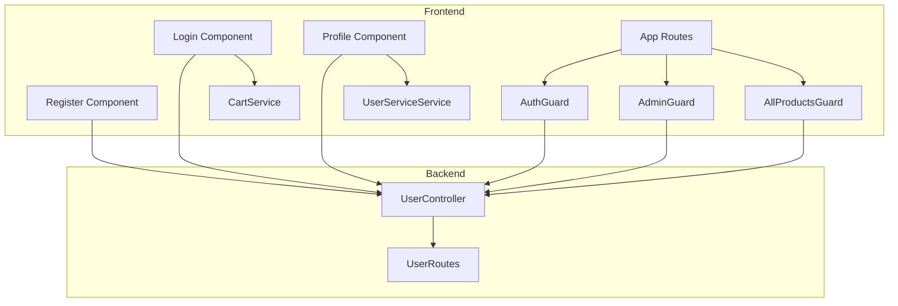
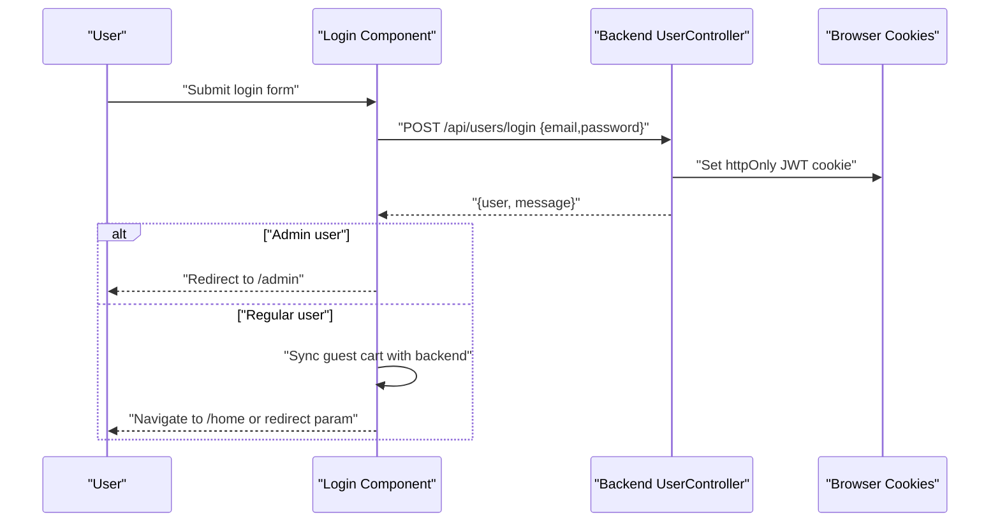
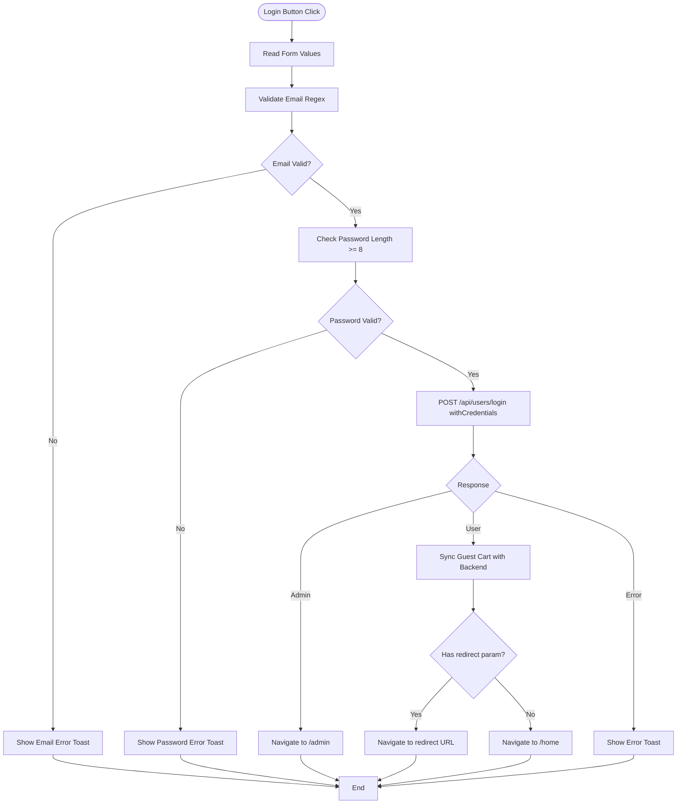
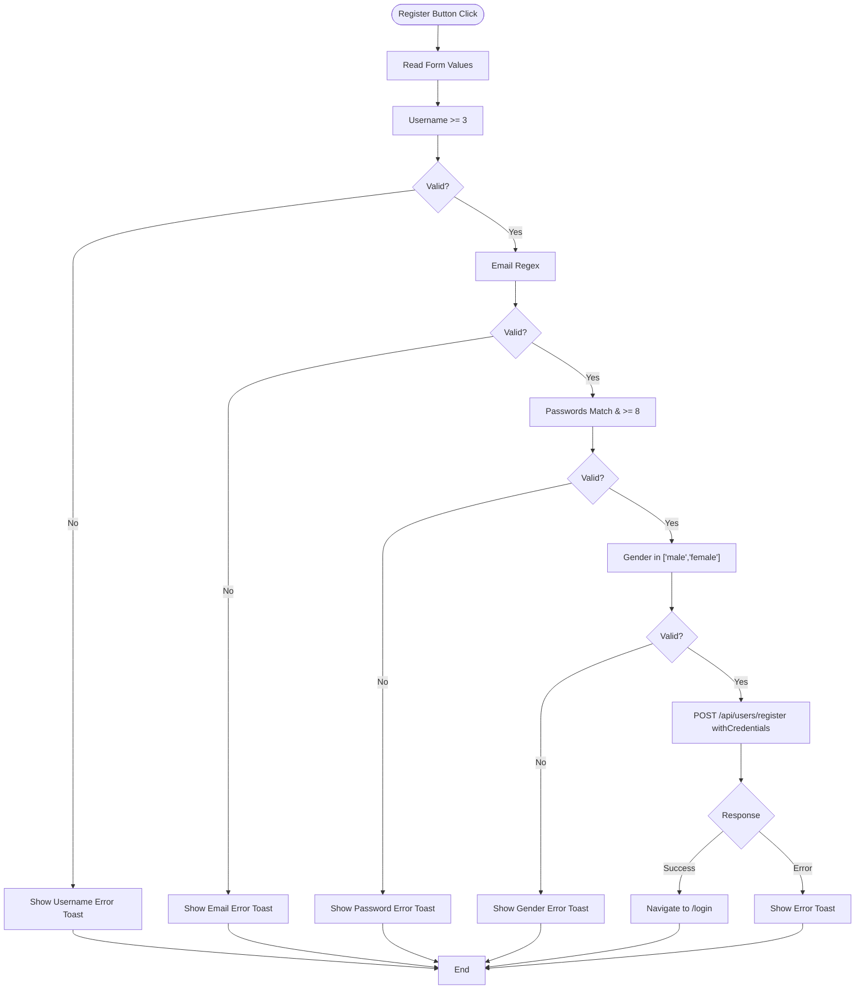
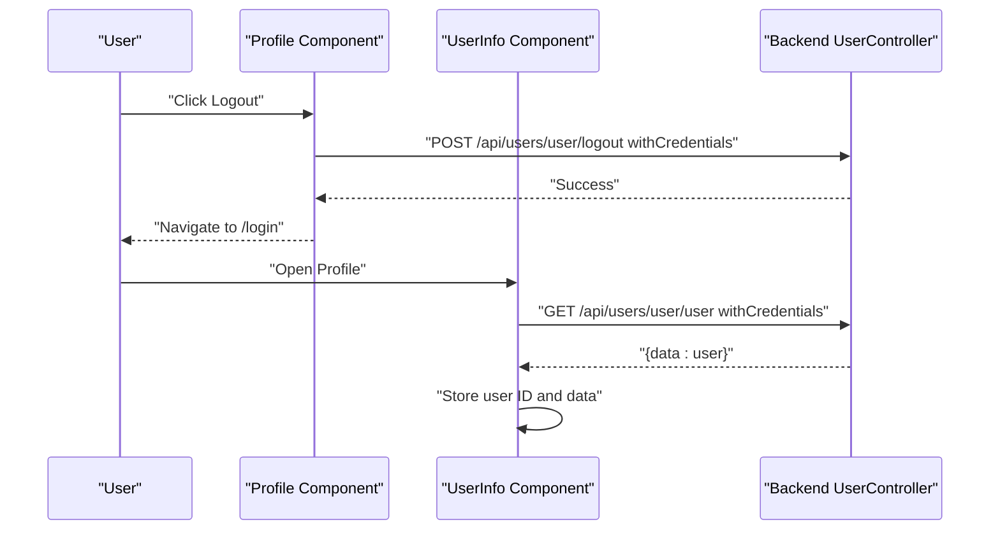
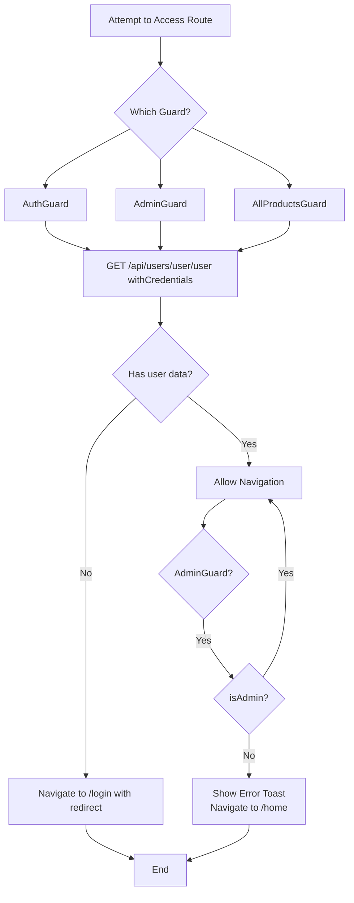
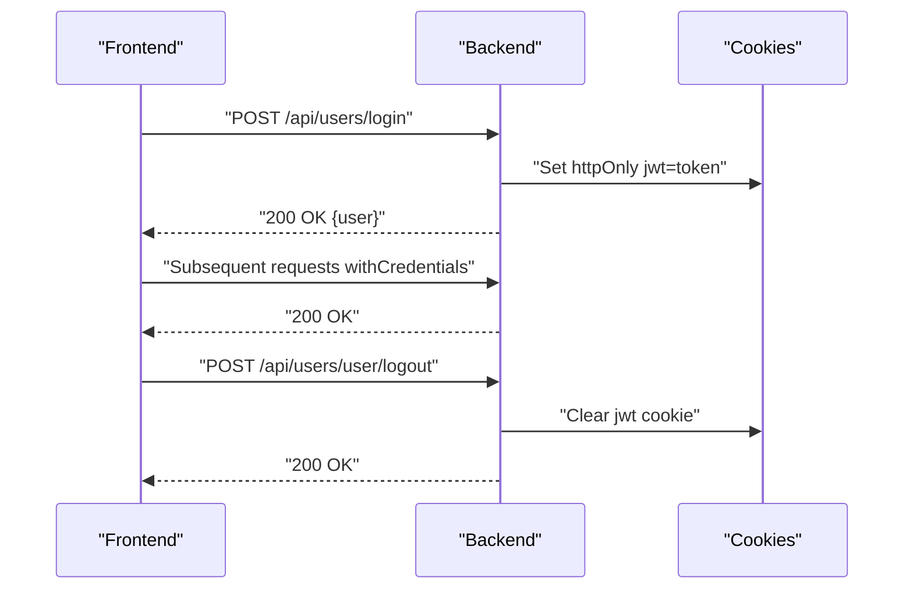
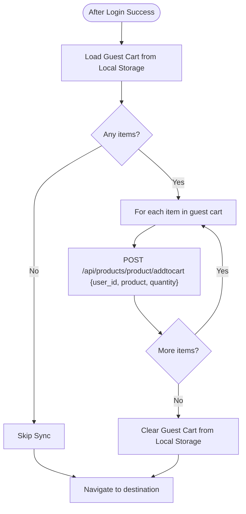
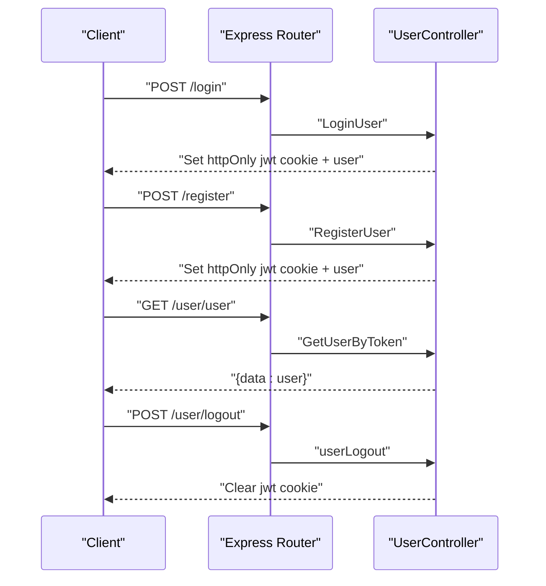
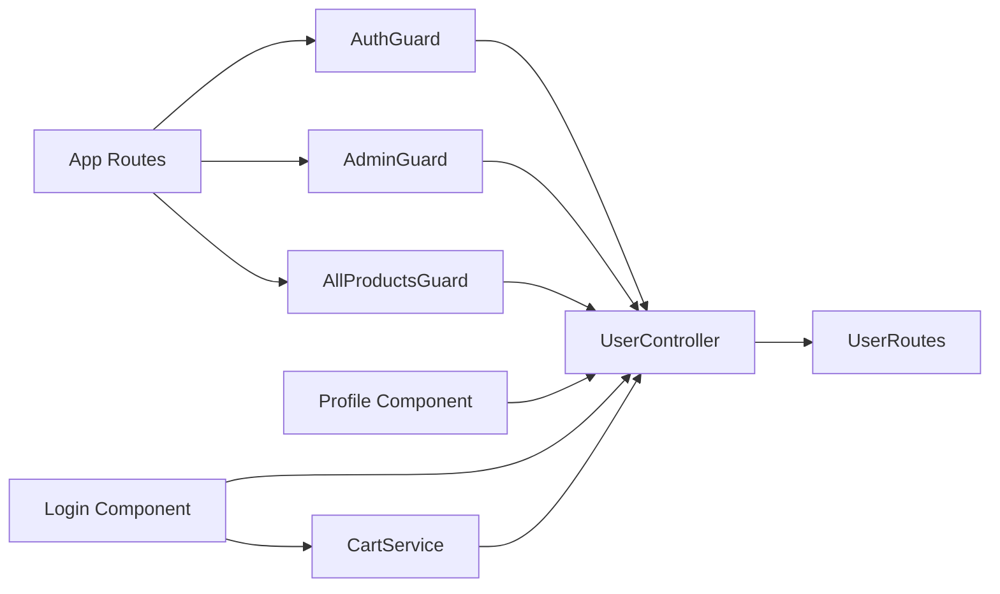

# Authentication System

<cite>
**Referenced Files in This Document**
- [login.component.ts](file://Front-end/src/app/features/auth/pages/login/login.component.ts)
- [login.component.html](file://Front-end/src/app/features/auth/pages/login/login.component.html)
- [register.component.ts](file://Front-end/src/app/features/auth/pages/register/register.component.ts)
- [register.component.html](file://Front-end/src/app/features/auth/pages/register/register.component.html)
- [profile.component.ts](file://Front-end/src/app/features/auth/pages/profile/profile.component.ts)
- [profile.component.html](file://Front-end/src/app/features/auth/pages/profile/profile.component.html)
- [user-info.component.ts](file://Front-end/src/app/features/auth/pages/profile/profile components/user-info/user-info.component.ts)
- [auth.guard.ts](file://Front-end/src/app/core/guards/auth.guard.ts)
- [admin.guard.ts](file://Front-end/src/app/core/guards/admin.guard.ts)
- [all-products.guard.ts](file://Front-end/src/app/core/guards/all-products.guard.ts)
- [cart.service.ts](file://Front-end/src/app/core/services/cart.service.ts)
- [user-service.service.ts](file://Front-end/src/app/core/services/user-service.service.ts)
- [app.routes.ts](file://Front-end/src/app/app.routes.ts)
- [user.controller.js](file://Back-end/src/Controllers/user.controller.js)
- [user.routes.js](file://Back-end/src/Routes/user.routes.js)
</cite>

## Table of Contents
1. [Introduction](#introduction)
2. [Project Structure](#project-structure)
3. [Core Components](#core-components)
4. [Architecture Overview](#architecture-overview)
5. [Detailed Component Analysis](#detailed-component-analysis)
6. [Dependency Analysis](#dependency-analysis)
7. [Performance Considerations](#performance-considerations)
8. [Troubleshooting Guide](#troubleshooting-guide)
9. [Conclusion](#conclusion)

## Introduction
This document describes the authentication system for the Lightstorm e-commerce platform. It covers login and registration flows, form validation, user profile management, route protection via guards, JWT token handling, session management, and user state persistence. It also documents the integration with backend authentication endpoints and local storage management for guest carts during login.

## Project Structure
The authentication system spans Angular frontend components and services, routing with guards, and Express backend controllers and routes. Key areas:
- Frontend authentication pages: login, registration, and profile
- Guards for route protection: AuthGuard, AdminGuard, AllProductsGuard
- Services for cart synchronization and user data updates
- Backend endpoints for login, registration, user retrieval by token, and logout

**Diagram sources**
- [login.component.ts](file://Front-end/src/app/features/auth/pages/login/login.component.ts#L1-L116)
- [register.component.ts](file://Front-end/src/app/features/auth/pages/register/register.component.ts#L1-L86)
- [profile.component.ts](file://Front-end/src/app/features/auth/pages/profile/profile.component.ts#L1-L33)
- [auth.guard.ts](file://Front-end/src/app/core/guards/auth.guard.ts#L1-L42)
- [admin.guard.ts](file://Front-end/src/app/core/guards/admin.guard.ts#L1-L46)
- [all-products.guard.ts](file://Front-end/src/app/core/guards/all-products.guard.ts#L1-L46)
- [cart.service.ts](file://Front-end/src/app/core/services/cart.service.ts#L1-L111)
- [user-service.service.ts](file://Front-end/src/app/core/services/user-service.service.ts#L1-L25)
- [app.routes.ts](file://Front-end/src/app/app.routes.ts#L1-L50)
- [user.controller.js](file://Back-end/src/Controllers/user.controller.js#L1-L480)
- [user.routes.js](file://Back-end/src/Routes/user.routes.js#L1-L24)

**Section sources**
- [app.routes.ts](file://Front-end/src/app/app.routes.ts#L1-L50)
- [user.routes.js](file://Back-end/src/Routes/user.routes.js#L1-L24)

## Core Components
- Login page: Validates email and password, submits credentials to backend, handles admin/non-admin redirection, and synchronizes guest cart with backend after login.
- Registration page: Validates username, email, passwords, and gender, then posts to backend registration endpoint.
- Profile page: Displays user account sections and logs out by calling backend logout endpoint.
- Guards: Protect routes by validating user session via backend and controlling access for admins and authenticated users.
- Services: CartService manages guest cart and syncs with backend after login; UserServiceService fetches and updates user data.

**Section sources**
- [login.component.ts](file://Front-end/src/app/features/auth/pages/login/login.component.ts#L1-L116)
- [register.component.ts](file://Front-end/src/app/features/auth/pages/register/register.component.ts#L1-L86)
- [profile.component.ts](file://Front-end/src/app/features/auth/pages/profile/profile.component.ts#L1-L33)
- [auth.guard.ts](file://Front-end/src/app/core/guards/auth.guard.ts#L1-L42)
- [admin.guard.ts](file://Front-end/src/app/core/guards/admin.guard.ts#L1-L46)
- [all-products.guard.ts](file://Front-end/src/app/core/guards/all-products.guard.ts#L1-L46)
- [cart.service.ts](file://Front-end/src/app/core/services/cart.service.ts#L1-L111)
- [user-service.service.ts](file://Front-end/src/app/core/services/user-service.service.ts#L1-L25)

## Architecture Overview
The authentication flow integrates frontend components with backend endpoints. The backend uses JWT stored in an httpOnly cookie for session management. Guards enforce access control by verifying the current session against the backend.

**Diagram sources**
- [login.component.ts](file://Front-end/src/app/features/auth/pages/login/login.component.ts#L38-L96)
- [user.controller.js](file://Back-end/src/Controllers/user.controller.js#L118-L136)
- [user.routes.js](file://Back-end/src/Routes/user.routes.js#L15-L16)

## Detailed Component Analysis

### Login Component
- Form structure and controls are defined in the template.
- Validation includes email regex and minimum password length.
- Submits credentials to backend login endpoint with credentials enabled.
- On success:
  - Distinguishes admin vs regular user and navigates accordingly.
  - Synchronizes guest cart with backend using CartService.
  - Respects redirect query parameter for navigation.
- On error, displays a toast with the error message.

**Diagram sources**
- [login.component.ts](file://Front-end/src/app/features/auth/pages/login/login.component.ts#L38-L96)
- [login.component.html](file://Front-end/src/app/features/auth/pages/login/login.component.html#L1-L29)
- [cart.service.ts](file://Front-end/src/app/core/services/cart.service.ts#L93-L109)

**Section sources**
- [login.component.ts](file://Front-end/src/app/features/auth/pages/login/login.component.ts#L1-L116)
- [login.component.html](file://Front-end/src/app/features/auth/pages/login/login.component.html#L1-L29)

### Registration Component
- Form structure includes username, email, password, confirm password, and gender.
- Validation checks:
  - Username length >= 3
  - Email regex validity
  - Password confirmation match
  - Minimum password length
  - Gender must be male or female
- Submits to backend registration endpoint with credentials enabled.
- On success, navigates to login; on error, shows toast with message.

**Diagram sources**
- [register.component.ts](file://Front-end/src/app/features/auth/pages/register/register.component.ts#L33-L84)
- [register.component.html](file://Front-end/src/app/features/auth/pages/register/register.component.html#L1-L52)

**Section sources**
- [register.component.ts](file://Front-end/src/app/features/auth/pages/register/register.component.ts#L1-L86)
- [register.component.html](file://Front-end/src/app/features/auth/pages/register/register.component.html#L1-L52)

### Profile Component and User Info
- Profile page aggregates user sections and provides logout.
- Logout calls backend logout endpoint and navigates to login.
- User info component retrieves current user data by calling backend user endpoint and stores the user ID for later use.

**Diagram sources**
- [profile.component.ts](file://Front-end/src/app/features/auth/pages/profile/profile.component.ts#L24-L29)
- [user-info.component.ts](file://Front-end/src/app/features/auth/pages/profile/profile components/user-info/user-info.component.ts#L57-L69)
- [user.controller.js](file://Back-end/src/Controllers/user.controller.js#L447-L458)
- [user.controller.js](file://Back-end/src/Controllers/user.controller.js#L421-L445)

**Section sources**
- [profile.component.ts](file://Front-end/src/app/features/auth/pages/profile/profile.component.ts#L1-L33)
- [profile.component.html](file://Front-end/src/app/features/auth/pages/profile/profile.component.html#L1-L40)
- [user-info.component.ts](file://Front-end/src/app/features/auth/pages/profile/profile components/user-info/user-info.component.ts#L1-L71)

### Guards and Route Protection
- AuthGuard: Ensures a valid session exists; redirects unauthenticated users to login with redirect URL; blocks admin users from accessing protected customer routes.
- AdminGuard: Restricts access to admin routes to users whose session resolves to an admin.
- AllProductsGuard: Ensures users are authenticated before accessing product listings.

**Diagram sources**
- [auth.guard.ts](file://Front-end/src/app/core/guards/auth.guard.ts#L15-L40)
- [admin.guard.ts](file://Front-end/src/app/core/guards/admin.guard.ts#L15-L44)
- [all-products.guard.ts](file://Front-end/src/app/core/guards/all-products.guard.ts#L15-L44)
- [user.controller.js](file://Back-end/src/Controllers/user.controller.js#L421-L445)

**Section sources**
- [auth.guard.ts](file://Front-end/src/app/core/guards/auth.guard.ts#L1-L42)
- [admin.guard.ts](file://Front-end/src/app/core/guards/admin.guard.ts#L1-L46)
- [all-products.guard.ts](file://Front-end/src/app/core/guards/all-products.guard.ts#L1-L46)

### JWT Token Handling and Session Management
- Backend sets an httpOnly JWT cookie upon login and registration.
- Frontend sends credentials automatically with subsequent requests to protected endpoints.
- Logout clears the JWT cookie on the backend.

**Diagram sources**
- [user.controller.js](file://Back-end/src/Controllers/user.controller.js#L128-L135)
- [user.controller.js](file://Back-end/src/Controllers/user.controller.js#L163-L170)
- [user.controller.js](file://Back-end/src/Controllers/user.controller.js#L447-L458)
- [user.routes.js](file://Back-end/src/Routes/user.routes.js#L15-L16)
- [user.routes.js](file://Back-end/src/Routes/user.routes.js#L17-L18)

**Section sources**
- [user.controller.js](file://Back-end/src/Controllers/user.controller.js#L118-L136)
- [user.controller.js](file://Back-end/src/Controllers/user.controller.js#L137-L175)
- [user.controller.js](file://Back-end/src/Controllers/user.controller.js#L447-L458)

### User State Persistence and Cart Synchronization
- Guest cart is persisted in local storage under a dedicated key.
- After login, the guest cart is synced to the backend by adding each item and clearing the local storage.
- The sync operation is performed sequentially per item and then cleared.

**Diagram sources**
- [login.component.ts](file://Front-end/src/app/features/auth/pages/login/login.component.ts#L76-L87)
- [cart.service.ts](file://Front-end/src/app/core/services/cart.service.ts#L93-L109)

**Section sources**
- [cart.service.ts](file://Front-end/src/app/core/services/cart.service.ts#L1-L111)
- [login.component.ts](file://Front-end/src/app/features/auth/pages/login/login.component.ts#L76-L87)

### Backend Authentication Endpoints
- POST /api/users/login: Validates credentials, hashes password comparison, creates JWT, sets httpOnly cookie, returns user.
- POST /api/users/register: Validates input, hashes password, creates JWT, sets httpOnly cookie, returns user.
- GET /api/users/user/user: Verifies JWT cookie, decodes payload, returns user data without password.
- POST /api/users/user/logout: Clears JWT cookie.

**Diagram sources**
- [user.routes.js](file://Back-end/src/Routes/user.routes.js#L15-L18)
- [user.controller.js](file://Back-end/src/Controllers/user.controller.js#L118-L136)
- [user.controller.js](file://Back-end/src/Controllers/user.controller.js#L137-L175)
- [user.controller.js](file://Back-end/src/Controllers/user.controller.js#L421-L445)
- [user.controller.js](file://Back-end/src/Controllers/user.controller.js#L447-L458)

**Section sources**
- [user.routes.js](file://Back-end/src/Routes/user.routes.js#L1-L24)
- [user.controller.js](file://Back-end/src/Controllers/user.controller.js#L118-L175)
- [user.controller.js](file://Back-end/src/Controllers/user.controller.js#L421-L458)

## Dependency Analysis
- Routing depends on guards for access control.
- Login and Profile components depend on backend endpoints for authentication and user data.
- CartService depends on backend cart endpoints for syncing guest cart to user cart.
- Guards depend on backend user endpoint to validate sessions.

**Diagram sources**
- [app.routes.ts](file://Front-end/src/app/app.routes.ts#L15-L48)
- [auth.guard.ts](file://Front-end/src/app/core/guards/auth.guard.ts#L15-L40)
- [admin.guard.ts](file://Front-end/src/app/core/guards/admin.guard.ts#L15-L44)
- [all-products.guard.ts](file://Front-end/src/app/core/guards/all-products.guard.ts#L15-L44)
- [login.component.ts](file://Front-end/src/app/features/auth/pages/login/login.component.ts#L57-L96)
- [profile.component.ts](file://Front-end/src/app/features/auth/pages/profile/profile.component.ts#L24-L29)
- [cart.service.ts](file://Front-end/src/app/core/services/cart.service.ts#L93-L109)
- [user.controller.js](file://Back-end/src/Controllers/user.controller.js#L118-L175)
- [user.routes.js](file://Back-end/src/Routes/user.routes.js#L1-L24)

**Section sources**
- [app.routes.ts](file://Front-end/src/app/app.routes.ts#L1-L50)
- [cart.service.ts](file://Front-end/src/app/core/services/cart.service.ts#L1-L111)

## Performance Considerations
- Cookie-based session management reduces client-side state overhead.
- Sequential cart sync ensures data consistency but may delay navigation; consider batching if needed.
- Guard checks rely on network calls; caching user data in memory could reduce repeated backend calls.

## Troubleshooting Guide
- Login errors: The login component displays a toast with the returned error message. Verify email/password format and backend availability.
- Registration errors: The registration component shows toasts for invalid inputs or backend errors; ensure username/email uniqueness and correct gender selection.
- Unauthorized access: Guards show toasts and redirect to login; ensure cookies are enabled and httpOnly cookie is present.
- Logout issues: Confirm the backend logout endpoint clears the cookie and frontend navigates to login.

**Section sources**
- [login.component.ts](file://Front-end/src/app/features/auth/pages/login/login.component.ts#L91-L95)
- [register.component.ts](file://Front-end/src/app/features/auth/pages/register/register.component.ts#L76-L84)
- [auth.guard.ts](file://Front-end/src/app/core/guards/auth.guard.ts#L32-L38)
- [admin.guard.ts](file://Front-end/src/app/core/guards/admin.guard.ts#L34-L42)
- [all-products.guard.ts](file://Front-end/src/app/core/guards/all-products.guard.ts#L34-L42)
- [profile.component.ts](file://Front-end/src/app/features/auth/pages/profile/profile.component.ts#L24-L29)

## Conclusion
The authentication system combines Angular guards, frontend components, and backend JWT cookie-based sessions to provide secure, user-friendly login, registration, and profile experiences. Guards protect routes, the backend enforces session validity, and cart synchronization ensures continuity across guest and authenticated states.