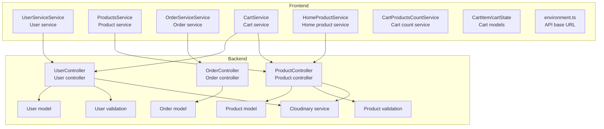
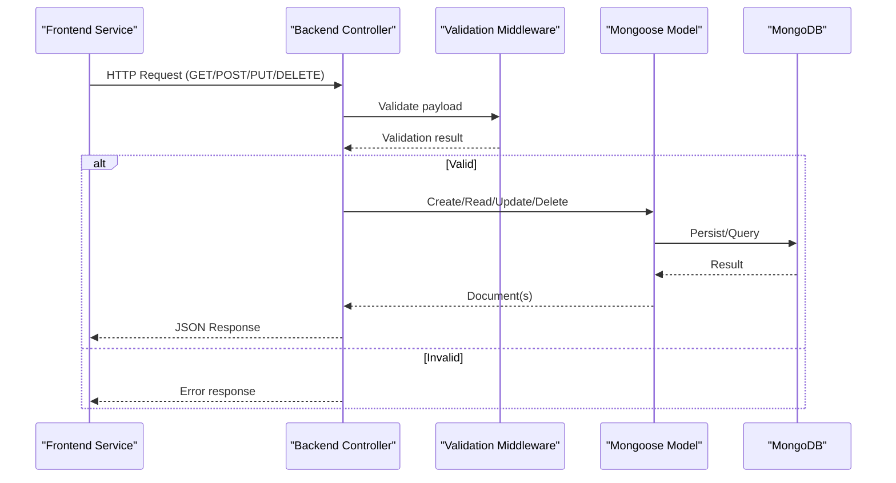
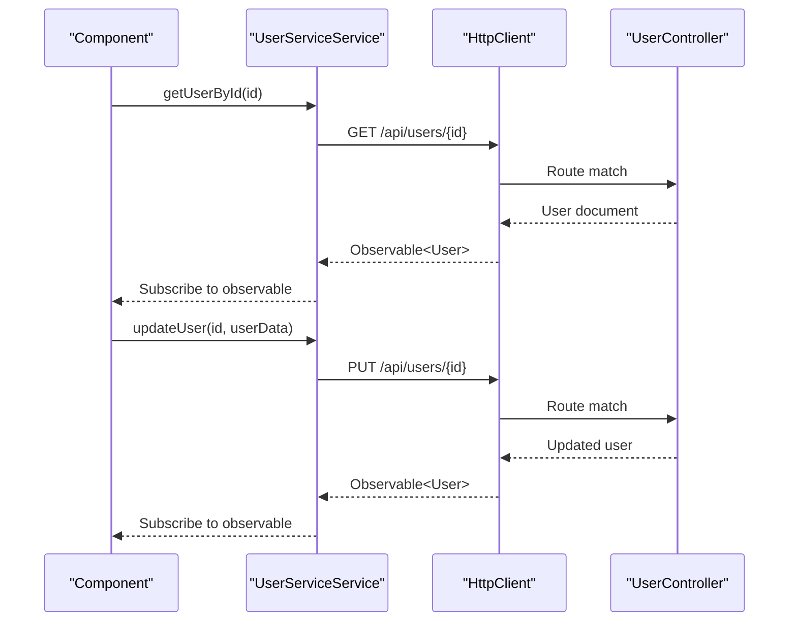
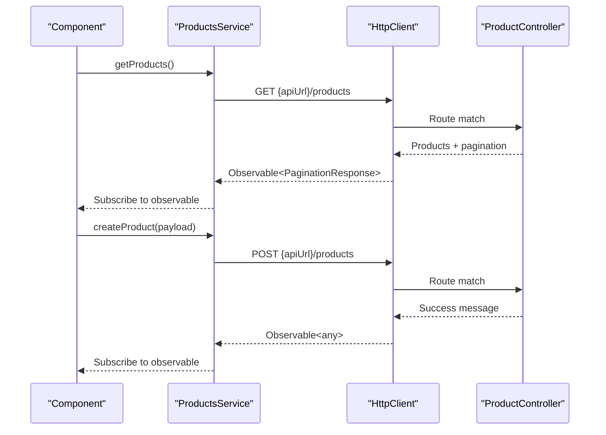
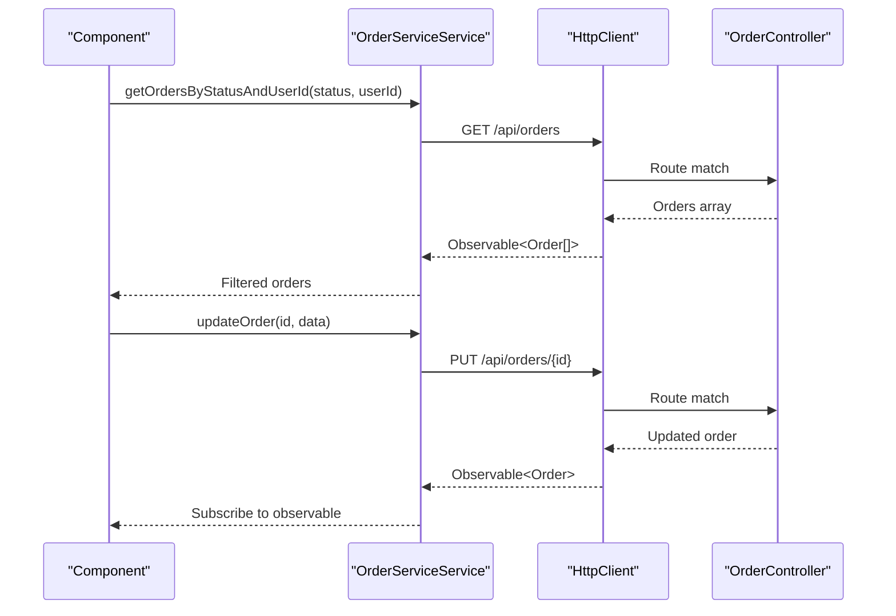
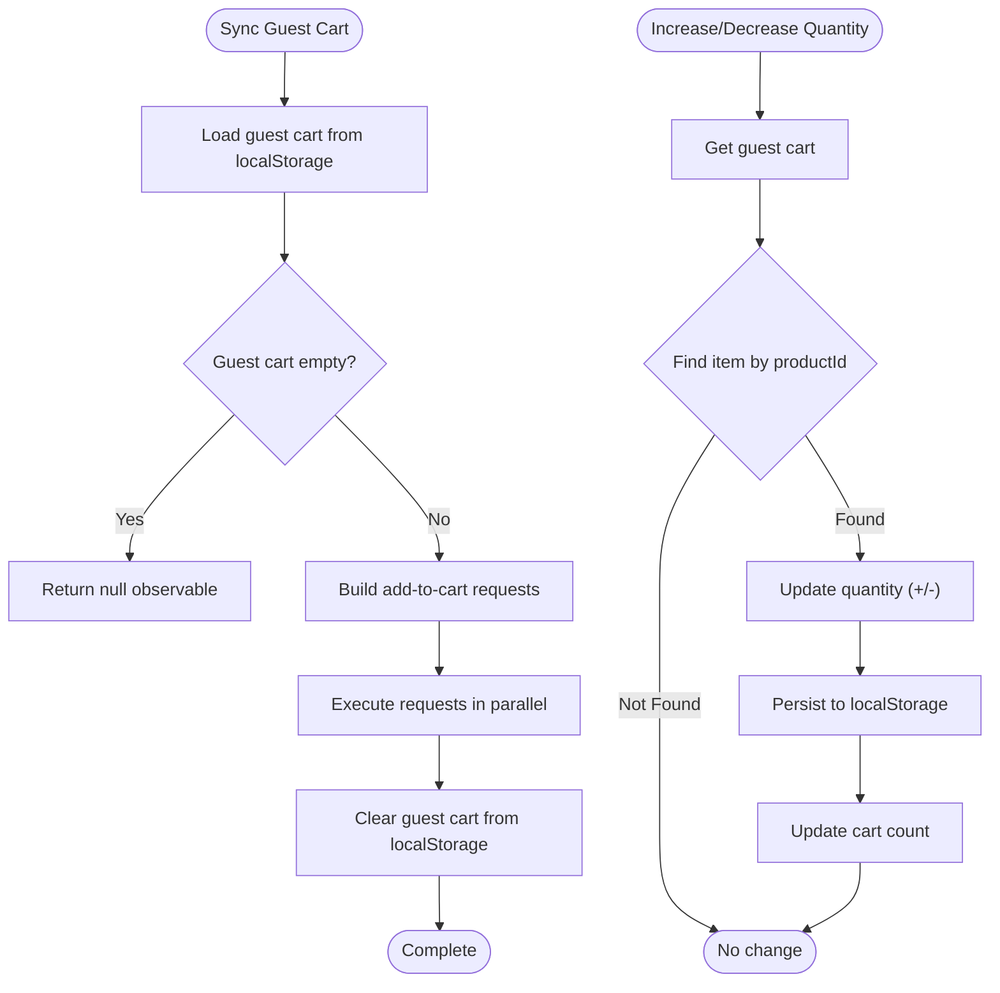
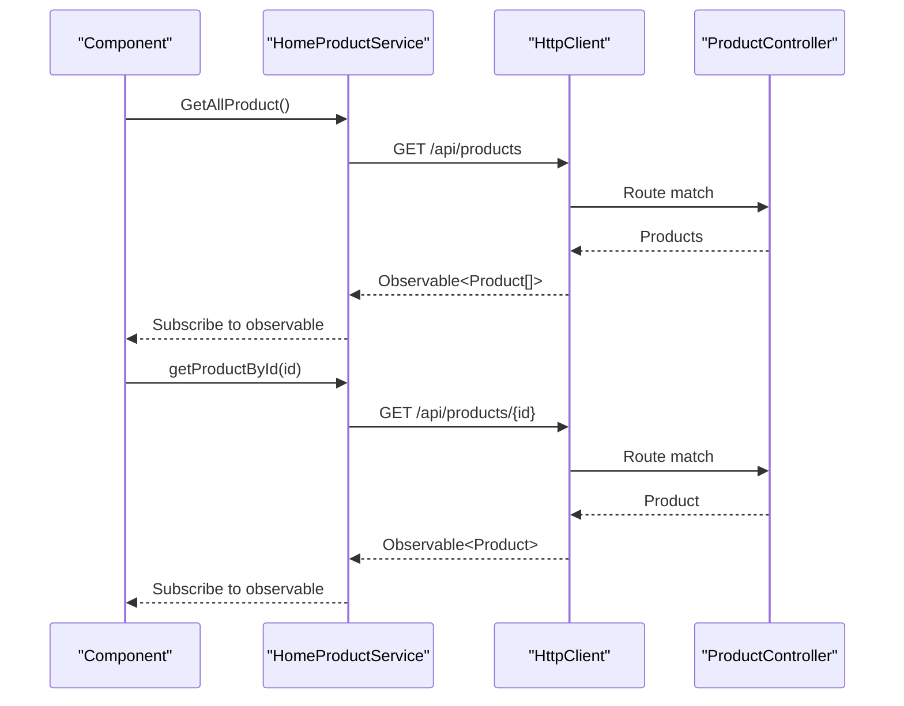
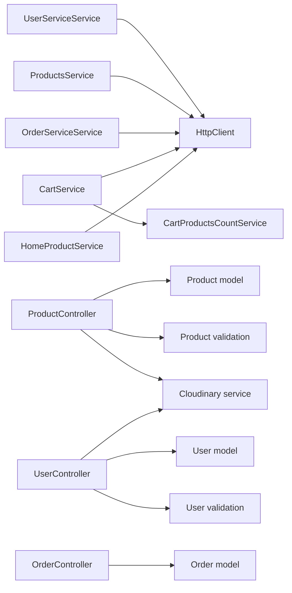

# Core Services Layer

<cite>
**Referenced Files in This Document**
- [user-service.service.ts](file://Front-end/src/app/core/services/user-service.service.ts)
- [products.service.ts](file://Front-end/src/app/core/services/products.service.ts)
- [order-service.service.ts](file://Front-end/src/app/core/services/order-service.service.ts)
- [cart.service.ts](file://Front-end/src/app/core/services/cart.service.ts)
- [home-product.service.ts](file://Front-end/src/app/core/services/home-product.service.ts)
- [cart-products-count.service.ts](file://Front-end/src/app/core/services/cart-products-count.service.ts)
- [cart.models.ts](file://Front-end/src/app/core/models/cart.models.ts)
- [environment.ts](file://Front-end/src/environments/environment.ts)
- [user.controller.js](file://Back-end/src/controllers/user.controller.js)
- [product.controller.js](file://Back-end/src/controllers/product.controller.js)
- [order.controller.js](file://Back-end/src/controllers/order.controller.js)
- [user.model.js](file://Back-end/src/models/user.model.js)
- [product.model.js](file://Back-end/src/models/product.model.js)
- [order.model.js](file://Back-end/src/models/order.model.js)
- [user.validation.js](file://Back-end/src/middlewares/user.validation.js)
- [product.validation.js](file://Back-end/src/middlewares/product.validation.js)
- [cloudinary.service.js](file://Back-end/src/services/cloudinary.service.js)
</cite>

## Table of Contents
1. [Introduction](#introduction)
2. [Project Structure](#project-structure)
3. [Core Components](#core-components)
4. [Architecture Overview](#architecture-overview)
5. [Detailed Component Analysis](#detailed-component-analysis)
6. [Dependency Analysis](#dependency-analysis)
7. [Performance Considerations](#performance-considerations)
8. [Troubleshooting Guide](#troubleshooting-guide)
9. [Conclusion](#conclusion)

## Introduction
This document describes the core services layer responsible for orchestrating HTTP communication between the Angular frontend and the Node.js/Express backend. It covers five primary services:
- User service for authentication and profile management
- Product service for catalog operations
- Order service for transaction processing
- Cart service for shopping cart functionality
- Home product service for featured content

It also documents HTTP client configuration, error handling patterns, data transformation, caching strategies, service dependencies, singleton patterns, and integration with Angular's dependency injection system.

## Project Structure
The core services are implemented as Angular injectable services that encapsulate HTTP calls to the backend API. The backend exposes REST endpoints via controllers that interact with Mongoose models and middleware validators.

**Diagram sources**
- [user-service.service.ts](file://Front-end/src/app/core/services/user-service.service.ts#L1-L25)
- [products.service.ts](file://Front-end/src/app/core/services/products.service.ts#L1-L31)
- [order-service.service.ts](file://Front-end/src/app/core/services/order-service.service.ts#L1-L62)
- [cart.service.ts](file://Front-end/src/app/core/services/cart.service.ts#L1-L111)
- [home-product.service.ts](file://Front-end/src/app/core/services/home-product.service.ts#L1-L26)
- [cart-products-count.service.ts](file://Front-end/src/app/core/services/cart-products-count.service.ts#L1-L20)
- [cart.models.ts](file://Front-end/src/app/core/models/cart.models.ts#L1-L12)
- [environment.ts](file://Front-end/src/environments/environment.ts#L1-L5)
- [user.controller.js](file://Back-end/src/controllers/user.controller.js#L1-L480)
- [product.controller.js](file://Back-end/src/controllers/product.controller.js#L1-L348)
- [order.controller.js](file://Back-end/src/controllers/order.controller.js#L1-L258)
- [user.model.js](file://Back-end/src/models/user.model.js#L1-L29)
- [product.model.js](file://Back-end/src/models/product.model.js#L1-L29)
- [order.model.js](file://Back-end/src/models/order.model.js#L1-L13)
- [user.validation.js](file://Back-end/src/middlewares/user.validation.js#L1-L29)
- [product.validation.js](file://Back-end/src/middlewares/product.validation.js#L1-L39)
- [cloudinary.service.js](file://Back-end/src/services/cloudinary.service.js#L1-L22)

**Section sources**
- [user-service.service.ts](file://Front-end/src/app/core/services/user-service.service.ts#L1-L25)
- [products.service.ts](file://Front-end/src/app/core/services/products.service.ts#L1-L31)
- [order-service.service.ts](file://Front-end/src/app/core/services/order-service.service.ts#L1-L62)
- [cart.service.ts](file://Front-end/src/app/core/services/cart.service.ts#L1-L111)
- [home-product.service.ts](file://Front-end/src/app/core/services/home-product.service.ts#L1-L26)
- [cart-products-count.service.ts](file://Front-end/src/app/core/services/cart-products-count.service.ts#L1-L20)
- [cart.models.ts](file://Front-end/src/app/core/models/cart.models.ts#L1-L12)
- [environment.ts](file://Front-end/src/environments/environment.ts#L1-L5)
- [user.controller.js](file://Back-end/src/controllers/user.controller.js#L1-L480)
- [product.controller.js](file://Back-end/src/controllers/product.controller.js#L1-L348)
- [order.controller.js](file://Back-end/src/controllers/order.controller.js#L1-L258)
- [user.model.js](file://Back-end/src/models/user.model.js#L1-L29)
- [product.model.js](file://Back-end/src/models/product.model.js#L1-L29)
- [order.model.js](file://Back-end/src/models/order.model.js#L1-L13)
- [user.validation.js](file://Back-end/src/middlewares/user.validation.js#L1-L29)
- [product.validation.js](file://Back-end/src/middlewares/product.validation.js#L1-L39)
- [cloudinary.service.js](file://Back-end/src/services/cloudinary.service.js#L1-L22)

## Core Components
This section outlines the responsibilities and HTTP interactions for each core service.

- User service
  - Fetches user by ID
  - Updates user profile
  - Integrates with backend authentication endpoints
  - Uses Angular HttpClient injected at construction time

- Product service
  - Retrieves product listings with filtering, sorting, and pagination
  - Fetches individual product details
  - Creates, updates, and deletes products
  - Uses environment-provided base URL for API endpoints

- Order service
  - Filters orders by status and user ID
  - Retrieves order details and updates order status
  - Supports bulk updates by user and order identifiers

- Cart service
  - Manages guest cart in local storage
  - Synchronizes guest cart with backend after user login
  - Adjusts product quantities and removes items
  - Coordinates with cart count service for UI updates

- Home product service
  - Provides featured product retrieval
  - Exposes methods to fetch all or selected products

HTTP client configuration
- Frontend services use Angular HttpClient
- Base URL configured via environment.ts
- Backend controllers define endpoint contracts for CRUD operations

Singleton pattern
- All services are decorated with Angular's root-level injection, ensuring singleton behavior across the application

Integration with Angular DI
- Services are decorated with providedIn: 'root'
- Dependencies are injected via constructor parameters (HttpClient, CartProductsCountService)

**Section sources**
- [user-service.service.ts](file://Front-end/src/app/core/services/user-service.service.ts#L1-L25)
- [products.service.ts](file://Front-end/src/app/core/services/products.service.ts#L1-L31)
- [order-service.service.ts](file://Front-end/src/app/core/services/order-service.service.ts#L1-L62)
- [cart.service.ts](file://Front-end/src/app/core/services/cart.service.ts#L1-L111)
- [home-product.service.ts](file://Front-end/src/app/core/services/home-product.service.ts#L1-L26)
- [environment.ts](file://Front-end/src/environments/environment.ts#L1-L5)

## Architecture Overview
The frontend services communicate with backend controllers that enforce validation and transform data before persisting to MongoDB via Mongoose models. Cloudinary handles media uploads.

**Diagram sources**
- [user.controller.js](file://Back-end/src/controllers/user.controller.js#L1-L480)
- [product.controller.js](file://Back-end/src/controllers/product.controller.js#L1-L348)
- [order.controller.js](file://Back-end/src/controllers/order.controller.js#L1-L258)
- [user.validation.js](file://Back-end/src/middlewares/user.validation.js#L1-L29)
- [product.validation.js](file://Back-end/src/middlewares/product.validation.js#L1-L39)
- [user.model.js](file://Back-end/src/models/user.model.js#L1-L29)
- [product.model.js](file://Back-end/src/models/product.model.js#L1-L29)
- [order.model.js](file://Back-end/src/models/order.model.js#L1-L13)

## Detailed Component Analysis

### User Service
Responsibilities
- Retrieve user by ID
- Update user profile
- Coordinate with backend authentication endpoints

Implementation highlights
- Uses Angular HttpClient injected via constructor
- Constructs URLs relative to backend API
- Returns RxJS observables for reactive data handling

**Diagram sources**
- [user-service.service.ts](file://Front-end/src/app/core/services/user-service.service.ts#L1-L25)
- [user.controller.js](file://Back-end/src/controllers/user.controller.js#L21-L105)

**Section sources**
- [user-service.service.ts](file://Front-end/src/app/core/services/user-service.service.ts#L1-L25)
- [user.controller.js](file://Back-end/src/controllers/user.controller.js#L21-L105)

### Product Service
Responsibilities
- List products with filters (price range, category, search) and sorting
- Paginate results
- CRUD operations for products
- Transform frontend field names to backend schema fields during creation/update

**Diagram sources**
- [products.service.ts](file://Front-end/src/app/core/services/products.service.ts#L1-L31)
- [product.controller.js](file://Back-end/src/controllers/product.controller.js#L10-L68)
- [product.controller.js](file://Back-end/src/controllers/product.controller.js#L107-L175)

**Section sources**
- [products.service.ts](file://Front-end/src/app/core/services/products.service.ts#L1-L31)
- [product.controller.js](file://Back-end/src/controllers/product.controller.js#L10-L68)
- [product.controller.js](file://Back-end/src/controllers/product.controller.js#L107-L175)

### Order Service
Responsibilities
- Filter orders by status and user ID
- Retrieve order details
- Update order status
- Support user-specific order updates

**Diagram sources**
- [order-service.service.ts](file://Front-end/src/app/core/services/order-service.service.ts#L1-L62)
- [order.controller.js](file://Back-end/src/controllers/order.controller.js#L43-L74)

**Section sources**
- [order-service.service.ts](file://Front-end/src/app/core/services/order-service.service.ts#L1-L62)
- [order.controller.js](file://Back-end/src/controllers/order.controller.js#L43-L74)

### Cart Service
Responsibilities
- Manage guest cart in local storage
- Synchronize guest cart with backend upon user login
- Adjust product quantities and remove items
- Update cart count via CartProductsCountService

**Diagram sources**
- [cart.service.ts](file://Front-end/src/app/core/services/cart.service.ts#L93-L109)
- [cart.service.ts](file://Front-end/src/app/core/services/cart.service.ts#L63-L84)
- [cart-products-count.service.ts](file://Front-end/src/app/core/services/cart-products-count.service.ts#L1-L20)

**Section sources**
- [cart.service.ts](file://Front-end/src/app/core/services/cart.service.ts#L1-L111)
- [cart-products-count.service.ts](file://Front-end/src/app/core/services/cart-products-count.service.ts#L1-L20)

### Home Product Service
Responsibilities
- Retrieve all products
- Fetch product by ID
- Provide featured product selection

**Diagram sources**
- [home-product.service.ts](file://Front-end/src/app/core/services/home-product.service.ts#L1-L26)
- [product.controller.js](file://Back-end/src/controllers/product.controller.js#L92-L102)

**Section sources**
- [home-product.service.ts](file://Front-end/src/app/core/services/home-product.service.ts#L1-L26)
- [product.controller.js](file://Back-end/src/controllers/product.controller.js#L92-L102)

## Dependency Analysis
Service dependencies and coupling
- Frontend services depend on Angular HttpClient and share a common base URL from environment.ts
- Cart service depends on CartProductsCountService for UI state synchronization
- Backend controllers depend on Mongoose models and validation middleware
- Product and user controllers depend on Cloudinary service for media uploads

**Diagram sources**
- [user-service.service.ts](file://Front-end/src/app/core/services/user-service.service.ts#L1-L25)
- [products.service.ts](file://Front-end/src/app/core/services/products.service.ts#L1-L31)
- [order-service.service.ts](file://Front-end/src/app/core/services/order-service.service.ts#L1-L62)
- [cart.service.ts](file://Front-end/src/app/core/services/cart.service.ts#L1-L111)
- [home-product.service.ts](file://Front-end/src/app/core/services/home-product.service.ts#L1-L26)
- [cart-products-count.service.ts](file://Front-end/src/app/core/services/cart-products-count.service.ts#L1-L20)
- [user.controller.js](file://Back-end/src/controllers/user.controller.js#L1-L480)
- [product.controller.js](file://Back-end/src/controllers/product.controller.js#L1-L348)
- [order.controller.js](file://Back-end/src/controllers/order.controller.js#L1-L258)
- [user.model.js](file://Back-end/src/models/user.model.js#L1-L29)
- [product.model.js](file://Back-end/src/models/product.model.js#L1-L29)
- [order.model.js](file://Back-end/src/models/order.model.js#L1-L13)
- [user.validation.js](file://Back-end/src/middlewares/user.validation.js#L1-L29)
- [product.validation.js](file://Back-end/src/middlewares/product.validation.js#L1-L39)
- [cloudinary.service.js](file://Back-end/src/services/cloudinary.service.js#L1-L22)

**Section sources**
- [user-service.service.ts](file://Front-end/src/app/core/services/user-service.service.ts#L1-L25)
- [products.service.ts](file://Front-end/src/app/core/services/products.service.ts#L1-L31)
- [order-service.service.ts](file://Front-end/src/app/core/services/order-service.service.ts#L1-L62)
- [cart.service.ts](file://Front-end/src/app/core/services/cart.service.ts#L1-L111)
- [home-product.service.ts](file://Front-end/src/app/core/services/home-product.service.ts#L1-L26)
- [cart-products-count.service.ts](file://Front-end/src/app/core/services/cart-products-count.service.ts#L1-L20)
- [user.controller.js](file://Back-end/src/controllers/user.controller.js#L1-L480)
- [product.controller.js](file://Back-end/src/controllers/product.controller.js#L1-L348)
- [order.controller.js](file://Back-end/src/controllers/order.controller.js#L1-L258)
- [user.model.js](file://Back-end/src/models/user.model.js#L1-L29)
- [product.model.js](file://Back-end/src/models/product.model.js#L1-L29)
- [order.model.js](file://Back-end/src/models/order.model.js#L1-L13)
- [user.validation.js](file://Back-end/src/middlewares/user.validation.js#L1-L29)
- [product.validation.js](file://Back-end/src/middlewares/product.validation.js#L1-L39)
- [cloudinary.service.js](file://Back-end/src/services/cloudinary.service.js#L1-L22)

## Performance Considerations
- Frontend
  - Use RxJS operators (map, tap, switchMap) judiciously to avoid unnecessary computations
  - Minimize repeated subscriptions by sharing observables where appropriate
  - Cache frequently accessed data in memory or local storage for guest cart operations

- Backend
  - Product listing queries use text indexes and pagination to reduce load
  - Aggregation pipelines compute derived metrics efficiently
  - Validation middleware prevents malformed requests from hitting database operations

[No sources needed since this section provides general guidance]

## Troubleshooting Guide
Common issues and resolutions
- Authentication failures
  - Verify JWT cookie presence and validity in user controller
  - Ensure token signing secret matches between frontend and backend

- Validation errors
  - Product and user validation schemas define required fields and constraints
  - Review validation messages returned by middleware for missing or invalid fields

- Media upload failures
  - Confirm Cloudinary credentials and network connectivity
  - Check upload promises for rejections and handle accordingly

- Cart synchronization
  - Ensure guest cart exists before attempting sync
  - Confirm backend endpoints for adding/removing items from cart

**Section sources**
- [user.controller.js](file://Back-end/src/controllers/user.controller.js#L421-L458)
- [user.validation.js](file://Back-end/src/middlewares/user.validation.js#L1-L29)
- [product.validation.js](file://Back-end/src/middlewares/product.validation.js#L1-L39)
- [cloudinary.service.js](file://Back-end/src/services/cloudinary.service.js#L1-L22)
- [cart.service.ts](file://Front-end/src/app/core/services/cart.service.ts#L93-L109)

## Conclusion
The core services layer provides a clean separation between frontend presentation logic and backend data operations. Angular services encapsulate HTTP concerns with predictable APIs, while backend controllers enforce validation and maintain referential integrity through Mongoose models. The design supports scalability through modular services, robust error handling, and efficient data transformations.