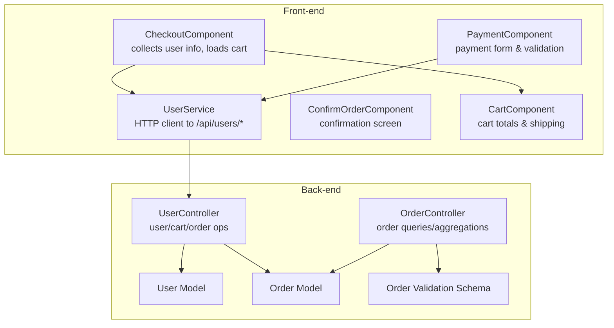
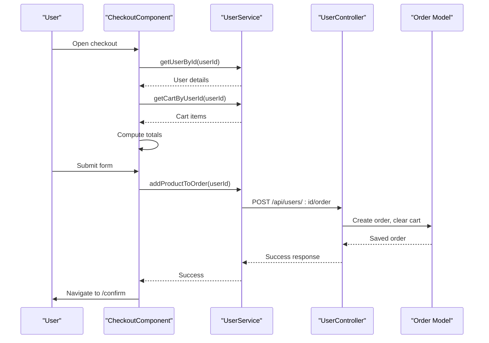
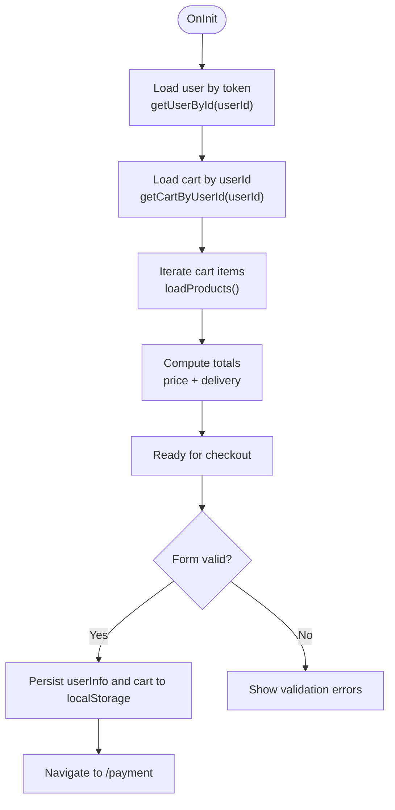
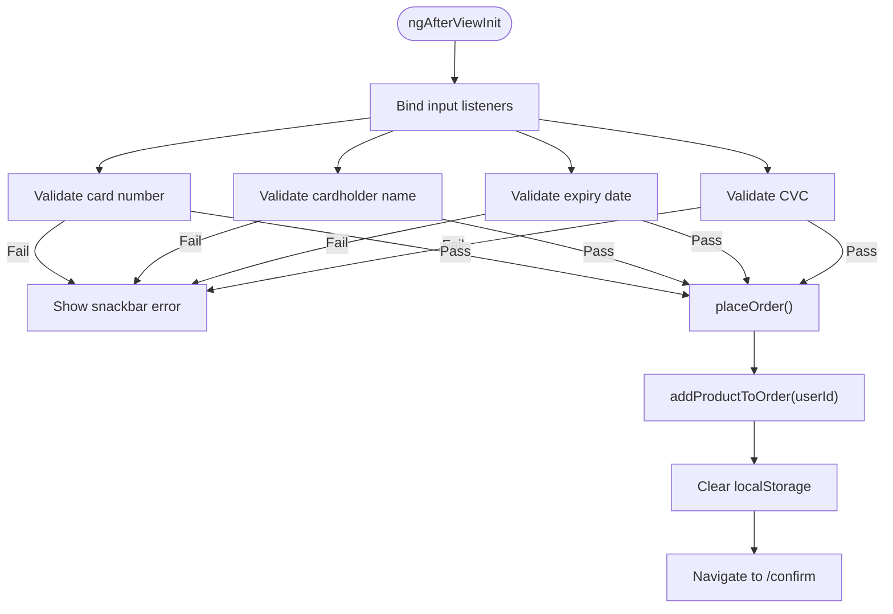
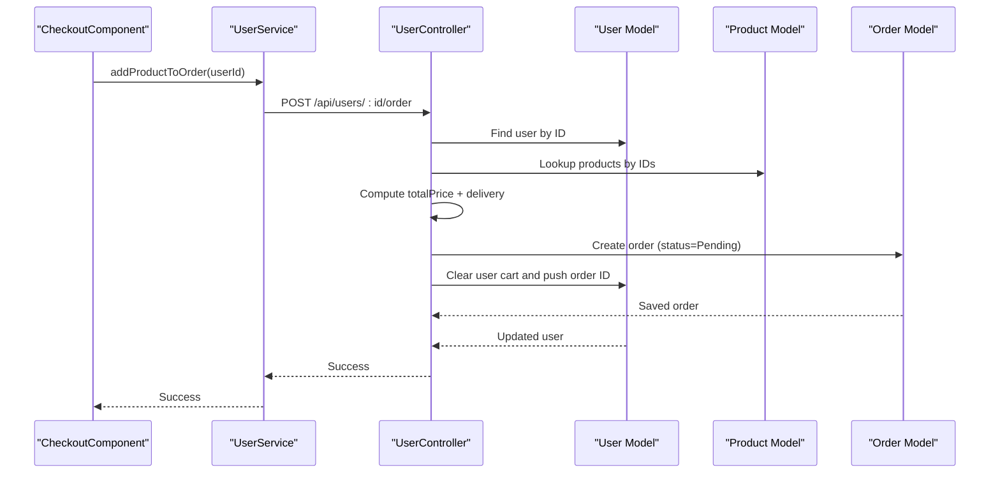
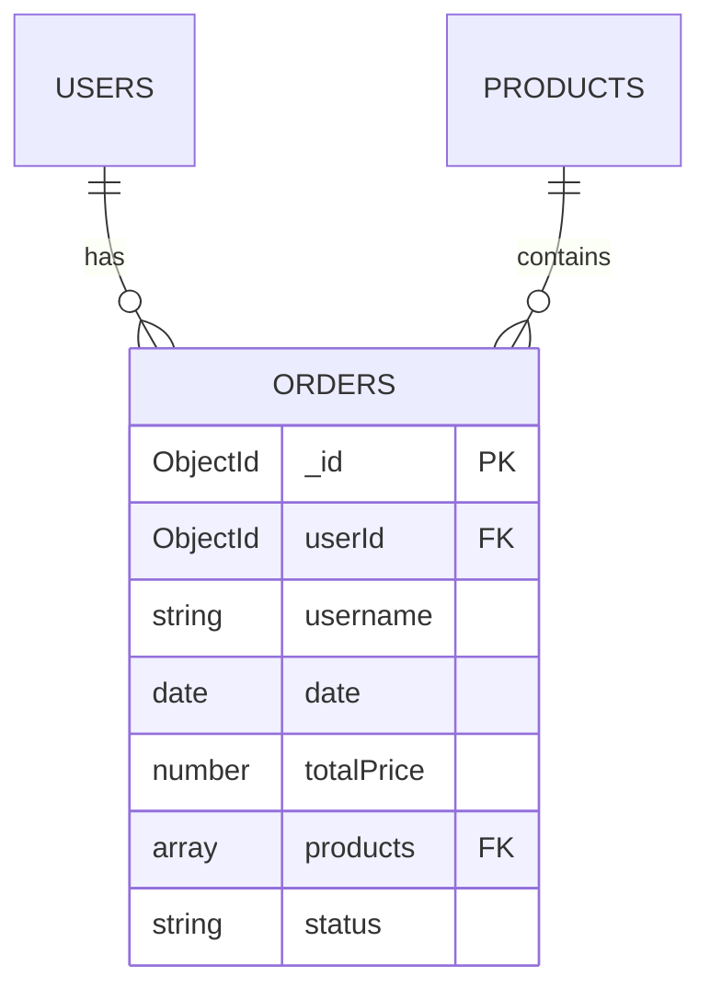
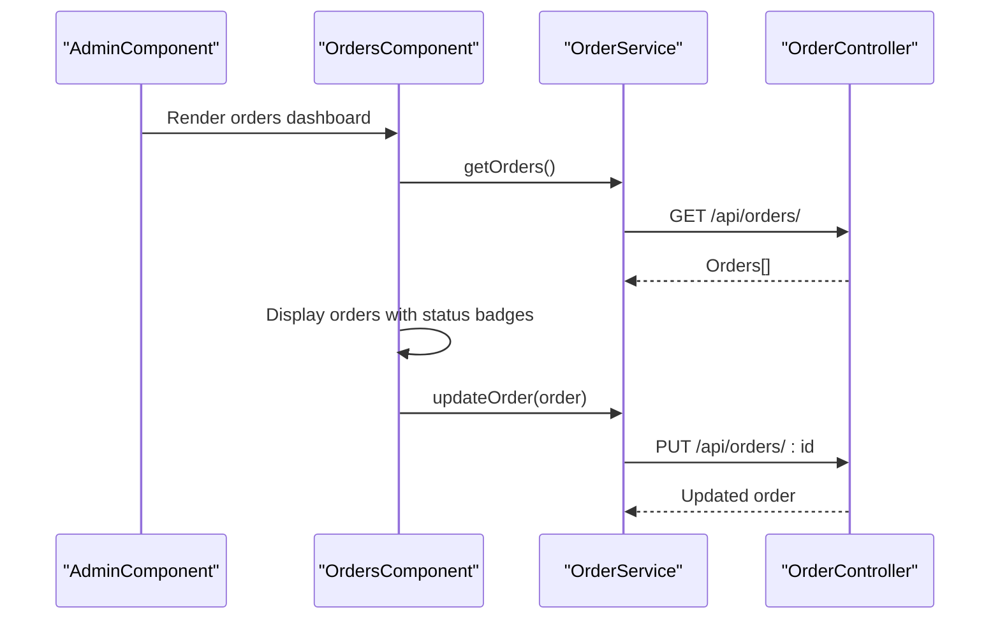
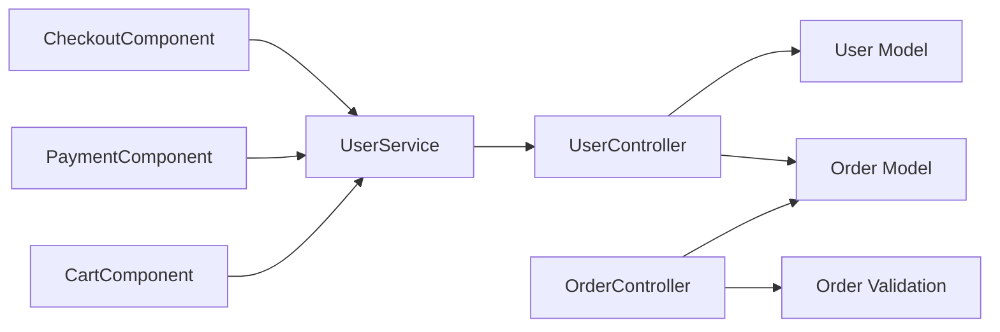

# Checkout and Order Processing

<cite>
**Referenced Files in This Document**
- [checkout.component.ts](file://Front-end/src/app/features/shop/pages/checkout/checkout.component.ts)
- [user.model.ts](file://Front-end/src/app/features/shop/pages/checkout/user.model.ts)
- [user.service.ts](file://Front-end/src/app/features/shop/pages/checkout/user.service.ts)
- [payment.component.ts](file://Front-end/src/app/features/shop/pages/payment/payment.component.ts)
- [confirm-order.component.ts](file://Front-end/src/app/features/shop/pages/confirm-order/confirm-order.component.ts)
- [cart.component.ts](file://Front-end/src/app/features/shop/pages/cart/cart.component.ts)
- [user.controller.js](file://Back-end/src/Controllers/user.controller.js)
- [order.controller.js](file://Back-end/src/Controllers/order.controller.js)
- [order.model.js](file://Back-end/src/Models/order.model.js)
- [order.validation.js](file://Back-end/src/Middlewares/order.validation.js)
- [user.routes.js](file://Back-end/src/Routes/user.routes.js)
- [order.routes.js](file://Back-end/src/Routes/order.routes.js)
- [orders.component.ts](file://Front-end/src/app/features/admin/components/orders/orders.component.ts)
- [orders.component.html](file://Front-end/src/app/features/admin/components/orders/orders.component.html)
- [profile.component.ts](file://Front-end/src/app/features/auth/pages/profile/profile.component.ts)
- [profile.component.html](file://Front-end/src/app/features/auth/pages/profile/profile.component.html)
</cite>

## Table of Contents
1. [Introduction](#introduction)
2. [Project Structure](#project-structure)
3. [Core Components](#core-components)
4. [Architecture Overview](#architecture-overview)
5. [Detailed Component Analysis](#detailed-component-analysis)
6. [Dependency Analysis](#dependency-analysis)
7. [Performance Considerations](#performance-considerations)
8. [Troubleshooting Guide](#troubleshooting-guide)
9. [Conclusion](#conclusion)

## Introduction
This document explains the checkout and order processing workflow end-to-end. It covers user information collection, shipping and billing considerations, payment processing simulation, order creation, and confirmation. It also documents form validation patterns, user and order data models, state management during the checkout funnel, error handling, order status tracking, and user feedback mechanisms. Integration points with backend services and routes are described, along with administrative order management.

## Project Structure
The checkout and order processing spans front-end Angular components and services, and back-end Express controllers and models. The front-end handles user input, cart state, and navigation; the back-end manages user, cart, and order persistence and validation.

**Diagram sources**
- [checkout.component.ts](file://Front-end/src/app/features/shop/pages/checkout/checkout.component.ts#L20-L136)
- [user.service.ts](file://Front-end/src/app/features/shop/pages/checkout/user.service.ts#L9-L36)
- [payment.component.ts](file://Front-end/src/app/features/shop/pages/payment/payment.component.ts#L16-L139)
- [confirm-order.component.ts](file://Front-end/src/app/features/shop/pages/confirm-order/confirm-order.component.ts#L12-L19)
- [cart.component.ts](file://Front-end/src/app/features/shop/pages/cart/cart.component.ts#L23-L201)
- [user.controller.js](file://Back-end/src/Controllers/user.controller.js#L224-L270)
- [order.controller.js](file://Back-end/src/Controllers/order.controller.js#L7-L31)
- [order.model.js](file://Back-end/src/Models/order.model.js#L3-L12)
- [order.validation.js](file://Back-end/src/Middlewares/order.validation.js#L4-L28)

**Section sources**
- [checkout.component.ts](file://Front-end/src/app/features/shop/pages/checkout/checkout.component.ts#L20-L136)
- [user.service.ts](file://Front-end/src/app/features/shop/pages/checkout/user.service.ts#L9-L36)
- [payment.component.ts](file://Front-end/src/app/features/shop/pages/payment/payment.component.ts#L16-L139)
- [confirm-order.component.ts](file://Front-end/src/app/features/shop/pages/confirm-order/confirm-order.component.ts#L12-L19)
- [cart.component.ts](file://Front-end/src/app/features/shop/pages/cart/cart.component.ts#L23-L201)
- [user.controller.js](file://Back-end/src/Controllers/user.controller.js#L224-L270)
- [order.controller.js](file://Back-end/src/Controllers/order.controller.js#L7-L31)
- [order.model.js](file://Back-end/src/Models/order.model.js#L3-L12)
- [order.validation.js](file://Back-end/src/Middlewares/order.validation.js#L4-L28)

## Core Components
- CheckoutComponent: Initializes the checkout form, loads user and cart data, computes totals, and navigates to payment or places orders.
- UserService: Encapsulates HTTP calls to user endpoints for retrieving user info, cart, and placing orders.
- PaymentComponent: Handles payment form formatting and validation, triggers order placement, and provides user feedback.
- ConfirmOrderComponent: Displays order confirmation and provides navigation to continue shopping.
- CartComponent: Manages cart totals, shipping cost calculation, and country selection for shipping.
- UserController: Implements user/cart/order operations including adding to order and computing totals.
- OrderController: Provides order retrieval, updates, and analytics endpoints.
- Order Model and Validation: Defines order schema and validates incoming order payloads.

**Section sources**
- [checkout.component.ts](file://Front-end/src/app/features/shop/pages/checkout/checkout.component.ts#L20-L136)
- [user.service.ts](file://Front-end/src/app/features/shop/pages/checkout/user.service.ts#L9-L36)
- [payment.component.ts](file://Front-end/src/app/features/shop/pages/payment/payment.component.ts#L16-L139)
- [confirm-order.component.ts](file://Front-end/src/app/features/shop/pages/confirm-order/confirm-order.component.ts#L12-L19)
- [cart.component.ts](file://Front-end/src/app/features/shop/pages/cart/cart.component.ts#L23-L201)
- [user.controller.js](file://Back-end/src/Controllers/user.controller.js#L224-L270)
- [order.controller.js](file://Back-end/src/Controllers/order.controller.js#L7-L31)
- [order.model.js](file://Back-end/src/Models/order.model.js#L3-L12)
- [order.validation.js](file://Back-end/src/Middlewares/order.validation.js#L4-L28)

## Architecture Overview
The checkout flow integrates front-end components with back-end controllers via REST endpoints. The front-end collects user input, loads cart data, optionally validates payment details, and posts to backend to create an order. The back-end persists the order, clears the user’s cart, and updates related collections.

**Diagram sources**
- [checkout.component.ts](file://Front-end/src/app/features/shop/pages/checkout/checkout.component.ts#L39-L56)
- [user.service.ts](file://Front-end/src/app/features/shop/pages/checkout/user.service.ts#L23-L25)
- [user.controller.js](file://Back-end/src/Controllers/user.controller.js#L224-L270)
- [order.model.js](file://Back-end/src/Models/order.model.js#L3-L12)

## Detailed Component Analysis

### Checkout Component
Responsibilities:
- Initialize reactive form with required fields for user information.
- Load logged-in user details and prefill form.
- Load cart and compute totals (including flat-rate shipping).
- Persist user info and cart to local storage before payment.
- Place order via backend and navigate to confirmation.

Key behaviors:
- Form validation uses Angular validators for required fields.
- Totals computed by iterating cart items and summing product prices plus fixed delivery cost.
- Navigation to payment or direct order placement depending on UX flow.

**Diagram sources**
- [checkout.component.ts](file://Front-end/src/app/features/shop/pages/checkout/checkout.component.ts#L29-L96)

**Section sources**
- [checkout.component.ts](file://Front-end/src/app/features/shop/pages/checkout/checkout.component.ts#L20-L136)
- [user.model.ts](file://Front-end/src/app/features/shop/pages/checkout/user.model.ts#L1-L11)
- [user.service.ts](file://Front-end/src/app/features/shop/pages/checkout/user.service.ts#L9-L36)

### Payment Component
Responsibilities:
- Format credit card inputs (number, expiry, CVC).
- Validate card number, holder, expiry, and CVC using regex and date checks.
- Provide user feedback via snack bar.
- Place order by invoking backend order endpoint.

Validation highlights:
- Card number format validation.
- Cardholder name alphabetic validation.
- Expiry date format and future-date validation.
- CVC numeric validation with length limit.

**Diagram sources**
- [payment.component.ts](file://Front-end/src/app/features/shop/pages/payment/payment.component.ts#L23-L139)

**Section sources**
- [payment.component.ts](file://Front-end/src/app/features/shop/pages/payment/payment.component.ts#L16-L139)

### Confirm Order Component
Responsibilities:
- Display order confirmation.
- Allow user to continue shopping.

**Section sources**
- [confirm-order.component.ts](file://Front-end/src/app/features/shop/pages/confirm-order/confirm-order.component.ts#L12-L19)

### Cart Component
Responsibilities:
- Manage cart items, quantities, and totals.
- Compute shipping costs and allow country selection.
- Integrate with backend cart operations for authenticated users.

Notes:
- Shipping cost logic differs from checkout totals computation; cart totals include a flat rate and selected country.
- Supports guest and authenticated user modes.

**Section sources**
- [cart.component.ts](file://Front-end/src/app/features/shop/pages/cart/cart.component.ts#L23-L201)
- [cart.component.html](file://Front-end/src/app/features/shop/pages/cart/cart.component.html#L44-L104)

### Backend Order Creation (UserController)
Responsibilities:
- Aggregate cart items and compute total price.
- Add fixed delivery fee to total.
- Create an order record with status set to Pending.
- Clear user cart and append order ID to user’s order history.
- Persist changes and return success.

**Diagram sources**
- [user.controller.js](file://Back-end/src/Controllers/user.controller.js#L224-L270)
- [order.model.js](file://Back-end/src/Models/order.model.js#L3-L12)

**Section sources**
- [user.controller.js](file://Back-end/src/Controllers/user.controller.js#L224-L270)

### Order Data Models and Validation
- Order Model: Defines schema for orders including user reference, username, date, total price, product references, and status.
- Order Validation: Uses AJV to validate order payload structure and enums for status.

**Diagram sources**
- [order.model.js](file://Back-end/src/Models/order.model.js#L3-L12)

**Section sources**
- [order.model.js](file://Back-end/src/Models/order.model.js#L3-L12)
- [order.validation.js](file://Back-end/src/Middlewares/order.validation.js#L4-L28)

### Administrative Order Management
- Admin dashboard lists orders with status indicators and actions.
- Actions allow changing order status to Accepted, Rejected, or Pending.
- Computes days since order date for display.

**Diagram sources**
- [orders.component.ts](file://Front-end/src/app/features/admin/components/orders/orders.component.ts#L32-L87)
- [orders.component.html](file://Front-end/src/app/features/admin/components/orders/orders.component.html#L23-L87)
- [order.routes.js](file://Back-end/src/Routes/order.routes.js#L10-L15)
- [order.controller.js](file://Back-end/src/Controllers/order.controller.js#L59-L74)

**Section sources**
- [orders.component.ts](file://Front-end/src/app/features/admin/components/orders/orders.component.ts#L15-L89)
- [orders.component.html](file://Front-end/src/app/features/admin/components/orders/orders.component.html#L1-L93)
- [order.routes.js](file://Back-end/src/Routes/order.routes.js#L1-L19)
- [order.controller.js](file://Back-end/src/Controllers/order.controller.js#L59-L74)

## Dependency Analysis
Front-end dependencies:
- CheckoutComponent depends on UserService for user/cart/order operations.
- PaymentComponent depends on UserService and CoreProductService for order placement.
- CartComponent depends on CartService and CoreProductService for cart operations.
- ConfirmOrderComponent depends on Router for navigation.

Back-end dependencies:
- UserController orchestrates user, product, and order persistence.
- OrderController exposes endpoints for order queries and updates.
- Order model and validation enforce schema and status constraints.

**Diagram sources**
- [checkout.component.ts](file://Front-end/src/app/features/shop/pages/checkout/checkout.component.ts#L20-L136)
- [user.service.ts](file://Front-end/src/app/features/shop/pages/checkout/user.service.ts#L9-L36)
- [payment.component.ts](file://Front-end/src/app/features/shop/pages/payment/payment.component.ts#L16-L139)
- [cart.component.ts](file://Front-end/src/app/features/shop/pages/cart/cart.component.ts#L23-L201)
- [user.controller.js](file://Back-end/src/Controllers/user.controller.js#L224-L270)
- [order.controller.js](file://Back-end/src/Controllers/order.controller.js#L7-L31)
- [order.validation.js](file://Back-end/src/Middlewares/order.validation.js#L4-L28)

**Section sources**
- [checkout.component.ts](file://Front-end/src/app/features/shop/pages/checkout/checkout.component.ts#L20-L136)
- [user.service.ts](file://Front-end/src/app/features/shop/pages/checkout/user.service.ts#L9-L36)
- [payment.component.ts](file://Front-end/src/app/features/shop/pages/payment/payment.component.ts#L16-L139)
- [cart.component.ts](file://Front-end/src/app/features/shop/pages/cart/cart.component.ts#L23-L201)
- [user.controller.js](file://Back-end/src/Controllers/user.controller.js#L224-L270)
- [order.controller.js](file://Back-end/src/Controllers/order.controller.js#L7-L31)
- [order.validation.js](file://Back-end/src/Middlewares/order.validation.js#L4-L28)

## Performance Considerations
- Minimize repeated network requests by caching user and cart data where appropriate.
- Batch product lookups when computing totals to reduce round trips.
- Use client-side totals computation only for display; rely on backend totals for order creation to avoid discrepancies.
- Debounce input formatting in payment form to prevent excessive reflows.

## Troubleshooting Guide
Common issues and remedies:
- Payment validation failures: Ensure card number, expiry, and CVC meet format and range constraints; verify snackbar messages for immediate feedback.
- Order placement errors: Confirm user is authenticated and cart is not empty; check backend logs for 404/not found or 500/internal server errors.
- Totals mismatch: Verify frontend and backend totals calculation; ensure delivery cost alignment across components.
- Order status not updating: Confirm admin actions are routed to PUT /api/orders/:id and that status values are enum-approved.

Operational references:
- Payment validation and feedback: [payment.component.ts](file://Front-end/src/app/features/shop/pages/payment/payment.component.ts#L86-L115)
- Order placement and navigation: [checkout.component.ts](file://Front-end/src/app/features/shop/pages/checkout/checkout.component.ts#L118-L134), [payment.component.ts](file://Front-end/src/app/features/shop/pages/payment/payment.component.ts#L120-L137)
- Order status management (admin): [orders.component.ts](file://Front-end/src/app/features/admin/components/orders/orders.component.ts#L44-L87), [order.routes.js](file://Back-end/src/Routes/order.routes.js#L14-L15)

**Section sources**
- [payment.component.ts](file://Front-end/src/app/features/shop/pages/payment/payment.component.ts#L86-L115)
- [checkout.component.ts](file://Front-end/src/app/features/shop/pages/checkout/checkout.component.ts#L118-L134)
- [orders.component.ts](file://Front-end/src/app/features/admin/components/orders/orders.component.ts#L44-L87)
- [order.routes.js](file://Back-end/src/Routes/order.routes.js#L14-L15)

## Conclusion
The checkout and order processing workflow integrates front-end components for user input and cart management with robust back-end controllers for order creation and persistence. The design emphasizes clear separation of concerns, explicit validation, and user feedback. Administrative controls enable order lifecycle management with status transitions. Extending the system can focus on integrating real payment gateways, enhancing error resilience, and standardizing totals computation across components.