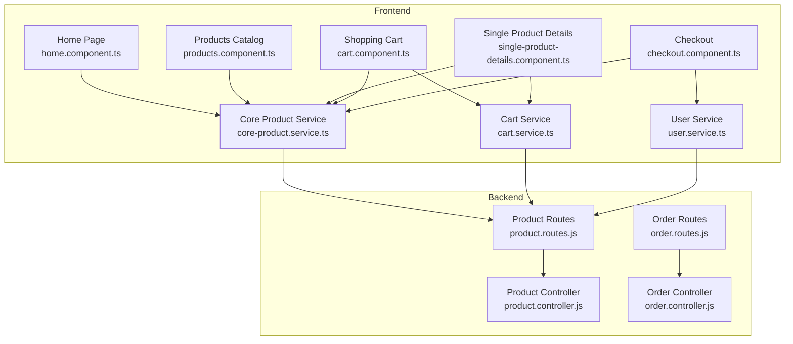
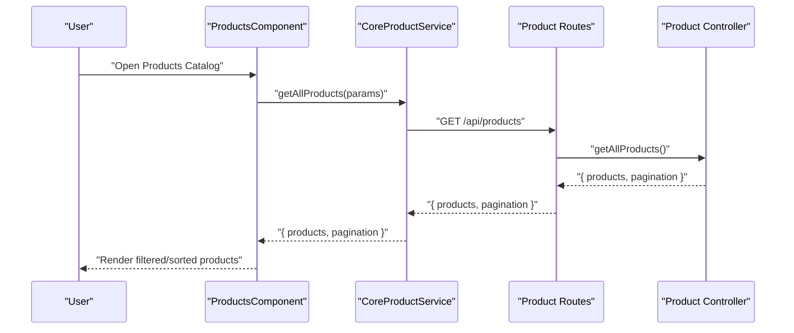
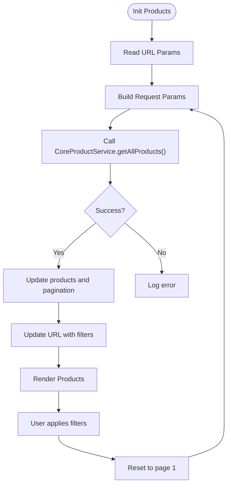
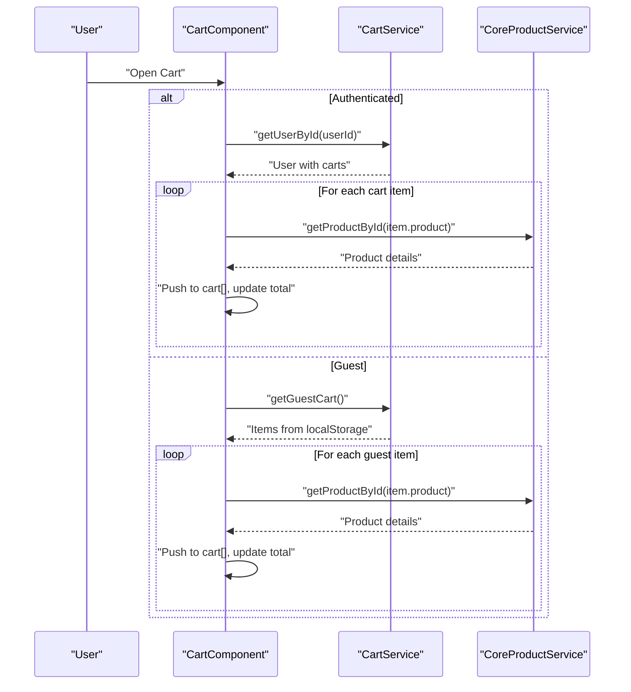
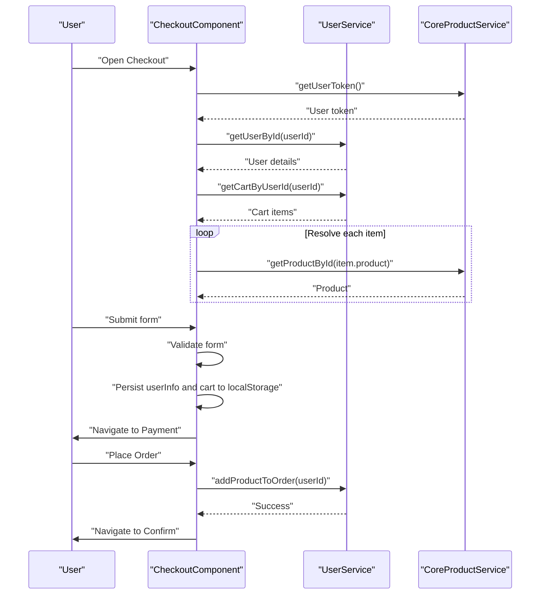
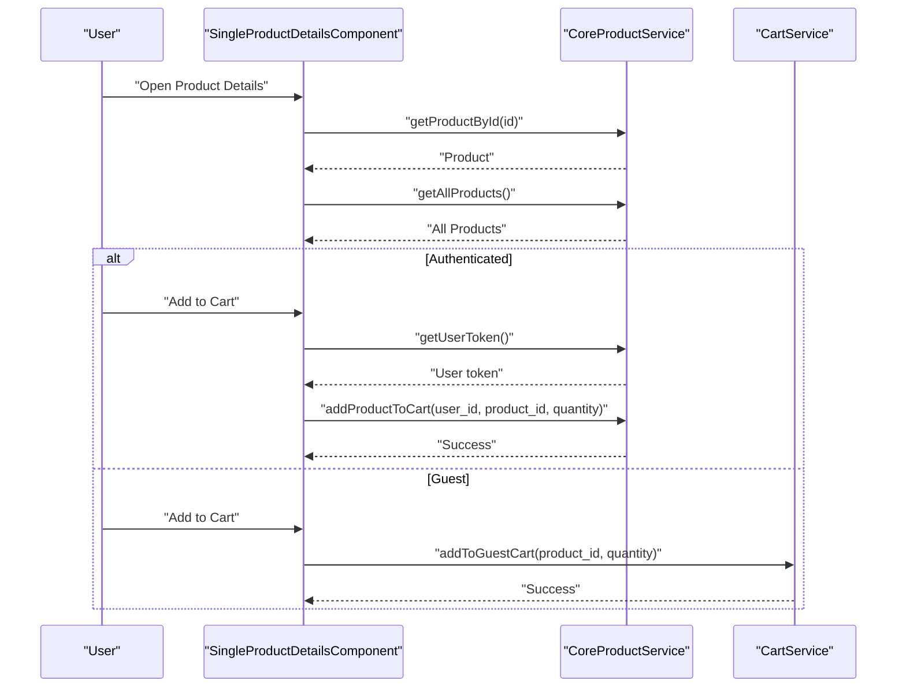
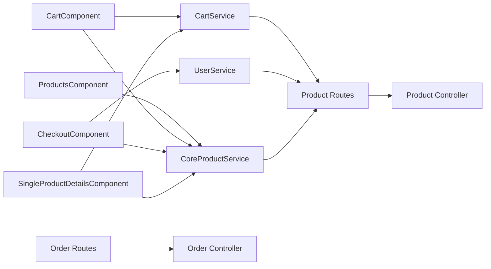

# Customer Portal Features

<cite>
**Referenced Files in This Document**
- [home.component.ts](file://Front-end/src/app/features/shop/pages/home/home.component.ts)
- [products.component.ts](file://Front-end/src/app/features/shop/pages/products/products.component.ts)
- [cart.component.ts](file://Front-end/src/app/features/shop/pages/cart/cart.component.ts)
- [checkout.component.ts](file://Front-end/src/app/features/shop/pages/checkout/checkout.component.ts)
- [single-product-details.component.ts](file://Front-end/src/app/features/shop/pages/single-product-details/single-product-details.component.ts)
- [cart.service.ts](file://Front-end/src/app/core/services/cart.service.ts)
- [core-product.service.ts](file://Front-end/src/app/core/services/core-product.service.ts)
- [cart.models.ts](file://Front-end/src/app/core/models/cart.models.ts)
- [user.service.ts](file://Front-end/src/app/features/shop/pages/checkout/user.service.ts)
- [user.model.ts](file://Front-end/src/app/features/shop/pages/checkout/user.model.ts)
- [product.controller.js](file://Back-end/src/Controllers/product.controller.js)
- [order.controller.js](file://Back-end/src/Controllers/order.controller.js)
- [product.routes.js](file://Back-end/src/Routes/product.routes.js)
- [order.routes.js](file://Back-end/src/Routes/order.routes.js)
</cite>

## Table of Contents
1. [Introduction](#introduction)
2. [Project Structure](#project-structure)
3. [Core Components](#core-components)
4. [Architecture Overview](#architecture-overview)
5. [Detailed Component Analysis](#detailed-component-analysis)
6. [Dependency Analysis](#dependency-analysis)
7. [Performance Considerations](#performance-considerations)
8. [Troubleshooting Guide](#troubleshooting-guide)
9. [Conclusion](#conclusion)

## Introduction
This document describes the customer portal features for browsing, searching, filtering, purchasing, and reviewing products. It covers:
- Homepage with product showcases
- Products catalog with filtering and search
- Shopping cart with item management and persistence
- Checkout process with form validation and order placement
- Single product details page with reviews and related products

It documents component interactions, state management for cart persistence, form handling patterns, and user experience flows, including integrations with product services and order processing workflows.

## Project Structure
The customer portal is implemented in Angular under the Front-end directory. Key areas:
- Home page: showcase featured products
- Products catalog: list, filter, search, pagination, sorting
- Cart: manage items, guest vs authenticated user persistence
- Checkout: prefill user info, validate form, place order
- Single product details: product info, reviews, related items, add to cart

**Diagram sources**
- [home.component.ts](file://Front-end/src/app/features/shop/pages/home/home.component.ts#L1-L19)
- [products.component.ts](file://Front-end/src/app/features/shop/pages/products/products.component.ts#L1-L217)
- [cart.component.ts](file://Front-end/src/app/features/shop/pages/cart/cart.component.ts#L1-L201)
- [checkout.component.ts](file://Front-end/src/app/features/shop/pages/checkout/checkout.component.ts#L1-L136)
- [single-product-details.component.ts](file://Front-end/src/app/features/shop/pages/single-product-details/single-product-details.component.ts#L1-L414)
- [core-product.service.ts](file://Front-end/src/app/core/services/core-product.service.ts#L1-L75)
- [cart.service.ts](file://Front-end/src/app/core/services/cart.service.ts#L1-L111)
- [user.service.ts](file://Front-end/src/app/features/shop/pages/checkout/user.service.ts#L1-L36)
- [product.controller.js](file://Back-end/src/Controllers/product.controller.js#L1-L348)
- [order.controller.js](file://Back-end/src/Controllers/order.controller.js#L1-L258)
- [product.routes.js](file://Back-end/src/Routes/product.routes.js#L1-L20)
- [order.routes.js](file://Back-end/src/Routes/order.routes.js#L1-L19)

**Section sources**
- [home.component.ts](file://Front-end/src/app/features/shop/pages/home/home.component.ts#L1-L19)
- [products.component.ts](file://Front-end/src/app/features/shop/pages/products/products.component.ts#L1-L217)
- [cart.component.ts](file://Front-end/src/app/features/shop/pages/cart/cart.component.ts#L1-L201)
- [checkout.component.ts](file://Front-end/src/app/features/shop/pages/checkout/checkout.component.ts#L1-L136)
- [single-product-details.component.ts](file://Front-end/src/app/features/shop/pages/single-product-details/single-product-details.component.ts#L1-L414)
- [core-product.service.ts](file://Front-end/src/app/core/services/core-product.service.ts#L1-L75)
- [cart.service.ts](file://Front-end/src/app/core/services/cart.service.ts#L1-L111)
- [user.service.ts](file://Front-end/src/app/features/shop/pages/checkout/user.service.ts#L1-L36)
- [product.controller.js](file://Back-end/src/Controllers/product.controller.js#L1-L348)
- [order.controller.js](file://Back-end/src/Controllers/order.controller.js#L1-L258)
- [product.routes.js](file://Back-end/src/Routes/product.routes.js#L1-L20)
- [order.routes.js](file://Back-end/src/Routes/order.routes.js#L1-L19)

## Core Components
- Home page: renders banner and product showcase components.
- Products catalog: fetches paginated, filtered, and sorted products; supports category, price range, and text search; updates URL query parameters; adds items to cart via user service.
- Cart: loads items from backend or guest storage; supports quantity adjustments and removal; persists country selection; computes totals.
- Checkout: pre-fills user info, validates form, stores cart and user info in local storage, places order via user service.
- Single product details: loads product by ID, related products by category, handles reviews, manages quantity, adds to cart (authenticated or guest), image zoom and full-screen dialog.

**Section sources**
- [home.component.ts](file://Front-end/src/app/features/shop/pages/home/home.component.ts#L1-L19)
- [products.component.ts](file://Front-end/src/app/features/shop/pages/products/products.component.ts#L18-L217)
- [cart.component.ts](file://Front-end/src/app/features/shop/pages/cart/cart.component.ts#L23-L201)
- [checkout.component.ts](file://Front-end/src/app/features/shop/pages/checkout/checkout.component.ts#L20-L136)
- [single-product-details.component.ts](file://Front-end/src/app/features/shop/pages/single-product-details/single-product-details.component.ts#L52-L414)

## Architecture Overview
The customer portal follows a layered Angular architecture:
- Components orchestrate UI and user interactions
- Services abstract HTTP calls and state
- Backend routes expose REST endpoints for products, carts, orders, and user tokens

**Diagram sources**
- [products.component.ts](file://Front-end/src/app/features/shop/pages/products/products.component.ts#L56-L88)
- [core-product.service.ts](file://Front-end/src/app/core/services/core-product.service.ts#L14-L27)
- [product.routes.js](file://Back-end/src/Routes/product.routes.js#L6)
- [product.controller.js](file://Back-end/src/Controllers/product.controller.js#L10-L68)

## Detailed Component Analysis

### Home Page
- Imports and registers child components for banner and product showcase.
- Delegates product fetching and display to child components.

**Section sources**
- [home.component.ts](file://Front-end/src/app/features/shop/pages/home/home.component.ts#L1-L19)

### Products Catalog
- State: filters (category, min/max price, search term), sort, pagination, view mode.
- Behavior:
  - Reads initial filters from URL query parameters on init.
  - Builds request parameters and calls CoreProductService.getAllProducts().
  - Updates URL with current filters to keep links shareable.
  - Adds items to cart by retrieving user token, extracting user ID, and invoking UserService.addProductToCart().
  - Supports grid/large view toggles and sidebar filter menu.

**Diagram sources**
- [products.component.ts](file://Front-end/src/app/features/shop/pages/products/products.component.ts#L43-L141)

**Section sources**
- [products.component.ts](file://Front-end/src/app/features/shop/pages/products/products.component.ts#L18-L217)
- [core-product.service.ts](file://Front-end/src/app/core/services/core-product.service.ts#L14-L27)

### Shopping Cart
- State: cart items, total, selected country, forms visibility.
- Persistence:
  - Authenticated user: loads cart from backend by user ID, resolves product details, updates totals.
  - Guest: loads items from localStorage, resolves product details, updates totals.
  - Country preference persisted in localStorage.
- Item management:
  - Increase/decrease quantity via CartService; backend for authenticated, localStorage for guests.
  - Remove item; clears deleted product reference.
- Computed state via cartState getter.

**Diagram sources**
- [cart.component.ts](file://Front-end/src/app/features/shop/pages/cart/cart.component.ts#L157-L199)
- [cart.service.ts](file://Front-end/src/app/core/services/cart.service.ts#L38-L90)
- [core-product.service.ts](file://Front-end/src/app/core/services/core-product.service.ts#L34-L37)

**Section sources**
- [cart.component.ts](file://Front-end/src/app/features/shop/pages/cart/cart.component.ts#L23-L201)
- [cart.service.ts](file://Front-end/src/app/core/services/cart.service.ts#L1-L111)
- [cart.models.ts](file://Front-end/src/app/core/models/cart.models.ts#L1-L12)
- [core-product.service.ts](file://Front-end/src/app/core/services/core-product.service.ts#L1-L75)

### Checkout
- Prefill user info from token and user endpoint.
- Load cart items by user ID and resolve product details to compute totals.
- Form validation with Angular Reactive Forms; on submit, persist user info and cart to localStorage and navigate to payment.
- Place order by calling UserService.addProductToOrder; navigates to confirmation.

**Diagram sources**
- [checkout.component.ts](file://Front-end/src/app/features/shop/pages/checkout/checkout.component.ts#L29-L134)
- [user.service.ts](file://Front-end/src/app/features/shop/pages/checkout/user.service.ts#L15-L34)
- [user.model.ts](file://Front-end/src/app/features/shop/pages/checkout/user.model.ts#L1-L11)
- [core-product.service.ts](file://Front-end/src/app/core/services/core-product.service.ts#L55-L58)

**Section sources**
- [checkout.component.ts](file://Front-end/src/app/features/shop/pages/checkout/checkout.component.ts#L20-L136)
- [user.service.ts](file://Front-end/src/app/features/shop/pages/checkout/user.service.ts#L1-L36)
- [user.model.ts](file://Front-end/src/app/features/shop/pages/checkout/user.model.ts#L1-L11)

### Single Product Details
- Loads product by ID; redirects to home if not found.
- Loads all products to build related items by matching category.
- Manages quantity, tabs (description/reviews), star rating UI, and review submission.
- Adds to cart:
  - Authenticated: calls CoreProductService.addProductToCart with user_id and quantity.
  - Guest: uses CartService.addToGuestCart and localStorage.
- Provides image dialog for full-screen viewing and product navigation.

**Diagram sources**
- [single-product-details.component.ts](file://Front-end/src/app/features/shop/pages/single-product-details/single-product-details.component.ts#L93-L389)
- [core-product.service.ts](file://Front-end/src/app/core/services/core-product.service.ts#L55-L63)
- [cart.service.ts](file://Front-end/src/app/core/services/cart.service.ts#L44-L54)

**Section sources**
- [single-product-details.component.ts](file://Front-end/src/app/features/shop/pages/single-product-details/single-product-details.component.ts#L52-L414)
- [core-product.service.ts](file://Front-end/src/app/core/services/core-product.service.ts#L1-L75)
- [cart.service.ts](file://Front-end/src/app/core/services/cart.service.ts#L1-L111)

## Dependency Analysis
- Components depend on services for HTTP communication and state management.
- Services depend on backend routes/controllers for CRUD operations.
- CartService coordinates guest/local storage and backend synchronization.
- CoreProductService centralizes product-related API calls.
- UserService bridges user data and cart/order operations.

**Diagram sources**
- [products.component.ts](file://Front-end/src/app/features/shop/pages/products/products.component.ts#L36-L41)
- [cart.component.ts](file://Front-end/src/app/features/shop/pages/cart/cart.component.ts#L35)
- [checkout.component.ts](file://Front-end/src/app/features/shop/pages/checkout/checkout.component.ts#L27)
- [single-product-details.component.ts](file://Front-end/src/app/features/shop/pages/single-product-details/single-product-details.component.ts#L72-L82)
- [cart.service.ts](file://Front-end/src/app/core/services/cart.service.ts#L14-L17)
- [core-product.service.ts](file://Front-end/src/app/core/services/core-product.service.ts#L10)
- [user.service.ts](file://Front-end/src/app/features/shop/pages/checkout/user.service.ts#L11)
- [product.routes.js](file://Back-end/src/Routes/product.routes.js#L1-L20)
- [order.routes.js](file://Back-end/src/Routes/order.routes.js#L1-L19)
- [product.controller.js](file://Back-end/src/Controllers/product.controller.js#L1-L348)
- [order.controller.js](file://Back-end/src/Controllers/order.controller.js#L1-L258)

**Section sources**
- [products.component.ts](file://Front-end/src/app/features/shop/pages/products/products.component.ts#L1-L217)
- [cart.component.ts](file://Front-end/src/app/features/shop/pages/cart/cart.component.ts#L1-L201)
- [checkout.component.ts](file://Front-end/src/app/features/shop/pages/checkout/checkout.component.ts#L1-L136)
- [single-product-details.component.ts](file://Front-end/src/app/features/shop/pages/single-product-details/single-product-details.component.ts#L1-L414)
- [cart.service.ts](file://Front-end/src/app/core/services/cart.service.ts#L1-L111)
- [core-product.service.ts](file://Front-end/src/app/core/services/core-product.service.ts#L1-L75)
- [user.service.ts](file://Front-end/src/app/features/shop/pages/checkout/user.service.ts#L1-L36)
- [product.routes.js](file://Back-end/src/Routes/product.routes.js#L1-L20)
- [order.routes.js](file://Back-end/src/Routes/order.routes.js#L1-L19)
- [product.controller.js](file://Back-end/src/Controllers/product.controller.js#L1-L348)
- [order.controller.js](file://Back-end/src/Controllers/order.controller.js#L1-L258)

## Performance Considerations
- Server-side filtering, sorting, and pagination reduce payload sizes and improve responsiveness in the catalog.
- Client-side computed totals and cart state minimize redundant network calls.
- Guest cart uses localStorage to avoid unnecessary backend requests until sync is needed.
- Image manipulation logic ensures proper rendering without heavy client-side computations.

[No sources needed since this section provides general guidance]

## Troubleshooting Guide
- Product not found:
  - Single product details redirect to home if product lookup fails.
- Cart sync:
  - Guest cart sync to backend occurs via CartService.syncCartWithBackend; ensure user is authenticated and guest cart exists.
- Form validation failures:
  - Checkout form requires specific fields; ensure all validators pass before navigating to payment or placing order.
- Token retrieval:
  - Several components rely on getUserToken; verify cookies and backend token verification are functioning.

**Section sources**
- [single-product-details.component.ts](file://Front-end/src/app/features/shop/pages/single-product-details/single-product-details.component.ts#L96-L107)
- [cart.service.ts](file://Front-end/src/app/core/services/cart.service.ts#L92-L109)
- [checkout.component.ts](file://Front-end/src/app/features/shop/pages/checkout/checkout.component.ts#L107-L116)
- [core-product.service.ts](file://Front-end/src/app/core/services/core-product.service.ts#L55-L58)
- [product.controller.js](file://Back-end/src/Controllers/product.controller.js#L273-L296)

## Conclusion
The customer portal integrates Angular components with backend APIs to deliver a seamless shopping experience. Filtering, search, and pagination are handled efficiently on the server, while cart state is managed consistently for authenticated and guest users. The checkout flow validates user input and securely places orders, and the product details page enriches the user journey with reviews and related items.

[No sources needed since this section summarizes without analyzing specific files]