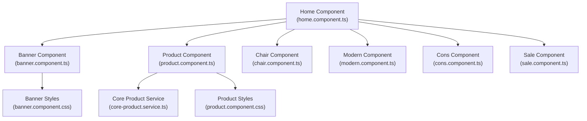
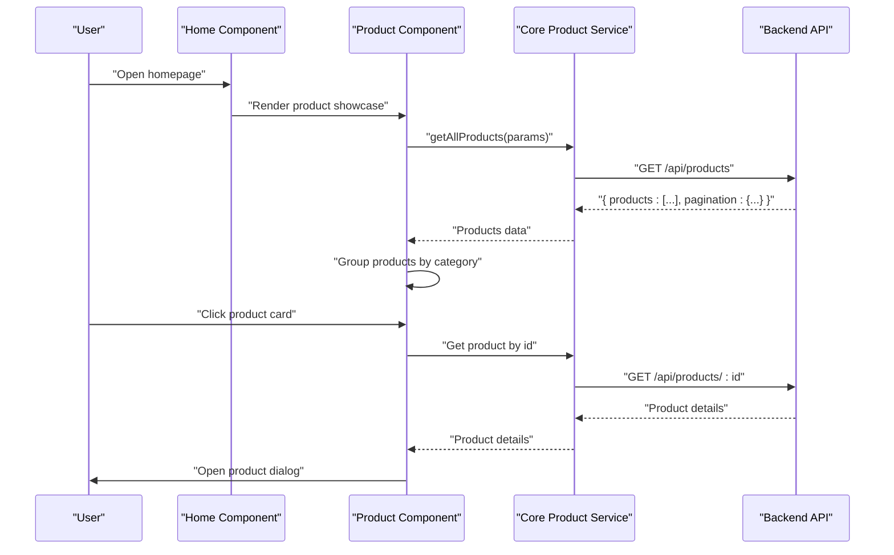
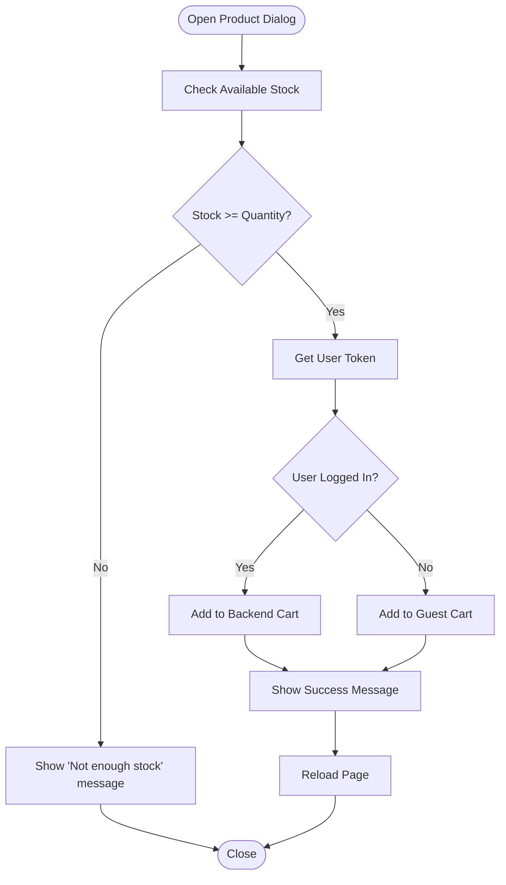
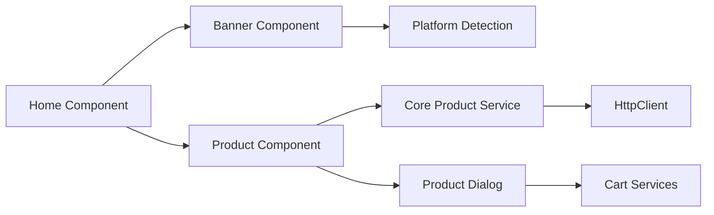

# Homepage and Product Showcase

<cite>
**Referenced Files in This Document**
- [home.component.ts](file://Front-end/src/app/features/shop/pages/home/home.component.ts)
- [home.component.html](file://Front-end/src/app/features/shop/pages/home/home.component.html)
- [banner.component.ts](file://Front-end/src/app/features/shop/pages/home/components/banner/banner.component.ts)
- [banner.component.css](file://Front-end/src/app/features/shop/pages/home/components/banner/banner.component.css)
- [product.component.ts](file://Front-end/src/app/features/shop/pages/home/components/product/product.component.ts)
- [product.component.css](file://Front-end/src/app/features/shop/pages/home/components/product/product.component.css)
- [chair.component.ts](file://Front-end/src/app/features/shop/pages/home/components/chair/chair.component.ts)
- [modern.component.ts](file://Front-end/src/app/features/shop/pages/home/components/modern/modern.component.ts)
- [cons.component.ts](file://Front-end/src/app/features/shop/pages/home/components/cons/cons.component.ts)
- [sale.component.ts](file://Front-end/src/app/features/shop/pages/home/components/sale/sale.component.ts)
- [core-product.service.ts](file://Front-end/src/app/core/services/core-product.service.ts)
- [products.service.ts](file://Front-end/src/app/core/services/products.service.ts)
- [home-product.service.ts](file://Front-end/src/app/core/services/home-product.service.ts)
- [products.component.ts](file://Front-end/src/app/features/shop/pages/products/products.component.ts)
- [one-product.component.ts](file://Front-end/src/app/features/shop/pages/single-product-details/one-product/one-product.component.ts)
</cite>

## Table of Contents
1. [Introduction](#introduction)
2. [Project Structure](#project-structure)
3. [Core Components](#core-components)
4. [Architecture Overview](#architecture-overview)
5. [Detailed Component Analysis](#detailed-component-analysis)
6. [Dependency Analysis](#dependency-analysis)
7. [Performance Considerations](#performance-considerations)
8. [Troubleshooting Guide](#troubleshooting-guide)
9. [Conclusion](#conclusion)

## Introduction
This document explains the homepage and product showcase features of the Lightstorm e-commerce application. It covers the main landing page structure, the banner component for promotional content, featured product displays, and category-specific sections (chair, modern, construction). It also documents component composition patterns, responsive design implementation, carousel functionality, product display logic, integration with product services for dynamic content loading, and user engagement patterns such as product dialogs and cart interactions.

## Project Structure
The homepage is implemented under the Angular shop module. The Home component composes the banner and product showcases, while specialized category components exist for chair, modern, and construction items. Product data is loaded via a core product service that integrates with the backend API.

**Diagram sources**
- [home.component.ts](file://Front-end/src/app/features/shop/pages/home/home.component.ts#L1-L19)
- [banner.component.ts](file://Front-end/src/app/features/shop/pages/home/components/banner/banner.component.ts#L1-L75)
- [product.component.ts](file://Front-end/src/app/features/shop/pages/home/components/product/product.component.ts#L1-L181)
- [chair.component.ts](file://Front-end/src/app/features/shop/pages/home/components/chair/chair.component.ts#L1-L13)
- [modern.component.ts](file://Front-end/src/app/features/shop/pages/home/components/modern/modern.component.ts#L1-L13)
- [cons.component.ts](file://Front-end/src/app/features/shop/pages/home/components/cons/cons.component.ts#L1-L13)
- [sale.component.ts](file://Front-end/src/app/features/shop/pages/home/components/sale/sale.component.ts#L1-L13)
- [core-product.service.ts](file://Front-end/src/app/core/services/core-product.service.ts#L1-L75)
- [banner.component.css](file://Front-end/src/app/features/shop/pages/home/components/banner/banner.component.css#L1-L90)
- [product.component.css](file://Front-end/src/app/features/shop/pages/home/components/product/product.component.css#L1-L85)

**Section sources**
- [home.component.ts](file://Front-end/src/app/features/shop/pages/home/home.component.ts#L1-L19)
- [home.component.html](file://Front-end/src/app/features/shop/pages/home/home.component.html#L1-L8)

## Core Components
- Home Component: Declares and renders the banner and product showcase components. It is a standalone component with minimal logic, delegating data fetching and UI to child components.
- Banner Component: Manages promotional slides and category navigation. It initializes a Bootstrap carousel in the browser environment and exposes slide and category data.
- Product Component: Loads all products, groups them by category, and opens a product dialog for viewing details and adding to cart. It integrates with the core product service and cart services.
- Category Components: Chair, Modern, and Cons components are currently placeholders with minimal structure; they can be extended to render category-specific product grids.
- Sale Component: Placeholder component for sale promotions; can be extended to render sale items and promotional banners.

Key responsibilities:
- Dynamic content loading via HTTP client
- Product grouping and display logic
- User engagement through dialogs and cart actions
- Responsive styling for product cards and carousels

**Section sources**
- [home.component.ts](file://Front-end/src/app/features/shop/pages/home/home.component.ts#L1-L19)
- [home.component.html](file://Front-end/src/app/features/shop/pages/home/home.component.html#L1-L8)
- [banner.component.ts](file://Front-end/src/app/features/shop/pages/home/components/banner/banner.component.ts#L1-L75)
- [product.component.ts](file://Front-end/src/app/features/shop/pages/home/components/product/product.component.ts#L1-L181)
- [chair.component.ts](file://Front-end/src/app/features/shop/pages/home/components/chair/chair.component.ts#L1-L13)
- [modern.component.ts](file://Front-end/src/app/features/shop/pages/home/components/modern/modern.component.ts#L1-L13)
- [cons.component.ts](file://Front-end/src/app/features/shop/pages/home/components/cons/cons.component.ts#L1-L13)
- [sale.component.ts](file://Front-end/src/app/features/shop/pages/home/components/sale/sale.component.ts#L1-L13)

## Architecture Overview
The homepage follows a parent-child composition pattern:
- Home component orchestrates child components.
- Banner component handles promotional content and carousel initialization.
- Product component fetches products, groups them, and manages product dialogs and cart interactions.
- Core product service abstracts HTTP calls to the backend API.

**Diagram sources**
- [home.component.ts](file://Front-end/src/app/features/shop/pages/home/home.component.ts#L1-L19)
- [product.component.ts](file://Front-end/src/app/features/shop/pages/home/components/product/product.component.ts#L1-L181)
- [core-product.service.ts](file://Front-end/src/app/core/services/core-product.service.ts#L1-L75)

## Detailed Component Analysis

### Home Component
- Purpose: Hosts the banner and product showcase sections.
- Composition: Imports and renders Banner and Product components.
- Template: Two rows, one for banner and one for product showcase.

Best practices:
- Keep the home component thin; delegate data fetching and rendering to child components.
- Use standalone components for better modularity.

**Section sources**
- [home.component.ts](file://Front-end/src/app/features/shop/pages/home/home.component.ts#L1-L19)
- [home.component.html](file://Front-end/src/app/features/shop/pages/home/home.component.html#L1-L8)

### Banner Component
- Purpose: Displays promotional slides and category navigation.
- Carousel: Initializes Bootstrap carousel after view render in the browser environment.
- Data: Maintains slide and category arrays for rendering.
- Responsiveness: Uses media queries to adjust carousel height across breakpoints.

Implementation highlights:
- Browser check before initializing carousel to avoid SSR issues.
- Carousel options configured for interval, wrapping, keyboard, and hover behavior.
- Category menu with hover effects and transitions.

**Section sources**
- [banner.component.ts](file://Front-end/src/app/features/shop/pages/home/components/banner/banner.component.ts#L1-L75)
- [banner.component.css](file://Front-end/src/app/features/shop/pages/home/components/banner/banner.component.css#L1-L90)

### Product Component
- Purpose: Load and display products, group by category, and manage product dialogs and cart actions.
- Data flow:
  - Fetches all products via CoreProductService.
  - Groups products by category and limits to a fixed number per category.
  - Opens a dialog with product details and cart controls.
- Dialog logic:
  - Retrieves user token to determine logged-in vs guest behavior.
  - Validates stock availability before adding to cart.
  - Supports quantity selection and adds to backend cart or guest cart accordingly.
- Styling: Hover effects, action buttons, and responsive adjustments for product cards.

User engagement patterns:
- Clicking a product card opens a dialog with product details.
- Quantity controls allow adjusting purchase amount.
- Success/error notifications guide user feedback.

**Section sources**
- [product.component.ts](file://Front-end/src/app/features/shop/pages/home/components/product/product.component.ts#L1-L181)
- [product.component.css](file://Front-end/src/app/features/shop/pages/home/components/product/product.component.css#L1-L85)

### Category Components (Placeholder)
- Chair, Modern, and Cons components are currently minimal placeholders.
- They can be extended to render category-specific product grids by integrating with the core product service and applying similar grouping and display logic as the Product component.

**Section sources**
- [chair.component.ts](file://Front-end/src/app/features/shop/pages/home/components/chair/chair.component.ts#L1-L13)
- [modern.component.ts](file://Front-end/src/app/features/shop/pages/home/components/modern/modern.component.ts#L1-L13)
- [cons.component.ts](file://Front-end/src/app/features/shop/pages/home/components/cons/cons.component.ts#L1-L13)

### Sale Component (Placeholder)
- Placeholder for sale promotions.
- Can be extended to render sale items and promotional banners aligned with the banner component’s design patterns.

**Section sources**
- [sale.component.ts](file://Front-end/src/app/features/shop/pages/home/components/sale/sale.component.ts#L1-L13)

### Product Dialog and Cart Integration
- Dialog component receives product data and exposes controls for quantity and adding to cart.
- For logged-in users, cart addition is handled via the core product service with user token retrieval.
- For guests, cart addition is handled via a cart service for guest carts.
- Stock validation prevents overselling and informs users via notifications.

**Diagram sources**
- [product.component.ts](file://Front-end/src/app/features/shop/pages/home/components/product/product.component.ts#L130-L177)
- [one-product.component.ts](file://Front-end/src/app/features/shop/pages/single-product-details/one-product/one-product.component.ts#L103-L133)

## Dependency Analysis
- Home component depends on Banner and Product components.
- Product component depends on CoreProductService for data and cart services for user actions.
- CoreProductService depends on HttpClient and communicates with the backend API.
- Banner component depends on Bootstrap carousel initialization and uses platform detection for SSR safety.
- Category and sale components are placeholders and depend on future implementations.

**Diagram sources**
- [home.component.ts](file://Front-end/src/app/features/shop/pages/home/home.component.ts#L1-L19)
- [banner.component.ts](file://Front-end/src/app/features/shop/pages/home/components/banner/banner.component.ts#L1-L75)
- [product.component.ts](file://Front-end/src/app/features/shop/pages/home/components/product/product.component.ts#L1-L181)
- [core-product.service.ts](file://Front-end/src/app/core/services/core-product.service.ts#L1-L75)

**Section sources**
- [home.component.ts](file://Front-end/src/app/features/shop/pages/home/home.component.ts#L1-L19)
- [banner.component.ts](file://Front-end/src/app/features/shop/pages/home/components/banner/banner.component.ts#L1-L75)
- [product.component.ts](file://Front-end/src/app/features/shop/pages/home/components/product/product.component.ts#L1-L181)
- [core-product.service.ts](file://Front-end/src/app/core/services/core-product.service.ts#L1-L75)

## Performance Considerations
- Lazy loading: Product images can be lazy-loaded using native browser attributes to improve initial page load performance.
- Carousel initialization: Ensure carousel initialization occurs after view render and only in the browser to prevent SSR overhead.
- Data fetching: Use server-side filtering and pagination for large datasets to reduce payload sizes.
- Dialogs: Open dialogs only when needed to minimize DOM overhead.
- Styling: Media queries are already present; keep CSS scoped to components to avoid global style bloat.

## Troubleshooting Guide
- Carousel not initializing:
  - Verify browser environment before initializing the carousel.
  - Ensure Bootstrap is available and the carousel element exists.
- Product dialog not opening:
  - Confirm product data is fetched and passed to the dialog.
  - Check dialog configuration and Material modules imports.
- Cart actions failing:
  - Verify user token retrieval and backend cart endpoint.
  - Confirm stock validation and error messages are displayed appropriately.
- Responsive layout issues:
  - Review media queries in banner and product component styles.
  - Test across breakpoints to ensure consistent behavior.

**Section sources**
- [banner.component.ts](file://Front-end/src/app/features/shop/pages/home/components/banner/banner.component.ts#L51-L73)
- [product.component.ts](file://Front-end/src/app/features/shop/pages/home/components/product/product.component.ts#L130-L177)
- [product.component.css](file://Front-end/src/app/features/shop/pages/home/components/product/product.component.css#L73-L85)
- [banner.component.css](file://Front-end/src/app/features/shop/pages/home/components/banner/banner.component.css#L70-L90)

## Conclusion
The homepage and product showcase features are structured around a clean component hierarchy with clear separation of concerns. The Banner component provides promotional content and category navigation, while the Product component handles dynamic content loading, grouping, and user engagement through dialogs and cart actions. The Core Product Service abstracts backend communication, enabling scalable enhancements such as category-specific displays and sale promotions. By following the established patterns and best practices, further development can extend the placeholder category and sale components to deliver a robust and engaging shopping experience.