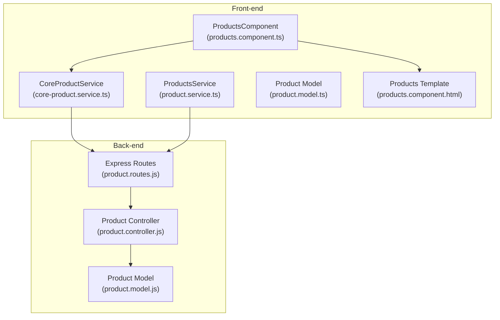
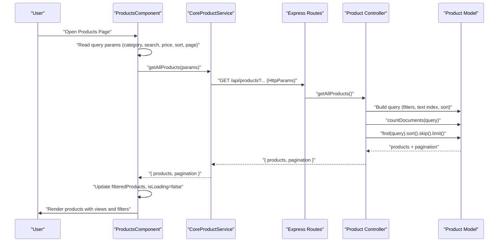
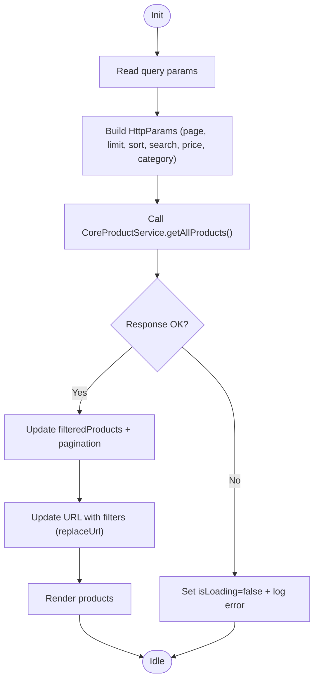
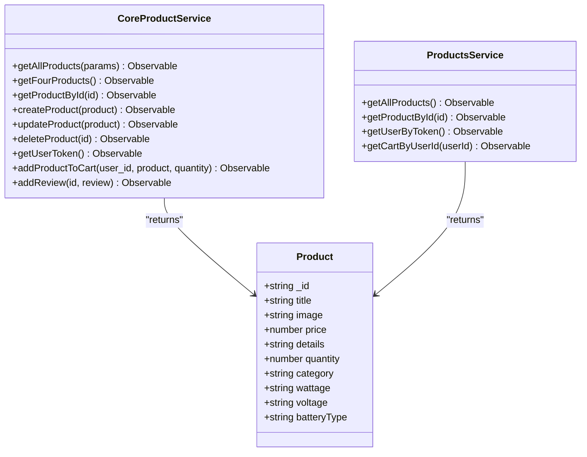
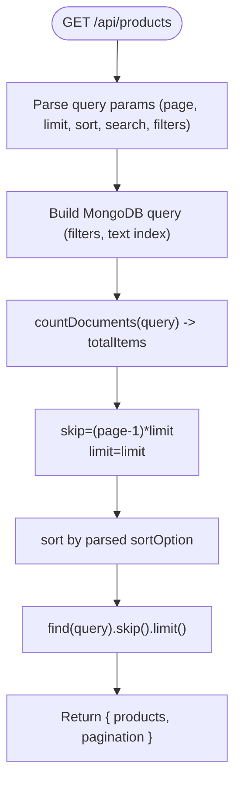
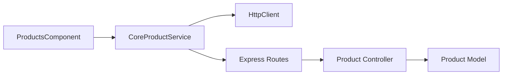

# Product Catalog and Search

<cite>
**Referenced Files in This Document**
- [product.controller.js](file://Back-end/src/Controllers/product.controller.js)
- [product.model.js](file://Back-end/src/Models/product.model.js)
- [product.routes.js](file://Back-end/src/Routes/product.routes.js)
- [product.service.ts](file://Front-end/src/app/features/shop/pages/products/product.service.ts)
- [core-product.service.ts](file://Front-end/src/app/core/services/core-product.service.ts)
- [product.model.ts](file://Front-end/src/app/features/shop/pages/products/product.model.ts)
- [products.component.ts](file://Front-end/src/app/features/shop/pages/products/products.component.ts)
- [products.component.html](file://Front-end/src/app/features/shop/pages/products/products.component.html)
- [products.component.css](file://Front-end/src/app/features/shop/pages/products/products.component.css)
- [productlist.component.ts](file://Front-end/src/app/features/admin/components/productlist/productlist.component.ts)
- [product.service.ts (Admin)](file://Front-end/src/app/features/admin/admin/services/product.service.ts)
</cite>

## Table of Contents
1. [Introduction](#introduction)
2. [Project Structure](#project-structure)
3. [Core Components](#core-components)
4. [Architecture Overview](#architecture-overview)
5. [Detailed Component Analysis](#detailed-component-analysis)
6. [Dependency Analysis](#dependency-analysis)
7. [Performance Considerations](#performance-considerations)
8. [Troubleshooting Guide](#troubleshooting-guide)
9. [Conclusion](#conclusion)

## Introduction
This document explains the product catalog and search functionality, covering the products listing page with filtering, sorting, and search capabilities. It documents the product service implementation for API communication, product model definitions, pagination handling, and real-time search behavior. It also details component state management for filters, error handling patterns, loading states, and infinite scroll considerations. Finally, it explains integration with backend product endpoints, query parameter handling, and user experience optimizations for large product datasets.

## Project Structure
The product catalog spans front-end Angular components and services and back-end Express routes and controllers backed by MongoDB models. The Angular application exposes a products listing page with filtering and pagination, while the back-end exposes REST endpoints for retrieving products with server-side filtering, sorting, and pagination.

**Diagram sources**
- [products.component.ts](file://Front-end/src/app/features/shop/pages/products/products.component.ts#L18-L217)
- [core-product.service.ts](file://Front-end/src/app/core/services/core-product.service.ts#L1-L75)
- [product.service.ts](file://Front-end/src/app/features/shop/pages/products/product.service.ts#L1-L49)
- [product.model.ts](file://Front-end/src/app/features/shop/pages/products/product.model.ts#L1-L13)
- [products.component.html](file://Front-end/src/app/features/shop/pages/products/products.component.html#L1-L144)
- [product.routes.js](file://Back-end/src/Routes/product.routes.js#L1-L20)
- [product.controller.js](file://Back-end/src/Controllers/product.controller.js#L1-L348)
- [product.model.js](file://Back-end/src/Models/product.model.js#L1-L29)

**Section sources**
- [products.component.ts](file://Front-end/src/app/features/shop/pages/products/products.component.ts#L1-L217)
- [core-product.service.ts](file://Front-end/src/app/core/services/core-product.service.ts#L1-L75)
- [product.service.ts](file://Front-end/src/app/features/shop/pages/products/product.service.ts#L1-L49)
- [product.model.ts](file://Front-end/src/app/features/shop/pages/products/product.model.ts#L1-L13)
- [products.component.html](file://Front-end/src/app/features/shop/pages/products/products.component.html#L1-L144)
- [product.routes.js](file://Back-end/src/Routes/product.routes.js#L1-L20)
- [product.controller.js](file://Back-end/src/Controllers/product.controller.js#L1-L348)
- [product.model.js](file://Back-end/src/Models/product.model.js#L1-L29)

## Core Components
- ProductsComponent: Orchestrates filtering, sorting, pagination, URL synchronization, and cart interactions. It reads query parameters on init, loads products via CoreProductService, updates the URL with filters, and handles loading/error states.
- CoreProductService: Encapsulates HTTP calls to the product API, building query parameters and returning paginated responses.
- ProductsService: Provides convenience methods for product retrieval and cart-related operations.
- Product Model: Defines the shape of product data returned by the API.
- Back-end Routes and Controller: Expose GET /api/products with support for filtering, sorting, pagination, and text search.
- Product Model (MongoDB): Defines schema and text index for efficient search.

Key responsibilities:
- Filtering: minPrice, maxPrice, category, and search terms.
- Sorting: server-side sort options derived from query parameters.
- Pagination: page, limit, totalItems, totalPages.
- Real-time search: debounced input triggers immediate API reload.
- Loading and error states: isLoading flag and error callbacks.
- Infinite scroll: not implemented; current UX uses replaceUrl and pagination-aware URL updates.

**Section sources**
- [products.component.ts](file://Front-end/src/app/features/shop/pages/products/products.component.ts#L18-L217)
- [core-product.service.ts](file://Front-end/src/app/core/services/core-product.service.ts#L14-L27)
- [product.service.ts](file://Front-end/src/app/features/shop/pages/products/product.service.ts#L20-L30)
- [product.model.ts](file://Front-end/src/app/features/shop/pages/products/product.model.ts#L1-L13)
- [product.controller.js](file://Back-end/src/Controllers/product.controller.js#L10-L68)
- [product.model.js](file://Back-end/src/Models/product.model.js#L25-L26)

## Architecture Overview
The client-server architecture integrates Angular components with Express routes and MongoDB. The ProductsComponent drives the UI and state, delegating data fetching to CoreProductService, which constructs query parameters and calls the back-end. The back-end applies filtering, sorting, and pagination, returning a structured payload with products and pagination metadata.

**Diagram sources**
- [products.component.ts](file://Front-end/src/app/features/shop/pages/products/products.component.ts#L43-L88)
- [core-product.service.ts](file://Front-end/src/app/core/services/core-product.service.ts#L15-L27)
- [product.routes.js](file://Back-end/src/Routes/product.routes.js#L6-L6)
- [product.controller.js](file://Back-end/src/Controllers/product.controller.js#L10-L68)
- [product.model.js](file://Back-end/src/Models/product.model.js#L25-L26)

## Detailed Component Analysis

### Products Listing Page (ProductsComponent)
Responsibilities:
- Initialize filters from URL query parameters.
- Build HttpParams for server-side filtering, sorting, and pagination.
- Load products and update pagination metadata.
- Update URL with current filters to keep links shareable.
- Handle loading and error states.
- Provide UI actions: view modes, filter toggles, and cart add.

State management:
- Filters: selectedCategory, minPrice, maxPrice, searchTerm.
- Sort: sortOption (default newest-first).
- Pagination: currentPage, pageSize, totalItems, totalPages.
- UI: isLoading, isLargeView.

Behavior highlights:
- Real-time search: input event handler updates searchTerm and triggers reload.
- Price filter: two-way bound inputs with applyPriceFilter.
- Category filter: select element with applyCategoryFilter.
- URL synchronization: replaceUrl prevents polluting browser history.

**Diagram sources**
- [products.component.ts](file://Front-end/src/app/features/shop/pages/products/products.component.ts#L43-L141)

**Section sources**
- [products.component.ts](file://Front-end/src/app/features/shop/pages/products/products.component.ts#L18-L217)
- [products.component.html](file://Front-end/src/app/features/shop/pages/products/products.component.html#L1-L144)
- [products.component.css](file://Front-end/src/app/features/shop/pages/products/products.component.css#L424-L644)

### Product Service Layer
Front-end services:
- CoreProductService: centralizes HTTP calls, builds HttpParams, and returns typed responses.
- ProductsService: convenience methods for product retrieval and cart operations.

Back-end endpoints:
- GET /api/products: supports filters, sorting, pagination, and text search.
- GET /api/products/:id: fetch product by ID.
- GET /api/products/user/product/token: fetch user by JWT cookie.
- POST /api/products/product/addtocart: add product to cart.

**Diagram sources**
- [core-product.service.ts](file://Front-end/src/app/core/services/core-product.service.ts#L1-L75)
- [product.service.ts](file://Front-end/src/app/features/shop/pages/products/product.service.ts#L1-L49)
- [product.model.ts](file://Front-end/src/app/features/shop/pages/products/product.model.ts#L1-L13)

**Section sources**
- [core-product.service.ts](file://Front-end/src/app/core/services/core-product.service.ts#L1-L75)
- [product.service.ts](file://Front-end/src/app/features/shop/pages/products/product.service.ts#L1-L49)
- [product.model.ts](file://Front-end/src/app/features/shop/pages/products/product.model.ts#L1-L13)

### Back-end Implementation (Server-Side Filtering, Sorting, Pagination)
Back-end controller:
- Builds query filters from minPrice, maxPrice, category, and search.
- Applies text search using MongoDB text index.
- Supports flexible sort options parsed from query string.
- Implements pagination with page, limit, skip, and totalItems calculation.

**Diagram sources**
- [product.controller.js](file://Back-end/src/Controllers/product.controller.js#L10-L68)
- [product.model.js](file://Back-end/src/Models/product.model.js#L25-L26)

**Section sources**
- [product.controller.js](file://Back-end/src/Controllers/product.controller.js#L10-L68)
- [product.routes.js](file://Back-end/src/Routes/product.routes.js#L6-L6)
- [product.model.js](file://Back-end/src/Models/product.model.js#L25-L26)

### Admin Product List Integration
Admin component uses a separate product service to manage products. It lists products, opens dialogs for viewing/editing, and deletes items. While the admin UI is distinct from the public catalog, it shares the same back-end endpoints.

**Section sources**
- [productlist.component.ts](file://Front-end/src/app/features/admin/components/productlist/productlist.component.ts#L1-L97)
- [product.service.ts (Admin)](file://Front-end/src/app/features/admin/admin/services/product.service.ts#L1-L26)

## Dependency Analysis
- Front-end ProductsComponent depends on CoreProductService for data and on the template for UI events.
- CoreProductService depends on HttpClient and constructs HttpParams for query parameters.
- Back-end routes depend on the product controller, which interacts with the product model.
- Product model defines the schema and text index used by the controller.

**Diagram sources**
- [products.component.ts](file://Front-end/src/app/features/shop/pages/products/products.component.ts#L36-L41)
- [core-product.service.ts](file://Front-end/src/app/core/services/core-product.service.ts#L12-L27)
- [product.routes.js](file://Back-end/src/Routes/product.routes.js#L1-L20)
- [product.controller.js](file://Back-end/src/Controllers/product.controller.js#L1-L348)
- [product.model.js](file://Back-end/src/Models/product.model.js#L1-L29)

**Section sources**
- [products.component.ts](file://Front-end/src/app/features/shop/pages/products/products.component.ts#L18-L217)
- [core-product.service.ts](file://Front-end/src/app/core/services/core-product.service.ts#L1-L75)
- [product.routes.js](file://Back-end/src/Routes/product.routes.js#L1-L20)
- [product.controller.js](file://Back-end/src/Controllers/product.controller.js#L1-L348)
- [product.model.js](file://Back-end/src/Models/product.model.js#L1-L29)

## Performance Considerations
- Text search: The product model defines a text index on title and details, enabling efficient text search queries on the back-end.
- Pagination: Server-side pagination reduces payload sizes and improves responsiveness for large datasets.
- Query parameter handling: HttpParams ensures only defined, non-empty parameters are sent, minimizing unnecessary filtering overhead.
- Real-time search: Immediate reloads on input changes improve perceived responsiveness; consider debouncing for very large datasets.
- Infinite scroll: Not implemented; current UX relies on replaceUrl and pagination-aware URLs. Implementing virtualized lists or intersection observer would further optimize rendering for large lists.

[No sources needed since this section provides general guidance]

## Troubleshooting Guide
Common issues and resolutions:
- Empty results after filtering: Verify that category values match backend expectations and that search terms are indexed.
- Incorrect sorting: Ensure sort query values correspond to allowed fields and direction indicators.
- Pagination mismatch: Confirm page and limit values are integers and within expected bounds.
- Cart operations fail: Check JWT cookie presence and validity for user token endpoint.
- CORS or proxy issues: Ensure the Angular proxy forwards /api/products to the correct back-end host/port.

Error handling patterns:
- Front-end: ProductsComponent sets isLoading to false on error and logs to console.
- Back-end: Controller wraps logic in try/catch and returns structured error responses.

**Section sources**
- [products.component.ts](file://Front-end/src/app/features/shop/pages/products/products.component.ts#L83-L87)
- [product.controller.js](file://Back-end/src/Controllers/product.controller.js#L65-L67)

## Conclusion
The product catalog and search implementation combines robust server-side filtering, sorting, and pagination with a responsive front-end UI. The ProductsComponent manages filters and pagination state, synchronizes URL parameters for shareability, and integrates with cart operations. The back-end leverages MongoDB text indexing and flexible query construction to deliver fast, scalable search results. For future enhancements, consider debouncing real-time search, implementing infinite scroll, and adding virtualized rendering for very large product catalogs.