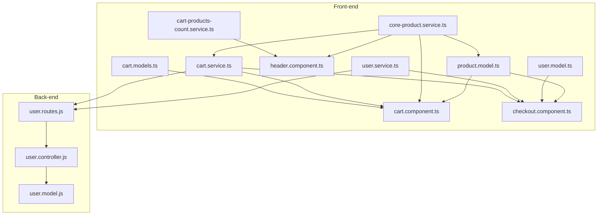
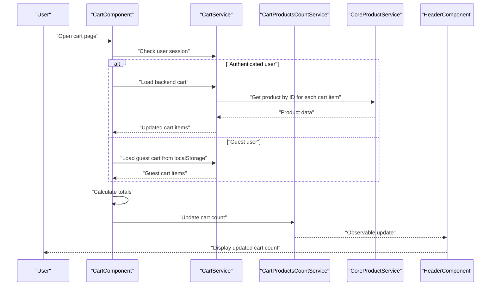
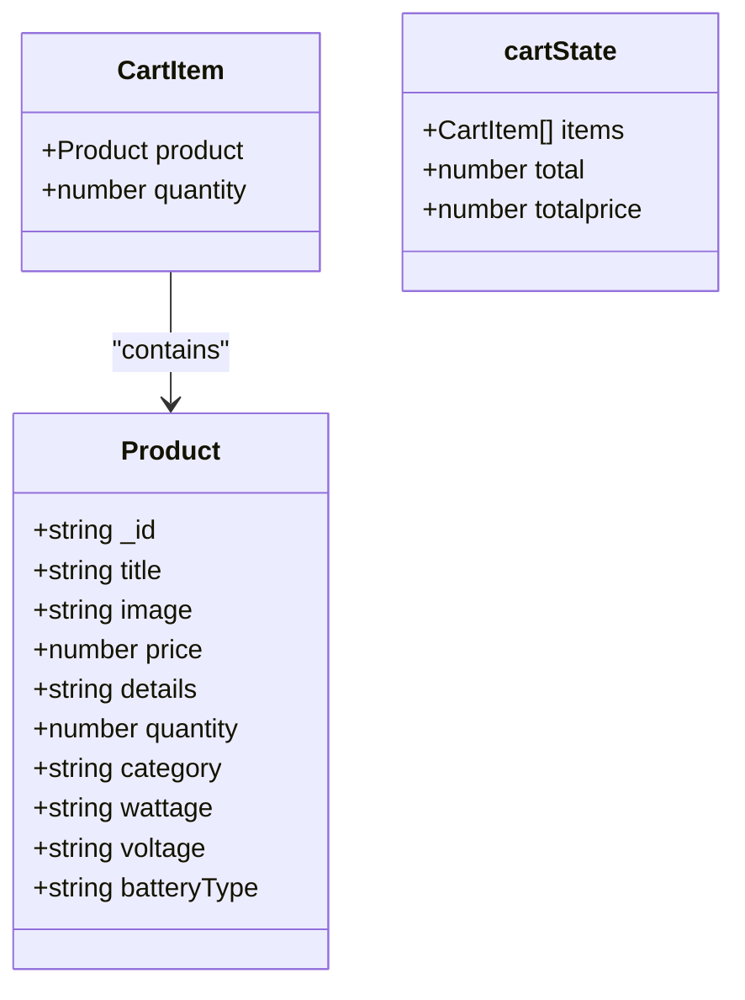
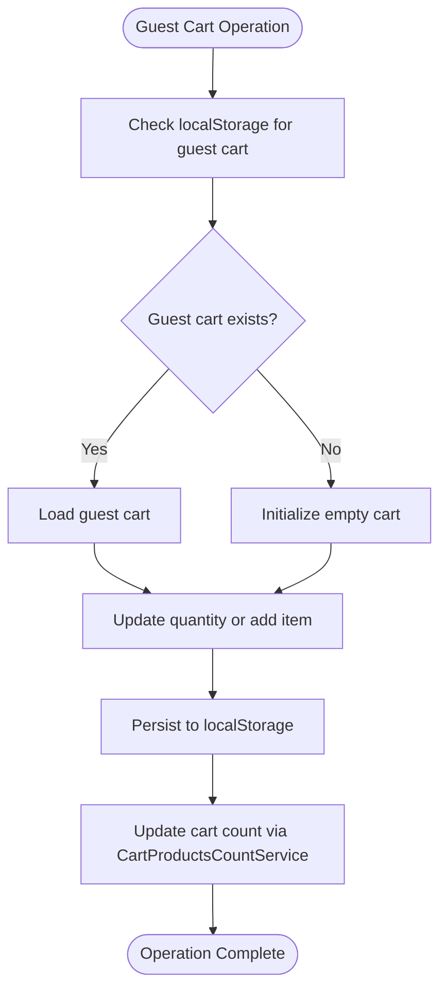
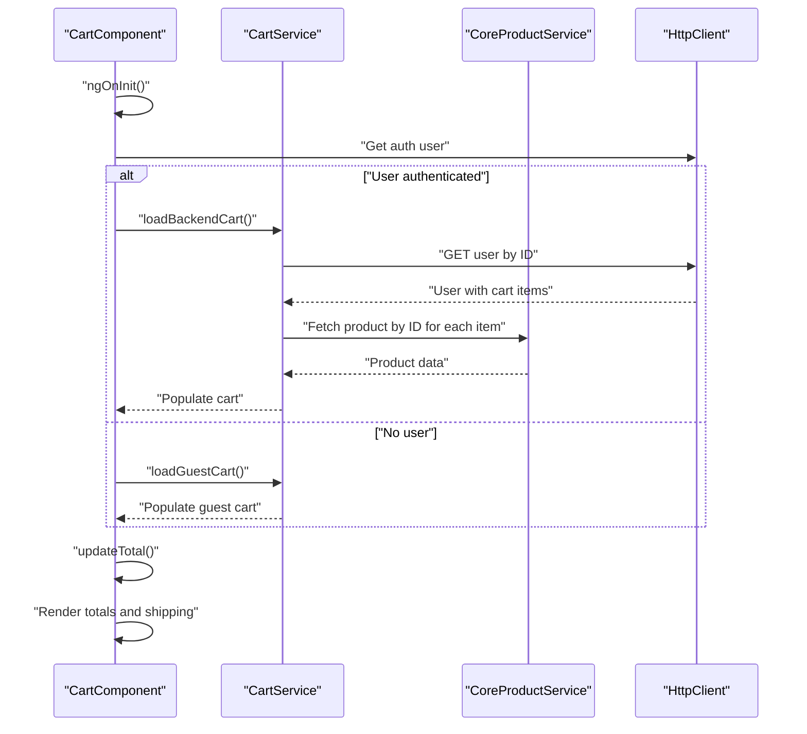
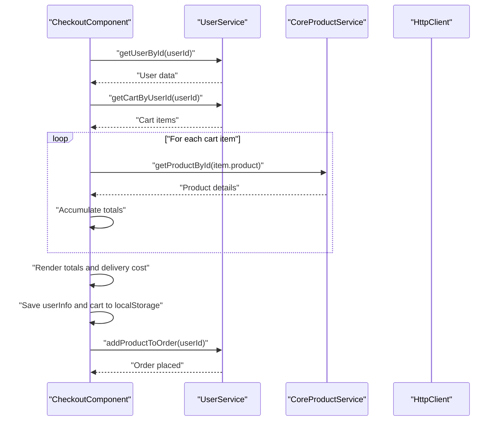
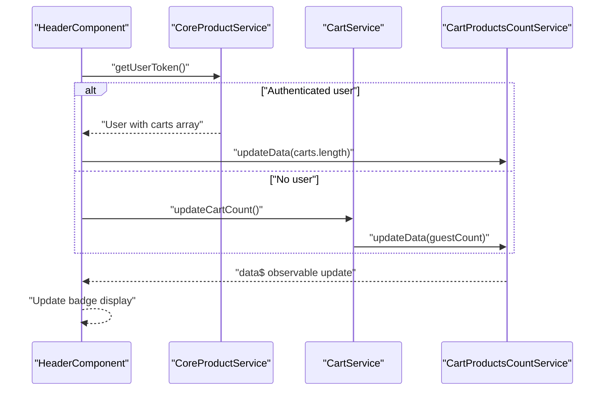
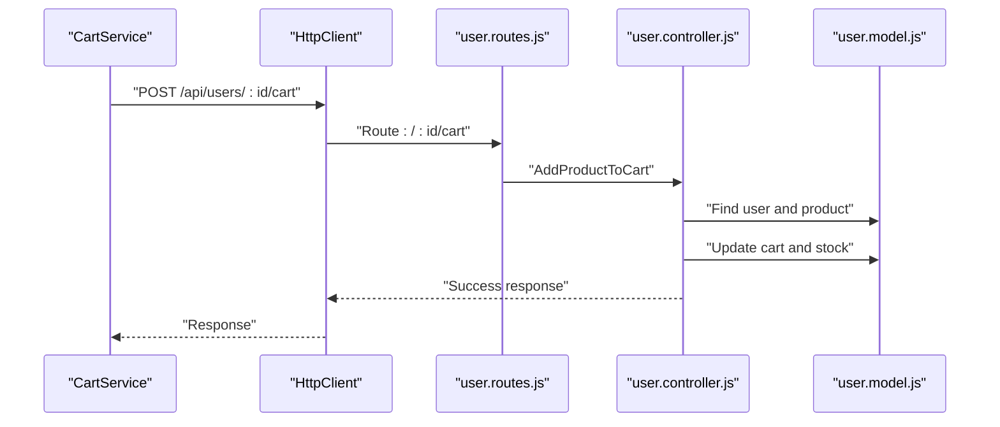
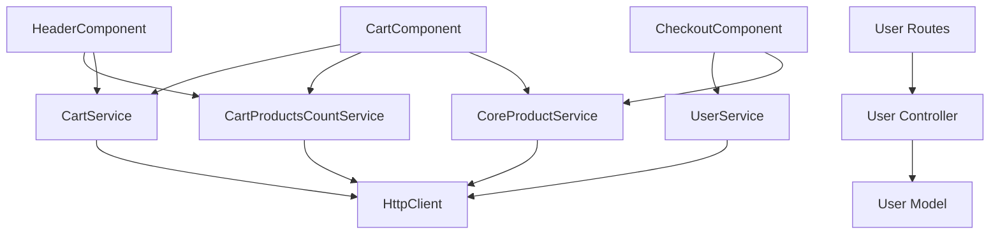

# Shopping Cart Management

<cite>
**Referenced Files in This Document**
- [cart.models.ts](file://Front-end/src/app/core/models/cart.models.ts)
- [cart.service.ts](file://Front-end/src/app/core/services/cart.service.ts)
- [cart-products-count.service.ts](file://Front-end/src/app/core/services/cart-products-count.service.ts)
- [cart.component.ts](file://Front-end/src/app/features/shop/pages/cart/cart.component.ts)
- [cart.component.html](file://Front-end/src/app/features/shop/pages/cart/cart.component.html)
- [checkout.component.ts](file://Front-end/src/app/features/shop/pages/checkout/checkout.component.ts)
- [checkout.component.html](file://Front-end/src/app/features/shop/pages/checkout/checkout.component.html)
- [user.service.ts](file://Front-end/src/app/features/shop/pages/checkout/user.service.ts)
- [user.model.ts](file://Front-end/src/app/features/shop/pages/checkout/user.model.ts)
- [product.model.ts](file://Front-end/src/app/features/shop/pages/products/product.model.ts)
- [core-product.service.ts](file://Front-end/src/app/core/services/core-product.service.ts)
- [header.component.ts](file://Front-end/src/app/shared/components/header/header.component.ts)
- [header.component.html](file://Front-end/src/app/shared/components/header/header.component.html)
- [user.routes.js](file://Back-end/src/Routes/user.routes.js)
- [user.controller.js](file://Back-end/src/Controllers/user.controller.js)
- [user.model.js](file://Back-end/src/Models/user.model.js)
</cite>

## Table of Contents
1. [Introduction](#introduction)
2. [Project Structure](#project-structure)
3. [Core Components](#core-components)
4. [Architecture Overview](#architecture-overview)
5. [Detailed Component Analysis](#detailed-component-analysis)
6. [Dependency Analysis](#dependency-analysis)
7. [Performance Considerations](#performance-considerations)
8. [Troubleshooting Guide](#troubleshooting-guide)
9. [Conclusion](#conclusion)

## Introduction
This document provides comprehensive documentation for the shopping cart management system in the Lightstorm e-commerce platform. It covers cart component functionality, cart service state management, local storage integration, cart synchronization across user sessions, and checkout preparation. The system supports both authenticated users and guest users, with reactive programming patterns using RxJS for state updates and synchronization.

## Project Structure
The cart system spans front-end Angular components and services, back-end Express routes and controllers, and Mongoose models. Key areas include:
- Front-end models and services for cart state and persistence
- Cart and checkout components for user interaction
- Header component for cart count synchronization
- Back-end routes, controllers, and models for cart operations and order creation

**Diagram sources**
- [cart.models.ts](file://Front-end/src/app/core/models/cart.models.ts#L1-L12)
- [cart-products-count.service.ts](file://Front-end/src/app/core/services/cart-products-count.service.ts#L1-L20)
- [cart.service.ts](file://Front-end/src/app/core/services/cart.service.ts#L1-L111)
- [core-product.service.ts](file://Front-end/src/app/core/services/core-product.service.ts#L1-L75)
- [header.component.ts](file://Front-end/src/app/shared/components/header/header.component.ts#L1-L97)
- [cart.component.ts](file://Front-end/src/app/features/shop/pages/cart/cart.component.ts#L1-L201)
- [checkout.component.ts](file://Front-end/src/app/features/shop/pages/checkout/checkout.component.ts#L1-L136)
- [user.service.ts](file://Front-end/src/app/features/shop/pages/checkout/user.service.ts#L1-L36)
- [user.model.ts](file://Front-end/src/app/features/shop/pages/checkout/user.model.ts#L1-L11)
- [product.model.ts](file://Front-end/src/app/features/shop/pages/products/product.model.ts#L1-L13)
- [user.routes.js](file://Back-end/src/Routes/user.routes.js#L1-L24)
- [user.controller.js](file://Back-end/src/Controllers/user.controller.js#L1-L480)
- [user.model.js](file://Back-end/src/Models/user.model.js#L1-L29)

**Section sources**
- [cart.models.ts](file://Front-end/src/app/core/models/cart.models.ts#L1-L12)
- [cart.service.ts](file://Front-end/src/app/core/services/cart.service.ts#L1-L111)
- [cart-products-count.service.ts](file://Front-end/src/app/core/services/cart-products-count.service.ts#L1-L20)
- [cart.component.ts](file://Front-end/src/app/features/shop/pages/cart/cart.component.ts#L1-L201)
- [checkout.component.ts](file://Front-end/src/app/features/shop/pages/checkout/checkout.component.ts#L1-L136)
- [user.service.ts](file://Front-end/src/app/features/shop/pages/checkout/user.service.ts#L1-L36)
- [user.model.ts](file://Front-end/src/app/features/shop/pages/checkout/user.model.ts#L1-L11)
- [product.model.ts](file://Front-end/src/app/features/shop/pages/products/product.model.ts#L1-L13)
- [core-product.service.ts](file://Front-end/src/app/core/services/core-product.service.ts#L1-L75)
- [header.component.ts](file://Front-end/src/app/shared/components/header/header.component.ts#L1-L97)
- [user.routes.js](file://Back-end/src/Routes/user.routes.js#L1-L24)
- [user.controller.js](file://Back-end/src/Controllers/user.controller.js#L1-L480)
- [user.model.js](file://Back-end/src/Models/user.model.js#L1-L29)

## Core Components
This section outlines the primary cart-related components and their responsibilities.

- Cart models
  - Defines the CartItem and cartState interfaces used across components for type safety and state representation.
  - Provides a consistent structure for cart items and aggregated totals.

- Cart service
  - Manages guest cart operations via local storage and exposes methods to add, remove, and adjust quantities.
  - Synchronizes guest cart with backend user cart upon login using HTTP requests.
  - Integrates with the cart count service to keep the header badge updated.

- Cart products count service
  - Maintains a reactive BehaviorSubject for the cart item count observable stream.
  - Updates the count across components via subscriptions.

- Cart component
  - Handles user interactions for increasing/decreasing quantities, removing items, and loading cart data.
  - Supports both authenticated and guest cart restoration and displays totals with shipping estimation.

- Checkout component
  - Prepares checkout data by fetching user cart, loading product details, and calculating totals.
  - Provides form handling for user information and order placement.

- User service and models
  - Supplies user-specific cart retrieval and order creation endpoints.
  - Defines the User model structure used in checkout.

- Product service and models
  - Provides product lookup by ID and cart addition operations.
  - Defines the Product model used in cart and checkout contexts.

**Section sources**
- [cart.models.ts](file://Front-end/src/app/core/models/cart.models.ts#L1-L12)
- [cart.service.ts](file://Front-end/src/app/core/services/cart.service.ts#L1-L111)
- [cart-products-count.service.ts](file://Front-end/src/app/core/services/cart-products-count.service.ts#L1-L20)
- [cart.component.ts](file://Front-end/src/app/features/shop/pages/cart/cart.component.ts#L1-L201)
- [checkout.component.ts](file://Front-end/src/app/features/shop/pages/checkout/checkout.component.ts#L1-L136)
- [user.service.ts](file://Front-end/src/app/features/shop/pages/checkout/user.service.ts#L1-L36)
- [user.model.ts](file://Front-end/src/app/features/shop/pages/checkout/user.model.ts#L1-L11)
- [product.model.ts](file://Front-end/src/app/features/shop/pages/products/product.model.ts#L1-L13)
- [core-product.service.ts](file://Front-end/src/app/core/services/core-product.service.ts#L1-L75)

## Architecture Overview
The cart system follows a layered architecture:
- Presentation layer: Cart and checkout components handle user interactions and UI rendering.
- Service layer: Cart service, cart products count service, and product service encapsulate business logic and HTTP communication.
- Domain layer: Models define data structures for cart items, products, and users.
- Persistence layer: Backend routes and controllers manage cart operations and order creation, backed by Mongoose models.

**Diagram sources**
- [cart.component.ts](file://Front-end/src/app/features/shop/pages/cart/cart.component.ts#L150-L201)
- [cart.service.ts](file://Front-end/src/app/core/services/cart.service.ts#L86-L90)
- [cart-products-count.service.ts](file://Front-end/src/app/core/services/cart-products-count.service.ts#L8-L17)
- [core-product.service.ts](file://Front-end/src/app/core/services/core-product.service.ts#L34-L37)
- [header.component.ts](file://Front-end/src/app/shared/components/header/header.component.ts#L89-L94)

## Detailed Component Analysis

### Cart Models
Defines the data structures for cart items and aggregated state:
- CartItem: Associates a product with a quantity.
- cartState: Aggregates items, total item count, and total price.

**Diagram sources**
- [product.model.ts](file://Front-end/src/app/features/shop/pages/products/product.model.ts#L1-L13)
- [cart.models.ts](file://Front-end/src/app/core/models/cart.models.ts#L1-L12)

**Section sources**
- [cart.models.ts](file://Front-end/src/app/core/models/cart.models.ts#L1-L12)
- [product.model.ts](file://Front-end/src/app/features/shop/pages/products/product.model.ts#L1-L13)

### Cart Service
Handles cart operations for both guests and authenticated users:
- Guest cart methods: Store, retrieve, update, and clear guest cart in localStorage; update cart count.
- Backend synchronization: Sync guest cart to user cart on login using HTTP POST requests.
- HTTP methods: Increase/decrease product quantity and remove product from cart for authenticated users.

**Diagram sources**
- [cart.service.ts](file://Front-end/src/app/core/services/cart.service.ts#L38-L90)

**Section sources**
- [cart.service.ts](file://Front-end/src/app/core/services/cart.service.ts#L1-L111)
- [cart-products-count.service.ts](file://Front-end/src/app/core/services/cart-products-count.service.ts#L1-L20)

### Cart Component
Manages the cart UI and interactions:
- Loads cart data based on user session (authenticated vs guest).
- Adjusts quantities via service calls and recalculates totals.
- Displays shipping costs and country selection with persistence in localStorage.
- Provides checkout navigation with conditional enablement based on cart presence.

**Diagram sources**
- [cart.component.ts](file://Front-end/src/app/features/shop/pages/cart/cart.component.ts#L150-L201)
- [cart.component.html](file://Front-end/src/app/features/shop/pages/cart/cart.component.html#L1-L105)
- [cart.service.ts](file://Front-end/src/app/core/services/cart.service.ts#L170-L199)
- [core-product.service.ts](file://Front-end/src/app/core/services/core-product.service.ts#L34-L37)

**Section sources**
- [cart.component.ts](file://Front-end/src/app/features/shop/pages/cart/cart.component.ts#L1-L201)
- [cart.component.html](file://Front-end/src/app/features/shop/pages/cart/cart.component.html#L1-L105)

### Checkout Component
Prepares checkout data and handles order placement:
- Retrieves user information and cart details.
- Loads product details for each cart item and calculates totals including a fixed delivery cost.
- Collects user information via a reactive form and persists data to localStorage for payment processing.
- Places the order by invoking the backend order creation endpoint.

**Diagram sources**
- [checkout.component.ts](file://Front-end/src/app/features/shop/pages/checkout/checkout.component.ts#L29-L136)
- [user.service.ts](file://Front-end/src/app/features/shop/pages/checkout/user.service.ts#L15-L35)
- [core-product.service.ts](file://Front-end/src/app/core/services/core-product.service.ts#L34-L37)

**Section sources**
- [checkout.component.ts](file://Front-end/src/app/features/shop/pages/checkout/checkout.component.ts#L1-L136)
- [checkout.component.html](file://Front-end/src/app/features/shop/pages/checkout/checkout.component.html#L1-L76)
- [user.service.ts](file://Front-end/src/app/features/shop/pages/checkout/user.service.ts#L1-L36)
- [user.model.ts](file://Front-end/src/app/features/shop/pages/checkout/user.model.ts#L1-L11)

### Header Component
Displays the cart count and synchronizes it across sessions:
- On initialization, attempts to fetch the authenticated user’s cart length and updates the count service.
- Falls back to guest cart count when no authenticated user is detected.
- Subscribes to the cart count observable to reflect real-time updates.

**Diagram sources**
- [header.component.ts](file://Front-end/src/app/shared/components/header/header.component.ts#L65-L94)
- [cart.service.ts](file://Front-end/src/app/core/services/cart.service.ts#L86-L90)
- [cart-products-count.service.ts](file://Front-end/src/app/core/services/cart-products-count.service.ts#L8-L17)

**Section sources**
- [header.component.ts](file://Front-end/src/app/shared/components/header/header.component.ts#L1-L97)
- [header.component.html](file://Front-end/src/app/shared/components/header/header.component.html#L50-L57)

### Back-end Integration
The cart system integrates with back-end endpoints for cart and order operations:
- Routes expose endpoints for adding to cart, increasing/decreasing quantities, removing items, retrieving cart by user ID, and placing orders.
- Controllers implement business logic for cart updates, stock validation, and order creation with shipping cost inclusion.
- Models define the user schema with embedded cart items referencing products.

**Diagram sources**
- [cart.service.ts](file://Front-end/src/app/core/services/cart.service.ts#L28-L36)
- [user.routes.js](file://Back-end/src/Routes/user.routes.js#L6-L21)
- [user.controller.js](file://Back-end/src/Controllers/user.controller.js#L176-L219)
- [user.model.js](file://Back-end/src/Models/user.model.js#L3-L27)

**Section sources**
- [user.routes.js](file://Back-end/src/Routes/user.routes.js#L1-L24)
- [user.controller.js](file://Back-end/src/Controllers/user.controller.js#L176-L219)
- [user.model.js](file://Back-end/src/Models/user.model.js#L1-L29)

## Dependency Analysis
The cart system exhibits clear separation of concerns with well-defined dependencies:
- Components depend on services for data access and state management.
- Services depend on HTTP clients and observables for asynchronous operations.
- Back-end routes depend on controllers for business logic and models for data persistence.

**Diagram sources**
- [cart.component.ts](file://Front-end/src/app/features/shop/pages/cart/cart.component.ts#L1-L35)
- [cart.service.ts](file://Front-end/src/app/core/services/cart.service.ts#L1-L17)
- [cart-products-count.service.ts](file://Front-end/src/app/core/services/cart-products-count.service.ts#L1-L20)
- [core-product.service.ts](file://Front-end/src/app/core/services/core-product.service.ts#L1-L12)
- [header.component.ts](file://Front-end/src/app/shared/components/header/header.component.ts#L59-L63)
- [checkout.component.ts](file://Front-end/src/app/features/shop/pages/checkout/checkout.component.ts#L27-L28)
- [user.service.ts](file://Front-end/src/app/features/shop/pages/checkout/user.service.ts#L9-L13)
- [user.routes.js](file://Back-end/src/Routes/user.routes.js#L1-L24)
- [user.controller.js](file://Back-end/src/Controllers/user.controller.js#L1-L10)
- [user.model.js](file://Back-end/src/Models/user.model.js#L1-L29)

**Section sources**
- [cart.component.ts](file://Front-end/src/app/features/shop/pages/cart/cart.component.ts#L1-L35)
- [cart.service.ts](file://Front-end/src/app/core/services/cart.service.ts#L1-L17)
- [cart-products-count.service.ts](file://Front-end/src/app/core/services/cart-products-count.service.ts#L1-L20)
- [core-product.service.ts](file://Front-end/src/app/core/services/core-product.service.ts#L1-L12)
- [header.component.ts](file://Front-end/src/app/shared/components/header/header.component.ts#L59-L63)
- [checkout.component.ts](file://Front-end/src/app/features/shop/pages/checkout/checkout.component.ts#L27-L28)
- [user.service.ts](file://Front-end/src/app/features/shop/pages/checkout/user.service.ts#L9-L13)
- [user.routes.js](file://Back-end/src/Routes/user.routes.js#L1-L24)
- [user.controller.js](file://Back-end/src/Controllers/user.controller.js#L1-L10)
- [user.model.js](file://Back-end/src/Models/user.model.js#L1-L29)

## Performance Considerations
- Reactive updates: Using BehaviorSubject ensures efficient propagation of cart count changes across components without unnecessary re-renders.
- Batch operations: Guest cart synchronization uses forkJoin to process multiple add-to-cart requests concurrently, reducing latency.
- Local storage caching: Guest cart persistence minimizes server round-trips during browsing and pre-checkout phases.
- Lazy loading: Product details are fetched per cart item only when needed, avoiding redundant network calls.

## Troubleshooting Guide
Common issues and resolutions:
- Cart count not updating
  - Verify that the cart count service is invoked after cart modifications and that components subscribe to the observable stream.
  - Ensure guest cart count is updated when no authenticated user is present.

- Guest cart not persisting
  - Confirm that localStorage keys match the configured guest cart key and that browser storage is enabled.

- Backend synchronization failures
  - Check route endpoints and controller logic for cart operations; ensure user and product IDs are valid and stock constraints are respected.

- Checkout totals incorrect
  - Validate that delivery cost is consistently applied and product prices are correctly multiplied by quantities.

**Section sources**
- [cart-products-count.service.ts](file://Front-end/src/app/core/services/cart-products-count.service.ts#L8-L17)
- [cart.service.ts](file://Front-end/src/app/core/services/cart.service.ts#L86-L109)
- [user.controller.js](file://Back-end/src/Controllers/user.controller.js#L176-L219)
- [checkout.component.ts](file://Front-end/src/app/features/shop/pages/checkout/checkout.component.ts#L60-L96)

## Conclusion
The shopping cart management system integrates front-end reactive patterns with robust back-end cart and order operations. It supports seamless transitions between guest and authenticated user experiences, maintains accurate cart totals, and provides a smooth checkout workflow. The modular design enables maintainability and scalability while ensuring consistent user interactions across components.