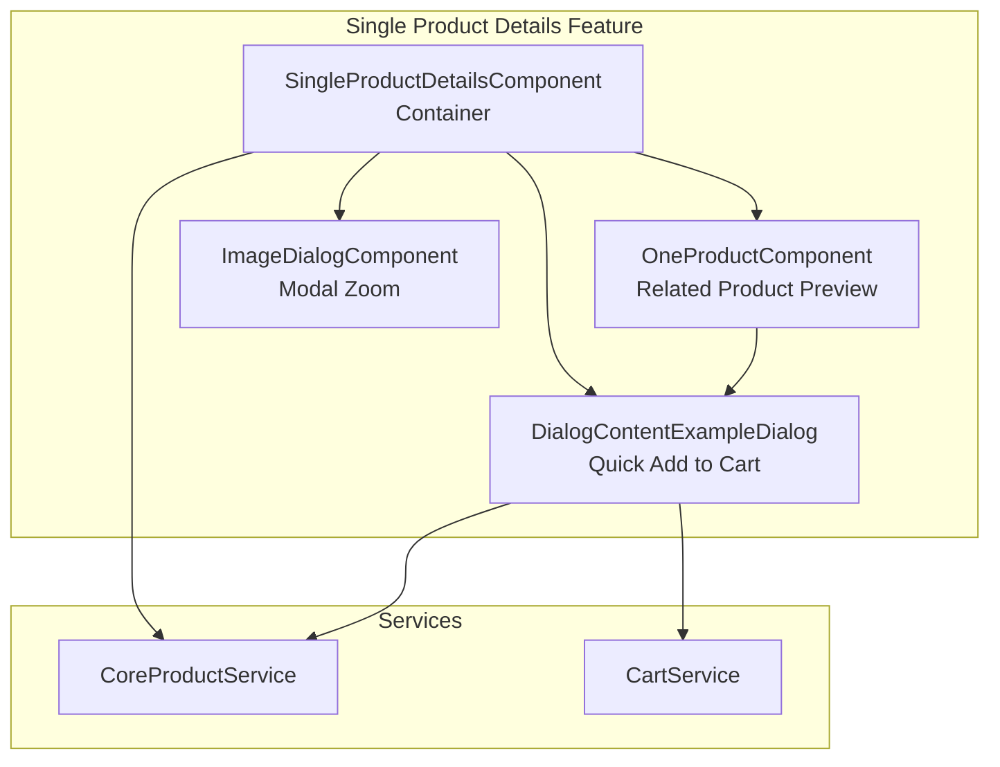
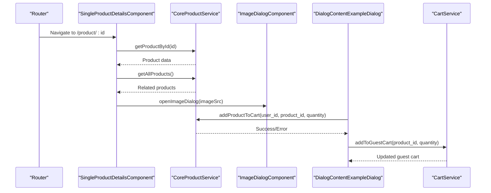
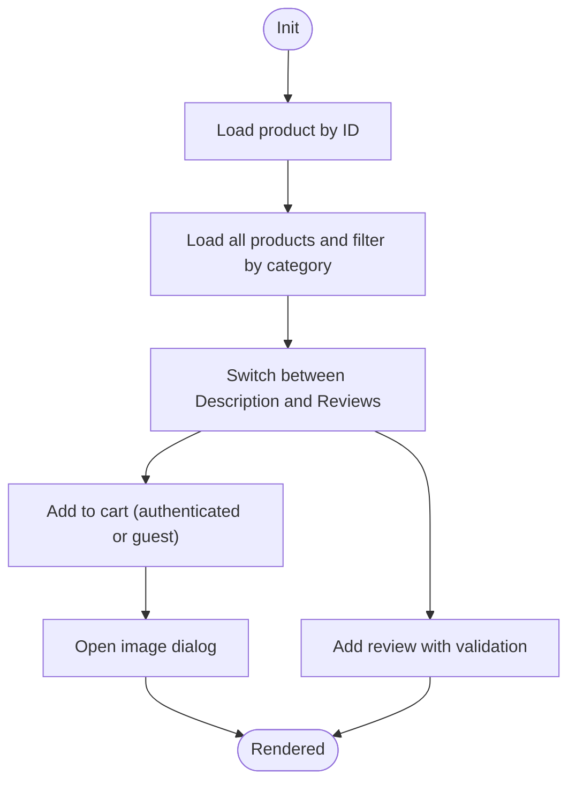
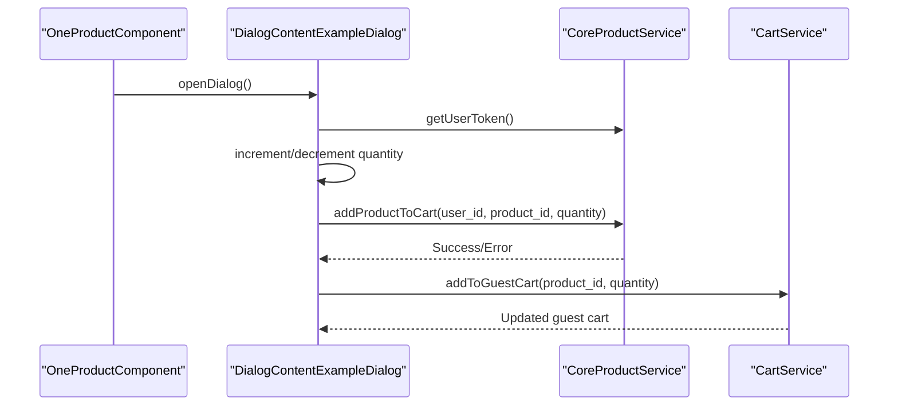
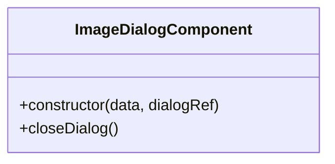
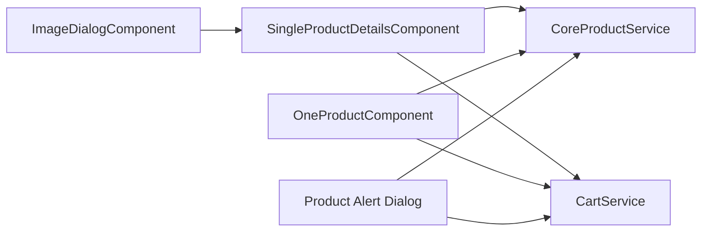

# Single Product Details

<cite>
**Referenced Files in This Document**
- [single-product-details.component.ts](file://Front-end/src/app/features/shop/pages/single-product-details/single-product-details.component.ts)
- [single-product-details.component.html](file://Front-end/src/app/features/shop/pages/single-product-details/single-product-details.component.html)
- [single-product-details.component.css](file://Front-end/src/app/features/shop/pages/single-product-details/single-product-details.component.css)
- [one-product.component.ts](file://Front-end/src/app/features/shop/pages/single-product-details/one-product/one-product.component.ts)
- [one-product.component.html](file://Front-end/src/app/features/shop/pages/single-product-details/one-product/one-product.component.html)
- [one-product.component.css](file://Front-end/src/app/features/shop/pages/single-product-details/one-product/one-product.component.css)
- [image-dialog.component.html](file://Front-end/src/app/features/shop/pages/single-product-details/ImageDialog/image-dialog.component.html)
- [image-dialog.component.css](file://Front-end/src/app/features/shop/pages/single-product-details/ImageDialog/image-dialog.component.css)
- [product-alert.component.html](file://Front-end/src/app/features/shop/pages/single-product-details/one-product/product-alert.component.html)
- [product-alert.component.css](file://Front-end/src/app/features/shop/pages/single-product-details/one-product/product-alert.component.css)
- [core-product.service.ts](file://Front-end/src/app/core/services/core-product.service.ts)
- [product.model.ts](file://Front-end/src/app/features/shop/pages/products/product.model.ts)
- [cart.service.ts](file://Front-end/src/app/core/services/cart.service.ts)
- [app.routes.ts](file://Front-end/src/app/app.routes.ts)
</cite>

## Table of Contents
1. [Introduction](#introduction)
2. [Project Structure](#project-structure)
3. [Core Components](#core-components)
4. [Architecture Overview](#architecture-overview)
5. [Detailed Component Analysis](#detailed-component-analysis)
6. [Dependency Analysis](#dependency-analysis)
7. [Performance Considerations](#performance-considerations)
8. [Troubleshooting Guide](#troubleshooting-guide)
9. [Conclusion](#conclusion)

## Introduction
This document describes the single product details page implementation. It covers how product information is rendered, including the image gallery with modal dialog, specifications, pricing, availability, and customer reviews. It documents the one-product component for related product previews, the image dialog for zooming, and the product alert dialog for quick-add to cart. It also explains component communication patterns, responsive design considerations, and integration with product services for real-time data updates.

## Project Structure
The single product details feature is organized under a dedicated folder with clear separation of concerns:
- Container component: loads product data, handles UI logic, and orchestrates child components
- Child components: one-product preview, image dialog, and product alert dialog
- Shared services: product and cart services for backend integration
- Routing: defines the product/:id route

**Diagram sources**
- [single-product-details.component.ts](file://Front-end/src/app/features/shop/pages/single-product-details/single-product-details.component.ts#L52-L394)
- [one-product.component.ts](file://Front-end/src/app/features/shop/pages/single-product-details/one-product/one-product.component.ts#L26-L136)
- [image-dialog.component.html](file://Front-end/src/app/features/shop/pages/single-product-details/ImageDialog/image-dialog.component.html#L1-L10)
- [product-alert.component.html](file://Front-end/src/app/features/shop/pages/single-product-details/one-product/product-alert.component.html#L1-L143)
- [core-product.service.ts](file://Front-end/src/app/core/services/core-product.service.ts#L9-L74)
- [cart.service.ts](file://Front-end/src/app/core/services/cart.service.ts#L10-L110)

**Section sources**
- [single-product-details.component.ts](file://Front-end/src/app/features/shop/pages/single-product-details/single-product-details.component.ts#L34-L51)
- [app.routes.ts](file://Front-end/src/app/app.routes.ts#L24-L27)

## Core Components
- SingleProductDetailsComponent: Fetches product by ID, manages tabs (description/reviews), handles quantity selection, adds reviews, paginates through products, and opens the image dialog.
- OneProductComponent: Renders a compact card for related products and opens the product alert dialog.
- ImageDialogComponent: Modal dialog displaying the full-size product image with a close action.
- DialogContentExampleDialog (Product Alert): Dialog for quick view and adding a product to the cart with quantity controls.
- CoreProductService: Provides HTTP methods for fetching products, reviews, cart operations, and user token retrieval.
- CartService: Manages guest cart persistence and synchronization with backend.

Key responsibilities:
- Data loading: getProductById, getAllProducts, getUserToken
- Interactions: addReview, addProductToCart, paginate, quantity controls
- UI orchestration: tab switching, dialog opening, image zoom

**Section sources**
- [single-product-details.component.ts](file://Front-end/src/app/features/shop/pages/single-product-details/single-product-details.component.ts#L52-L394)
- [one-product.component.ts](file://Front-end/src/app/features/shop/pages/single-product-details/one-product/one-product.component.ts#L26-L136)
- [core-product.service.ts](file://Front-end/src/app/core/services/core-product.service.ts#L9-L74)
- [cart.service.ts](file://Front-end/src/app/core/services/cart.service.ts#L10-L110)

## Architecture Overview
The single product details page follows a component-driven architecture:
- Route triggers SingleProductDetailsComponent
- Component fetches product and related products via CoreProductService
- Reviews are posted to the backend through CoreProductService
- Cart actions are handled either by authenticated user (CoreProductService) or guest (CartService)
- Dialogs encapsulate reusable UI for image zoom and quick add

**Diagram sources**
- [app.routes.ts](file://Front-end/src/app/app.routes.ts#L24-L27)
- [single-product-details.component.ts](file://Front-end/src/app/features/shop/pages/single-product-details/single-product-details.component.ts#L96-L107)
- [single-product-details.component.ts](file://Front-end/src/app/features/shop/pages/single-product-details/single-product-details.component.ts#L110-L134)
- [single-product-details.component.ts](file://Front-end/src/app/features/shop/pages/single-product-details/single-product-details.component.ts#L84-L90)
- [one-product.component.ts](file://Front-end/src/app/features/shop/pages/single-product-details/one-product/one-product.component.ts#L104-L133)
- [cart.service.ts](file://Front-end/src/app/core/services/cart.service.ts#L44-L54)

## Detailed Component Analysis

### SingleProductDetailsComponent
Responsibilities:
- Load product by route param and related products
- Manage tabs for description and reviews
- Handle quantity selection and add to cart (authenticated vs guest)
- Paginate through all products
- Open image dialog for zoom
- Submit reviews with validation

Implementation highlights:
- Uses CoreProductService to fetch product and related items
- Uses CartService for guest cart operations
- Uses SweetAlert for user feedback
- Implements star rating toggling and form validation

**Diagram sources**
- [single-product-details.component.ts](file://Front-end/src/app/features/shop/pages/single-product-details/single-product-details.component.ts#L96-L134)
- [single-product-details.component.ts](file://Front-end/src/app/features/shop/pages/single-product-details/single-product-details.component.ts#L186-L265)
- [single-product-details.component.ts](file://Front-end/src/app/features/shop/pages/single-product-details/single-product-details.component.ts#L344-L389)
- [single-product-details.component.ts](file://Front-end/src/app/features/shop/pages/single-product-details/single-product-details.component.ts#L84-L90)

**Section sources**
- [single-product-details.component.ts](file://Front-end/src/app/features/shop/pages/single-product-details/single-product-details.component.ts#L52-L394)
- [single-product-details.component.html](file://Front-end/src/app/features/shop/pages/single-product-details/single-product-details.component.html#L1-L311)
- [single-product-details.component.css](file://Front-end/src/app/features/shop/pages/single-product-details/single-product-details.component.css#L1-L278)

### OneProductComponent and Product Alert Dialog
Responsibilities:
- Render a compact card for related products
- Open a dialog with product details and quick add to cart
- Handle quantity selection and cart submission

**Diagram sources**
- [one-product.component.ts](file://Front-end/src/app/features/shop/pages/single-product-details/one-product/one-product.component.ts#L26-L136)
- [product-alert.component.html](file://Front-end/src/app/features/shop/pages/single-product-details/one-product/product-alert.component.html#L1-L143)
- [product-alert.component.css](file://Front-end/src/app/features/shop/pages/single-product-details/one-product/product-alert.component.css#L1-L89)

**Section sources**
- [one-product.component.ts](file://Front-end/src/app/features/shop/pages/single-product-details/one-product/one-product.component.ts#L26-L136)
- [one-product.component.html](file://Front-end/src/app/features/shop/pages/single-product-details/one-product/one-product.component.html#L1-L26)
- [one-product.component.css](file://Front-end/src/app/features/shop/pages/single-product-details/one-product/one-product.component.css#L1-L27)
- [product-alert.component.html](file://Front-end/src/app/features/shop/pages/single-product-details/one-product/product-alert.component.html#L1-L143)
- [product-alert.component.css](file://Front-end/src/app/features/shop/pages/single-product-details/one-product/product-alert.component.css#L1-L89)

### Image Dialog Implementation
Responsibilities:
- Display a full-size image in a centered modal
- Provide a close action to dismiss the dialog

**Diagram sources**
- [single-product-details.component.ts](file://Front-end/src/app/features/shop/pages/single-product-details/single-product-details.component.ts#L397-L413)
- [image-dialog.component.html](file://Front-end/src/app/features/shop/pages/single-product-details/ImageDialog/image-dialog.component.html#L1-L10)
- [image-dialog.component.css](file://Front-end/src/app/features/shop/pages/single-product-details/ImageDialog/image-dialog.component.css#L1-L24)

**Section sources**
- [single-product-details.component.ts](file://Front-end/src/app/features/shop/pages/single-product-details/single-product-details.component.ts#L397-L413)
- [image-dialog.component.html](file://Front-end/src/app/features/shop/pages/single-product-details/ImageDialog/image-dialog.component.html#L1-L10)
- [image-dialog.component.css](file://Front-end/src/app/features/shop/pages/single-product-details/ImageDialog/image-dialog.component.css#L1-L24)

### Product Information Display
The single product details page renders:
- Product image gallery with zoom capability
- Pricing and free shipping note
- Category and breadcrumb navigation
- Technical specifications (wattage, voltage, battery type)
- Quantity selector and add-to-cart button
- Guaranteed safe checkout icons
- Tabbed description and reviews
- Related products grid

Responsive considerations:
- Flexbox and grid layouts adapt to small, medium, and large screens
- Images use object-fit and percentage-based sizing
- Buttons and inputs adjust widths per breakpoint

**Section sources**
- [single-product-details.component.html](file://Front-end/src/app/features/shop/pages/single-product-details/single-product-details.component.html#L1-L311)
- [single-product-details.component.css](file://Front-end/src/app/features/shop/pages/single-product-details/single-product-details.component.css#L1-L278)

### Product Alert System for Stock Notifications
The product alert dialog provides:
- Quick view of product details
- Immediate add-to-cart action
- Quantity selection with increment/decrement
- Feedback via alerts

Integration:
- Uses CoreProductService for authenticated users
- Uses CartService for guest users
- Persists guest cart in localStorage

**Section sources**
- [one-product.component.ts](file://Front-end/src/app/features/shop/pages/single-product-details/one-product/one-product.component.ts#L54-L136)
- [product-alert.component.html](file://Front-end/src/app/features/shop/pages/single-product-details/one-product/product-alert.component.html#L1-L143)
- [cart.service.ts](file://Front-end/src/app/core/services/cart.service.ts#L38-L90)

## Dependency Analysis
Component and service dependencies:
- SingleProductDetailsComponent depends on CoreProductService, CartService, and Material/Angular modules
- OneProductComponent depends on CoreProductService and dialogs
- Dialogs depend on CoreProductService and CartService
- Routing depends on Angular Router

**Diagram sources**
- [single-product-details.component.ts](file://Front-end/src/app/features/shop/pages/single-product-details/single-product-details.component.ts#L72-L82)
- [one-product.component.ts](file://Front-end/src/app/features/shop/pages/single-product-details/one-product/one-product.component.ts#L29-L31)
- [core-product.service.ts](file://Front-end/src/app/core/services/core-product.service.ts#L9-L74)
- [cart.service.ts](file://Front-end/src/app/core/services/cart.service.ts#L10-L110)

**Section sources**
- [single-product-details.component.ts](file://Front-end/src/app/features/shop/pages/single-product-details/single-product-details.component.ts#L72-L82)
- [one-product.component.ts](file://Front-end/src/app/features/shop/pages/single-product-details/one-product/one-product.component.ts#L29-L31)
- [core-product.service.ts](file://Front-end/src/app/core/services/core-product.service.ts#L9-L74)
- [cart.service.ts](file://Front-end/src/app/core/services/cart.service.ts#L10-L110)

## Performance Considerations
- Lazy loading: Consider lazy-loading the single product details module to reduce initial bundle size.
- Image optimization: Use responsive images and appropriate formats; consider implementing intersection observer for lazy loading offscreen images.
- Dialogs: Keep dialogs lightweight; avoid heavy computations during open/close transitions.
- HTTP caching: Implement caching strategies for product lists and frequently accessed product details.
- Debouncing: Debounce review form submissions to prevent excessive network requests.
- Virtual scrolling: For long lists of related products, consider virtualization to improve rendering performance.

## Troubleshooting Guide
Common issues and resolutions:
- Product not found: The component navigates to home if product is null; verify backend endpoint correctness.
- Review submission errors: Check form validation and ensure user token is available before posting reviews.
- Cart operations fail: Verify user authentication and backend cart endpoints; guest cart fallback should work with localStorage.
- Dialog not closing: Ensure dialogRef.close() is called and no blocking operations prevent closure.
- Pagination inconsistencies: Confirm local storage index updates and bounds checking.

**Section sources**
- [single-product-details.component.ts](file://Front-end/src/app/features/shop/pages/single-product-details/single-product-details.component.ts#L96-L107)
- [single-product-details.component.ts](file://Front-end/src/app/features/shop/pages/single-product-details/single-product-details.component.ts#L223-L265)
- [single-product-details.component.ts](file://Front-end/src/app/features/shop/pages/single-product-details/single-product-details.component.ts#L344-L389)

## Conclusion
The single product details page integrates multiple components and services to deliver a comprehensive shopping experience. It supports product browsing, reviews, cart actions (authenticated and guest), and quick previews through dialogs. The modular design and service-based data access enable maintainability and scalability. Applying the recommended performance and troubleshooting practices will further enhance user experience and reliability.