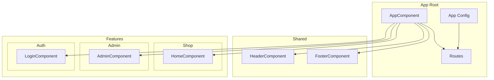
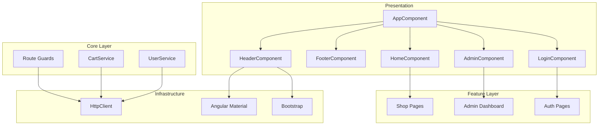
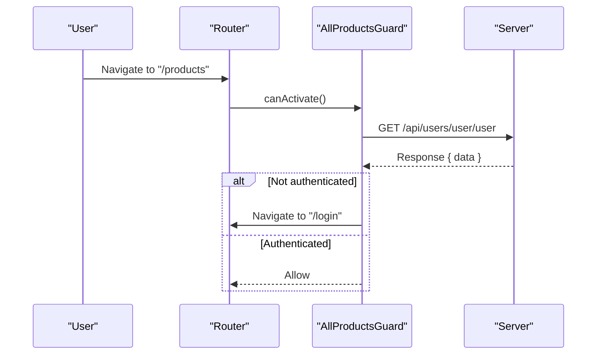
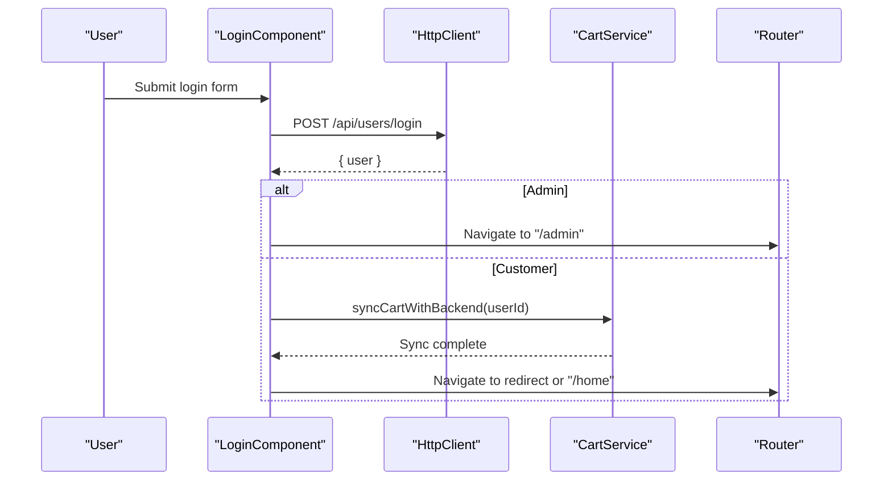
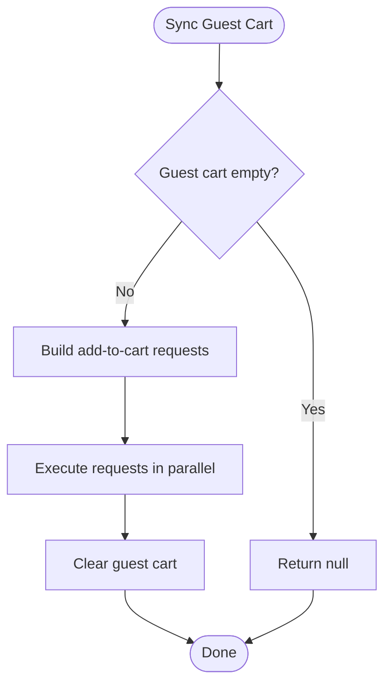
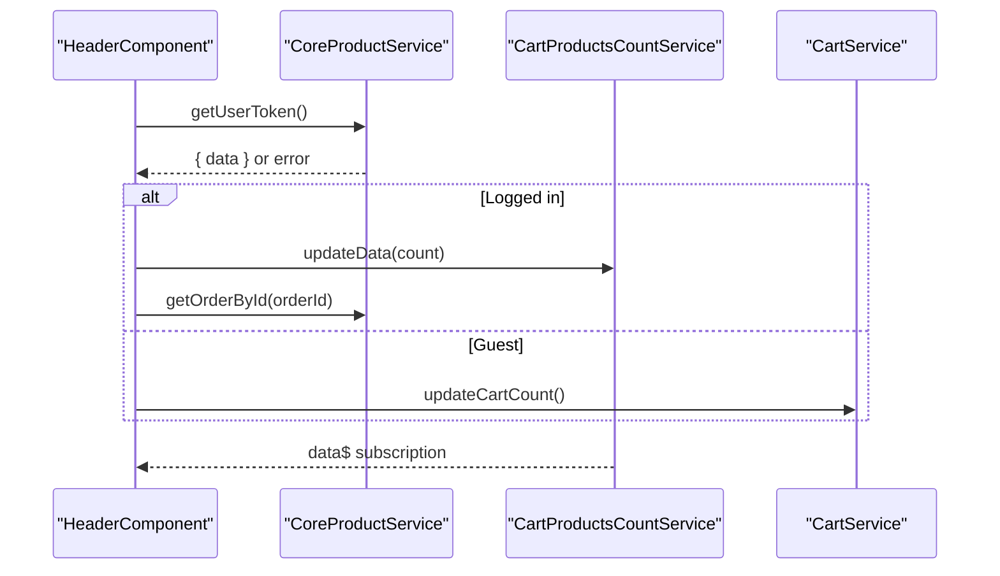
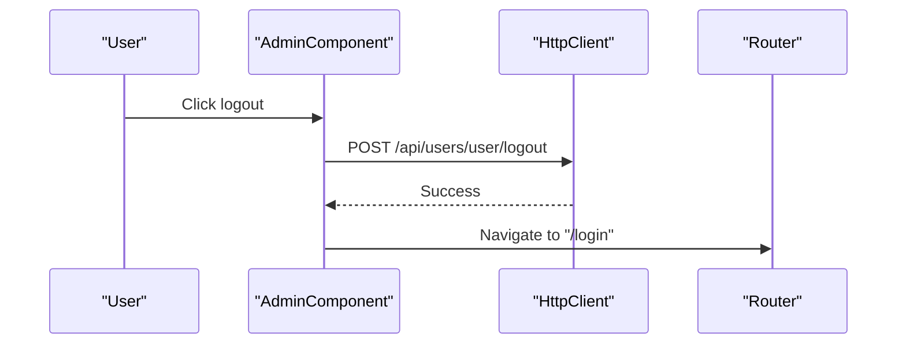
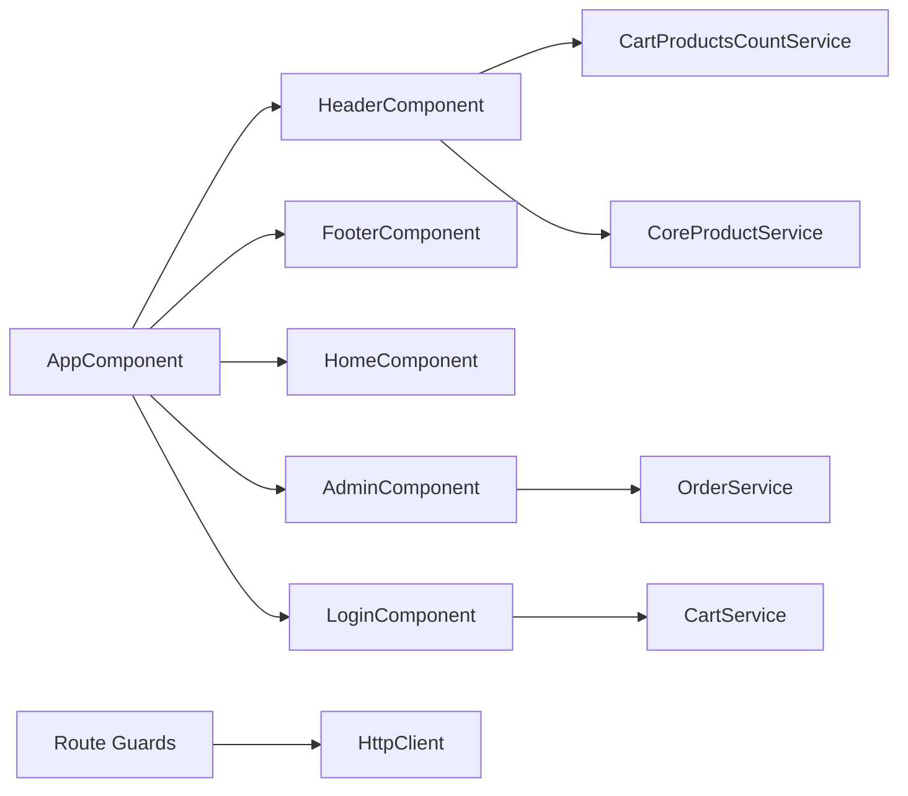

# Frontend Application Architecture

<cite>
**Referenced Files in This Document**
- [app.component.ts](file://Front-end/src/app/app.component.ts)
- [app.routes.ts](file://Front-end/src/app/app.routes.ts)
- [app.config.ts](file://Front-end/src/app/app.config.ts)
- [main.ts](file://Front-end/src/main.ts)
- [angular.json](file://Front-end/angular.json)
- [auth.guard.ts](file://Front-end/src/app/core/guards/auth.guard.ts)
- [admin.guard.ts](file://Front-end/src/app/core/guards/admin.guard.ts)
- [all-products.guard.ts](file://Front-end/src/app/core/guards/all-products.guard.ts)
- [user-service.service.ts](file://Front-end/src/app/core/services/user-service.service.ts)
- [cart.service.ts](file://Front-end/src/app/core/services/cart.service.ts)
- [admin.component.ts](file://Front-end/src/app/features/admin/admin/admin.component.ts)
- [login.component.ts](file://Front-end/src/app/features/auth/pages/login/login.component.ts)
- [home.component.ts](file://Front-end/src/app/features/shop/pages/home/home.component.ts)
- [header.component.ts](file://Front-end/src/app/shared/components/header/header.component.ts)
- [footer.component.ts](file://Front-end/src/app/shared/components/footer/footer.component.ts)
</cite>

## Table of Contents
1. [Introduction](#introduction)
2. [Project Structure](#project-structure)
3. [Core Components](#core-components)
4. [Architecture Overview](#architecture-overview)
5. [Detailed Component Analysis](#detailed-component-analysis)
6. [Dependency Analysis](#dependency-analysis)
7. [Performance Considerations](#performance-considerations)
8. [Troubleshooting Guide](#troubleshooting-guide)
9. [Conclusion](#conclusion)

## Introduction
This document explains the Angular frontend architecture for the Lightstorm E-commerce application. It covers component hierarchy, routing configuration, guard-based route protection, service layer design, state management patterns, and UI integration with Angular Material and Bootstrap. The application is organized into three primary feature areas: customer portal (shop), admin dashboard, and authentication. Reactive programming with RxJS is used extensively for HTTP interactions, form handling, and state updates.

## Project Structure
The Angular application follows a feature-based module structure under the app directory. Key areas:
- Core: Guards and services shared across features
- Features: Customer shop pages, admin dashboard, and authentication
- Shared: Reusable UI components (header, footer)
- Root: Application bootstrap, routing, and configuration

**Diagram sources**
- [app.component.ts](file://Front-end/src/app/app.component.ts#L10-L25)
- [app.routes.ts](file://Front-end/src/app/app.routes.ts#L21-L49)
- [app.config.ts](file://Front-end/src/app/app.config.ts#L8-L10)

**Section sources**
- [app.component.ts](file://Front-end/src/app/app.component.ts#L1-L26)
- [app.routes.ts](file://Front-end/src/app/app.routes.ts#L1-L50)
- [app.config.ts](file://Front-end/src/app/app.config.ts#L1-L11)
- [main.ts](file://Front-end/src/main.ts#L1-L10)
- [angular.json](file://Front-end/angular.json#L1-L114)

## Core Components
- AppComponent: Root component that composes shared header and footer and hosts router outlet.
- Routing: Centralized in app.routes.ts with route guards applied to protected paths.
- Guards: AuthGuard, AdminGuard, and AllProductsGuard enforce access control via backend checks.
- Services: CartService manages shopping cart state (including guest/local storage), and UserService handles user-related operations.
- UI Frameworks: Angular Material modules integrated via angular.json styles/scripts; Bootstrap included for additional styling and components.

Key implementation references:
- Root component composition and imports
- Route definitions and guard bindings
- Guard HTTP-based authentication checks
- Cart service guest/backend synchronization
- UI framework integration

**Section sources**
- [app.component.ts](file://Front-end/src/app/app.component.ts#L10-L25)
- [app.routes.ts](file://Front-end/src/app/app.routes.ts#L21-L49)
- [auth.guard.ts](file://Front-end/src/app/core/guards/auth.guard.ts#L15-L40)
- [admin.guard.ts](file://Front-end/src/app/core/guards/admin.guard.ts#L15-L43)
- [all-products.guard.ts](file://Front-end/src/app/core/guards/all-products.guard.ts#L15-L43)
- [cart.service.ts](file://Front-end/src/app/core/services/cart.service.ts#L10-L110)
- [user-service.service.ts](file://Front-end/src/app/core/services/user-service.service.ts#L1-L25)
- [angular.json](file://Front-end/angular.json#L28-L36)

## Architecture Overview
The application uses a layered architecture:
- Presentation Layer: Components and templates
- Feature Layer: Shop, Admin, Auth feature modules
- Core Layer: Guards and shared services
- Infrastructure Layer: HTTP client and external UI libraries

**Diagram sources**
- [app.component.ts](file://Front-end/src/app/app.component.ts#L10-L25)
- [header.component.ts](file://Front-end/src/app/shared/components/header/header.component.ts#L15-L29)
- [cart.service.ts](file://Front-end/src/app/core/services/cart.service.ts#L10-L17)
- [user-service.service.ts](file://Front-end/src/app/core/services/user-service.service.ts#L4-L6)
- [angular.json](file://Front-end/angular.json#L28-L36)

## Detailed Component Analysis

### Routing and Navigation
- Routes define public and protected paths. Guards are attached to restrict access:
  - AuthGuard: Protects checkout, profile, payment, and confirm routes.
  - AdminGuard: Protects admin routes and enforces admin role.
  - AllProductsGuard: Ensures login for product listings.
- Redirects and fallback routes ensure smooth navigation.

**Diagram sources**
- [app.routes.ts](file://Front-end/src/app/app.routes.ts#L40-L44)
- [all-products.guard.ts](file://Front-end/src/app/core/guards/all-products.guard.ts#L15-L43)

**Section sources**
- [app.routes.ts](file://Front-end/src/app/app.routes.ts#L21-L49)
- [auth.guard.ts](file://Front-end/src/app/core/guards/auth.guard.ts#L15-L40)
- [admin.guard.ts](file://Front-end/src/app/core/guards/admin.guard.ts#L15-L43)
- [all-products.guard.ts](file://Front-end/src/app/core/guards/all-products.guard.ts#L15-L43)

### Authentication Flow
- Login component validates credentials, submits to backend, and navigates based on role.
- On successful login, guest cart is synchronized with backend using CartService.
- Guards verify session and admin status on subsequent navigations.

**Diagram sources**
- [login.component.ts](file://Front-end/src/app/features/auth/pages/login/login.component.ts#L38-L96)
- [cart.service.ts](file://Front-end/src/app/core/services/cart.service.ts#L93-L109)

**Section sources**
- [login.component.ts](file://Front-end/src/app/features/auth/pages/login/login.component.ts#L16-L116)
- [cart.service.ts](file://Front-end/src/app/core/services/cart.service.ts#L93-L109)

### Shopping Cart State Management
- CartService supports:
  - Backend cart operations for logged-in users
  - Guest cart persistence using localStorage
  - Synchronization of guest cart to backend upon login
  - Count updates via CartProductsCountService
- Reactive updates ensure UI reflects cart changes.

**Diagram sources**
- [cart.service.ts](file://Front-end/src/app/core/services/cart.service.ts#L93-L109)

**Section sources**
- [cart.service.ts](file://Front-end/src/app/core/services/cart.service.ts#L10-L110)

### Header Component and State Integration
- HeaderComponent integrates Angular Material and Bootstrap for UI.
- Subscribes to CartProductsCountService to display cart item count.
- Fetches user session and aggregates order totals when available.
- Falls back to guest cart count when user is not authenticated.

**Diagram sources**
- [header.component.ts](file://Front-end/src/app/shared/components/header/header.component.ts#L65-L94)
- [cart.service.ts](file://Front-end/src/app/core/services/cart.service.ts#L86-L90)

**Section sources**
- [header.component.ts](file://Front-end/src/app/shared/components/header/header.component.ts#L30-L96)
- [cart.service.ts](file://Front-end/src/app/core/services/cart.service.ts#L86-L90)

### Admin Dashboard and Logout
- AdminComponent composes dashboard widgets and exposes logout via backend endpoint.
- Uses HTTP with credentials to maintain session integrity.

**Diagram sources**
- [admin.component.ts](file://Front-end/src/app/features/admin/admin/admin.component.ts#L26-L36)

**Section sources**
- [admin.component.ts](file://Front-end/src/app/features/admin/admin/admin.component.ts#L24-L37)

### Home Page Composition
- HomeComponent composes reusable child components for banners and products.

**Section sources**
- [home.component.ts](file://Front-end/src/app/features/shop/pages/home/home.component.ts#L6-L18)

## Dependency Analysis
- Module boundaries:
  - Shared components (header, footer) are imported by the root component and used across features.
  - Feature components import shared components and core services.
- External dependencies:
  - Angular Material and Bootstrap configured in angular.json.
  - HttpClient provided at root level via app.config.ts and main.ts.
- Guard dependencies:
  - Guards depend on HttpClient and Router to query backend and navigate.

**Diagram sources**
- [app.component.ts](file://Front-end/src/app/app.component.ts#L10-L25)
- [header.component.ts](file://Front-end/src/app/shared/components/header/header.component.ts#L15-L29)
- [cart.service.ts](file://Front-end/src/app/core/services/cart.service.ts#L10-L17)
- [admin.component.ts](file://Front-end/src/app/features/admin/admin/admin.component.ts#L10-L23)
- [app.config.ts](file://Front-end/src/app/app.config.ts#L8-L10)
- [main.ts](file://Front-end/src/main.ts#L7-L9)

**Section sources**
- [angular.json](file://Front-end/angular.json#L28-L36)
- [app.config.ts](file://Front-end/src/app/app.config.ts#L8-L10)
- [main.ts](file://Front-end/src/main.ts#L7-L9)

## Performance Considerations
- Use of forkJoin for parallel cart synchronization reduces total sync time.
- Subscriptions to BehaviorSubject (cart count) avoid unnecessary DOM updates.
- Lazy loading and production builds configured in angular.json optimize bundle sizes.
- Avoid heavy synchronous loops in components; rely on RxJS operators for efficient transformations.

## Troubleshooting Guide
- Login failures:
  - Verify backend endpoint availability and credentials.
  - Check error handling in login component for user-friendly messages.
- Cart synchronization:
  - Confirm guest cart exists before attempting sync.
  - Ensure backend endpoints for cart operations are reachable.
- Guard redirects:
  - Confirm guard logic aligns with backend session state.
  - Validate redirect query parameters after login.

**Section sources**
- [login.component.ts](file://Front-end/src/app/features/auth/pages/login/login.component.ts#L91-L95)
- [cart.service.ts](file://Front-end/src/app/core/services/cart.service.ts#L93-L109)
- [auth.guard.ts](file://Front-end/src/app/core/guards/auth.guard.ts#L32-L38)
- [admin.guard.ts](file://Front-end/src/app/core/guards/admin.guard.ts#L34-L42)
- [all-products.guard.ts](file://Front-end/src/app/core/guards/all-products.guard.ts#L34-L42)

## Conclusion
The Angular application employs a clean, feature-based architecture with strong separation of concerns. Guards enforce robust route protection, services encapsulate HTTP interactions and state management, and UI frameworks enhance the user experience. The design leverages RxJS for reactive data flows and provides a scalable foundation for future enhancements.