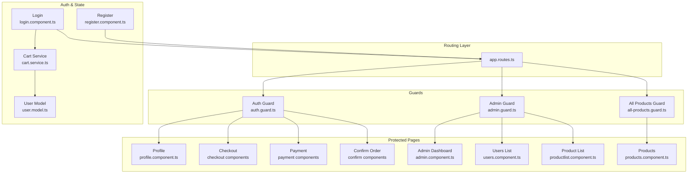
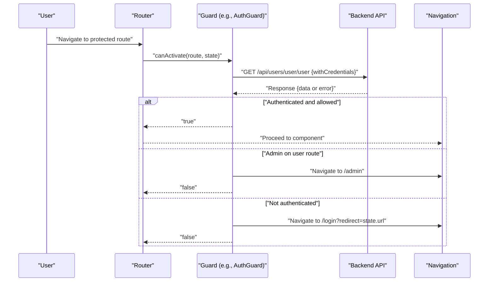
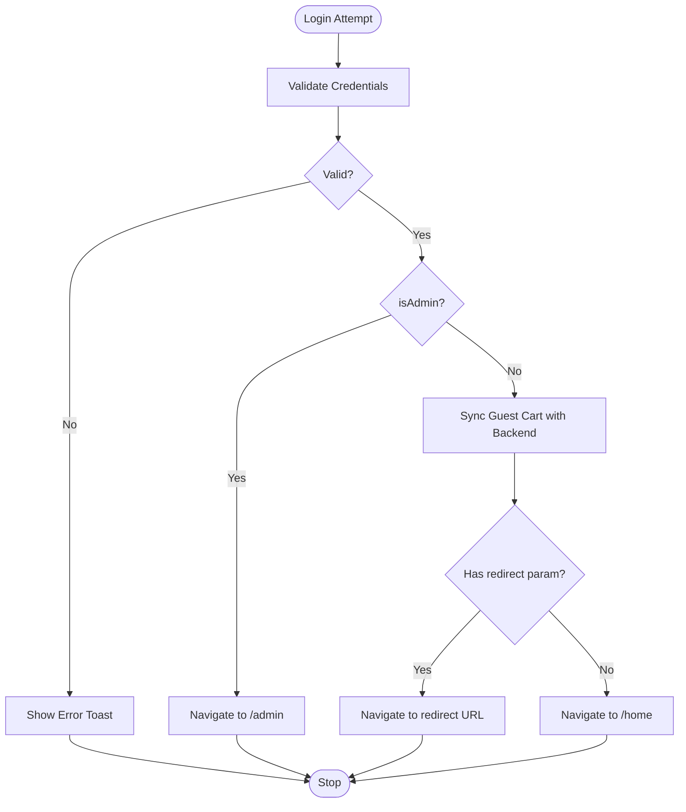
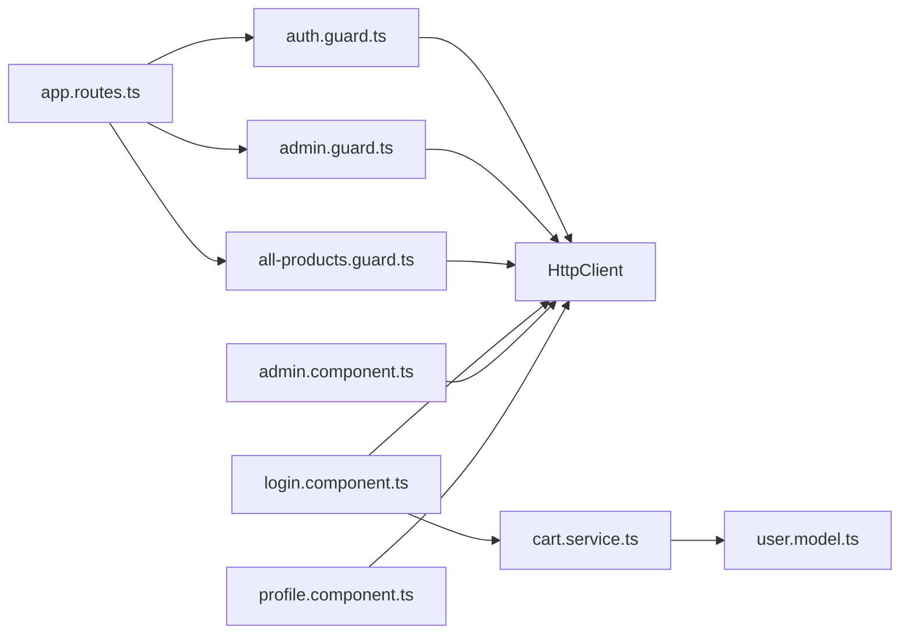

# Route Protection and Guards

<cite>
**Referenced Files in This Document**
- [auth.guard.ts](file://Front-end/src/app/core/guards/auth.guard.ts)
- [admin.guard.ts](file://Front-end/src/app/core/guards/admin.guard.ts)
- [all-products.guard.ts](file://Front-end/src/app/core/guards/all-products.guard.ts)
- [app.routes.ts](file://Front-end/src/app/app.routes.ts)
- [login.component.ts](file://Front-end/src/app/features/auth/pages/login/login.component.ts)
- [register.component.ts](file://Front-end/src/app/features/auth/pages/register/register.component.ts)
- [admin.component.ts](file://Front-end/src/app/features/admin/admin/admin.component.ts)
- [profile.component.ts](file://Front-end/src/app/features/auth/pages/profile/profile.component.ts)
- [cart.service.ts](file://Front-end/src/app/core/services/cart.service.ts)
- [user.model.ts](file://Front-end/src/app/features/shop/pages/checkout/user.model.ts)
</cite>

## Table of Contents
1. [Introduction](#introduction)
2. [Project Structure](#project-structure)
3. [Core Components](#core-components)
4. [Architecture Overview](#architecture-overview)
5. [Detailed Component Analysis](#detailed-component-analysis)
6. [Dependency Analysis](#dependency-analysis)
7. [Performance Considerations](#performance-considerations)
8. [Troubleshooting Guide](#troubleshooting-guide)
9. [Conclusion](#conclusion)

## Introduction
This document explains the route protection system built with Angular guards in the Lightstorm e-commerce application. It covers:
- Authentication guards to restrict access to user-only routes
- Admin guards for role-based access control
- A specialized guard for general product access
- Guard implementation patterns, canActivate interfaces, route parameter handling, and redirect strategies
- Examples of guard composition, conditional navigation, and integration with authentication state management

## Project Structure
The route protection system centers around three guards located under the core guards module and the routing configuration that attaches them to specific routes. Supporting components handle login, registration, admin logout, and profile logout, while services manage cart synchronization and user data.

**Diagram sources**
- [app.routes.ts](file://Front-end/src/app/app.routes.ts#L21-L49)
- [auth.guard.ts](file://Front-end/src/app/core/guards/auth.guard.ts#L11-L41)
- [admin.guard.ts](file://Front-end/src/app/core/guards/admin.guard.ts#L11-L45)
- [all-products.guard.ts](file://Front-end/src/app/core/guards/all-products.guard.ts#L11-L45)
- [login.component.ts](file://Front-end/src/app/features/auth/pages/login/login.component.ts#L38-L96)
- [register.component.ts](file://Front-end/src/app/features/auth/pages/register/register.component.ts#L33-L84)
- [admin.component.ts](file://Front-end/src/app/features/admin/admin/admin.component.ts#L26-L36)
- [profile.component.ts](file://Front-end/src/app/features/auth/pages/profile/profile.component.ts#L24-L29)
- [cart.service.ts](file://Front-end/src/app/core/services/cart.service.ts#L93-L109)
- [user.model.ts](file://Front-end/src/app/features/shop/pages/checkout/user.model.ts#L1-L11)

**Section sources**
- [app.routes.ts](file://Front-end/src/app/app.routes.ts#L21-L49)

## Core Components
- AuthGuard: Protects user-only routes by ensuring the current user is not an admin and is authenticated. Redirects unauthenticated users to the login page with a redirect query parameter and informs admins they cannot access user pages.
- AdminGuard: Enforces role-based access control for admin-only routes. Blocks non-admins and redirects them appropriately.
- AllProductsGuard: Ensures general product access requires authentication.

These guards implement the canActivate interface and rely on a backend endpoint to fetch the current user session. They use RxJS operators to transform HTTP responses into boolean outcomes and handle errors by navigating to the login page.

**Section sources**
- [auth.guard.ts](file://Front-end/src/app/core/guards/auth.guard.ts#L11-L41)
- [admin.guard.ts](file://Front-end/src/app/core/guards/admin.guard.ts#L11-L45)
- [all-products.guard.ts](file://Front-end/src/app/core/guards/all-products.guard.ts#L11-L45)

## Architecture Overview
The routing configuration attaches guards to specific paths. When a user attempts to navigate:
- Guards call the backend to validate the session and role
- On success, navigation proceeds; otherwise, guards redirect to login or home with optional redirect parameters

**Diagram sources**
- [app.routes.ts](file://Front-end/src/app/app.routes.ts#L32-L47)
- [auth.guard.ts](file://Front-end/src/app/core/guards/auth.guard.ts#L15-L40)
- [admin.guard.ts](file://Front-end/src/app/core/guards/admin.guard.ts#L15-L44)
- [all-products.guard.ts](file://Front-end/src/app/core/guards/all-products.guard.ts#L15-L44)

## Detailed Component Analysis

### AuthGuard Implementation
Purpose:
- Prevent admins from accessing user-only routes
- Allow authenticated non-admin users to proceed
- Redirect unauthenticated users to login with the attempted URL as a redirect parameter

Key behaviors:
- Calls backend to fetch current user session
- If response indicates an admin, show an error and redirect to the admin area
- On authentication failure, navigate to login with the current URL as a redirect query parameter
- Returns an observable of boolean to control navigation

Integration points:
- Used for profile, checkout, payment, and confirm order routes
- Works with login redirection via query parameters

**Section sources**
- [auth.guard.ts](file://Front-end/src/app/core/guards/auth.guard.ts#L11-L41)
- [app.routes.ts](file://Front-end/src/app/app.routes.ts#L32-L47)

### AdminGuard Implementation
Purpose:
- Enforce admin-only access to admin routes
- Block non-admin users and redirect them appropriately

Key behaviors:
- Validates that the current user exists and has admin privileges
- On success, allows navigation
- On failure, shows an error and navigates either to home or login depending on the scenario
- Handles backend errors by prompting login

Integration points:
- Applied to admin dashboard and admin-managed lists

**Section sources**
- [admin.guard.ts](file://Front-end/src/app/core/guards/admin.guard.ts#L11-L45)
- [app.routes.ts](file://Front-end/src/app/app.routes.ts#L33-L39)

### AllProductsGuard Implementation
Purpose:
- Require authentication for general product access

Key behaviors:
- Checks for a valid user session
- Denies access and redirects to login if not authenticated
- Allows access if authenticated

Integration points:
- Applied to the products listing route

**Section sources**
- [all-products.guard.ts](file://Front-end/src/app/core/guards/all-products.guard.ts#L11-L45)
- [app.routes.ts](file://Front-end/src/app/app.routes.ts#L40-L44)

### Route Parameter Handling and Redirect Strategies
- Redirect after login: The login component reads a redirect query parameter and navigates accordingly after successful authentication. It also synchronizes the guest cart with the backend for logged-in users.
- Backend-driven session checks: Guards rely on a session endpoint to determine user status and role.
- Conditional navigation: Guards decide whether to allow navigation or redirect based on the response.

**Diagram sources**
- [login.component.ts](file://Front-end/src/app/features/auth/pages/login/login.component.ts#L57-L96)
- [cart.service.ts](file://Front-end/src/app/core/services/cart.service.ts#L93-L109)

**Section sources**
- [login.component.ts](file://Front-end/src/app/features/auth/pages/login/login.component.ts#L77-L87)
- [cart.service.ts](file://Front-end/src/app/core/services/cart.service.ts#L93-L109)

### Guard Composition and Conditional Navigation
- Multiple guards per route: While the current configuration applies a single guard per route, Angular supports combining guards in arrays. This pattern enables layered checks (e.g., authentication followed by role verification).
- Conditional navigation: Guards use router navigation to send users to appropriate destinations based on session and role checks.

Example patterns (conceptual):
- Compose guards by listing multiple guard tokens in the canActivate array of a route definition.
- Use route data to pass additional context to guards for feature-specific checks.

[No sources needed since this section provides conceptual guidance]

### Integration with Authentication State Management
- Session endpoint: Guards and login/register components communicate with a session endpoint to validate and establish user identity.
- Role awareness: Guards read the admin flag from the session to enforce role-based restrictions.
- Cart synchronization: After login, the guest cart is synchronized with the backend to preserve purchase intent.

**Section sources**
- [auth.guard.ts](file://Front-end/src/app/core/guards/auth.guard.ts#L18-L39)
- [admin.guard.ts](file://Front-end/src/app/core/guards/admin.guard.ts#L18-L43)
- [all-products.guard.ts](file://Front-end/src/app/core/guards/all-products.guard.ts#L18-L43)
- [login.component.ts](file://Front-end/src/app/features/auth/pages/login/login.component.ts#L57-L96)
- [cart.service.ts](file://Front-end/src/app/core/services/cart.service.ts#L93-L109)

## Dependency Analysis
The routing layer depends on guards, which depend on HTTP clients to validate sessions and roles. Login and admin components depend on HTTP clients for logout and navigation. The user model defines the shape of user data consumed by components.

**Diagram sources**
- [app.routes.ts](file://Front-end/src/app/app.routes.ts#L15-L17)
- [auth.guard.ts](file://Front-end/src/app/core/guards/auth.guard.ts#L1-L10)
- [admin.guard.ts](file://Front-end/src/app/core/guards/admin.guard.ts#L1-L10)
- [all-products.guard.ts](file://Front-end/src/app/core/guards/all-products.guard.ts#L1-L10)
- [login.component.ts](file://Front-end/src/app/features/auth/pages/login/login.component.ts#L1-L24)
- [admin.component.ts](file://Front-end/src/app/features/admin/admin/admin.component.ts#L1-L25)
- [profile.component.ts](file://Front-end/src/app/features/auth/pages/profile/profile.component.ts#L1-L32)
- [cart.service.ts](file://Front-end/src/app/core/services/cart.service.ts#L1-L17)
- [user.model.ts](file://Front-end/src/app/features/shop/pages/checkout/user.model.ts#L1-L11)

**Section sources**
- [app.routes.ts](file://Front-end/src/app/app.routes.ts#L15-L17)
- [auth.guard.ts](file://Front-end/src/app/core/guards/auth.guard.ts#L1-L10)
- [admin.guard.ts](file://Front-end/src/app/core/guards/admin.guard.ts#L1-L10)
- [all-products.guard.ts](file://Front-end/src/app/core/guards/all-products.guard.ts#L1-L10)
- [login.component.ts](file://Front-end/src/app/features/auth/pages/login/login.component.ts#L1-L24)
- [admin.component.ts](file://Front-end/src/app/features/admin/admin/admin.component.ts#L1-L25)
- [profile.component.ts](file://Front-end/src/app/features/auth/pages/profile/profile.component.ts#L1-L32)
- [cart.service.ts](file://Front-end/src/app/core/services/cart.service.ts#L1-L17)
- [user.model.ts](file://Front-end/src/app/features/shop/pages/checkout/user.model.ts#L1-L11)

## Performance Considerations
- Minimize backend calls: Guards currently call the session endpoint on each navigation attempt. Consider caching the session state in memory for short-lived tabs to reduce repeated network requests.
- Debounce navigation: If users rapidly navigate between protected pages, avoid redundant guard evaluations by debouncing route changes.
- Lazy loading: Keep guard logic lightweight to prevent blocking navigation during initial page loads.

[No sources needed since this section provides general guidance]

## Troubleshooting Guide
Common issues and resolutions:
- Users stuck on admin routes despite being regular users:
  - Verify the session endpoint returns the correct admin flag and that AdminGuard logic evaluates it properly.
- Admins accidentally accessing user routes:
  - Confirm AuthGuard logic denies admin users and redirects them to the admin area.
- Unauthenticated users redirected to login but losing intended destination:
  - Ensure the redirect query parameter is present and handled in the login component to navigate to the intended URL after successful authentication.
- Cart not syncing after login:
  - Confirm the cart synchronization logic runs and clears the guest cart upon success.

**Section sources**
- [auth.guard.ts](file://Front-end/src/app/core/guards/auth.guard.ts#L20-L30)
- [admin.guard.ts](file://Front-end/src/app/core/guards/admin.guard.ts#L20-L32)
- [all-products.guard.ts](file://Front-end/src/app/core/guards/all-products.guard.ts#L20-L32)
- [login.component.ts](file://Front-end/src/app/features/auth/pages/login/login.component.ts#L77-L87)
- [cart.service.ts](file://Front-end/src/app/core/services/cart.service.ts#L93-L109)

## Conclusion
The Lightstorm application employs a straightforward yet effective guard-based route protection system:
- AuthGuard protects user-only routes by preventing admin access and requiring authentication
- AdminGuard enforces strict role-based access for administrative areas
- AllProductsGuard ensures general product access remains authenticated
- Guards integrate with the routing configuration and authentication state, leveraging a session endpoint and redirect strategies to maintain a smooth user experience