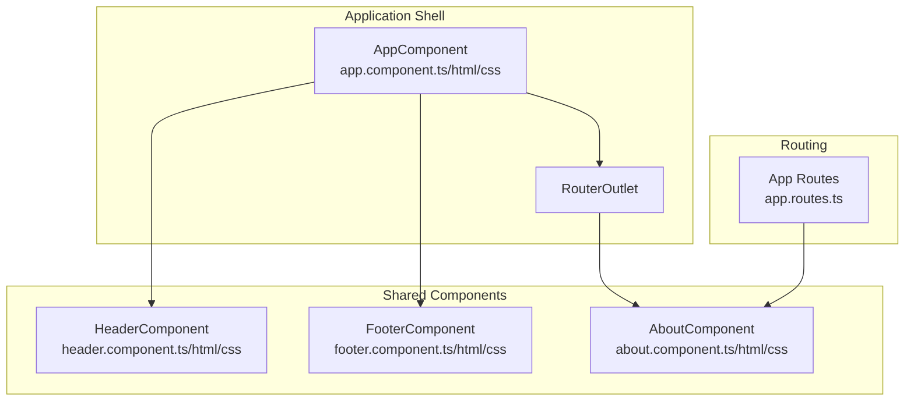
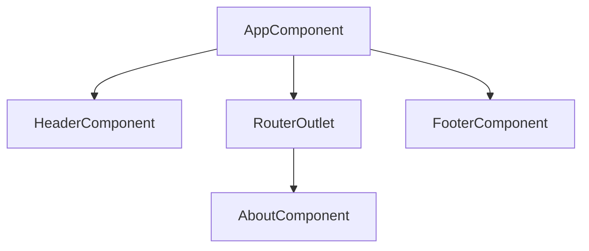
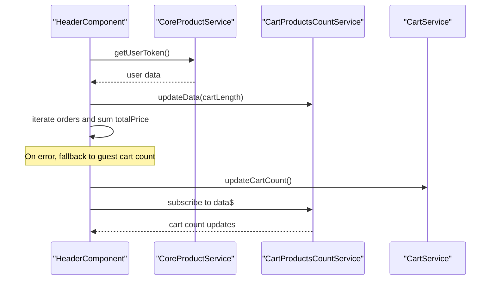
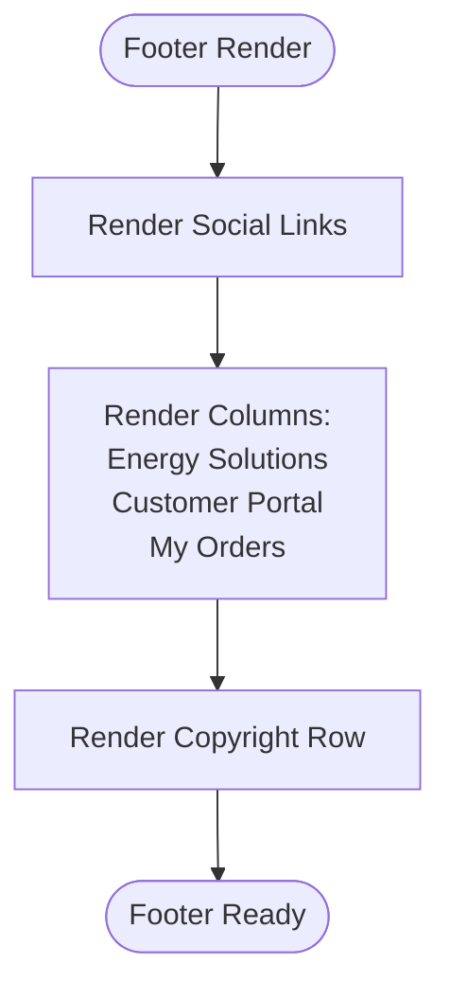
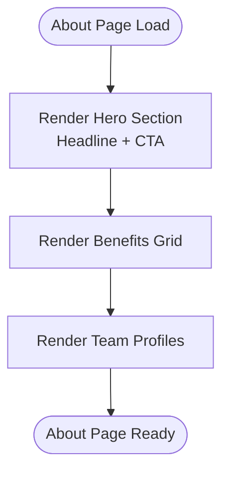
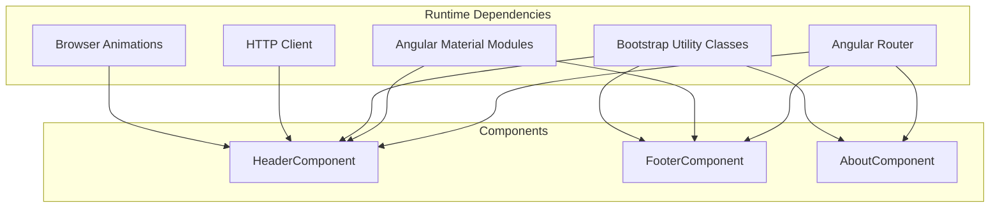

# Shared Components and UI Library

<cite>
**Referenced Files in This Document**
- [header.component.ts](file://Front-end/src/app/shared/components/header/header.component.ts)
- [header.component.html](file://Front-end/src/app/shared/components/header/header.component.html)
- [header.component.css](file://Front-end/src/app/shared/components/header/header.component.css)
- [footer.component.ts](file://Front-end/src/app/shared/components/footer/footer.component.ts)
- [footer.component.html](file://Front-end/src/app/shared/components/footer/footer.component.html)
- [footer.component.css](file://Front-end/src/app/shared/components/footer/footer.component.css)
- [about.component.ts](file://Front-end/src/app/shared/components/about/about.component.ts)
- [about.component.html](file://Front-end/src/app/shared/components/about/about.component.html)
- [about.component.css](file://Front-end/src/app/shared/components/about/about.component.css)
- [app.component.ts](file://Front-end/src/app/app.component.ts)
- [app.component.html](file://Front-end/src/app/app.component.html)
- [app.routes.ts](file://Front-end/src/app/app.routes.ts)
- [app.config.ts](file://Front-end/src/app/app.config.ts)
- [styles.css](file://Front-end/src/styles.css)
</cite>

## Table of Contents
1. [Introduction](#introduction)
2. [Project Structure](#project-structure)
3. [Core Components](#core-components)
4. [Architecture Overview](#architecture-overview)
5. [Detailed Component Analysis](#detailed-component-analysis)
6. [Dependency Analysis](#dependency-analysis)
7. [Performance Considerations](#performance-considerations)
8. [Troubleshooting Guide](#troubleshooting-guide)
9. [Conclusion](#conclusion)

## Introduction
This document describes the shared components and reusable UI library used across the Lightstorm e-commerce application. It focuses on three primary shared components: the header with navigation and user controls, the footer with site information, and the about component for company information display. The documentation covers component composition patterns, shared styling approaches, responsive design implementation, and integration with Angular Material and third-party libraries. It also explains component communication patterns, input/output properties, and customization options for maintaining a consistent UI across the application.

## Project Structure
The shared components are located under the shared/components directory and are integrated into the main application shell via the root component. Routing is configured centrally to expose the about page and route guards for protected areas.

**Diagram sources**
- [app.component.ts](file://Front-end/src/app/app.component.ts#L10-L22)
- [app.component.html](file://Front-end/src/app/app.component.html#L1-L15)
- [app.routes.ts](file://Front-end/src/app/app.routes.ts#L21-L49)

**Section sources**
- [app.component.ts](file://Front-end/src/app/app.component.ts#L1-L26)
- [app.component.html](file://Front-end/src/app/app.component.html#L1-L15)
- [app.routes.ts](file://Front-end/src/app/app.routes.ts#L1-L50)

## Core Components
This section introduces the three shared components and their roles in the application layout and navigation.

- Header component: Provides branding, search, cart badge, mobile menu, and desktop navigation with category dropdowns.
- Footer component: Displays social links, site sections, and copyright information.
- About component: Presents company information, benefits, and team highlights.

Key integration points:
- The header and footer are declared as standalone components and included in the root component template.
- The about page is routed via a dedicated route and rendered between the header and footer.

**Section sources**
- [header.component.ts](file://Front-end/src/app/shared/components/header/header.component.ts#L15-L29)
- [footer.component.ts](file://Front-end/src/app/shared/components/footer/footer.component.ts#L4-L12)
- [about.component.ts](file://Front-end/src/app/shared/components/about/about.component.ts#L5-L11)
- [app.component.html](file://Front-end/src/app/app.component.html#L1-L15)
- [app.routes.ts](file://Front-end/src/app/app.routes.ts#L28-L28)

## Architecture Overview
The shared components follow a consistent layout pattern: the root component hosts the header and footer, while the router outlet renders page-specific views. The header integrates Angular Material components for menus and badges, and Bootstrap utility classes for responsive layout. The footer uses social icons and internal navigation via Angular Router.

**Diagram sources**
- [app.component.ts](file://Front-end/src/app/app.component.ts#L10-L22)
- [app.component.html](file://Front-end/src/app/app.component.html#L1-L15)
- [app.routes.ts](file://Front-end/src/app/app.routes.ts#L28-L28)

## Detailed Component Analysis

### Header Component
The header component encapsulates the top bar, main navigation, search bar, and mobile menu. It integrates Angular Material for menu and badge functionality and uses a local service to maintain cart item counts.

Composition and responsibilities:
- Top bar: Displays location and quick links to About Us and My Account.
- Main header: Contains logo, search input, contact info, and cart link with badge.
- Navigation bar: Desktop-only category dropdown and main links.
- Mobile menu: Material menu triggered on small screens.

Angular Material integration:
- Uses MatMenuModule for the mobile menu and MatBadgeModule for the cart indicator.
- Leverages MatIconModule for icons and MatToolbarModule for toolbar styling.

Responsive design:
- Utilizes Bootstrap grid classes (col-*, order-*) to rearrange elements across breakpoints.
- Adjusts logo size and hides certain elements on extra-small screens.

State and services:
- Maintains local state for cart item count and user orders total price.
- Subscribes to a cart products count service to keep the badge synchronized.
- Fetches user token and cart/order data on initialization.

Communication patterns:
- Emits no outputs; communicates via service subscriptions and router links.
- Uses Angular signals indirectly through RxJS subscriptions.

Customization options:
- Modify category list and icons in the component class.
- Override styles via component CSS or global CSS variables.
- Adjust breakpoint classes to change responsive behavior.

**Diagram sources**
- [header.component.ts](file://Front-end/src/app/shared/components/header/header.component.ts#L65-L94)

**Section sources**
- [header.component.ts](file://Front-end/src/app/shared/components/header/header.component.ts#L15-L97)
- [header.component.html](file://Front-end/src/app/shared/components/header/header.component.html#L1-L112)
- [header.component.css](file://Front-end/src/app/shared/components/header/header.component.css#L1-L108)

### Footer Component
The footer component provides social media links, internal navigation sections, and copyright information. It is a lightweight standalone component that relies on Angular Router for navigation.

Composition and responsibilities:
- Hero section with background image and social links.
- Three columns: Energy Solutions, Customer Portal, and My Orders.
- Copyright row with powered-by attribution.

Styling and responsiveness:
- Uses utility classes for alignment and spacing.
- Responsive column layout adjusts across device sizes.
- Social icons styled with inline SVG and hover effects.

Navigation:
- Uses routerLink directives to navigate to internal pages.

Customization options:
- Replace background image URL in CSS.
- Add or remove social media links and icons.
- Extend navigation sections by adding new items.

**Diagram sources**
- [footer.component.html](file://Front-end/src/app/shared/components/footer/footer.component.html#L1-L141)

**Section sources**
- [footer.component.ts](file://Front-end/src/app/shared/components/footer/footer.component.ts#L4-L16)
- [footer.component.html](file://Front-end/src/app/shared/components/footer/footer.component.html#L1-L141)
- [footer.component.css](file://Front-end/src/app/shared/components/footer/footer.component.css#L1-L44)

### About Component
The about component presents company information, benefits, and team profiles. It is a standalone component registered in the routing configuration.

Composition and responsibilities:
- Split layout with headline and call-to-action on the left, hero image on the right.
- Benefits section with icons and labels.
- Team section with profile cards and LinkedIn links.

Navigation:
- Includes a button linking to the home page.

Styling:
- Uses Bootstrap grid classes for responsive layout.
- Applies custom styles for backgrounds, hover effects, and typography.

Customization options:
- Update hero image and benefit icons.
- Modify team member details and links.
- Adjust layout classes to fit different screen sizes.

**Diagram sources**
- [about.component.html](file://Front-end/src/app/shared/components/about/about.component.html#L1-L160)

**Section sources**
- [about.component.ts](file://Front-end/src/app/shared/components/about/about.component.ts#L5-L15)
- [about.component.html](file://Front-end/src/app/shared/components/about/about.component.html#L1-L160)
- [about.component.css](file://Front-end/src/app/shared/components/about/about.component.css#L1-L107)

## Dependency Analysis
The shared components depend on Angular Router for navigation and Angular Material for interactive elements. The header integrates with services for cart and user data. The application configuration provides routing, animations, and HTTP client support.

**Diagram sources**
- [header.component.ts](file://Front-end/src/app/shared/components/header/header.component.ts#L1-L14)
- [footer.component.ts](file://Front-end/src/app/shared/components/footer/footer.component.ts#L1-L9)
- [app.config.ts](file://Front-end/src/app/app.config.ts#L8-L10)

**Section sources**
- [header.component.ts](file://Front-end/src/app/shared/components/header/header.component.ts#L1-L14)
- [footer.component.ts](file://Front-end/src/app/shared/components/footer/footer.component.ts#L1-L9)
- [app.config.ts](file://Front-end/src/app/app.config.ts#L1-L11)

## Performance Considerations
- Lazy loading: Consider lazy-loading feature modules to reduce initial bundle size.
- Material components: Defer importing unused Material modules to minimize overhead.
- Images: Optimize hero and team images; consider responsive image attributes.
- CSS: Keep component styles scoped and avoid deep selectors to prevent cascade issues.
- Observables: Unsubscribe from subscriptions in ngOnDestroy to prevent memory leaks.

## Troubleshooting Guide
Common issues and resolutions:
- Cart badge not updating: Verify the cart products count service subscription and ensure the service emits updates.
- Mobile menu not opening: Confirm MatMenuModule is imported and the trigger directive is applied correctly.
- Router links not working: Ensure RouterModule is imported in the component and the routes are defined in the routing configuration.
- Social icons missing: Check that the SVG markup is intact and the CSS class applies the correct fill color.
- Responsive layout glitches: Review Bootstrap column classes and media queries in component CSS.

**Section sources**
- [header.component.ts](file://Front-end/src/app/shared/components/header/header.component.ts#L65-L94)
- [header.component.html](file://Front-end/src/app/shared/components/header/header.component.html#L104-L112)
- [app.routes.ts](file://Front-end/src/app/app.routes.ts#L21-L49)

## Conclusion
The shared components provide a consistent, responsive, and accessible UI foundation for the Lightstorm e-commerce application. They integrate Angular Material for interactive elements, Bootstrap for responsive layout, and Angular Router for navigation. The header, footer, and about components are designed as standalone, reusable units that can be customized and extended to meet evolving design and functional requirements.