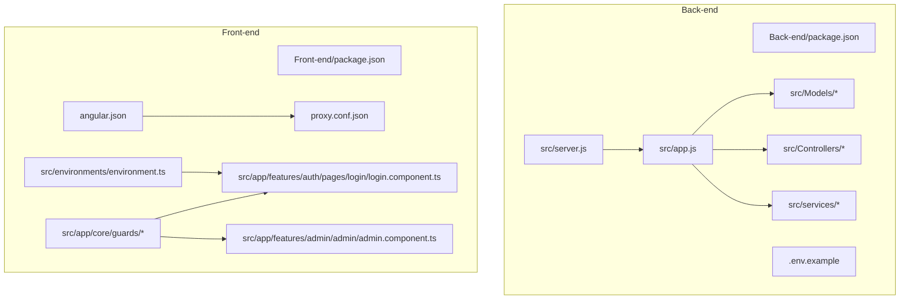
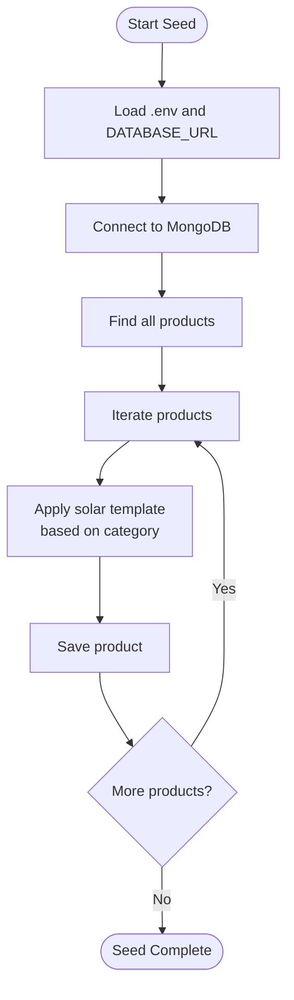
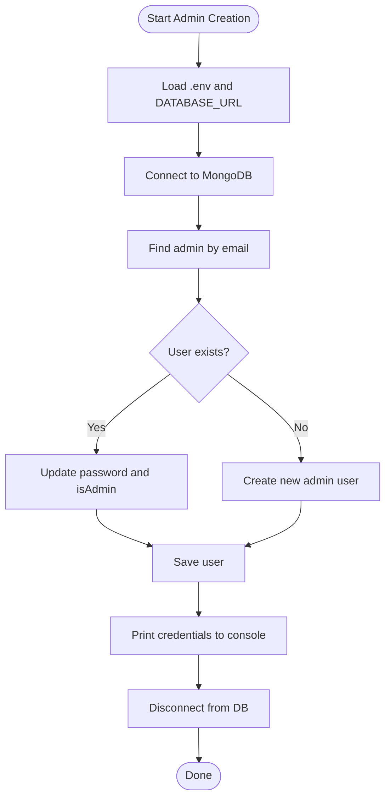
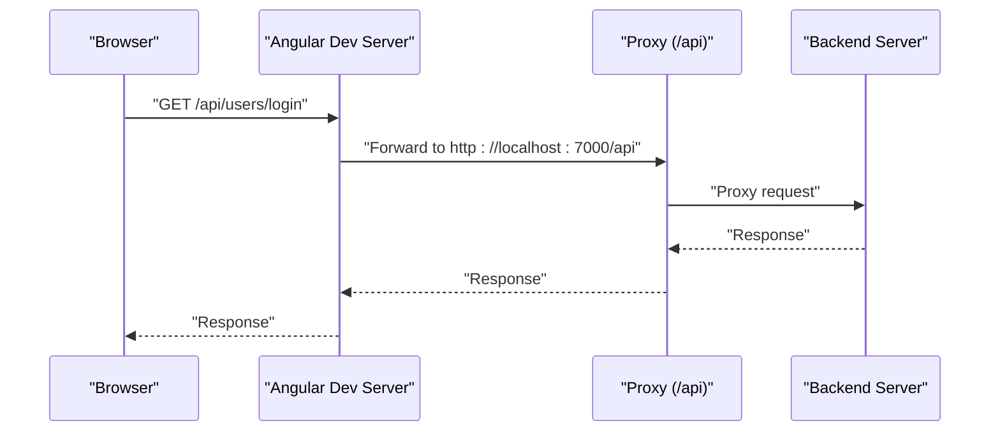
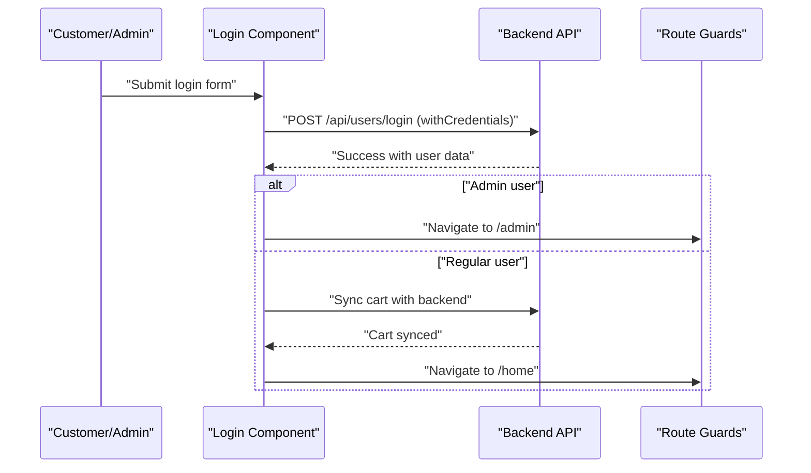
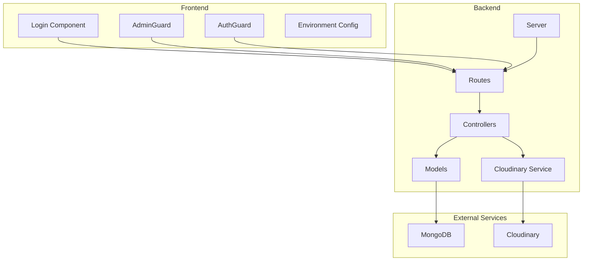

# Getting Started

<cite>
**Referenced Files in This Document**
- [PROJECT_STRUCTURE.md](file://PROJECT_STRUCTURE.md)
- [Back-end/.env.example](file://Back-end/.env.example)
- [Back-end/package.json](file://Back-end/package.json)
- [Back-end/src/config/env.js](file://Back-end/src/config/env.js)
- [Back-end/src/server.js](file://Back-end/src/server.js)
- [Back-end/create_admin.js](file://Back-end/create_admin.js)
- [Back-end/solarize_db.js](file://Back-end/solarize_db.js)
- [Front-end/package.json](file://Front-end/package.json)
- [Front-end/proxy.conf.json](file://Front-end/proxy.conf.json)
- [Front-end/angular.json](file://Front-end/angular.json)
- [Front-end/src/environments/environment.ts](file://Front-end/src/environments/environment.ts)
- [Front-end/src/app/features/auth/pages/login/login.component.ts](file://Front-end/src/app/features/auth/pages/login/login.component.ts)
- [Front-end/src/app/features/admin/admin/admin.component.ts](file://Front-end/src/app/features/admin/admin/admin.component.ts)
- [Front-end/src/app/core/guards/admin.guard.ts](file://Front-end/src/app/core/guards/admin.guard.ts)
- [Front-end/src/app/core/guards/auth.guard.ts](file://Front-end/src/app/core/guards/auth.guard.ts)
</cite>

## Table of Contents
1. [Introduction](#introduction)
2. [Prerequisites](#prerequisites)
3. [Project Structure](#project-structure)
4. [Environment Setup](#environment-setup)
5. [Installation](#installation)
6. [Initial Database Configuration](#initial-database-configuration)
7. [Admin User Creation](#admin-user-creation)
8. [Local Development](#local-development)
9. [Basic Usage Patterns](#basic-usage-patterns)
10. [Architecture Overview](#architecture-overview)
11. [Troubleshooting Guide](#troubleshooting-guide)
12. [Conclusion](#conclusion)

## Introduction
This guide helps you install and run the Lightstorm Technologies e-commerce platform locally. It covers backend and frontend setup, environment configuration (MongoDB, Cloudinary, JWT), initial database seeding, admin account creation, and local development server startup. It also documents basic usage for both customer and administrative interfaces.

## Prerequisites
- Node.js and npm installed on your machine
- MongoDB installed and running locally or access to a MongoDB instance
- A Cloudinary account and credentials (cloud name, API key, API secret)
- A JWT secret for secure authentication
- Basic understanding of Angular and MongoDB concepts

## Project Structure
The repository is organized into three main parts:
- Back-end: Node.js/Express API server with controllers, models, routes, and services
- Front-end: Angular 17 application with admin and customer features
- Landing page: Static marketing website

**Diagram sources**
- [PROJECT_STRUCTURE.md](file://PROJECT_STRUCTURE.md#L1-L448)
- [Back-end/package.json](file://Back-end/package.json#L1-L29)
- [Front-end/package.json](file://Front-end/package.json#L1-L55)

**Section sources**
- [PROJECT_STRUCTURE.md](file://PROJECT_STRUCTURE.md#L1-L448)

## Environment Setup
Create a .env file in the Back-end directory with the following keys and values:
- PORT: server port (default 7000)
- DATABASE_URL: MongoDB connection string
- CLOUDINARY_CLOUD_NAME: your Cloudinary cloud name
- CLOUDINARY_API_KEY: your Cloudinary API key
- CLOUDINARY_API_SECRET: your Cloudinary API secret
- JWT_SECRET: a strong secret used to sign JWT tokens

Notes:
- The backend reads environment variables via dotenv and uses DATABASE_URL for MongoDB connectivity.
- The frontend expects an apiUrl pointing to the backend API during development.

**Section sources**
- [Back-end/.env.example](file://Back-end/.env.example#L1-L3)
- [Back-end/src/config/env.js](file://Back-end/src/config/env.js#L1-L4)
- [Front-end/src/environments/environment.ts](file://Front-end/src/environments/environment.ts#L1-L5)

## Installation
Backend:
- Navigate to the Back-end directory
- Install dependencies using npm
- Scripts:
  - Development: npm run serve
  - Production: npm start

Frontend:
- Navigate to the Front-end directory
- Install dependencies using npm
- Development server: ng serve (Angular CLI)
- Build for production: ng build

**Section sources**
- [Back-end/package.json](file://Back-end/package.json#L6-L10)
- [Front-end/package.json](file://Front-end/package.json#L5-L11)

## Initial Database Configuration
The database initialization script seeds products with predefined templates and applies category-specific attributes. It connects to MongoDB using the DATABASE_URL environment variable and updates existing products.

To run the database seed:
- Ensure MongoDB is running
- Set DATABASE_URL in the Back-end .env
- Execute the seed script from the Back-end directory

**Diagram sources**
- [Back-end/solarize_db.js](file://Back-end/solarize_db.js#L46-L92)

**Section sources**
- [Back-end/solarize_db.js](file://Back-end/solarize_db.js#L1-L92)

## Admin User Creation
The admin creation script connects to MongoDB, ensures a default admin user exists, and sets the isAdmin flag. It uses bcrypt to hash passwords and writes credentials to the console.

To create or update the admin:
- Ensure MongoDB is running
- Set DATABASE_URL in the Back-end .env
- Execute the admin creation script from the Back-end directory

**Diagram sources**
- [Back-end/create_admin.js](file://Back-end/create_admin.js#L6-L59)

**Section sources**
- [Back-end/create_admin.js](file://Back-end/create_admin.js#L1-L59)

## Local Development
Frontend proxy configuration:
- The Angular dev server proxies API calls from /api to the backend server running on localhost:7000.
- Proxy settings are defined in proxy.conf.json and referenced by angular.json.

Frontend environment:
- apiUrl is configured to point to http://localhost:7000/api for development.

Backend server:
- The server listens on the PORT defined in environment variables (default 7000).

**Diagram sources**
- [Front-end/proxy.conf.json](file://Front-end/proxy.conf.json#L1-L8)
- [Front-end/angular.json](file://Front-end/angular.json#L67-L81)
- [Front-end/src/environments/environment.ts](file://Front-end/src/environments/environment.ts#L1-L5)
- [Back-end/src/server.js](file://Back-end/src/server.js#L1-L6)

**Section sources**
- [Front-end/proxy.conf.json](file://Front-end/proxy.conf.json#L1-L8)
- [Front-end/angular.json](file://Front-end/angular.json#L67-L81)
- [Front-end/src/environments/environment.ts](file://Front-end/src/environments/environment.ts#L1-L5)
- [Back-end/src/server.js](file://Back-end/src/server.js#L1-L6)

## Basic Usage Patterns
Customer interface:
- Login: Navigate to the login page, submit credentials, and receive a JWT via an httpOnly cookie. On successful login, the frontend redirects authenticated users to the home page and synchronizes the shopping cart with the backend.
- Guards: AuthGuard protects routes requiring login for customers, redirecting unauthenticated users to the login page.

Administrative interface:
- Admin login: Same login flow; upon success, the frontend navigates admins to the admin dashboard.
- Admin logout: The admin component posts to the backend logout endpoint and redirects to the login page.

**Diagram sources**
- [Front-end/src/app/features/auth/pages/login/login.component.ts](file://Front-end/src/app/features/auth/pages/login/login.component.ts#L38-L96)
- [Front-end/src/app/core/guards/auth.guard.ts](file://Front-end/src/app/core/guards/auth.guard.ts#L15-L41)
- [Front-end/src/app/features/admin/admin/admin.component.ts](file://Front-end/src/app/features/admin/admin/admin.component.ts#L26-L36)

**Section sources**
- [Front-end/src/app/features/auth/pages/login/login.component.ts](file://Front-end/src/app/features/auth/pages/login/login.component.ts#L1-L116)
- [Front-end/src/app/core/guards/admin.guard.ts](file://Front-end/src/app/core/guards/admin.guard.ts#L1-L46)
- [Front-end/src/app/core/guards/auth.guard.ts](file://Front-end/src/app/core/guards/auth.guard.ts#L1-L42)
- [Front-end/src/app/features/admin/admin/admin.component.ts](file://Front-end/src/app/features/admin/admin/admin.component.ts#L1-L38)

## Architecture Overview
The system consists of:
- Frontend (Angular): Handles routing, guards, HTTP calls, and UI
- Backend (Node/Express): Provides REST endpoints, authentication, and data persistence
- Database (MongoDB): Stores users, products, and orders
- Cloudinary: Manages image uploads and URLs
- JWT: Secures sessions via httpOnly cookies

**Diagram sources**
- [PROJECT_STRUCTURE.md](file://PROJECT_STRUCTURE.md#L18-L84)
- [Front-end/src/environments/environment.ts](file://Front-end/src/environments/environment.ts#L1-L5)
- [Back-end/src/config/env.js](file://Back-end/src/config/env.js#L1-L4)

**Section sources**
- [PROJECT_STRUCTURE.md](file://PROJECT_STRUCTURE.md#L365-L390)

## Troubleshooting Guide
Common setup issues and resolutions:
- Port conflicts:
  - Backend runs on PORT (default 7000). Change PORT in the Back-end .env if needed.
  - Frontend dev server runs on port 4200 by default; Angular CLI handles this automatically.
- Proxy not forwarding API calls:
  - Verify proxy.conf.json target matches the backend port.
  - Ensure angular.json references the proxy configuration.
- MongoDB connection failures:
  - Confirm DATABASE_URL in the Back-end .env points to a reachable MongoDB instance.
  - Ensure the database name in the URI matches your setup.
- Cloudinary configuration errors:
  - Set CLOUDINARY_CLOUD_NAME, CLOUDINARY_API_KEY, and CLOUDINARY_API_SECRET in the Back-end .env.
- JWT secret issues:
  - Set JWT_SECRET in the Back-end .env. Keep it secure and consistent across deployments.
- CORS or cookie issues:
  - The backend uses cors and cookie-parser. Ensure frontend and backend domains match the proxy configuration.
- Admin creation or login problems:
  - Run the admin creation script after ensuring MongoDB connectivity.
  - Confirm the admin credentials printed by the script.

**Section sources**
- [Back-end/.env.example](file://Back-end/.env.example#L1-L3)
- [Back-end/package.json](file://Back-end/package.json#L13-L27)
- [Front-end/proxy.conf.json](file://Front-end/proxy.conf.json#L1-L8)
- [Front-end/angular.json](file://Front-end/angular.json#L67-L81)
- [Back-end/create_admin.js](file://Back-end/create_admin.js#L1-L59)

## Conclusion
You now have the steps to install, configure, and run the Lightstorm Technologies platform locally. After setting up environment variables, initializing the database, and creating an admin user, you can start both backend and frontend servers and explore the customer and administrative interfaces. Use the troubleshooting section to resolve common issues quickly.