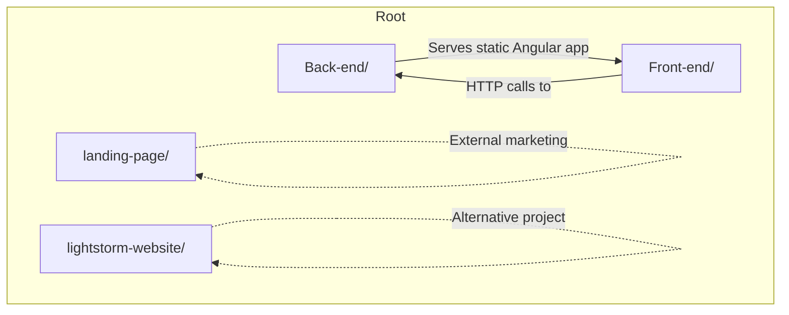
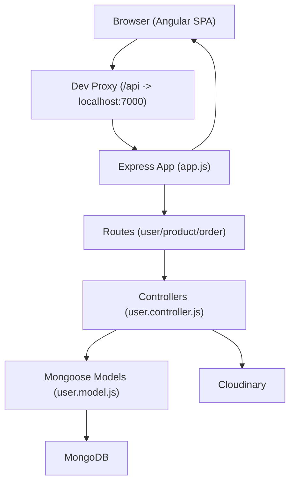
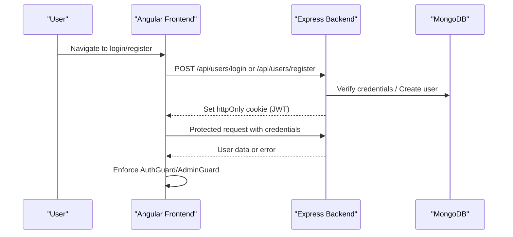
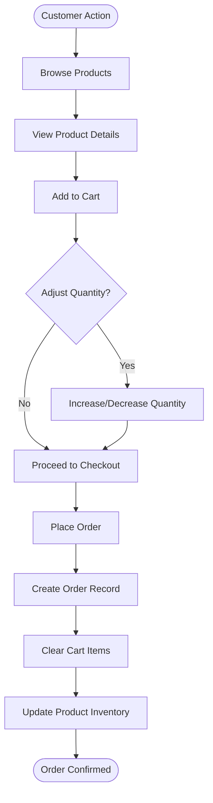
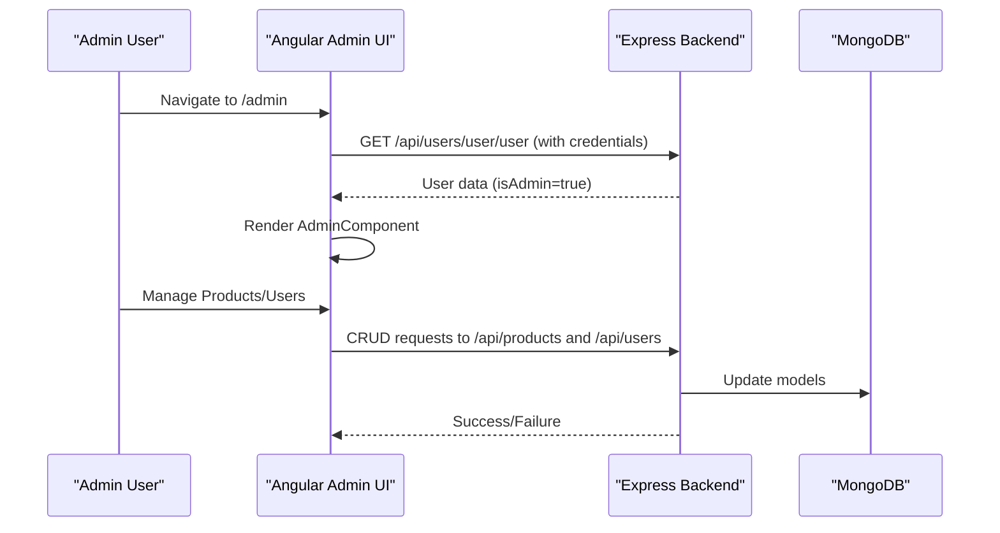
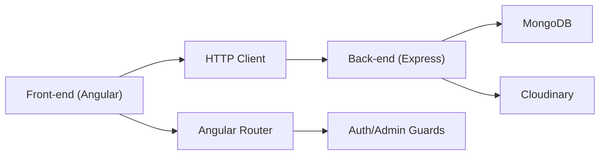

# Project Overview

<cite>
**Referenced Files in This Document**
- [PROJECT_STRUCTURE.md](file://PROJECT_STRUCTURE.md)
- [Back-end/package.json](file://Back-end/package.json)
- [Front-end/package.json](file://Front-end/package.json)
- [Back-end/src/app.js](file://Back-end/src/app.js)
- [Front-end/src/main.ts](file://Front-end/src/main.ts)
- [Back-end/src/config/env.js](file://Back-end/src/config/env.js)
- [Back-end/src/services/cloudinary.service.js](file://Back-end/src/services/cloudinary.service.js)
- [Front-end/src/app/app.routes.ts](file://Front-end/src/app/app.routes.ts)
- [Back-end/src/Middlewares/multer.js](file://Back-end/src/Middlewares/multer.js)
- [Front-end/proxy.conf.json](file://Front-end/proxy.conf.json)
- [Front-end/src/app/core/guards/auth.guard.ts](file://Front-end/src/app/core/guards/auth.guard.ts)
- [Front-end/src/app/core/services/user-service.service.ts](file://Front-end/src/app/core/services/user-service.service.ts)
- [Back-end/src/Controllers/user.controller.js](file://Back-end/src/Controllers/user.controller.js)
- [Back-end/src/Routes/user.routes.js](file://Back-end/src/Routes/user.routes.js)
- [Front-end/src/app/core/guards/admin.guard.ts](file://Front-end/src/app/core/guards/admin.guard.ts)
- [Front-end/src/app/features/admin/admin/admin.component.ts](file://Front-end/src/app/features/admin/admin/admin.component.ts)
- [Back-end/src/Models/user.model.js](file://Back-end/src/Models/user.model.js)
</cite>

## Table of Contents
1. [Introduction](#introduction)
2. [Project Structure](#project-structure)
3. [Core Components](#core-components)
4. [Architecture Overview](#architecture-overview)
5. [Detailed Component Analysis](#detailed-component-analysis)
6. [Dependency Analysis](#dependency-analysis)
7. [Performance Considerations](#performance-considerations)
8. [Troubleshooting Guide](#troubleshooting-guide)
9. [Conclusion](#conclusion)

## Introduction
Lightstorm Technologies is a solar energy e-commerce platform designed to connect customers with solar and energy solutions. The platform enables users to browse products, manage shopping carts, place orders, and track order status, while administrators can manage products, users, and sales via a dedicated dashboard. The system emphasizes a full-stack implementation with an Angular frontend and a Node.js/Express backend, integrated with MongoDB for persistence, JWT-based authentication secured via httpOnly cookies, and Cloudinary for image management.

Key goals:
- Deliver a seamless customer experience for discovering and purchasing solar energy products.
- Provide an intuitive administrative dashboard for managing inventory, users, and orders.
- Enable real-time order processing and status updates.
- Maintain scalability and maintainability through a clean monorepo structure.

Target audience:
- Solar energy consumers seeking reliable products and support.
- Administrators responsible for product and user management.

Differentiators:
- Integrated Cloudinary image handling for optimized media delivery.
- Role-based access control with admin-only dashboards.
- Real-time cart and order management with MongoDB-backed persistence.

## Project Structure
The repository follows a monorepo layout with clear separation between frontend, backend, and supporting assets:
- Back-end: Node.js/Express API server with controllers, models, routes, middlewares, and services.
- Front-end: Angular 17 application with feature-based modules, guards, services, and shared components.
- Landing page: Static marketing site for awareness and lead generation.
- Supporting projects: Additional Angular project artifacts.

**Diagram sources**
- [PROJECT_STRUCTURE.md](file://PROJECT_STRUCTURE.md#L1-L14)

**Section sources**
- [PROJECT_STRUCTURE.md](file://PROJECT_STRUCTURE.md#L1-L14)

## Core Components
- Backend API server: Express application configured with CORS, body parsing, cookie handling, MongoDB connection, and static serving for the Angular app.
- Frontend application: Angular app bootstrapped with routing, guards, and HTTP client integration.
- Authentication: JWT tokens stored in httpOnly cookies, validated by backend middleware and enforced by Angular guards.
- Media management: Multer-based local storage and Cloudinary integration for image uploads.
- Routing: Angular routes guarded by auth and admin guards; backend routes organized per domain (users, products, orders).

**Section sources**
- [Back-end/src/app.js](file://Back-end/src/app.js#L1-L96)
- [Front-end/src/main.ts](file://Front-end/src/main.ts#L1-L10)
- [Back-end/src/config/env.js](file://Back-end/src/config/env.js#L1-L4)
- [Back-end/src/services/cloudinary.service.js](file://Back-end/src/services/cloudinary.service.js#L1-L22)
- [Front-end/src/app/app.routes.ts](file://Front-end/src/app/app.routes.ts#L1-L50)
- [Back-end/src/Middlewares/multer.js](file://Back-end/src/Middlewares/multer.js#L1-L33)
- [Front-end/proxy.conf.json](file://Front-end/proxy.conf.json#L1-L8)

## Architecture Overview
The system architecture integrates an Angular SPA served by the Express backend, with MongoDB for data persistence and Cloudinary for media. Authentication relies on JWT tokens stored in httpOnly cookies, verified by the backend and enforced by Angular guards.

**Diagram sources**
- [Back-end/src/app.js](file://Back-end/src/app.js#L1-L96)
- [Back-end/src/Routes/user.routes.js](file://Back-end/src/Routes/user.routes.js#L1-L24)
- [Back-end/src/Controllers/user.controller.js](file://Back-end/src/Controllers/user.controller.js#L1-L480)
- [Back-end/src/Models/user.model.js](file://Back-end/src/Models/user.model.js#L1-L29)
- [Back-end/src/services/cloudinary.service.js](file://Back-end/src/services/cloudinary.service.js#L1-L22)
- [Front-end/proxy.conf.json](file://Front-end/proxy.conf.json#L1-L8)

## Detailed Component Analysis

### Authentication and Authorization Flow
The authentication flow uses JWT tokens stored in httpOnly cookies. On successful login or registration, the backend signs a token and sets an httpOnly cookie. Angular guards call a protected endpoint to validate the session and enforce role-based access.

**Diagram sources**
- [Back-end/src/Controllers/user.controller.js](file://Back-end/src/Controllers/user.controller.js#L118-L175)
- [Front-end/src/app/core/guards/auth.guard.ts](file://Front-end/src/app/core/guards/auth.guard.ts#L1-L42)
- [Front-end/src/app/core/guards/admin.guard.ts](file://Front-end/src/app/core/guards/admin.guard.ts#L1-L46)

**Section sources**
- [Back-end/src/Controllers/user.controller.js](file://Back-end/src/Controllers/user.controller.js#L118-L175)
- [Front-end/src/app/core/guards/auth.guard.ts](file://Front-end/src/app/core/guards/auth.guard.ts#L1-L42)
- [Front-end/src/app/core/guards/admin.guard.ts](file://Front-end/src/app/core/guards/admin.guard.ts#L1-L46)

### Customer Portal and Real-Time Order Processing
The customer portal supports browsing products, adding items to the cart, adjusting quantities, and placing orders. The backend coordinates cart updates and order creation, linking user carts to product inventory and order history.

**Diagram sources**
- [Back-end/src/Controllers/user.controller.js](file://Back-end/src/Controllers/user.controller.js#L177-L270)
- [Back-end/src/Models/user.model.js](file://Back-end/src/Models/user.model.js#L3-L6)

**Section sources**
- [Back-end/src/Controllers/user.controller.js](file://Back-end/src/Controllers/user.controller.js#L177-L270)
- [Back-end/src/Models/user.model.js](file://Back-end/src/Models/user.model.js#L3-L6)

### Administrative Dashboard
The admin dashboard provides tools for managing products and users. Access is restricted to administrators via the AdminGuard, which validates the session and checks the admin flag.

**Diagram sources**
- [Front-end/src/app/core/guards/admin.guard.ts](file://Front-end/src/app/core/guards/admin.guard.ts#L1-L46)
- [Front-end/src/app/features/admin/admin/admin.component.ts](file://Front-end/src/app/features/admin/admin/admin.component.ts#L1-L38)
- [Back-end/src/Routes/user.routes.js](file://Back-end/src/Routes/user.routes.js#L1-L24)
- [Back-end/src/Controllers/user.controller.js](file://Back-end/src/Controllers/user.controller.js#L1-L480)

**Section sources**
- [Front-end/src/app/core/guards/admin.guard.ts](file://Front-end/src/app/core/guards/admin.guard.ts#L1-L46)
- [Front-end/src/app/features/admin/admin/admin.component.ts](file://Front-end/src/app/features/admin/admin/admin.component.ts#L1-L38)
- [Back-end/src/Routes/user.routes.js](file://Back-end/src/Routes/user.routes.js#L1-L24)
- [Back-end/src/Controllers/user.controller.js](file://Back-end/src/Controllers/user.controller.js#L1-L480)

### Technology Stack and Integrations
- Backend: Node.js, Express, Mongoose, JWT, Multer, Cloudinary, CORS, dotenv.
- Frontend: Angular 17, Angular Material, Bootstrap, PrimeNG, RxJS, SweetAlert2, ApexCharts.
- Dev tools: Angular CLI, nodemon, Webpack (via Angular CLI), npm.

**Section sources**
- [Back-end/package.json](file://Back-end/package.json#L1-L29)
- [Front-end/package.json](file://Front-end/package.json#L1-L55)
- [PROJECT_STRUCTURE.md](file://PROJECT_STRUCTURE.md#L365-L390)

### Monorepo Structure and Separation of Concerns
- Back-end: Contains controllers, models, routes, middlewares, services, and server configuration.
- Front-end: Organized by feature modules (admin, auth, shop), shared components, and core services/guards.
- Landing page: Static marketing site separate from the e-commerce application.
- Supporting projects: Additional Angular project artifacts.

**Section sources**
- [PROJECT_STRUCTURE.md](file://PROJECT_STRUCTURE.md#L18-L204)

## Dependency Analysis
The frontend depends on Angular and UI libraries, while the backend depends on Express, Mongoose, and Cloudinary. The Angular app communicates with the backend via HTTP calls proxied to localhost:7000 during development.

**Diagram sources**
- [Front-end/src/main.ts](file://Front-end/src/main.ts#L1-L10)
- [Front-end/src/app/app.routes.ts](file://Front-end/src/app/app.routes.ts#L1-L50)
- [Front-end/proxy.conf.json](file://Front-end/proxy.conf.json#L1-L8)
- [Back-end/src/app.js](file://Back-end/src/app.js#L1-L96)

**Section sources**
- [Front-end/src/main.ts](file://Front-end/src/main.ts#L1-L10)
- [Front-end/src/app/app.routes.ts](file://Front-end/src/app/app.routes.ts#L1-L50)
- [Front-end/proxy.conf.json](file://Front-end/proxy.conf.json#L1-L8)
- [Back-end/src/app.js](file://Back-end/src/app.js#L1-L96)

## Performance Considerations
- Use pagination and filtering for product listings to reduce payload sizes.
- Optimize Cloudinary image delivery with appropriate formats and sizes.
- Minimize unnecessary re-renders in Angular by leveraging immutable data patterns and OnPush change detection where applicable.
- Cache frequently accessed data (e.g., featured products) on the frontend to reduce API calls.
- Monitor database queries and consider indexing for common search fields.

## Troubleshooting Guide
Common issues and resolutions:
- CORS errors: Ensure the backend allows the frontend origin and credentials are enabled.
- Authentication failures: Verify httpOnly cookie presence and expiration; confirm JWT secret alignment.
- File upload errors: Confirm Multer configuration and Cloudinary credentials; check upload directory permissions.
- Route navigation issues: Validate Angular route guards and ensure proper redirect logic after login.

**Section sources**
- [Back-end/src/app.js](file://Back-end/src/app.js#L19-L22)
- [Back-end/src/Controllers/user.controller.js](file://Back-end/src/Controllers/user.controller.js#L421-L458)
- [Back-end/src/Middlewares/multer.js](file://Back-end/src/Middlewares/multer.js#L1-L33)
- [Front-end/src/app/core/guards/auth.guard.ts](file://Front-end/src/app/core/guards/auth.guard.ts#L1-L42)
- [Front-end/src/app/core/guards/admin.guard.ts](file://Front-end/src/app/core/guards/admin.guard.ts#L1-L46)

## Conclusion
Lightstorm Technologies delivers a robust, full-stack e-commerce solution tailored for the solar energy market. Its monorepo structure, combined with Angular and Node.js, ensures maintainability and scalability. The integration of JWT authentication, MongoDB, and Cloudinary provides a secure, efficient, and media-rich platform for customers and administrators alike. The real-time order processing capabilities and role-based dashboards position the platform to meet the evolving needs of its target audience.